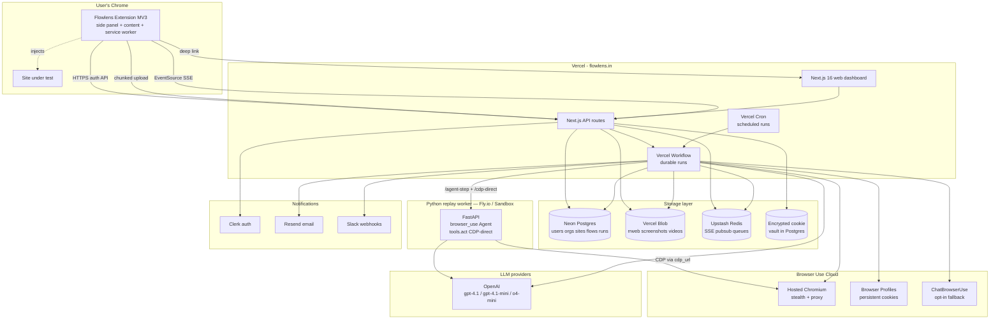
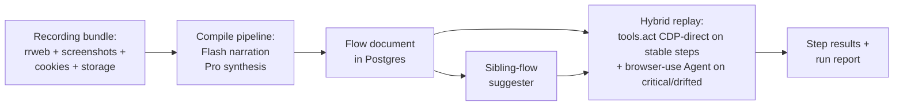
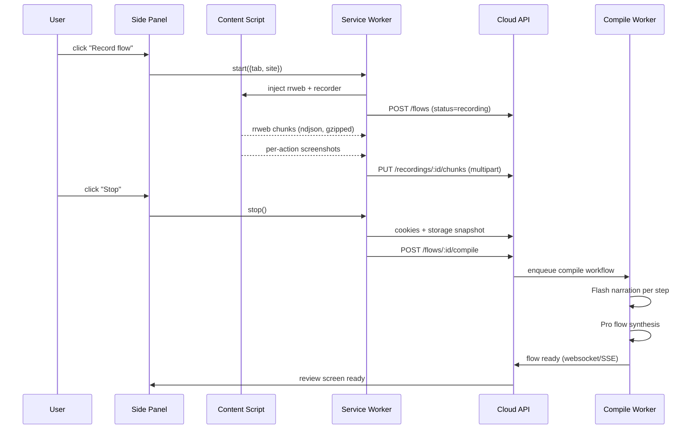
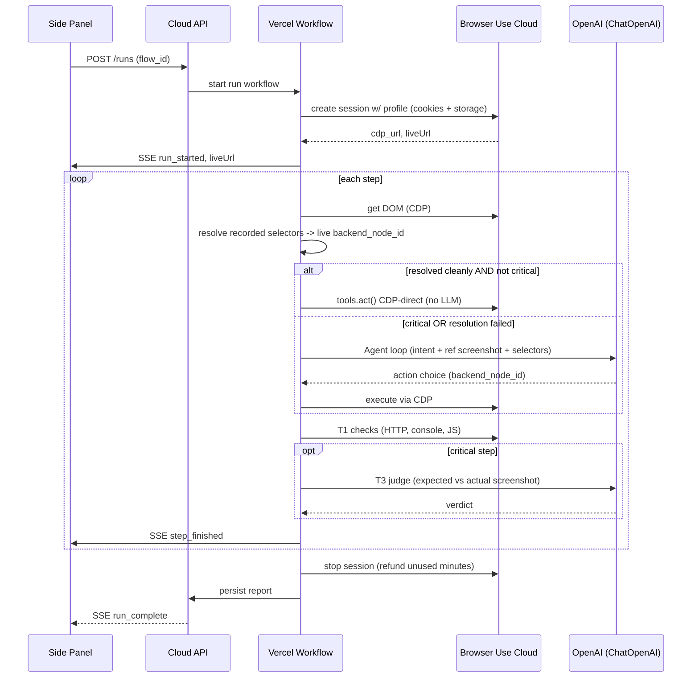
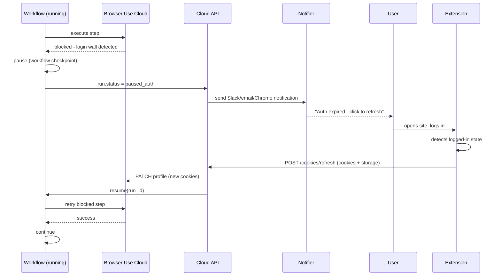

# Flowlens v3 — High-Level Design

> **Status:** proposed (plan mode draft, 2026-04-27)
> **Authors:** Flowlens core team
> **Supersedes:** [ARCHITECTURE_V2.md](../ARCHITECTURE_V2.md), [CONTEXT.md](../../CONTEXT.md) §4

---

## TL;DR

Flowlens v3 is a no-code, AI-driven QA tool. A user installs a Chrome extension, clicks "Record" on any website, demonstrates a flow once, and from then on Flowlens replays it on demand on Browser Use Cloud — verifying both that the flow's intent succeeded and that the UI hasn't drifted. No selectors. No tests to maintain. The LLM is the QA engineer; the recording is the user story.

---

## 1. The product in one paragraph

A user demonstrates a flow once in their own browser. We capture the demonstration as structured data (DOM events, screenshots, cookies, storage), turn it into a semantic Flow document with an LLM, and run it on demand on a hosted browser. Each replay is an LLM-driven agent that *thinks* through every step, using the recording as a strong prior and the live page as ground truth. Verification is layered: deterministic checks for crashes, an LLM judge for intent correctness, and (Pro tier) visual diff for regression. Reports live both in the extension and on a web dashboard. Cookies are user-supplied via the same extension, refreshed in place when they expire.

---

## 2. Who, why, why now

### Target users (in priority order)

1. **Startup CTOs** with 10–50 engineers and no QA team. They ship daily, fear regressions, and can't justify a QA hire.
2. **E-commerce / SaaS founders** whose revenue depends on a handful of critical flows (signup, checkout, search, dashboard).
3. **Agencies** managing 5–50 client sites who need a quick health check after every deploy.
4. **Solo founders** who want a "Heroku-style" QA experience: install, record, done.

### Problems we solve

| Today                                                   | With Flowlens                   |
| ------------------------------------------------------- | ------------------------------- |
| Writing Cypress / Playwright tests takes hours per flow | Record once, ~3 minutes         |
| Tests break on every UI tweak                           | LLM re-finds elements by intent |
| LogRocket / FullStory show recordings, not tests        | We *test*, not just monitor     |
| QA contractors are slow and expensive                   | Cloud replay is ~$0.30/run      |
| No regression visibility between deploys                | Cross-run drift analyzer        |

### Why now

- LLMs are finally cheap enough to be in the replay loop (~$0.10–0.18 per browser-driven test run with `gpt-4.1-mini` and a tightened DOM serialization).
- Browser Use Cloud removes the "running Chrome at scale" problem entirely. We have $500 in credits to validate.
- MV3 + Chrome Side Panel API make extensions a first-class UI surface.
- rrweb + browser-use (CDP, no Playwright) + Vercel Workflow are stable, battle-tested building blocks.

---

## 3. The end-to-end user journey

The 12-step story from "discovers Flowlens" to "gets daily regression reports". Every later document hangs off this spine.

```mermaid
flowchart LR
    S1[1. Install from<br/>Chrome Web Store] --> S2[2. Sign in<br/>via Google/Clerk]
    S2 --> S3[3. Open site,<br/>click Record]
    S3 --> S4[4. Demonstrate<br/>the flow]
    S4 --> S5[5. Stop,<br/>review steps]
    S5 --> S6[6. Save flow]
    S6 --> S7[7. AI-suggested<br/>sibling flows]
    S7 --> S8[8. Run now]
    S8 --> S9[9. Watch live in<br/>side panel + iframe]
    S9 --> S10[10. Step-by-step<br/>report]
    S10 --> S11[11. Schedule<br/>daily runs]
    S11 --> S12[12. Get Slack/email<br/>on regression]
```

### Step detail

1. **Install.** One click from the Chrome Web Store. ~5 MB extension. Minimal permissions explained inline.
2. **Sign in.** Side panel opens automatically. Google sign-in via Clerk. Free tier: 3 sites, 10 flows, 50 runs/month.
3. **Record.** User navigates to their site. Click extension icon → side panel → "Record flow". A subtle red dot appears in the page corner.
4. **Demonstrate.** User does whatever they want to test (signup, search, checkout). The extension captures rrweb events + per-action screenshots + cookies + storage. Optional "Note this step" button lets the user tag intent live ("I'm filling email", "this should redirect to dashboard").
5. **Stop & review.** User clicks "Stop". Side panel shows a horizontal carousel of step screenshots, each with an AI-generated label ("clicked Add to Cart", "filled email field"). User can rename, reorder, delete junk steps (cookie banners, accidental clicks), edit intents.
6. **Save.** Flow uploads to cloud. AI compiles the recording into a Flow document (~10–20 s with progress bar).
7. **AI suggests siblings.** Flowlens proposes 1–3 related flows: "Also test guest checkout?", "Also test invalid card?", "Also test cart abandonment?". User opt-ins with checkboxes. These are AI-only flows — no recording needed.
8. **Run now.** User clicks "Run". Side panel switches to "Running" view.
9. **Watch live.** Side panel shows step-by-step progress (SSE) + an iframe of the cloud browser doing the work (`liveUrl` from BU Cloud). User can pause, stop, or just watch.
10. **Report.** Run completes. Side panel shows the per-step verdict: passed / failed / flaky / blocked-auth. Click any step → screenshot diff (recorded vs replay) + AI judge verdict + console errors. Deep link to full web dashboard report.
11. **Schedule.** User toggles "Run daily at 9 AM". Done. Cron-driven via Vercel Cron.
12. **Get notified.** Slack or email on any regression. Notification includes failing step, AI's diagnosis ("button moved", "API 500"), and link to the run.

### The "auth refresh" detour (Step 11.5)

Cookies eventually expire. When they do:

1. A scheduled run fails at the auth wall.
2. Slack message: "shop.example.com auth expired. Click to refresh."
3. User opens the site, logs in.
4. Extension detects the logged-in state (URL pattern + auth-cookie heuristic).
5. Side panel shows "Refresh auth?" button. User clicks → cookies + storage re-snapped → server updates the BU Cloud profile.
6. The paused run resumes from the failing step (no re-run cost).

---

## 4. System architecture

### The whole system on one page

### Data flow at a glance

---

## 5. The three core flows (high level)

### A. Recording flow

### B. Replay flow

### C. Auth refresh flow

---

## 6. Major components (one paragraph each)

| Component                          | What it does                                                                                                                                                                                                          | Repo path                                                   |
| ---------------------------------- | --------------------------------------------------------------------------------------------------------------------------------------------------------------------------------------------------------------------- | ----------------------------------------------------------- |
| **Extension**                      | Records flows, captures cookies, side-panel UI, auth refresh, deep-links to web. WXT + React 19 + Tailwind.                                                                                                            | `apps/extension/`                                           |
| **Web dashboard + API**            | Marketing site, signed-in app, every HTTP endpoint (recording uploads, flows CRUD, run lifecycle, SSE, cookie refresh, webhooks). Next.js 16 Route Handlers. Owns Drizzle ORM + OpenAI calls + run orchestration.       | `apps/web/`                                                 |
| **Replay worker (Python sidecar)** | FastAPI service that wraps `browser_use`. Exposes `POST /agent-step` (full Agent loop) and `POST /cdp-direct` (resolved selector + `tools.act()`). Deployed separately on Fly.io / Railway / Vercel Sandbox. Phase 3. | `apps/replay-worker/`                                       |
| **Compile pipeline**               | Recording → Flow document. VLM narration + flow synthesis on Vercel Workflow. Calls OpenAI via `apps/web/src/lib/openai.ts`. Phase 2.                                                                                  | `packages/flow-doc/`                                        |
| **Replay engine (TS)**             | TS run lifecycle, T1 + T2 + T3 verifiers, profile attach, SSE emission. Delegates each browser action to the Python sidecar over HTTP. Never imports `browser_use`. Phase 3.                                          | `packages/replay-engine/`                                   |
| **Cookie vault**                   | Capture, encrypt (libsodium per-org keypair), store, push-to-BU-profile, refresh. Phase 2.                                                                                                                            | `packages/cookies-vault/`                                   |
| **BU Cloud client**                | Typed TS wrapper around Browser Use Cloud v2 REST. Shipped Phase 1.                                                                                                                                                   | `packages/bu-cloud-client/`                                 |
| **Recorder core**                  | Framework-agnostic rrweb wrapper + screenshot scheduler + selector hardener + sensitive-detect. Used by extension. Phase 2.                                                                                            | `packages/recorder-core/`                                   |
| **Schema**                         | Zod runtime + Drizzle table defs shared by extension, API, workers. Sidecar mirrors a small subset in Python. Shipped Phase 1.                                                                                        | `packages/schema/`                                          |
| **Design tokens**                  | Single source of truth for colors / type / spacing. Used by both apps' Tailwind v4 `@theme`. Shipped Phase 1.                                                                                                          | `packages/design-tokens/`                                   |
| **OpenAI integration**             | Centralized model selection + Zod-validated call helpers. Every LLM call in v3 goes through here. Shipped Phase 1.                                                                                                    | `apps/web/src/lib/openai.ts` + `apps/web/src/lib/models.ts` |
| **Detectors**                      | Functional / perf / a11y / responsive checks. Ported from v2 in Phase 3.                                                                                                                                              | `packages/detectors/`                                       |

---

## 7. Tech stack & rationale

### Frontend

- **WXT** for the extension (Vite-based, MV3-first, hot reload, TypeScript)
- **Next.js 16** for the web dashboard (App Router, Server Components, Cache Components)
- **React 19** + **Tailwind CSS v4** (matches existing v2 design system)
- **Framer Motion** (already in use)
- **shadcn/ui** components (consistent design system)

### Backend

- **Next.js API Route Handlers** (single deployment, no separate FastAPI)
- **Vercel Workflow** for durable run orchestration (pause/resume on auth refresh)
- **Vercel Cron** for scheduled runs

### Storage

- **Neon Postgres** (Vercel Marketplace, branching for preview deploys)
- **Vercel Blob** (rrweb chunks, screenshots, replay videos)
- **Upstash Redis** (SSE pubsub, ephemeral run state)

### Auth & users

- **Clerk** (Vercel Marketplace, Google OAuth, multi-tenant orgs out of the box, extension-friendly)

### Browser execution

- **Browser Use Cloud** (only browser runtime; kills our EC2 + Xvfb stack)
- **browser-use** as the only Python automation library — no Playwright. Two execution paths over the same `cdp_url`:
  1. `tools.act()` direct CDP for stable steps (no LLM, ~$0.001/step).
  2. Full `Agent` loop for critical or drifted steps (LLM-driven, ~$0.01/step cached).
  Details + config in [LLD §5.5](LLD.md#55-browser-use-configuration--selector-resolution).
- **Replay worker deploy target**: Docker container on **AWS App Runner** *or* **Azure Container Apps** — both offer scale-to-zero pay-per-vCPU-second pricing. Choose based on credit pool ($10K AWS or Azure available); the Phase 3 spike will deploy to one and benchmark cold-start latency against the BU Cloud session. Both are first-class Docker hosts and require no per-host configuration. We are NOT using Fly.io; we are NOT compromising on the hybrid `tools.act()` + Agent loop model.

### LLMs

OpenAI is the only LLM provider we ship with. Model selection is centralized in `apps/web/src/lib/models.ts` and overridable per env via `FLOWLENS_MODEL_*` vars.

- **`gpt-4.1-mini`** — replay agent (browser-use Agent loop), per-step narration (vision), AI judge, test-data generator, sibling-flow generator, sensitive-data classifier fallback. Cheap, fast, vision-capable.
- **`gpt-4.1`** — whole-flow synthesis, site model, cross-run drift analyzer. Better multi-step reasoning; called rarely.
- **`o4-mini`** — failure investigator. Reasoning-heavy classification of why a critical step failed (`app_bug | flaky | env | auth`).
- **ChatBrowserUse** stays available as an opt-in fallback for the replay agent — its provider-side prompt caching is cheaper than OpenAI for very repetitive browser loops, but you trade some control over the agent's reasoning. Ship default is OpenAI; ChatBrowserUse is feature-flagged per org.

### Notifications

- **Resend** for email
- **Slack webhooks** for chat
- **Chrome notifications API** for in-extension alerts

### Observability

- **Vercel Observability** (logs, traces, errors)
- **PostHog** for product analytics

### Why this stack (in 5 bullets)

1. **Single Vercel deployment** vs. today's EC2 + Vercel split. One billing, one log surface, one IAM model.
2. **Vercel Workflow + BU Cloud** = no Chrome on our infra. Massive ops simplification.
3. **WXT** is the modern MV3-first extension framework; Plasmo is sliding, CRXJS is too low-level.
4. **Neon's branching DB** lets us spin up a preview Postgres per PR — huge for testing migrations.
5. **Clerk + Marketplace auto-provisioning** means we get auth + DB + Blob + Redis with zero ops.

---

## 8. Key design decisions

| Decision                                         | Why                                                                                                                                 | Alternative considered                                                                   |
| ------------------------------------------------ | ----------------------------------------------------------------------------------------------------------------------------------- | ---------------------------------------------------------------------------------------- |
| **Record rrweb, not video**                      | Lossless replay, semantic events, ~50× smaller, searchable                                                                          | Pure `tabCapture` MP4 — too heavy, no semantics                                          |
| **LLM-first replay (with CDP-direct fast path)** | Recording is a *prior*; LLM thinks at every critical step; non-critical steps that resolve cleanly bypass the LLM via `tools.act()` | Pure deterministic CDP — brittle when UI drifts; pure LLM — wastes money on stable steps |
| **One Browser Use Cloud session per run**        | Simplest cost model, billed per minute, easy to refund                                                                              | Pre-warmed pool — premature optimization                                                 |
| **Hybrid extension + web split**                 | Side panel for action; web for reports & sharing                                                                                    | Extension-only — too cramped; web-only — no recording UX                                 |
| **Cookies in encrypted Postgres + BU profile**   | Auditable, rotatable, refreshable in place                                                                                          | Re-pushing cookies on every run — wasteful, racy                                         |
| **Vercel Workflow for runs**                     | Native pause/resume, retry, idempotency for auth refresh                                                                            | Custom queue + state machine — reinventing the wheel                                     |
| **No deterministic-only "fast mode" by default** | "Real testing" > "fast macros". Offer fast mode as opt-in.                                                                          | Fast mode default — would attract wrong customer                                         |
| **Per-step screenshot, not per-tick**            | One screenshot per semantic action, not 30 fps                                                                                      | Continuous video — bandwidth waste                                                       |
| **Free tier with 50 runs/month**                 | Enough to feel value, not enough to abuse                                                                                           | Trial-only — kills viral growth                                                          |

---

## 9. Out of scope (v3)

To stay shippable in 4 weeks:

- Mobile recording (iOS/Android browsers don't support extensions in this way)
- API-only test recording (no browser involved)
- Multi-tab cross-origin flows (defer; OAuth + payment provider redirects are the main offenders, handled separately)
- Visual no-code flow editor (drag-drop steps) — saved flows are editable as text only
- Self-hosted version
- Team RBAC beyond Clerk's defaults
- Custom test data sources (CSV upload, env vars) — comes in Pro v3.1

---

## 10. Phased delivery (4 weeks)

| Week    | Theme              | Deliverable                                                                                                                                                                                                                                                                                |
| ------- | ------------------ | ------------------------------------------------------------------------------------------------------------------------------------------------------------------------------------------------------------------------------------------------------------------------------------------ |
| **1**   | Foundations        | pnpm monorepo. Drizzle schema + Zod runtime types. Typed BU Cloud v2 client. OpenAI client + centralized `MODELS`. WXT extension scaffold (stub auth). Next.js 16 web scaffold + `/api/health`. Shared design tokens. ✅ shipped.                                                          |
| **1.5** | Real auth          | Clerk Google OAuth. Extension token issuance + storage. Replace stub `chrome.storage.local` auth in side panel. Org-scoping middleware in API routes. `pnpm db:push` after Neon `DATABASE_URL` is available.                                                                              |
| **2**   | Recording → Flow   | rrweb + per-action screenshots + cookies upload, encrypted. Compile pipeline (`gpt-4.1-mini` narration + `gpt-4.1` synthesis) on Vercel Workflow. `data-flowlens-id` injection. Extension review/save UI.                                                                                  |
| **3**   | Replay + verify    | ✅ shipped. Python sidecar (`apps/replay-worker/`) — Dockerfile + AWS App Runner + Azure Container Apps deploy paths. Hybrid replay engine on BU Cloud (`tools.act()` CDP-direct + `Agent` loop, both via the sidecar). Selector resolution layer. T1 + T3 verifiers. Auth-refresh loop with workflow checkpointing. Side-panel run UI (`liveUrl` iframe + step pills + auth-refresh banner). Per-org budget guardrails + BU Cloud circuit breaker. |
| **3.5a** | Workflow runtime swap | ✅ shipped. Migrated `compile-recording` and `run-flow` workflows from the Phase 3 fire-and-forget shim to the real Vercel Workflow Devkit (`workflow@4.2.4` + `@workflow/next@4.0.5`). All durable steps now persist + retry; auth-pause uses `createHook(token)` + `sleep('24h')` race; `/api/cookies/refresh` resumes via `resumeHook(token, payload)`. WDK manifest auto-discovers 2 workflows + 18 steps at build time. |
| **4**   | Dashboard + polish | Web dashboard (sites, flows, runs, public share). T2 visual diff (Pro). Scheduled runs + Slack/email. Chrome Web Store submission. EC2 decommission.                                                                                                                                       |

---

## 11. Cost model (per run, summarized)

Recomputed for OpenAI lineup (April 2026 prices: `gpt-4.1-mini` ~$0.40/M input, ~$1.60/M output; `gpt-4.1` ~$2.50/M input, ~$10/M output; `o4-mini` ~$1.10/M input, ~$4.40/M output). The `tools.act()` CDP-direct path on stable steps still skips the LLM entirely.

After reconciling the per-step token budget (LLD §5.5):

| Phase                                                                                   | Cost (central / guardrail) |
| --------------------------------------------------------------------------------------- | -------------------------- |
| Recording compile (one-time per flow)                                                   | ~$0.26                     |
| Sibling flow generation (per recording)                                                 | ~$0.02                     |
| Replay run, hybrid mode (default — Agent on critical, CDP-direct on stable)             | **$0.07** central / $0.14 upper |
| Replay run, fast mode (CDP-direct everywhere we can)                                    | ~$0.04                     |
| Replay run, full LLM mode (Agent on every step)                                         | ~$0.23                     |
| Cross-run drift analysis                                                                | ~$0.03 per pair            |
| Failure investigator (only on critical fail, ~10 % runs)                                | ~$0.06                     |

**Credit pool** (granted): **$500 BU Cloud** + **$2,000 OpenAI**. Total runway:

- BU Cloud at $0.0008/run is functionally non-binding (~625K runs on $500).
- LLM is the binding constraint. At the **$0.07 central** estimate, $2,000 OpenAI buys **~28,500 hybrid replay runs**. At the **$0.14 upper guardrail**, ~14,000 runs.
- **150–200 closed-beta users** running **2–3 daily flows** for **a month**, plus generous ad-hoc usage — comfortable headroom either way.

This gives ~10× the runway of the original Gemini-only plan, with a built-in upper guardrail for cost surprises.

Detailed breakdown: see [LLD §15](LLD.md#15-cost-model-detailed).

---

## 12. Risks & mitigations

| Risk                                     | Likelihood | Impact                    | Mitigation                                                                                                    |
| ---------------------------------------- | ---------- | ------------------------- | ------------------------------------------------------------------------------------------------------------- |
| Chrome Web Store rejection / delay       | High       | Blocks GTM                | Apply early in week 4, prep privacy policy, shorten permissions, demo video                                   |
| Cookie capture privacy concerns          | High       | Trust-killer              | Encrypt at rest, scope to user-recorded origins only, delete on flow delete, audit log, never log values      |
| Anti-bot detection on cloud replay       | Medium     | Replay false-failures     | BU Cloud stealth Chromium, geo-matched proxy, human-like timing, fall back to "verify on user's browser" mode |
| LLM cost runaway from stuck agents       | Medium     | Burns $500 in days        | Hard `max_steps` cap, wallclock timeouts, `should_stop_callback`, per-org budget guardrail, BU billing poller |
| rrweb cross-origin iframe limits         | Medium     | Bad coverage on SSO sites | Document upfront, fallback recording mode that captures screenshots only across iframe boundaries             |
| Selector drift between record and replay | Medium     | Flaky tests               | 4-tier selector hardening (role+text → testid → CSS → XPath), LLM intent fallback                             |
| Vercel Workflow GA stability             | Low        | Run reliability           | Have a backup queue+worker fallback, ship behind feature flag                                                 |
| User records sensitive data into a flow  | High       | Privacy + compliance      | Auto-detect (regex for cards, SSN, JWT) + warn at compile, encrypt-at-rest, redact in UI                      |

---

## 13. Success metrics (north stars)

### Activation

- ≥ 60 % of users who install the extension save their first flow within 24 h.
- Median time from install → first saved flow: ≤ 10 min.

### Engagement

- ≥ 40 % of users who save a flow run it again within 7 d.
- ≥ 25 % of users who save a flow schedule it within 14 d.

### Retention

- D30 retention: ≥ 30 %.
- ≥ 10 % of free users convert to Pro within 60 d (regression-diff is the wedge).

### Quality

- Replay reliability (passed when intent succeeded, not flaky): ≥ 85 % across the closed beta.
- Auth refresh success rate (user finishes the refresh flow): ≥ 90 %.

### Cost

- Median cost per run: ≤ $0.35.
- Cumulative BU Cloud spend in beta: ≤ $500.

---

## 14. Open questions to resolve before week 1

1. **Pricing** — exact free / Pro / team tier limits and prices.
2. **Org model** — single workspace per user (simple) vs Clerk Organizations (multi-tenant from day 1).
3. **Scheduled runs concurrency cap** — global per-org limit and behavior on overflow.
4. **Public share URL TTL** — perpetual until revoked, or auto-expire after N days?
5. **Replay video** — render on demand from rrweb (cheap, lazy) or pre-render after every run (faster UX, more storage)?

---

## 15. Where to go next

- **[LLD.md](LLD.md)** — implementation-level: data models, API contracts, recording protocol, replay algorithm, edge cases, execution traces.
- **[UX.md](UX.md)** — wireframes, microcopy, journey maps, every-state-of-every-screen.

