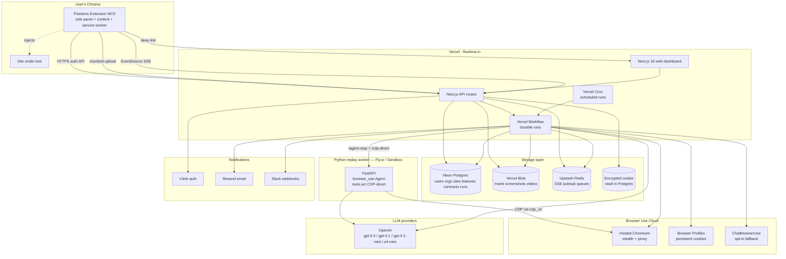
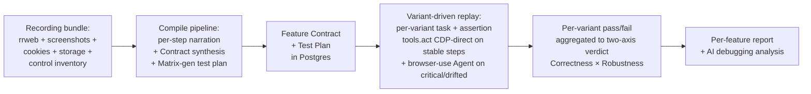
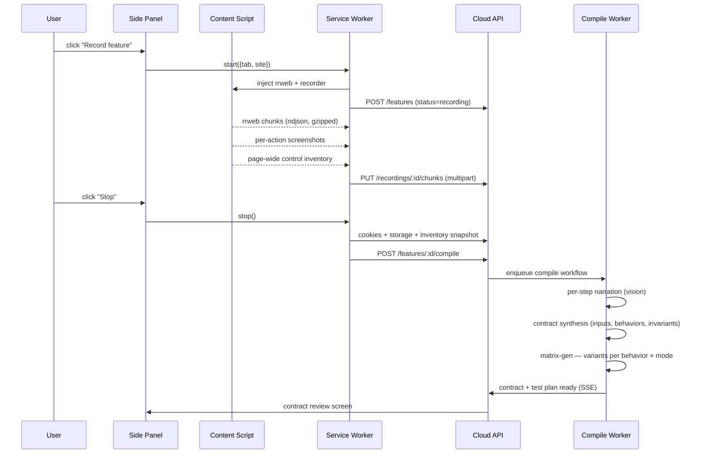
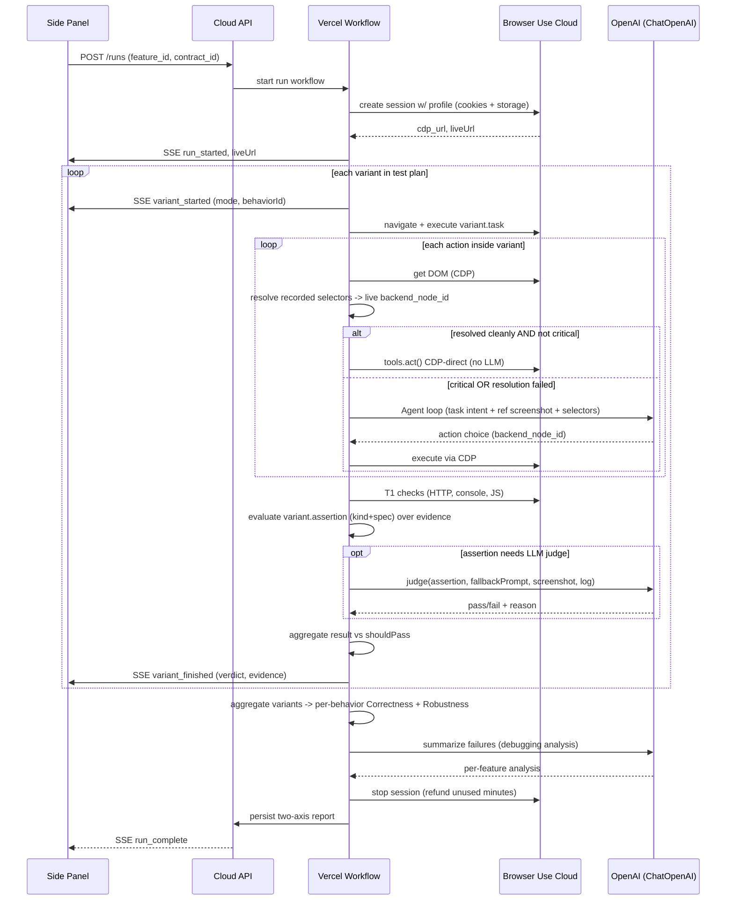
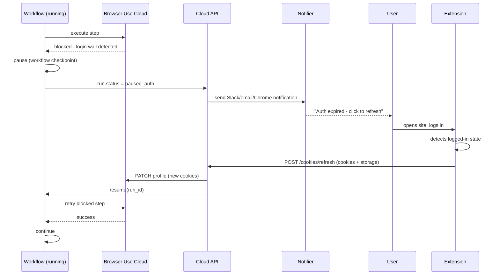

# Flowlens v3 — High-Level Design

> **Status:** proposed (plan mode draft, 2026-04-27)
> **Authors:** Flowlens core team
> **Supersedes:** [ARCHITECTURE_V2.md](../ARCHITECTURE_V2.md), [CONTEXT.md](../../CONTEXT.md) §4

---

## TL;DR

Flowlens v3 is the AI senior QA engineer that learns your features and tests them like a human would — not by replaying scripts, but by reasoning about what each feature is meant to do and proving it works across the four ways software actually breaks. A user records a feature once in any web app; Flowlens synthesizes a **Feature Contract** (inputs, expected behaviors, invariants) and runs a **four-mode test plan** (Verify / Edge / Stress / Adversarial) on Browser Use Cloud. The output is a **two-axis verdict** — Correctness (does it work as claimed?) and Robustness (does it survive what users actually do?). No selectors. No tests to maintain. The LLM is the QA engineer; the recording is the brief.

---

## 1. The product in one paragraph

A user demonstrates a feature once in their own browser. We capture the demonstration as structured data (DOM events, screenshots, cookies, storage, page-wide control inventory), and an LLM synthesizes a **Feature Contract**: a structured, universal description of inputs, 3–7 testable expected behaviors, and invariants that hold across every input. The user reviews and approves the contract (review-only in v1; re-record if it's wrong), then a test-plan generator expands each behavior into 1–2 variants per applicable mode — Verify, Edge, Stress, Adversarial, plus cross-cutting invariants — and the run executes on a hosted browser. Each variant carries an explicit `assertion` (concrete observable expectation) and a `shouldPass` signal; the replay engine drives the agent, captures evidence, and judges pass/fail per variant. The final report is a per-feature grid: rows are behaviors, columns aggregate to the **two-axis verdict** (Correctness ≈ verify+edge; Robustness ≈ stress+adversarial), with an AI-summarized debugging analysis at the bottom. Reports live both in the extension and on a web dashboard. Cookies are user-supplied via the same extension, refreshed in place when they expire.

---

## 2. Who, why, why now

### Target users (in priority order)

1. **Startup CTOs** with 10–50 engineers and no QA team. They ship daily, fear regressions, and can't justify a QA hire.
2. **E-commerce / SaaS founders** whose revenue depends on a handful of critical flows (signup, checkout, search, dashboard).
3. **Agencies** managing 5–50 client sites who need a quick health check after every deploy.
4. **Solo founders** who want a "Heroku-style" QA experience: install, record, done.

### Problems we solve


| Today                                                                | With Flowlens                                                                                         |
| -------------------------------------------------------------------- | ----------------------------------------------------------------------------------------------------- |
| Writing Cypress / Playwright tests takes hours per flow              | Record a feature in ~3 minutes; Flowlens designs the test plan                                        |
| Tests verify the script you wrote, not the feature you shipped       | Contract-based testing — the spec is "what the feature should do", not "what to click"                |
| Selenium-based AI testing (mabl, Rainforest) only replays the script | We don't replay — we synthesize new variants across four modes (verify / edge / stress / adversarial) |
| LogRocket / FullStory show recordings, not tests                     | We *test* before users hit the bug, with a two-axis Correctness × Robustness verdict                  |
| General-purpose AI agents (Devin etc.) wander without grounding      | The recording + contract is ground truth; matrix-gen reasons inside that scope                        |
| QA contractors cost $5K–15K / month                                  | $0.30 / run, always-on, never sleeps                                                                  |
| No regression visibility between deploys                             | Per-feature confidence over time + cross-deploy drift                                                 |


### How we differ from alternatives

- **Cypress / Playwright** — deterministic but manual; breaks on UI tweaks. We're zero-code, no maintenance.
- **Selenium-based AI testing (mabl, Rainforest)** — record + replay scripts. We don't replay; we derive a contract and design new tests across four modes.
- **General-purpose AI agents (Devin et al.)** — wander without grounding. We have the recording + contract as ground truth.
- **LogRocket / FullStory** — monitoring, not testing. We catch bugs before users hit them.
- **Manual QA contractors** — $5K–15K / month. We're $0.30 / run, always-on.

### Why now

- LLMs are finally cheap enough to be in the replay loop (~$0.10–0.18 per browser-driven test run with `gpt-4.1-mini` and a tightened DOM serialization).
- Browser Use Cloud removes the "running Chrome at scale" problem entirely. We have $500 in credits to validate.
- MV3 + Chrome Side Panel API make extensions a first-class UI surface.
- rrweb + browser-use (CDP, no Playwright) + Vercel Workflow are stable, battle-tested building blocks.

---

## 3. The end-to-end user journey

The 12-step story from "discovers Flowlens" to "gets daily regression reports". Every later document hangs off this spine.

```mermaid
flowchart LR
    S1[1. Install from<br/>Chrome Web Store] --> S2[2. Sign in<br/>via Google/Clerk]
    S2 --> S3[3. Open site,<br/>click Record]
    S3 --> S4[4. Demonstrate<br/>the feature]
    S4 --> S5[5. Stop &<br/>compile contract]
    S5 --> S6[6. Review Feature<br/>Contract]
    S6 --> S7[7. Approve<br/>or re-record]
    S7 --> S8[8. Auto-run<br/>4-mode test plan]
    S8 --> S9[9. Watch live in<br/>side panel + iframe]
    S9 --> S10[10. Two-axis report<br/>Correctness × Robustness]
    S10 --> S11[11. Schedule<br/>daily runs]
    S11 --> S12[12. Get Slack/email<br/>on regression]
```




### Step detail

1. **Install.** One click from the Chrome Web Store. ~5 MB extension. Minimal permissions explained inline.
2. **Sign in.** Side panel opens automatically. Google sign-in via Clerk. Free tier: 3 features, 50 runs / month.
3. **Record.** User navigates to their site. Click extension icon → side panel → "Record feature". A subtle red dot appears in the page corner.
4. **Demonstrate.** User performs the feature they care about — signup, checkout, search, filter, dashboard, settings, anything. The extension captures rrweb events + per-action screenshots + cookies + storage + a page-wide inventory of controls (radio / select / checkbox / text / number / etc.) on the surfaces touched. Optional "Note this step" button lets the user tag intent live.
5. **Stop & compile contract.** User clicks "Stop". The recording uploads, and the **contract synthesizer** turns it into a Feature Contract: `featureName`, `inputs` (structured ControlInputs derived from the touched controls + page inventory), 3–7 `expectedBehaviors` (each with given/when/then/observableOutcome), and `invariants` (claims that hold regardless of input — e.g. "Reset clears all filters", "no console errors during the flow"). ~10–20 s with progress bar.
6. **Review Feature Contract.** Side panel renders the contract: name, inputs, expected behaviors, invariants. The user reads what Flowlens *understood* about the feature — not a step carousel of clicks. **Review-only in v1**: if the contract is wrong, the user re-records (edit-contract is v2).
7. **Approve.** One click. Approval triggers test-plan generation (matrix-gen): for each behavior, the planner produces 1–2 variants in each applicable mode (Verify, Edge, Stress, Adversarial), plus invariant variants. Each variant carries `task`, `assertion { kind, spec, fallbackPrompt }`, `shouldPass`, and a one-line `riskHypothesis`.
8. **Auto-run.** No "Run" button to click — approval kicks off the run on Browser Use Cloud. The run UI opens automatically. (Manual re-run is one click from the report.)
9. **Watch live.** Side panel shows variant-by-variant progress (SSE) and an iframe of the cloud browser doing the work (`liveUrl` from BU Cloud). Per-variant pills colored by mode. User can pause, stop, or just watch.
10. **Two-axis report.** Run completes. The side panel and dashboard show a per-feature grid: rows = expected behaviors, each with a micro-grid of mode results. Aggregated columns: **Correctness** (verify + edge passing?) and **Robustness** (stress + adversarial passing?). Each failure deep-links to the variant's `assertion`, evidence (screenshot, console log, network trace), and the AI's debugging analysis ("Reset button leaves the Min Enrollments slider populated — invariant 2 violated").
11. **Schedule.** User toggles "Run daily at 9 AM". Done. Cron-driven via Vercel Cron.
12. **Get notified.** Slack or email on any regression — failing behaviors, the modes that broke, and a link to the run report.

### The "auth refresh" detour (Step 8.5)

Cookies eventually expire. When they do:

1. A scheduled run fails at the auth wall.
2. Slack message: "shop.example.com auth expired. Click to refresh."
3. User opens the site, logs in.
4. Extension detects the logged-in state (URL pattern + auth-cookie heuristic).
5. Side panel shows "Refresh auth?" button. User clicks → cookies + storage re-snapped → server updates the BU Cloud profile.
6. The paused run resumes from the failing step (no re-run cost).

### Surface split: side panel for action, web for depth

Flowlens ships two front-end surfaces. They aren't a primary/secondary pair — each is **chosen** for a job it does best, and they hand off cleanly via deep-link.

| Surface              | Job                                                                                   | Why this surface                                                                                                                                       |
| -------------------- | ------------------------------------------------------------------------------------- | ------------------------------------------------------------------------------------------------------------------------------------------------------ |
| **Side panel** (extension) | Recording, contract approval, watching the live run, the **compact two-axis verdict**, and quick post-run actions (re-run failed only, schedule daily, share). | The user is on the page being tested. The recorder needs the page; the live `liveUrl` iframe is the magic moment; the verdict needs to be scannable in 5 seconds without leaving flow. |
| **Web dashboard** (`flowlens.in/app/...`) | The **deep report** (side-by-side recorded vs replay screenshots, per-variant detail with task + assertion + evidence, full clustered AI debugging analysis), cross-deploy regression diff, scheduling, public sharing, team & billing. | Inherently wider, comparative, sharable. A 400 px side panel can't responsibly render two full-resolution screenshots side by side, three paragraphs of cluster analysis, and a behavior × mode grid simultaneously. |

The handoff is one-click: the side panel's `MatrixReport` screen has `Open full report ↗` as its primary CTA, deep-linking to `${flowlensWebUrl}/app/features/${flowId}/runs/${batchId}` in a new tab. The side panel **stays open** with the compact verdict still visible, so quick actions remain one click away while the user explores the deep view in the new tab.

This is a product principle, not a fallback for "the side panel can't fit everything". During a run, the side panel is intentionally the only place the live iframe lives — we don't redirect to the web mid-run because that would break the watch-live experience. After the run, the deep data lives on the web because that's what the data deserves. The full surface-split table is in [UX.md §8](UX.md#8-surface-split--side-panel-vs-web-dashboard).

---

## 4. System architecture

### The whole system on one page




### Data flow at a glance




---

## 4.5 What the AI actually does at each stage

§4 shows the org chart of components. This section answers the three questions the architecture diagram doesn't: **what does each LLM decide and what does it see when it decides?**, **what happens inside the remote browser when a variant runs?**, and **how do we make the cloud browser look exactly like the user's logged-in tab?** Implementation-level prompts, schemas, and code paths live in [LLD §5](LLD.md#5-compile-pipeline)–[§8](LLD.md#8-cookie-vault).

### 4.5.1 How the LLM makes decisions, stage by stage

There are six places we call an LLM. Each has a sharply scoped job, a curated input window (so we never pay for tokens we don't need), and a hard rule about what it must **never** see. Cookies, raw rrweb event streams, localStorage values, and IndexedDB contents are **excluded from every prompt** — they cross only the server-to-browser boundary, never the LLM boundary.

All model names below are resolved through the `MODELS.<stage>` registry in [`packages/llm-config/src/index.ts`](../../packages/llm-config/src/index.ts), so flipping providers (`LLM_PROVIDER=openai` vs `azure_foundry`) or per-stage env overrides (`FLOWLENS_MODEL_*`) doesn't require a code change. Resolved values per provider live in [LLD §7](LLD.md#7-llm-integration-map).


| Stage | What it sees | What it decides | What it never sees | Model (via `MODELS.<stage>`) |
| --- | --- | --- | --- | --- |
| **Narrate** — per step, parallel ×4 | step-before screenshot, step-after screenshot, action type, URL, hardened selectors, recorded value, controlType, availableOptions for that control | per-step `intent` + `expectedOutcome` + `isCritical` + `fragility` | full DOM, cookies, storage, other steps' screenshots | `MODELS.narrate` — fast vision LLM (`gpt-5.4-mini` on Foundry / `gpt-4.1-mini` on OpenAI direct) |
| **Synthesize Contract** — once per recording | site origin, ONE page screenshot (the first form-control step, low detail), page-wide control inventory, the bullet list of narrated step intents, per-step `controlType` / `availableOptions` / `recordedValue` | the Feature Contract: `featureName`, `inputs` (ControlInputs), 3–7 `expectedBehaviors` (given/when/then/observableOutcome), `invariants`, `preconditions`, `postconditions`, `fragilityHints` | full DOM, cookies, screenshots of other steps, the rrweb stream | `MODELS.synthesize` — multi-step text reasoning (`gpt-4.1` today; see LLD §7) |
| **Matrix-gen** — once per contract, the only reasoning model in the compile pipeline | the contract, the page screenshot at high detail, the page-wide control inventory, per-step `recordedValue` / `controlType` / `availableOptions` | for each `expectedBehavior`: 1–2 variants per applicable mode (Verify / Edge / Stress / Adversarial), each carrying `task`, `assertion { kind, spec, fallbackPrompt }`, `shouldPass`, `riskHypothesis`. Plus invariant variants. | cookies, full DOM, raw rrweb, other features' contracts | `MODELS.matrixGenerator` — `gpt-5.4` with `reasoning_effort=high` on Foundry; the only reasoning call in compile |
| **Replay agent** — only on structural-divergence variants | live serialized DOM (capped at 25K chars by `max_clickable_elements_length`), one page screenshot, the variant's `task` | `backend_node_id` to interact with + the action shape (click / input / scroll / etc.) | cookies (server-side only, decrypted into CDP without ever entering a prompt), the full Feature Contract | `MODELS.replayAgent` — fast vision LLM, runs inside browser-use's Agent loop |
| **Assertion judge** — only when no deterministic check applies | the recorded screenshot, the replay end-state screenshot, `assertion.fallbackPrompt`, a one-line summary of `variant.task` | `pass | fail` + reason + confidence | cookies, raw DOM (judge is intentionally pixel-only) | `MODELS.judge` — fast vision LLM |
| **Failure investigator** — only on critical-variant fail | recorded screenshot, replay screenshot, console errors, network errors, the failed step result | error class: `app_bug` / `flaky` / `env` / `auth` | cookies | `MODELS.investigator` — `o4-mini` reasoning model |


**The shape of each prompt.** Narrate is image-first — two before/after frames + a JSON blob of action context. Synthesize is text-first with a single anchor screenshot — the model reasons over the *narration list*, not the pixels. Matrix-gen is the most expensive prompt because it carries the contract plus the high-detail page screenshot plus the inventory; it gets reasoning effort to compensate. Replay agent and judge see screenshots only where pixels are the cheapest evidence. The investigator is the only call that sees console + network errors, because those are exactly the signals it needs to classify the failure.

**Why this carving matters for cost.** Compile is a one-time cost per feature (~$0.26 central), and matrix-gen alone accounts for ~40% of it. Each run reuses the contract + test plan; the per-run LLM cost is dominated by the replay agent (only fires on the ~30% of variants that need structural divergence) and the judge (only fires when no deterministic assertion applies). The CDP-direct fast path (no LLM, ~$0.001/step) carries the rest. Detailed model and pricing breakdown in [LLD §7](LLD.md#7-llm-integration-map) and [§15](LLD.md#15-cost-model-detailed).

### 4.5.2 How replay executes in the remote browser

Replay is where the contract becomes evidence. It's also the only place we touch a real browser — and we touch it through Browser Use Cloud's CDP endpoint, not Playwright. Here's what happens end-to-end for a single feature run:

1. **Spin up a hosted browser.** The web app POSTs to BU Cloud's REST API to create a session for the org's profile. BU returns `cdpUrl` (the WebSocket the sidecar will attach to) and `liveUrl` (the iframe-able URL the side panel embeds for the user to watch).
2. **Hand off to the Python sidecar.** The web app `POST`s `/run` to the replay-worker with the variant's `task`, the recorded `steps` (with any `fieldOverrides` already applied), the `cdpUrl`, the decrypted `cookies`, and the `landingUrl`. Cookies travel server → sidecar → CDP; they never enter an LLM prompt.
3. **Inject the session.** The sidecar opens a `BrowserSession` against `cdpUrl`, then before any `Page.navigate` it pushes the recorded session state into the cloud browser via raw CDP — cookies via `Storage.setCookies`, UA + locale + timezone via `Emulation.setUserAgentOverride` / `setTimezoneOverride` / `setLocaleOverride`, viewport via `setDeviceMetricsOverride`, permissions via `Browser.grantPermissions`. Origin storage (localStorage / sessionStorage / IndexedDB) is written *after* the first navigate via `Runtime.evaluate`, since CDP storage scope is origin-bound. Detail in [§4.5.3](#453-how-user-sessions-are-replicated) below.
4. **Navigate and pick an execution path per step.** The sidecar navigates to `landingUrl`, then walks the variant's step list. **Most variants take the static-divergence path**: `simple_replay.py` resolves each recorded selector against the live DOM (testid → role+name → CSS → XPath), executes via raw CDP `Input.dispatchMouseEvent` / `Runtime.evaluate`, captures a JPEG screenshot, and reads console errors from the CDP `Log` domain. **No LLM at execution time.** Per-step cost is the browser session minute, plus essentially zero.
5. **Promote to the Agent loop only when the variant requires actions not in the recording.** When `matrix-gen` synthesizes a variant whose `task` references an element the user didn't touch — "click Reset" when Reset wasn't recorded; "submit empty form" when the recording always typed something — that variant carries a `structuralDivergence: true` flag. Those steps hand off to the browser-use `Agent` loop: the agent serializes the live DOM (capped at 25K chars), the LLM picks a `backend_node_id` from lines like `*[12345]<button "Reset">`, `tools.act()` executes the action via CDP, and we fall back to the static path for any subsequent recorded steps in the same variant.
6. **Evaluate the assertion.** When the variant finishes, the assertion engine reads `variant.assertion.kind`. Deterministic kinds run first as raw CDP queries: `text_present` is a `Runtime.evaluate` of `document.body.innerText.includes(spec)`; `url_matches` is a regex against the current `Page.frameNavigated` URL; `console_no_errors` reads the captured CDP `Log` events; `count_equals` runs a `document.querySelectorAll(spec.selector).length` check. Only when no deterministic kind applies do we wake the LLM judge — it gets the recorded screenshot, the replay end-state screenshot, and `assertion.fallbackPrompt`, and returns pass/fail + reason + confidence. The judge never sees DOM or cookies.
7. **Aggregate.** Per-variant outcomes roll up to per-behavior verdicts: a behavior's **Correctness** column is green when its verify+edge variants all pass; its **Robustness** column is green when its stress+adversarial variants all pass. The full per-feature report is the rows × modes grid plus one final `MODELS.matrixCluster` call that summarizes the failures into 1–3 *clusters* ("Reset doesn't repaint — drives B4/Verify, B2/Stress, B3/Adv") for the AI debugging analysis paragraph.
8. **Tear down.** The sidecar releases the BrowserSession; the web app calls BU's REST API to stop the session and refund unused minutes; SSE emits `run_complete` to the side panel; the report persists to Postgres.

The sequence diagram in [§5.B](#b-replay-flow) shows the same flow at the message-passing level. The full algorithm with retry policies, T1 deterministic check list, and recovery strategies per failure type lives in [LLD §6](LLD.md#6-replay-engine-algorithm).

### 4.5.3 How user sessions are replicated

For replay to test the user's real account state, the cloud browser has to look — to the application, to the network, to client-side fingerprinting — **byte-identical to the user's own logged-in tab**. Cookies are the obvious half. Modern apps put auth tokens in IndexedDB (Clerk, Supabase, Firebase), feature flags in localStorage, locale in `Intl.DateTimeFormat`, and UA hints in `navigator.userAgentData`. A miss at any layer breaks at least some flows. So we capture and inject across seven layers — and at no point does any of this state cross the LLM boundary.

**Capture (extension side).** Three trigger points: recording start (baseline), recording stop (catches mid-session changes), and the explicit "Refresh auth" button. Each capture pulls:

- **Cookies** via `chrome.cookies.getAll({ url: origin })` — picks up HttpOnly + SameSite + Secure cookies the page can't see.
- **Web storage** via `chrome.scripting.executeScript` reading `localStorage` and `sessionStorage` from the recorded tab.
- **IndexedDB** via `chrome.scripting.executeScript` calling `indexedDB.databases()` then opening each DB and cursoring every store. *This is the most important "missing piece" for SPA auth* — Clerk's `__clerk_*`, Supabase's `sb-*`, Firebase's `firebase:authUser:*` all live here.
- **Service worker registrations** via `navigator.serviceWorker.getRegistrations()` (best-effort — we capture scope + scriptURL, not internal SW state).
- **Browser fingerprint** via `chrome.scripting.executeScript`: UA, UA-CH high-entropy hints, viewport, DPR, color depth, hardware concurrency, timezone, locale, languages.
- **Permissions** per origin via `navigator.permissions.query`.

The whole bundle is a `RichStateSnapshot` (schema version 1; version 0 was the legacy `{ cookies, storage }` format and is still readable). It's sealed via libsodium per-org keypair and stored in `cookie_snapshots.ciphertext`. Plaintext never lands on disk.

**Inject (sidecar side, per variant).** The sidecar decrypts the snapshot in memory, opens the BU Cloud session's CDP WebSocket, and runs the override sequence **before the first `Page.navigate`** so the very first HTTP request goes out with the right identity:

```text
1. Storage.setCookies                       — auth cookies in headers from request 1
2. Emulation.setUserAgentOverride           — UA + UA-CH metadata
3. Emulation.setTimezoneOverride            — affects new Date() in initial scripts
4. Emulation.setLocaleOverride              — affects Intl + Accept-Language
5. Emulation.setDeviceMetricsOverride       — viewport + DPR
6. Browser.grantPermissions                 — geolocation, notifications, etc.
7. Page.navigate(landingUrl)                — first request, with everything above applied
8. Runtime.evaluate(localStorage.setItem…)  — origin-scoped writes after navigate
9. Runtime.evaluate(indexedDB.open + put)   — origin-scoped writes after navigate
10. (Optional) re-register service workers via navigator.serviceWorker.register
```

Ordering is load-bearing: UA + cookies + locale must be set before request 1, but localStorage / IndexedDB writes can only happen *after* the page is on the right origin (CDP storage commands are origin-scoped). Service workers we mostly let auto-register on the first page load — best-effort, and almost no flow we've seen depends on a pre-warmed SW.

**Two snapshot versions, same injection path.** Schema version 0 (legacy `{cookies, storage}`) skips steps 8–10 and is still supported for old recordings. Version 1 (current `RichStateSnapshot`) runs the full sequence. The sidecar branches on `snapshot.version`; the migration is forward-only.

**The privacy invariant.** Cookies, storage values, and IndexedDB contents go: extension (encrypted in browser) → API (sealed at rest in Postgres) → sidecar (decrypted in memory) → CDP (over the wire to BU Cloud). They are **excluded from every LLM prompt by construction** — the prompts in §4.5.1 show what each stage sees, and none of those windows include cookies or storage. The compile pipeline strips them before any narration call; the replay agent's DOM serialization runs after `document.cookie` is set but the cookies themselves are never in the serialized output the agent sees.

The per-layer field list, full capture code, and CDP invocation sequence live in [LLD §8](LLD.md#8-cookie-vault) and the deeper architecture audit in [SESSION_REPLICATION.md](SESSION_REPLICATION.md).

---

## 5. The three core flows (high level)

### A. Recording flow




### B. Replay flow

A run executes the test plan: every variant is its own scoped replay with a `task` (natural-language replay instruction) and an `assertion` (concrete observable expectation). Per-variant outcomes aggregate up to per-behavior verdicts and finally to the two-axis report.




### C. Auth refresh flow




---

## 6. Major components (one paragraph each)


| Component                          | What it does                                                                                                                                                                                                                                                                                                                                           | Repo path                                                   |
| ---------------------------------- | ------------------------------------------------------------------------------------------------------------------------------------------------------------------------------------------------------------------------------------------------------------------------------------------------------------------------------------------------------ | ----------------------------------------------------------- |
| **Extension**                      | Records features, captures cookies + control inventory, side-panel UI (record / contract review / live run / report), auth refresh, deep-links to web. WXT + React 19 + Tailwind.                                                                                                                                                                      | `apps/extension/`                                           |
| **Web dashboard + API**            | Marketing site, signed-in app, every HTTP endpoint (recording uploads, features + contracts CRUD, run lifecycle, SSE, cookie refresh, webhooks). Next.js 16 Route Handlers. Owns Drizzle ORM + LLM calls + run orchestration.                                                                                                                          | `apps/web/`                                                 |
| **Replay worker (Python sidecar)** | FastAPI service that wraps `browser_use`. Exposes `POST /agent-step` (full Agent loop) and `POST /cdp-direct` (resolved selector + `tools.act()`). Deployed separately on Fly.io / Railway / Vercel Sandbox. Phase 3.                                                                                                                                  | `apps/replay-worker/`                                       |
| **Compile pipeline**               | Recording → **Feature Contract + Test Plan**. Three sub-stages on Vercel Workflow: per-step VLM narration, contract synthesis, matrix-gen test-plan generation. Calls OpenAI via `apps/web/src/lib/openai.ts`. Phase 2.                                                                                                                                | `packages/flow-doc/`                                        |
| **Contract synthesizer**           | Sub-component of the compile pipeline. Turns recording + control inventory into the universal contract schema: `featureName`, structured `inputs` (ControlInputs with name + domain), 3–7 `expectedBehaviors` (given/when/then/observableOutcome), `invariants`. Phase 2.                                                                              | `packages/flow-doc/synthesize/`                             |
| **Matrix-gen**                     | Sub-component of the compile pipeline. For each `expectedBehavior`, produces 1–2 variants in each applicable mode (Verify / Edge / Stress / Adversarial), plus invariant variants. Each variant carries `task`, `assertion { kind, spec, fallbackPrompt }`, `shouldPass`, `riskHypothesis`. Reasoning-heavy LLM call. Phase 2.                         | `packages/flow-doc/matrix-gen/`                             |
| **Replay engine (TS)**             | TS run lifecycle. Iterates the test plan variant-by-variant, drives the Python sidecar, evaluates each variant's `assertion` against captured evidence (deterministic checks first, LLM judge as `fallbackPrompt`), aggregates per-behavior verdicts to the two-axis Correctness × Robustness report, emits SSE. Never imports `browser_use`. Phase 3. | `packages/replay-engine/`                                   |
| **Cookie vault**                   | Capture, encrypt (libsodium per-org keypair), store, push-to-BU-profile, refresh. Phase 2.                                                                                                                                                                                                                                                             | `packages/cookies-vault/`                                   |
| **BU Cloud client**                | Typed TS wrapper around Browser Use Cloud v2 REST. Shipped Phase 1.                                                                                                                                                                                                                                                                                    | `packages/bu-cloud-client/`                                 |
| **Recorder core**                  | Framework-agnostic rrweb wrapper + screenshot scheduler + selector hardener + sensitive-detect. Used by extension. Phase 2.                                                                                                                                                                                                                            | `packages/recorder-core/`                                   |
| **Schema**                         | Zod runtime + Drizzle table defs shared by extension, API, workers. Sidecar mirrors a small subset in Python. Shipped Phase 1.                                                                                                                                                                                                                         | `packages/schema/`                                          |
| **Design tokens**                  | Single source of truth for colors / type / spacing. Used by both apps' Tailwind v4 `@theme`. Shipped Phase 1.                                                                                                                                                                                                                                          | `packages/design-tokens/`                                   |
| **OpenAI integration**             | Centralized model selection + Zod-validated call helpers. Every LLM call in v3 goes through here. Shipped Phase 1.                                                                                                                                                                                                                                     | `apps/web/src/lib/openai.ts` + `apps/web/src/lib/models.ts` |
| **Detectors**                      | Functional / perf / a11y / responsive checks. Ported from v2 in Phase 3.                                                                                                                                                                                                                                                                               | `packages/detectors/`                                       |


---

## 7. Tech stack & rationale

### Frontend

- **WXT** for the extension (Vite-based, MV3-first, hot reload, TypeScript)
- **Next.js 16** for the web dashboard (App Router, Server Components, Cache Components)
- **React 19** + **Tailwind CSS v4** (matches existing v2 design system)
- **Framer Motion** (already in use)
- **shadcn/ui** components (consistent design system)

### Backend

- **Next.js API Route Handlers** (single deployment, no separate FastAPI)
- **Vercel Workflow** for durable run orchestration (pause/resume on auth refresh)
- **Vercel Cron** for scheduled runs

### Storage

- **Neon Postgres** (Vercel Marketplace, branching for preview deploys)
- **Vercel Blob** (rrweb chunks, screenshots, replay videos)
- **Upstash Redis** (SSE pubsub, ephemeral run state)

### Auth & users

- **Clerk** (Vercel Marketplace, Google OAuth, multi-tenant orgs out of the box, extension-friendly)

### Browser execution

- **Browser Use Cloud** (only browser runtime; kills our EC2 + Xvfb stack)
- **browser-use** as the only Python automation library — no Playwright. Two execution paths over the same `cdp_url`:
  1. `tools.act()` direct CDP for stable steps (no LLM, ~$0.001/step).
  2. Full `Agent` loop for critical or drifted steps (LLM-driven, ~$0.01/step cached).
  Details + config in [LLD §5.5](LLD.md#55-browser-use-configuration--selector-resolution).
- **Replay worker deploy target**: Docker container on **AWS App Runner** *or* **Azure Container Apps** — both offer scale-to-zero pay-per-vCPU-second pricing. Choose based on credit pool ($10K AWS or Azure available); the Phase 3 spike will deploy to one and benchmark cold-start latency against the BU Cloud session. Both are first-class Docker hosts and require no per-host configuration. We are NOT using Fly.io; we are NOT compromising on the hybrid `tools.act()` + Agent loop model.

### LLMs

OpenAI is the only LLM provider we ship with. Model selection is centralized in `apps/web/src/lib/models.ts` and overridable per env via `FLOWLENS_MODEL_*` vars.

- `**gpt-4.1-mini`** — replay agent (browser-use Agent loop), per-step narration (vision), assertion judge, test-data generator, sensitive-data classifier fallback. Cheap, fast, vision-capable.
- `**gpt-4.1` (vision)** — **contract synthesis**. Multi-step reasoning over the recording bundle + control inventory + screenshots to produce the universal Feature Contract.
- `**gpt-5.4` (reasoning_effort=high)** — **matrix-gen brain**. Expanding each `expectedBehavior` into Verify / Edge / Stress / Adversarial variants is genuinely reasoning-heavy: the model has to imagine what *could* go wrong, derive boundary values, and craft assertion specs. We pay for reasoning here because variants directly determine coverage. Called once per feature compile, typically 2–4 calls per feature in practice.
- `**o4-mini`** — failure investigator. Reasoning-heavy classification of why a critical variant failed (`app_bug | flaky | env | auth`).
- **ChatBrowserUse** stays available as an opt-in fallback for the replay agent — its provider-side prompt caching is cheaper than OpenAI for very repetitive browser loops, but you trade some control over the agent's reasoning. Ship default is OpenAI; ChatBrowserUse is feature-flagged per org.

### Notifications

- **Resend** for email
- **Slack webhooks** for chat
- **Chrome notifications API** for in-extension alerts

### Observability

- **Vercel Observability** (logs, traces, errors)
- **PostHog** for product analytics

### Why this stack (in 5 bullets)

1. **Single Vercel deployment** vs. today's EC2 + Vercel split. One billing, one log surface, one IAM model.
2. **Vercel Workflow + BU Cloud** = no Chrome on our infra. Massive ops simplification.
3. **WXT** is the modern MV3-first extension framework; Plasmo is sliding, CRXJS is too low-level.
4. **Neon's branching DB** lets us spin up a preview Postgres per PR — huge for testing migrations.
5. **Clerk + Marketplace auto-provisioning** means we get auth + DB + Blob + Redis with zero ops.

---

## 8. Key design decisions


| Decision                                                         | Why                                                                                                                                                                                    | Alternative considered                                                                   |
| ---------------------------------------------------------------- | -------------------------------------------------------------------------------------------------------------------------------------------------------------------------------------- | ---------------------------------------------------------------------------------------- |
| **Feature Contract as the primary artifact (vs step list)**      | The contract is *what the feature should do*; the recording is just one demonstration of it. Tests reason about claims, not clicks — that's why tests survive UI tweaks.               | A flat step list — couples tests to one execution path; UI tweak = test break            |
| **Four-mode test plan per behavior (vs input-fuzzing families)** | Verify / Edge / Stress / Adversarial mirrors how a senior human QA actually thinks. Random fuzzing finds noise; the four modes are the four *real* failure surfaces.                   | Random input fuzzing — unguided, unprioritized, hard to debug, low signal                |
| **Two-axis verdict (Correctness × Robustness)**                  | Splits "does it work?" from "does it survive abuse?". A green Correctness with red Robustness is shippable to a small audience but not to scale — that's a meaningful signal.          | Single pass/fail — collapses the most useful product distinction we can offer            |
| **Universal contract schema across all feature types**           | Same schema for signup, search, checkout, dashboard, settings — anywhere we can describe inputs + expected behaviors + invariants. Keeps matrix-gen general and the report consistent. | Per-vertical templates — explodes maintenance, fragments the report grid                 |
| **Review-only contract approval in v1 (re-record if wrong)**     | Editing a structured contract well is hard UX; re-recording is fast and unambiguous. We learn from re-record patterns before designing the editor.                                     | In-product contract editor in v1 — high UX risk on first release                         |
| **Auto-run after contract approval (no separate "Run" click)**   | The user already said "this is what I want tested" by approving. An extra click is friction without information.                                                                       | Manual run trigger — extra step, no benefit                                              |
| **Record rrweb, not video**                                      | Lossless replay, semantic events, ~50× smaller, searchable                                                                                                                             | Pure `tabCapture` MP4 — too heavy, no semantics                                          |
| **LLM-first replay (with CDP-direct fast path)**                 | Recording is a *prior*; LLM thinks at every critical step; non-critical steps that resolve cleanly bypass the LLM via `tools.act()`                                                    | Pure deterministic CDP — brittle when UI drifts; pure LLM — wastes money on stable steps |
| **One Browser Use Cloud session per run**                        | Simplest cost model, billed per minute, easy to refund                                                                                                                                 | Pre-warmed pool — premature optimization                                                 |
| **Hybrid extension + web split**                                 | Side panel for action; web for reports & sharing                                                                                                                                       | Extension-only — too cramped; web-only — no recording UX                                 |
| **Cookies in encrypted Postgres + BU profile**                   | Auditable, rotatable, refreshable in place                                                                                                                                             | Re-pushing cookies on every run — wasteful, racy                                         |
| **Vercel Workflow for runs**                                     | Native pause/resume, retry, idempotency for auth refresh                                                                                                                               | Custom queue + state machine — reinventing the wheel                                     |
| **No deterministic-only "fast mode" by default**                 | "Real testing" > "fast macros". Offer fast mode as opt-in.                                                                                                                             | Fast mode default — would attract wrong customer                                         |
| **Per-step screenshot, not per-tick**                            | One screenshot per semantic action, not 30 fps                                                                                                                                         | Continuous video — bandwidth waste                                                       |
| **Free tier: 3 features, 50 runs / month**                       | Priced against fractional QA contractors, not per-test infra. Three features is enough for one critical journey + two adjacent ones — the wedge.                                       | Per-run trial — fights our "always-on" pitch; per-flow tier — wrong unit                 |


---

## 9. Out of scope (v3)

What we are *not*:

- **Not unit / integration tests** — devs own those.
- **Not load / performance testing** — different tool, different budget.
- **Not security pentesting** — adversarial mode catches naive issues, not a substitute for proper audits.
- **Not multi-tenant collab in v1** — solo + small team focus.

To stay shippable in 4 weeks, we also defer:

- **Contract editing in-product** — review-only in v1; re-record if the contract is wrong. Edit-contract is v2.
- **Cross-site invariant testing** — invariants are scoped to one feature in one site for v1. Site-level rules ("no console error on any page") wait.
- **Performance testing as a first-class mode** — Stress mode catches *functional* breakage under rapid use, not latency budgets.
- **Visual regression as a first-class mode** — pixel diffs and AI image diffs come back in v3.1 (was previously a tier in v2).
- Mobile recording (iOS/Android browsers don't support extensions in this way).
- API-only test recording (no browser involved).
- Multi-tab cross-origin flows (defer; OAuth + payment provider redirects are the main offenders, handled separately).
- Self-hosted version.
- Team RBAC beyond Clerk's defaults.
- Custom test data sources (CSV upload, env vars) — comes in Pro v3.1.

---

## 10. Phased delivery (4 weeks)


| Week     | Theme                 | Deliverable                                                                                                                                                                                                                                                                                                                                                                                                                                                                                                                                                                                   |
| -------- | --------------------- | --------------------------------------------------------------------------------------------------------------------------------------------------------------------------------------------------------------------------------------------------------------------------------------------------------------------------------------------------------------------------------------------------------------------------------------------------------------------------------------------------------------------------------------------------------------------------------------------- |
| **1**    | Foundations           | pnpm monorepo. Drizzle schema + Zod runtime types. Typed BU Cloud v2 client. OpenAI client + centralized `MODELS`. WXT extension scaffold (stub auth). Next.js 16 web scaffold + `/api/health`. Shared design tokens. ✅ shipped.                                                                                                                                                                                                                                                                                                                                                              |
| **1.5**  | Real auth             | Clerk Google OAuth. Extension token issuance + storage. Replace stub `chrome.storage.local` auth in side panel. Org-scoping middleware in API routes. `pnpm db:push` after Neon `DATABASE_URL` is available.                                                                                                                                                                                                                                                                                                                                                                                  |
| **2**    | Recording → Contract  | rrweb + per-action screenshots + cookies + page-wide control inventory upload, encrypted. Compile pipeline on Vercel Workflow: `gpt-4.1-mini` per-step narration → `gpt-4.1` contract synthesis → `gpt-5.4` reasoning-high matrix-gen test plan. `data-flowlens-id` injection. Extension contract-review UI (read-only).                                                                                                                                                                                                                                                                      |
| **3**    | Replay + verify       | ✅ shipped. Python sidecar (`apps/replay-worker/`) — Dockerfile + AWS App Runner + Azure Container Apps deploy paths. Hybrid replay engine on BU Cloud (`tools.act()` CDP-direct + `Agent` loop, both via the sidecar). Selector resolution layer. Variant-driven loop: per-variant `task` execution, T1 deterministic checks + assertion judge (LLM fallback), per-behavior aggregation to two-axis verdict. Auth-refresh loop with workflow checkpointing. Side-panel run UI (`liveUrl` iframe + variant pills + auth-refresh banner). Per-org budget guardrails + BU Cloud circuit breaker. |
| **3.5a** | Workflow runtime swap | ✅ shipped. Migrated `compile-recording` and `run-flow` workflows from the Phase 3 fire-and-forget shim to the real Vercel Workflow Devkit (`workflow@4.2.4` + `@workflow/next@4.0.5`). All durable steps now persist + retry; auth-pause uses `createHook(token)` + `sleep('24h')` race; `/api/cookies/refresh` resumes via `resumeHook(token, payload)`. WDK manifest auto-discovers 2 workflows + 18 steps at build time.                                                                                                                                                                   |
| **4**    | Dashboard + polish    | Web dashboard (sites, features, contracts, runs with two-axis report, public share). Scheduled runs + Slack/email. Chrome Web Store submission. EC2 decommission. (T2 visual diff and visual regression as a first-class mode are deferred to v3.1 — see §9.)                                                                                                                                                                                                                                                                                                                                 |


---

## 11. Cost model (per run, summarized)

Recomputed for the new pipeline (April 2026 prices: `gpt-4.1-mini` ~$0.40/M input, ~$1.60/M output; `gpt-4.1` ~$2.50/M input, ~$10/M output; `gpt-5.4` reasoning-high ~$5/M input, ~$20/M output with reasoning tokens; `o4-mini` ~$1.10/M input, ~$4.40/M output). The `tools.act()` CDP-direct path on stable steps still skips the LLM entirely.

The unit of work is now a **per-feature run** (8–15 variants across 4–6 behaviors), not a single step list. Compile is a one-time cost per feature; runs reuse the contract + test plan.


| Phase                                                                                  | Cost (central / guardrail)       |
| -------------------------------------------------------------------------------------- | -------------------------------- |
| Per-step VLM narration (`gpt-4.1-mini` vision)                                         | ~$0.06                           |
| Contract synthesis (`gpt-4.1` over recording bundle + control inventory)               | ~$0.10                           |
| Matrix-gen test plan (`gpt-5.4` reasoning_effort=high, 1–2 calls per feature)          | ~$0.10 central / $0.15 upper     |
| **Total compile per feature (one-time)**                                               | **~$0.26 central / $0.31 upper** |
| Replay run, full feature, hybrid mode (~8–15 variants, Agent on critical + CDP-direct) | **~$0.30 central / $0.50 upper** |
| Replay run, fast mode (CDP-direct everywhere we can, deterministic assertions only)    | ~$0.15                           |
| Replay run, full LLM mode (Agent on every variant + LLM judge on every assertion)      | ~$0.70                           |
| Cross-deploy regression (one feature run + diff)                                       | ~$0.33                           |
| Failure investigator (only on critical fail, ~10 % runs)                               | ~$0.06                           |


**Credit pool** (granted): **$500 BU Cloud** + **$2,000 OpenAI**. Total runway:

- BU Cloud at ~~$0.005 per feature run (longer browser sessions because more variants) is still effectively non-binding (~~100K runs on $500).
- LLM is the binding constraint. At the **$0.30 central** estimate, $2,000 OpenAI buys **~6,600 hybrid feature runs**. At the **$0.50 upper guardrail**, ~4,000 runs.
- **80–120 closed-beta users** running **2–3 features daily** for **a month**, plus ad-hoc usage and matrix-gen recompiles — fits within the credit pool with a small buffer. Per-org budget guardrails clamp run count automatically.

The cost-per-run is higher than v2's input-fuzzing-family runs, but each run now covers ~10× the surface (4 modes × multiple behaviors instead of a single deterministic replay). Cost-per-bug-caught should drop substantially.

Detailed breakdown: see [LLD §15](LLD.md#15-cost-model-detailed).

---

## 12. Risks & mitigations


| Risk                                                         | Likelihood | Impact                                | Mitigation                                                                                                                                                                                          |
| ------------------------------------------------------------ | ---------- | ------------------------------------- | --------------------------------------------------------------------------------------------------------------------------------------------------------------------------------------------------- |
| **Contract accuracy** — AI misunderstands the feature        | High       | Tests measure the wrong thing         | Render the contract clearly at review time (named inputs, behavior given/when/then in plain English); user can re-record if wrong; track contract-edit / re-record rate as a quality metric         |
| **Variant explosion** — 4 modes × N behaviors gets expensive | Medium     | Run cost spikes; report becomes noisy | Mode-aware variant cap (max 2 variants per behavior per mode in v1); per-org budget guardrail; allow Pro to opt into deeper coverage; matrix-gen prompt enforces "1–2 variants per applicable mode" |
| Chrome Web Store rejection / delay                           | High       | Blocks GTM                            | Apply early in week 4, prep privacy policy, shorten permissions, demo video                                                                                                                         |
| Cookie capture privacy concerns                              | High       | Trust-killer                          | Encrypt at rest, scope to user-recorded origins only, delete on feature delete, audit log, never log values                                                                                         |
| Anti-bot detection on cloud replay                           | Medium     | Replay false-failures                 | BU Cloud stealth Chromium, geo-matched proxy, human-like timing, fall back to "verify on user's browser" mode                                                                                       |
| LLM cost runaway from stuck agents                           | Medium     | Burns $500 in days                    | Hard `max_steps` cap, wallclock timeouts, `should_stop_callback`, per-org budget guardrail, BU billing poller                                                                                       |
| rrweb cross-origin iframe limits                             | Medium     | Bad coverage on SSO sites             | Document upfront, fallback recording mode that captures screenshots only across iframe boundaries                                                                                                   |
| Selector drift between record and replay                     | Medium     | Flaky variants                        | 4-tier selector hardening (role+text → testid → CSS → XPath), LLM intent fallback                                                                                                                   |
| Vercel Workflow GA stability                                 | Low        | Run reliability                       | Have a backup queue+worker fallback, ship behind feature flag                                                                                                                                       |
| User records sensitive data into a feature                   | High       | Privacy + compliance                  | Auto-detect (regex for cards, SSN, JWT) + warn at compile, encrypt-at-rest, redact in UI                                                                                                            |
| **Adversarial mode overreach**                               | Low        | False-positive "security bugs"        | Adversarial variants test *graceful degradation*, not exploitability; framing in the report makes this explicit; we explicitly disclaim being a pentest tool                                        |


---

## 13. Success metrics (north stars)

The shift from step-based replays to feature-confidence runs means our KPIs measure *confidence delivered*, not *variants executed*.

### Activation

- ≥ 60 % of users who install the extension approve their first contract within 24 h.
- Median time from install → first comprehended report: ≤ 5 min.

### Feature confidence (new core metrics)

- **Median behaviors per feature**: 4–6 — too few means we're under-claiming; too many means matrix-gen is hallucinating.
- **Median variants per feature**: 8–15 — proxy for coverage breadth.
- **Correctness verification rate**: ≥ 90 % of approved contracts produce a green Correctness column on first run across the closed beta. Below that, the contract is too ambitious or the assertions too strict.
- **Bugs caught per feature per week**: ≥ 1 for active users — the only metric that proves we're earning the "QA engineer" framing.

### Engagement

- ≥ 40 % of users who approve a contract trigger a manual re-run within 7 d.
- ≥ 25 % of users who approve a contract schedule daily runs within 14 d.

### Retention

- D30 retention: ≥ 30 %.
- ≥ 10 % of free users convert to Pro within 60 d (cross-deploy regression + scheduled runs are the wedge).

### Quality

- Replay reliability (variant pass when the underlying intent succeeded, not flaky): ≥ 85 % across the closed beta.
- Auth refresh success rate (user finishes the refresh flow): ≥ 90 %.
- Re-record rate after contract review: ≤ 20 % (above that, contract synthesis is failing too often).

### Cost

- Median cost per feature run: ≤ $0.50.
- Cumulative BU Cloud spend in beta: ≤ $500.

---

## 14. Open questions to resolve before week 1

1. **Contract editing** — does it land in v2, or do we wait for closed-beta usage data on re-record patterns before designing the editor? Decision affects v2 scope and the "review-only" framing in marketing.
2. **Adversarial variant aggressiveness** — for sites without an obvious security surface (marketing pages, simple dashboards), how many adversarial variants does matrix-gen generate? Risk: noise / cost. Mitigation candidate: the contract synthesis tags each behavior with a sensitivity prior that matrix-gen consults.
3. **Variants-per-behavior cap** — the brief assumes 1–2 per applicable mode. Is that the right ceiling for v1, or should Pro tier opt into 3–4 for deeper coverage at higher cost?
4. **Pricing** — exact free / Pro / team tier limits and prices ($0 / $? / $? per seat per month).
5. **Org model** — single workspace per user (simple) vs Clerk Organizations (multi-tenant from day 1).
6. **Scheduled runs concurrency cap** — global per-org limit and behavior on overflow.
7. **Public share URL TTL** — perpetual until revoked, or auto-expire after N days?
8. **Replay video** — render on demand from rrweb (cheap, lazy) or pre-render after every run (faster UX, more storage)?

---

## 15. Where to go next

- **[LLD.md](LLD.md)** — implementation-level: data models, API contracts, recording protocol, replay algorithm, edge cases, execution traces.
- **[UX.md](UX.md)** — wireframes, microcopy, journey maps, every-state-of-every-screen.

