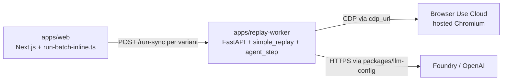
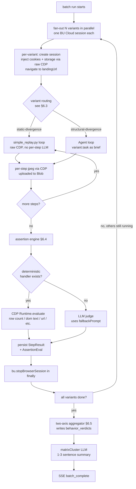

# Flowlens v3 — Low-Level Design

> **Companion to:** [HLD.md](HLD.md)
> **Audience:** engineers who will implement this
> **Status:** Phases 1, 1.5, 2, 3, 3.5a, 3.5b, 3.5c shipped; Phase 4 (contract + 4-mode test plan + assertion engine) in flight as **additive deltas** over the existing code.

> **Reading guide.** This doc reflects the current code state under `flowlens/apps/` and `flowlens/packages/`. Sections describe what's already shipped. Where the new direction (Feature Contract / 4-mode test plan / two-axis verdict — see HLD §1) requires changes, the doc calls out the **delta** (additive column, additive prompt, additive endpoint) rather than re-specifying a green-field replacement. Migration plan in §19.

---

## Contents

1. [Component map](#1-component-map)
2. [Data models](#2-data-models)
3. [API contracts](#3-api-contracts)
4. [Recording protocol](#4-recording-protocol)
5. [Compile pipeline](#5-compile-pipeline)
6. [Replay engine algorithm](#6-replay-engine-algorithm)
7. [LLM integration map](#7-llm-integration-map)
8. [Cookie vault & session replication](#8-cookie-vault--session-replication)
9. [Storage architecture](#9-storage-architecture)
10. [Auth flows](#10-auth-flows)
11. [Error handling & retries](#11-error-handling--retries)
12. [Step-by-step execution traces](#12-step-by-step-execution-traces)
13. [Edge cases](#13-edge-cases)
14. [Performance characteristics](#14-performance-characteristics)
15. [Cost model (detailed)](#15-cost-model-detailed)
16. [Security considerations](#16-security-considerations)
17. [Observability](#17-observability)
18. [Open features deferred](#18-open-features-deferred)
19. [Migration plan: current code → contract + 4-mode + assertion](#19-migration-plan-current-code--contract--4-mode--assertion)
20. [Where to go next](#20-where-to-go-next)

---

## 1. Component map

> **Polyglot reality**: The frontend, API, schema, and orchestration are TypeScript on Vercel. The replay engine's Agent loop calls `**browser_use`** which is a Python library — there is no equivalent npm package. We solve this with a thin Python sidecar (`apps/replay-worker/`) that the TS replay engine talks to over HTTP. See [§5.5](#55-browser-use-configuration--selector-resolution).

```text
flowlens/
  apps/
    extension/                        # WXT MV3 extension (TypeScript)
      wxt.config.ts
      entrypoints/
        background.ts                 # service worker
        sidepanel/
          index.html
          App.tsx                     # root state machine
          screens/
            Idle.tsx
            Recording.tsx
            Reviewing.tsx
            Running.tsx
            AuthRefresh.tsx
            Empty.tsx
            Error.tsx
        content/
          recorder.ts                 # rrweb wrapper + screenshot scheduler
          overlay.tsx                 # in-page record badge
          inject.ts                   # bootstrap content world
        popup/
          index.html
          Popup.tsx                   # tiny — opens side panel
      lib/
        api-client.ts                 # typed Cloud API client
        chrome-cookies.ts             # capture helpers
        chrome-storage.ts             # localStorage / sessionStorage helpers
        selector-harden.ts            # 4-tier selector computer
        message-bus.ts                # typed runtime messaging
        clerk-extension.ts            # Clerk auth glue
      manifest/
        permissions.json
    web/                              # Next.js 16 app (TypeScript)
      src/
        lib/
          db.ts                       # Drizzle node-postgres pool
          models.ts                   # ★ centralized FLOWLENS_MODEL_* registry
          openai.ts                   # ★ singleton OpenAI client + Zod-typed call helpers
          auth.ts                     # Clerk session helpers (Phase 1.5)
        app/
          (marketing)/
            page.tsx
          app/
            sites/page.tsx
            sites/[siteId]/page.tsx
            flows/[flowId]/page.tsx
            runs/[runId]/page.tsx
            runs/[runId]/share/[token]/page.tsx
            settings/page.tsx
          api/
            health/route.ts                 # ★ Phase 1: env + MODELS visibility
            recordings/start/route.ts
            recordings/[id]/chunks/route.ts
            recordings/[id]/finish/route.ts
            flows/route.ts
            flows/[id]/route.ts
            flows/[id]/compile/route.ts
            flows/[id]/runs/route.ts
            runs/[id]/route.ts
            runs/[id]/stream/route.ts          # SSE
            runs/[id]/pause/route.ts
            runs/[id]/resume/route.ts
            runs/[id]/cancel/route.ts
            cookies/refresh/route.ts
            sites/[id]/site-model/route.ts
            webhooks/browser-use/route.ts
            schedule/[flowId]/route.ts
            billing/usage/route.ts
          actions/
            createFlow.ts                     # server action
            deleteFlow.ts
            updateFlow.ts
      workflows/                              # ★ Phase 3.5a — Vercel Workflow Devkit (real)
        compile-recording.ts                  # 6 step fns + workflow fn ("use workflow")
        run-flow.ts                           # 9 step fns + auth-pause via createHook
        scheduled-run.ts                      # Phase 4
      drizzle.config.ts
    replay-worker/                            # ★ Python sidecar — Phase 3 → Phase 4
      pyproject.toml
      app/                                    # actual layout in current code
        main.py                               # FastAPI app (/run, /run-sync)
        run.py                                # per-variant orchestration (Phase 4: dispatch)
        simple_replay.py                      # ★ static-divergence path (current code)
        agent_step.py                         # ★ structural-divergence path (Phase 4 wire)
        cookie_inject.py                      # raw CDP Storage.setCookies pre-navigation
        state_replicate.py                    # Phase 4: rich-state replay (UA hints, IDB, SW)
        auth_wall.py                          # login-wall heuristics
        assertion_engine.py                   # ★ Phase 4 — deterministic + LLM-judge handlers
        judge.py                              # MODELS.judge — vision fallback for assertions
        llm_client.py                         # mirrors @flowlens/llm-config; provider routing
        contracts.py                          # StepResult, AssertionEval, VariantPayload
      Dockerfile                              # deployable to AWS App Runner OR Azure Container Apps
      apprunner.yaml                          # AWS App Runner config (if AWS chosen)
      azure-containerapp.bicep                # Azure Container Apps config (if Azure chosen)
  packages/
    schema/                                   # Zod + Drizzle (TypeScript)
      src/
        index.ts
        flow.ts
        run.ts
        recording.ts
        cookie.ts
        events.ts                             # SSE / runtime message types
        db.ts                                 # Drizzle table defs
    recorder-core/                            # Phase 2 — extension-shared TS
      record.ts                               # rrweb + screenshots wrapper
      action-stream.ts                        # rrweb -> semantic actions
      selector-harden.ts
      chunker.ts                              # NDJSON gzip chunks
      sensitive-detect.ts                     # regex + LLM-fallback heuristic
    flow-doc/                                 # Phase 2 → Phase 4 — compile pipeline
      compile.ts                              # main entry (consumed by compile-inline.ts)
      narrate-step.ts                         # MODELS.narrate
      synthesize-flow.ts                      # MODELS.synthesize → ★ outputs FeatureContract (Phase 4)
      generate-matrix.ts                      # MODELS.matrixGenerator → ★ 4-mode + assertion (Phase 4)
      sibling-flows.ts                        # MODELS.siblingGen
      site-model.ts                           # MODELS.siteModel (legacy; kept for sibling AI flows)
      inject-flowlens-ids.ts                  # data-flowlens-id annotation hints
      prompts.ts                              # all system prompts (single source)
    llm-config/                               # ★ Phase 3 — provider routing source of truth
      src/index.ts                            # MODELS table + resolveModel(stage)
    replay-engine/                            # ★ Phase 3 — thin TS HTTP client around the sidecar
      run-batch-inline.ts                     # batch dispatcher (parallel BU sessions)
      run-single-inline.ts                    # single-variant debug path
      replay-worker-client.ts                 # HTTP client to apps/replay-worker
      data-gen.ts                             # MODELS.dataGen
      failure-investigator.ts                 # MODELS.investigator (o4-mini)
      aggregate-batch-verdict.ts              # ★ Phase 4 — two-axis verdict aggregator
    cookies-vault/
      capture.ts
      encrypt.ts                              # libsodium sealed box
      bu-profile-sync.ts
      refresh-detect.ts
    bu-cloud-client/                          # ★ shipped Phase 1 — typed BU Cloud v2 REST
      src/index.ts                            # billing, sessions, profiles, tasks
    design-tokens/                            # ★ shipped Phase 1 — shared CSS vars + TS
      src/index.ts
      src/tokens.css
    detectors/                                # Phase 3 port from v2
      functional.ts
      performance.ts
      accessibility.ts
      responsive.ts
  infra/
    vercel.json
  legacy/                                      # v2 archived (read-only)
```

★ = item shipped or augmented in Phase 1 that wasn't in the original LLD draft.

---

## 2. Data models

### Drizzle schema (Postgres)

```ts
// packages/schema/drizzle.ts (excerpts)
import { pgTable, text, integer, timestamp, jsonb, boolean, uuid, index, primaryKey } from 'drizzle-orm/pg-core';

export const orgs = pgTable('orgs', {
  id: uuid('id').primaryKey().defaultRandom(),
  clerkOrgId: text('clerk_org_id').unique().notNull(),
  name: text('name').notNull(),
  plan: text('plan', { enum: ['free', 'pro', 'team'] }).default('free').notNull(),
  // Microdollars (USD * 1_000_000) so we never do float math on credit balances.
  monthlyRunBudgetUsdMicro: integer('monthly_run_budget_usd_micro').default(20_000_000).notNull(),
  monthlyRunsConsumedUsdMicro: integer('monthly_runs_consumed_usd_micro').default(0).notNull(),
  monthlyRunsResetAt: timestamp('monthly_runs_reset_at').defaultNow().notNull(),
  createdAt: timestamp('created_at').defaultNow().notNull(),
});

export const users = pgTable('users', {
  id: uuid('id').primaryKey().defaultRandom(),
  clerkUserId: text('clerk_user_id').unique().notNull(),
  email: text('email').notNull(),
  defaultOrgId: uuid('default_org_id').references(() => orgs.id),
  createdAt: timestamp('created_at').defaultNow().notNull(),
});

export const sites = pgTable('sites', {
  id: uuid('id').primaryKey().defaultRandom(),
  orgId: uuid('org_id').references(() => orgs.id).notNull(),
  origin: text('origin').notNull(),                    // https://shop.example.com
  displayName: text('display_name').notNull(),
  faviconUrl: text('favicon_url'),
  siteModel: jsonb('site_model'),                      // cached AI understanding
  siteModelStaleAfter: timestamp('site_model_stale_after'),
  createdAt: timestamp('created_at').defaultNow().notNull(),
}, t => ({
  orgOrigin: index('sites_org_origin_idx').on(t.orgId, t.origin),
}));

export const flows = pgTable('flows', {
  id: uuid('id').primaryKey().defaultRandom(),
  orgId: uuid('org_id').references(() => orgs.id).notNull(),
  siteId: uuid('site_id').references(() => sites.id).notNull(),
  createdByUserId: uuid('created_by_user_id').references(() => users.id).notNull(),
  name: text('name').notNull(),
  description: text('description'),
  source: text('source', { enum: ['recorded', 'ai_suggested', 'manual'] }).notNull(),
  preconditions: jsonb('preconditions').$type<string[]>().default([]),
  postconditions: jsonb('postconditions').$type<string[]>().default([]),
  fragilityHints: jsonb('fragility_hints').$type<string[]>().default([]),
  steps: jsonb('steps').$type<FlowStep[]>().notNull(),
  rrwebBlobKey: text('rrweb_blob_key'),                // null for ai_suggested
  cookieSnapshotId: uuid('cookie_snapshot_id').references(() => cookieSnapshots.id),
  buProfileId: text('bu_profile_id'),                  // browser-use cloud profile id
  parentFlowId: uuid('parent_flow_id'),                // for ai_suggested siblings
  status: text('status', { enum: ['draft', 'compiling', 'ready', 'archived'] }).default('draft').notNull(),
  createdAt: timestamp('created_at').defaultNow().notNull(),
  updatedAt: timestamp('updated_at').defaultNow().notNull(),
});

export type FlowStep = {
  index: number;
  action: 'navigate' | 'click' | 'input' | 'select' | 'keypress' | 'wait' | 'assert' | 'scroll';
  intent: string;                          // VLM-generated NL ("click the Add to Cart button")
  expectedOutcome: string;                 // for AI judge
  isCritical: boolean;                     // affects flash_mode and judge usage
  selectors: {
    role?: string;                         // e.g. "button"
    accessibleName?: string;               // e.g. "Add to Cart"
    testid?: string;
    css?: string;
    xpath?: string;
  };
  recordedValue?: string;                  // user's typed value (may be redacted)
  isSensitive?: boolean;                   // password / card / SSN heuristic hit
  recordedScreenshotKey: string;           // blob key
  url?: string;                            // for navigate
  durationMsHint?: number;                 // recorded delay before this step
};

export const recordings = pgTable('recordings', {
  id: uuid('id').primaryKey().defaultRandom(),
  flowId: uuid('flow_id').references(() => flows.id).notNull(),
  startedAt: timestamp('started_at').defaultNow().notNull(),
  finishedAt: timestamp('finished_at'),
  rrwebChunks: jsonb('rrweb_chunks').$type<{ blobKey: string; bytes: number; ordinal: number }[]>().default([]).notNull(),
  // Action stream is uploaded as a single blob (NDJSON) at recording finish,
  // not embedded inline — keeps the row small and queryable.
  actionStreamBlobKey: text('action_stream_blob_key'),
  viewport: jsonb('viewport').$type<{ w: number; h: number; dpr: number }>(),
  userAgent: text('user_agent'),
});

export const cookieSnapshots = pgTable('cookie_snapshots', {
  id: uuid('id').primaryKey().defaultRandom(),
  orgId: uuid('org_id').references(() => orgs.id).notNull(),
  siteId: uuid('site_id').references(() => sites.id).notNull(),
  capturedByUserId: uuid('captured_by_user_id').references(() => users.id).notNull(),
  capturedAt: timestamp('captured_at').defaultNow().notNull(),
  origin: text('origin').notNull(),
  ciphertext: text('ciphertext').notNull(),            // libsodium sealed box (cookies + storage)
  nonce: text('nonce').notNull(),
  cookieDomains: jsonb('cookie_domains').$type<string[]>().notNull(),
  hasAuthCookie: boolean('has_auth_cookie').notNull(), // heuristic flag
  expiresAtHint: timestamp('expires_at_hint'),         // earliest cookie expiry seen
  supersededAt: timestamp('superseded_at'),
});

export const runs = pgTable('runs', {
  id: uuid('id').primaryKey().defaultRandom(),
  orgId: uuid('org_id').references(() => orgs.id).notNull(),
  flowId: uuid('flow_id').references(() => flows.id).notNull(),
  triggeredBy: text('triggered_by', { enum: ['user', 'schedule', 'webhook', 'sibling_chain'] }).notNull(),
  triggeredByUserId: uuid('triggered_by_user_id').references(() => users.id),
  status: text('status', {
    enum: ['queued', 'running', 'paused_auth', 'paused_user', 'passed', 'failed', 'errored', 'canceled'],
  }).default('queued').notNull(),
  buSessionId: text('bu_session_id'),
  buCdpUrl: text('bu_cdp_url'),
  liveUrl: text('live_url'),
  publicShareToken: text('public_share_token'),
  startedAt: timestamp('started_at'),
  finishedAt: timestamp('finished_at'),
  durationMs: integer('duration_ms'),
  costUsdMicro: integer('cost_usd_micro'),             // microdollars
  workflowRunId: text('workflow_run_id'),              // Vercel Workflow id
  healthScore: integer('health_score'),                // 0-100
  summary: text('summary'),                            // AI-generated 1-line
  errorClass: text('error_class', { enum: ['app_bug', 'flaky', 'env', 'auth'] }),
  cookieSnapshotId: uuid('cookie_snapshot_id').references(() => cookieSnapshots.id),
  createdAt: timestamp('created_at').defaultNow().notNull(),
});

export const stepResults = pgTable('step_results', {
  id: uuid('id').primaryKey().defaultRandom(),
  runId: uuid('run_id').references(() => runs.id).notNull(),
  stepIndex: integer('step_index').notNull(),
  status: text('status', {
    enum: ['passed', 'failed', 'flaky', 'blocked_auth', 'inconclusive', 'skipped'],
  }).notNull(),
  startedAt: timestamp('started_at').notNull(),
  finishedAt: timestamp('finished_at'),
  durationMs: integer('duration_ms'),
  selectorResolvedVia: text('selector_resolved_via', {
    enum: ['testid', 'role-name', 'css', 'xpath', 'flowlens-id', 'llm', 'recorded-only'],
  }),
  replayScreenshotKey: text('replay_screenshot_key'),
  judge: jsonb('judge').$type<{ verdict: 'pass' | 'fail'; reason: string; confidence: number }>(),
  visualDiff: jsonb('visual_diff').$type<{ score: number; threshold: number; passed: boolean; overlayKey: string }>(),
  consoleErrors: jsonb('console_errors').$type<string[]>().default([]),
  networkErrors: jsonb('network_errors').$type<{ url: string; status: number }[]>().default([]),
  llmStepsUsed: integer('llm_steps_used').default(0),
  llmCostUsdMicro: integer('llm_cost_usd_micro').default(0),
  errorMessage: text('error_message'),
}, t => ({
  runStep: index('step_results_run_step_idx').on(t.runId, t.stepIndex),
}));

export const flowSchedules = pgTable('flow_schedules', {
  id: uuid('id').primaryKey().defaultRandom(),
  flowId: uuid('flow_id').references(() => flows.id).notNull(),
  cron: text('cron').notNull(),                        // e.g. "0 9 * * *"
  enabled: boolean('enabled').default(true).notNull(),
  lastRunAt: timestamp('last_run_at'),
  nextRunAt: timestamp('next_run_at'),
});

export const notificationChannels = pgTable('notification_channels', {
  id: uuid('id').primaryKey().defaultRandom(),
  orgId: uuid('org_id').references(() => orgs.id).notNull(),
  kind: text('kind', { enum: ['email', 'slack', 'webhook'] }).notNull(),
  config: jsonb('config').notNull(),                   // { email } | { webhookUrl } | etc.
  failureOnly: boolean('failure_only').default(true).notNull(),
});
```

### Phase 4 additive deltas — Feature Contract + 4-mode test plan + two-axis verdict

Everything above is shipped. The contract / 4-mode / two-axis pipeline lands as **additive** columns — no existing column is dropped or repurposed, no row migration required. Legacy rows simply have `NULL` in the new columns and read the same as before.

```ts
// packages/schema/db.ts — additive ALTERs (Phase 4)

// 1. Free-tier propagation: feature cap per org plan.
ALTER TABLE orgs ADD COLUMN monthly_feature_cap INTEGER NOT NULL DEFAULT 3;
//   free=3, pro=50, team=200; enforced at POST /flows.

// 2. Feature contract on the flow row. Stored as JSONB so we can iterate
//    on the schema without a DDL change every time matrix-gen learns a
//    new field.
ALTER TABLE flows ADD COLUMN feature_contract JSONB;
//   FeatureContract zod shape — see below. NULL for legacy flows;
//   the compile pipeline backfills on next compile.

// 3. Mode-aware variants. The existing `family` enum stays for backward
//    compatibility (old runs in the DB still parse) but `mode` is the
//    new primary classifier the matrix-gen + judge code paths read.
ALTER TABLE test_variants ADD COLUMN mode TEXT;
//   enum at app layer: 'verify' | 'edge' | 'stress' | 'adversarial' | 'invariant'
ALTER TABLE test_variants ADD COLUMN behavior_id TEXT;
//   stable hash of the parent behavior's given+when+then (so re-compile
//   that emits identical behaviors keeps variant↔behavior linkage).
ALTER TABLE test_variants ADD COLUMN assertion JSONB;
//   Assertion zod shape — see below. Drives §6 assertion engine.
ALTER TABLE test_variants ADD COLUMN should_pass BOOLEAN NOT NULL DEFAULT TRUE;
//   true for verify/edge (success expected) AND for stress/adversarial
//   when the assertion is "system gracefully degrades" (success-by-not-
//   crashing). Only false for explicit "this MUST be rejected" cases
//   where pass = the rejection actually happened.
ALTER TABLE test_variants ADD COLUMN risk_hypothesis TEXT;
//   1-sentence rationale — surfaces in the report as "what this variant
//   was checking for". Used as fallback explanation in failure reports.

// 4. Two-axis verdict on the batch row. Aggregated from variants by the
//    workflow at run completion.
ALTER TABLE run_batches ADD COLUMN behavior_verdicts JSONB;
//   BehaviorVerdict[] zod shape — see below. Powers the report screen
//   without a per-variant scan.
ALTER TABLE run_batches ADD COLUMN correctness_passed INTEGER;
ALTER TABLE run_batches ADD COLUMN correctness_total  INTEGER;
ALTER TABLE run_batches ADD COLUMN robustness_passed  INTEGER;
ALTER TABLE run_batches ADD COLUMN robustness_total   INTEGER;
//   Pre-computed scalars for the side-panel header pill — avoid scanning
//   `behavior_verdicts` jsonb to render the "4/5 verified" summary.

// 5. Per-variant assertion result on each step result row. Lets us show
//    "step 3 of variant X → assertion 'all visible rows have Java'
//    failed: only 7 of 12 visible rows match" in the lightbox detail.
ALTER TABLE step_results ADD COLUMN assertion_eval JSONB;
//   { kind, deterministic, passed, evidence: { ... }, judgeReason?, judgeConfidence? }
```

> **Why JSONB for the new shapes.** The Feature Contract schema is genuinely evolving — assertion `kind`s expand as we add deterministic primitives (DOM text, row count, URL match, console-error count, network-status check). Locking it into typed columns now would force a migration every iteration. The Zod schema in `@flowlens/schema` is the source of truth; Drizzle just serializes it.

The new Zod shapes live alongside the existing `FlowSchema` / `FlowStepSchema`:

```ts
// packages/schema/src/contract.ts (Phase 4 — new file)
import { z } from 'zod';
import { ControlTypeSchema, ControlConstraintsSchema } from './flow';

// What goes IN to the contract — describes inputs the feature responds to.
// Reuses ControlInput shape from PageControlSummary so the contract is
// grounded in actual recorder evidence.
export const ControlInputSchema = z.object({
  name: z.string(),                                   // "Language", "Email", "Min enrollments"
  controlType: ControlTypeSchema,
  domain: z.union([
    z.array(z.string()),                              // fixed choice: ["Any","Java","Python"]
    z.literal('free-text'),
    z.literal('numeric'),
    z.literal('email'),
    z.literal('password'),
  ]),
  constraints: ControlConstraintsSchema.optional(),
  initialValue: z.string().optional(),                // initial form state at recording start
});
export type ControlInput = z.infer<typeof ControlInputSchema>;

// One testable claim about the feature. given/when/then is the universal
// shape — works for filter table, login, search, checkout, anything.
export const ExpectedBehaviorSchema = z.object({
  id: z.string(),                                     // stable hash; survives re-compile
  given: z.string(),                                  // "Given the user is on the practice-test-table page"
  when: z.string(),                                   // "When Language=Java is selected"
  then: z.string(),                                   // "the table shows only rows where Language=Java"
  observableOutcome: z.string(),                      // verbatim assertion seed for matrix-gen
  importance: z.enum(['critical', 'normal']).default('normal'),
});
export type ExpectedBehavior = z.infer<typeof ExpectedBehaviorSchema>;

// Cross-cutting claims that hold regardless of any single behavior.
// Examples: "Reset clears all filters", "no console errors during the
// flow", "all interactive elements have accessible names".
export const InvariantSchema = z.object({
  id: z.string(),
  statement: z.string(),
  observableOutcome: z.string(),
});
export type Invariant = z.infer<typeof InvariantSchema>;

export const FeatureContractSchema = z.object({
  featureName: z.string(),                            // "Filter Course Table by Language and Level"
  inputs: z.array(ControlInputSchema),
  expectedBehaviors: z.array(ExpectedBehaviorSchema).min(1).max(10),
  invariants: z.array(InvariantSchema).max(8),
  // Optional: classification used by matrix-gen to bias variant counts
  // per mode (e.g. payment flows get heavier adversarial coverage).
  featureCategory: z
    .enum(['data_view', 'data_mutation', 'auth', 'navigation', 'search', 'other'])
    .optional(),
});
export type FeatureContract = z.infer<typeof FeatureContractSchema>;
```

```ts
// packages/schema/src/assertion.ts (Phase 4 — new file)
import { z } from 'zod';

// Assertion `kind`s are ordered by descending determinism — the
// assertion engine evaluates the most specific deterministic kind it
// can; only `screenshot_judge` falls back to the LLM.
export const AssertionKindSchema = z.enum([
  'dom_text_present',     // CSS-selector + expected substring; CDP Runtime.evaluate
  'dom_text_absent',      // ditto, negated
  'url_match',            // window.location matches regex / equals
  'url_changed_from',     // navigation away from a recorded URL
  'row_count',            // count of rows matching a selector
  'row_content_match',    // every row matching selector has expected substring in target column
  'console_error_count',  // captured during step execution; max 0 / max N
  'network_status',       // a request matching pattern returned status range
  'element_visible',      // selector present + visible (offsetHeight>0)
  'element_absent',       // selector resolves to 0 elements
  'attribute_equals',     // element[selector].getAttribute(name) === value
  'screenshot_judge',     // LLM fallback only; uses fallbackPrompt
]);
export type AssertionKind = z.infer<typeof AssertionKindSchema>;

export const AssertionSchema = z.object({
  kind: AssertionKindSchema,
  // Discriminated by `kind`; we keep it as `unknown` here and validate
  // per-kind at evaluation time (see app/assertion_engine.py for the
  // per-kind shapes). Enables matrix-gen to emit assertions even as
  // we add new kinds without bumping the schema version.
  spec: z.record(z.string(), z.unknown()),
  // ALWAYS include — used as the LLM judge prompt when no deterministic
  // path applies, OR as the explanation surfaced to the user. Free-text.
  fallbackPrompt: z.string(),
});
export type Assertion = z.infer<typeof AssertionSchema>;

export const AssertionEvalSchema = z.object({
  kind: AssertionKindSchema,
  deterministic: z.boolean(),                          // false ⇒ LLM judge was used
  passed: z.boolean(),
  evidence: z.record(z.string(), z.unknown()),         // kind-specific: count, matched text, network log
  judgeReason: z.string().optional(),
  judgeConfidence: z.number().min(0).max(1).optional(),
  durationMs: z.number().int().nonnegative(),
});
export type AssertionEval = z.infer<typeof AssertionEvalSchema>;
```

```ts
// packages/schema/src/variant.ts (Phase 4 — additive: existing `family`
// stays for back-compat; new `mode` + `assertion` etc. are the primary).
import { z } from 'zod';
import { AssertionSchema } from './assertion';

export const VariantModeSchema = z.enum([
  'verify',         // does the behavior work under nominal conditions?
  'edge',           // boundaries: empty, max, min, combinations
  'stress',         // rapid / repeated / concurrent use
  'adversarial',    // invalid / malicious input — graceful degradation
  'invariant',      // cross-behavior invariants
]);
export type VariantMode = z.infer<typeof VariantModeSchema>;

export const VariantSchema = z.object({
  id: z.string().uuid(),
  flowId: z.string().uuid(),
  behaviorId: z.string(),                             // links to FeatureContract.expectedBehaviors[].id
  mode: VariantModeSchema,
  // Existing fields kept for back-compat with current matrix-gen output.
  family: z.string().optional(),                      // legacy: 'happy_path' | 'boundary' | …
  name: z.string(),
  description: z.string(),
  rationale: z.string().optional(),
  // NEW: natural-language replay instruction. simple_replay path uses
  // it as a label; structural-divergence (Agent loop) uses it as the
  // task brief. See §6.
  task: z.string(),
  // Existing: { stepIndex → value } for static-divergence.
  fieldOverrides: z.record(z.string(), z.string()).default({}),
  assertion: AssertionSchema,                          // NEW: see above
  shouldPass: z.boolean().default(true),               // NEW
  riskHypothesis: z.string().optional(),               // NEW
  fragility: z.enum(['low', 'medium', 'high']),
  enabled: z.boolean().default(true),
  generatedBy: z.string(),                             // model id that emitted this
});
export type Variant = z.infer<typeof VariantSchema>;
```

```ts
// packages/schema/src/verdict.ts (Phase 4 — new file)
import { z } from 'zod';
import { VariantModeSchema } from './variant';

export const ModeRollupSchema = z.object({
  mode: VariantModeSchema,
  variantsRun: z.number().int().nonnegative(),
  variantsPassed: z.number().int().nonnegative(),
});

export const BehaviorVerdictSchema = z.object({
  behaviorId: z.string(),
  status: z.enum(['verified', 'failed', 'inconclusive']),
  // Per-mode rollup so the side panel can render a micro-grid like
  // "Verify ✓✓ · Edge ✓✓ · Stress ⚠1 · Adv ✓".
  modeRollups: z.array(ModeRollupSchema),
  // First failing variant + why — surfaces in the report headline so
  // the user doesn't have to drill in.
  failureReason: z.string().optional(),
  failingVariantId: z.string().uuid().optional(),
});
export type BehaviorVerdict = z.infer<typeof BehaviorVerdictSchema>;

export const TwoAxisReportSchema = z.object({
  correctness: z.object({
    passed: z.number().int().nonnegative(),
    total: z.number().int().nonnegative(),
  }),
  robustness: z.object({
    passed: z.number().int().nonnegative(),
    total: z.number().int().nonnegative(),
  }),
  behaviorVerdicts: z.array(BehaviorVerdictSchema),
  aiSummary: z.string().optional(),                    // post-batch debugging analysis
});
export type TwoAxisReport = z.infer<typeof TwoAxisReportSchema>;
```

> **Mode → axis mapping (canonical, used by §6 aggregator):**
> Correctness axis = `verify` + `edge` variants for that behavior.
> Robustness axis = `stress` + `adversarial` + `invariant` variants for that behavior.
> A behavior's `status='verified'` requires **all** correctness variants pass; `failed` if any correctness variant fails; `inconclusive` if all correctness variants errored (browser issue, not feature issue).

### Zod runtime schemas (extension ↔ API)

```ts
// packages/schema/events.ts (excerpts)
export const SseEvent = z.discriminatedUnion('type', [
  z.object({ type: z.literal('run_started'), runId: z.string(), liveUrl: z.string() }),
  z.object({ type: z.literal('step_started'), runId: z.string(), stepIndex: z.number() }),
  z.object({ type: z.literal('step_finished'), runId: z.string(), stepIndex: z.number(), result: StepResultSchema }),
  z.object({ type: z.literal('run_paused'), runId: z.string(), reason: z.enum(['auth', 'user']), hint: z.string() }),
  z.object({ type: z.literal('run_resumed'), runId: z.string() }),
  z.object({ type: z.literal('run_complete'), runId: z.string(), status: RunStatusSchema, healthScore: z.number() }),
  z.object({ type: z.literal('compile_progress'), flowId: z.string(), pct: z.number(), stage: z.string() }),
]);
```

---

## 3. API contracts

All endpoints are signed with the user's Clerk session JWT (web) or extension token (extension). Org scoping is enforced server-side from the JWT (see `apps/web/src/proxy.ts` for the demo-bearer + Clerk routing). The Phase 4 deltas below are additive — existing endpoints keep working unchanged; new fields appear in responses.

### Recording lifecycle (shipped — Phase 2)

```http
POST /api/recordings/start
body: { siteOrigin, viewport: {w,h,dpr}, userAgent, displayName }
200:  { recordingId, flowId, uploadKeyPrefix }

PUT  /api/recordings/:recordingId/chunks
body: multipart { ordinal, gzipNdjson, screenshots?[] }
200:  { ordinal, bytesStored }

POST /api/recordings/:recordingId/finish
body: {
  cookies:    ChromeCookie[],                 # captured via chrome.cookies.getAll
  storage:    { localStorage, sessionStorage },
  richState?: RichStateSnapshot,              # Phase 3.5c — IndexedDB / SW / UA hints / locale / perms
  origins:    string[],
  actions:    RecordedAction[],               # full stream (small; chunks blob has the bulk)
  pageControls?: PageControlSummary[],        # Phase 3.5b — page-wide control inventory at stop
}
200:  { flowId, recordingId, status: 'compiling' }
```

The action-stream NDJSON blob is **the** durable artifact; the rrweb chunks are bulk replay fidelity. `pageControls` rides as a sentinel envelope line at the head of `recordings/<id>/actions.ndjson` — no separate column, no DDL change. `compile-inline.ts` parses + strips it before reading actions.

### Feature CRUD (shipped + Phase 4 contract surfacing)

```http
GET    /api/flows?siteId=...                  list flows for a site (org-scoped)
GET    /api/flows/:flowId                     fetch one — Phase 4 response now includes:
                                               • flow.featureContract (FeatureContract | null)
                                               • flow.steps[].recordedScreenshotUrl (enriched)
                                               • flow.cookieSnapshot { count, authDetected, origin }
PATCH  /api/flows/:flowId                     edit name / description / steps (limited)
                                               Phase 4 stretch: PATCH .featureContract
                                               (review-only in v1; PATCH path scoped behind
                                               FLOWLENS_FEATURE_CONTRACT_EDIT flag).
DELETE /api/flows/:flowId                     soft delete + cookie purge
POST   /api/flows/:flowId/compile             re-compile (rare; bumps featureContract too)
GET    /api/flows/:flowId/compile-status      polled by extension during compile
                                               Phase 4 v3.1 response gains:
                                                 compile.recentNarrations?: Array<{
                                                   stepIndex, actionType, intent, isCritical
                                                 }>
                                               Rolling 8-entry buffer of the most recently
                                               narrated steps. Set on every progress tick
                                               during stage='narrate'; cleared once the
                                               pipeline moves to synthesize. Powers the
                                               "what the AI just decoded" live feed in
                                               apps/extension/.../screens/Compiling.tsx
                                               (UX §1 — AI works in the open).
```

Free-tier enforcement: `POST /api/recordings/start` checks `count(flows where org_id = ? and status != 'archived') < orgs.monthly_feature_cap` before issuing a `recordingId`. 402 with `error: 'feature_cap_reached'` otherwise.

### Test plan lifecycle (shipped Phase 3.5b → evolves in Phase 4)

The "test matrix" path was originally framed as a deferred Pro-tier feature (old §18.1). Phase 3.5b promoted it to **the** primary run path; auto-run after compile success uses it. Phase 4 makes the variants 4-mode + assertion-aware (see §5 + §6).

```http
GET  /api/flows/:flowId/test-matrix          list current variants for a flow
                                              Phase 4 fields: variant.mode, .behaviorId,
                                              .assertion, .shouldPass, .riskHypothesis.
                                              Legacy variants (pre-Phase-4) read with
                                              mode=null and behave as 'verify' at runtime.

POST /api/flows/:flowId/test-matrix          (re)generate variants
body: { count?: 5|10|20, regenerate?: boolean }
200:  { variants: Variant[], model, usage }

POST /api/flows/:flowId/runs/batch            kick off a batch run
body: { variantIds?: string[], parallelism?: number }
200:  { batchId, variantCount, status: 'queued' }

GET  /api/batches/:batchId                    batch state — Phase 4 response now includes:
                                               • batch.behaviorVerdicts (BehaviorVerdict[])
                                               • batch.correctness/robustness rollup scalars
                                               • batch.aiClusterSummary (debugging analysis)
                                               • variants[].run, variants[].stepResults[]
                                                 with replayScreenshotUrl + assertionEval
```

### Run lifecycle (shipped — Phase 3 + 3.5b)

`POST /api/flows/:flowId/runs` is the single-run path (still wired for back-compat / debugging) and uses `runSingleInline` after the WDK 404 workaround. The matrix path above is the canonical product surface.

```http
POST  /api/flows/:flowId/runs                 body: { mode: 'hybrid' | 'fast' | 'full_llm' }
GET   /api/runs/:runId                        full report — Phase 4 includes:
                                               • run.flowSteps[]
                                               • run.stepResults[].assertionEval
                                               • run.stepResults[].replayScreenshotUrl
                                               • run.summary, run.healthScore, run.errorClass
GET   /api/runs/:runId/stream                 SSE — see SseEvent
POST  /api/runs/:runId/pause                  user-initiated pause
POST  /api/runs/:runId/resume
POST  /api/runs/:runId/cancel
POST  /api/runs/:runId/share                  body: { enable } → { token | null }
```

### Cookie / auth

```http
POST  /api/cookies/refresh
body: {
  siteId: uuid,
  cookies: [...], storage: {...},              # same shape as recording finish
  triggeredByRunId?: uuid,                     # if invoked from a paused run
}
200:  { cookieSnapshotId, buProfileUpdated: true, runResumed?: boolean }
```

### Site model (cached AI understanding)

```http
GET   /api/sites/:siteId/site-model           cached, may trigger background refresh
POST  /api/sites/:siteId/site-model/refresh   manual refresh
```

### Schedule

```http
POST  /api/schedule/:flowId                   body: { cron: '0 9 * * *', enabled: true }
DELETE /api/schedule/:flowId
```

### Webhooks (incoming from BU Cloud — optional)

```http
POST  /api/webhooks/browser-use               # if/when BU Cloud webhooks ship
```

### SSE protocol details

- Heartbeat every 15 s (`: ping\n\n`).
- Reconnection via `Last-Event-ID` header — server replays from event log in Redis (TTL 1 h).
- Authenticated via signed query param token (extensions can't easily set Auth headers on EventSource).

---

## 4. Recording protocol

### What we capture

```ts
// packages/recorder-core/record.ts
type CapturedRecording = {
  rrwebEvents: RrwebEvent[];                    // streamed in chunks (NDJSON gzipped)
  actions: RecordedAction[];                    // semantic action stream (subset)
  screenshots: { actionIndex: number; blobKey: string; url: string }[];
  meta: {
    viewport: { w: number; h: number; dpr: number };
    userAgent: string;
    startedAt: string;
    finishedAt: string;
  };
  cookies: ChromeCookie[];                       // captured at start, end, and on Set-Cookie
  storage: { localStorage: KV; sessionStorage: KV };
  origins: string[];                              // all unique origins visited
};

type RecordedAction = {
  index: number;
  timestamp: number;                              // ms since recording start
  type: 'navigate' | 'click' | 'input' | 'change' | 'submit' | 'keypress' | 'scroll';
  url: string;
  selectors: HardenedSelectors;
  value?: string;                                 // for input/change
  isSensitiveByHeuristic: boolean;
  rrwebEventId: number;                           // index into the rrweb stream for replay
  screenshotKey?: string;                         // post-action visible screenshot
};
```

### Chunking & upload

- rrweb events buffered in memory in 256 KB blocks → gzipped → POSTed as `chunks/${ordinal}`.
- Upload runs in service worker with `chrome.runtime.connect` long-lived port.
- Failed chunks retry with exponential backoff (max 5 attempts), then queue locally in `chrome.storage.local` for next online window.
- Atomic finish: `POST /finish` is the only step that commits the recording. If user closes the tab mid-recording, the partial chunks are GC'd after 24 h.

### Selector hardening (4 tiers, computed client-side per action)

```ts
// packages/recorder-core/selector-harden.ts
function harden(el: Element): HardenedSelectors {
  const role = el.getAttribute('role') ?? implicitRole(el);    // computed via aria-utils
  const accessibleName = computeAccessibleName(el);            // axe-core algorithm
  const testid = el.getAttribute('data-testid') ?? el.getAttribute('data-test') ?? el.id;
  const css = optimalCssSelector(el);                          // unique, shortest, no nth-child if avoidable
  const xpath = uniqueXPath(el);

  return { role, accessibleName, testid, css, xpath };
}
```

The replay engine resolves in this order: testid → role+name → css → xpath → LLM intent.

### Sensitive-data heuristic

For each input action, mark sensitive if any of:

- `<input type="password" / "tel" / "credit-card" />`
- `name`/`id` matches `/password|pwd|cvv|cvc|cardnumber|ssn|secret|token/i`
- value matches `/\b\d{4}[- ]?\d{4}[- ]?\d{4}[- ]?\d{4}\b/` (card-like) or `/\b\d{3}-\d{2}-\d{4}\b/` (SSN-like)
- value is exactly the user's logged-in email / known org domain

Sensitive values are **stored encrypted** in the cookie vault, not the flow document. The flow document keeps `recordedValue: '[REDACTED:password]'` and on replay we substitute from the vault.

---

## 5. Compile pipeline

Currently runs **inline** via `runCompileInline()` from `apps/web/src/lib/compile-inline.ts`, fired from `POST /api/recordings/:id/finish` via `waitUntil(...)`. The Vercel Workflow Devkit (WDK) `/.well-known/workflow/v1/*` routes return 404 on this Vercel project even with a successful build. The workflow code is still on disk for the eventual fix; until then the inline path runs the same logic with fire-and-forget durability.

```ts
// apps/web/src/lib/compile-inline.ts (paraphrased — actual file is the source of truth)
export async function runCompileInline({ flowId, recordingId, orgId }) {
  // 1. Load action stream from blob; strip pageControls envelope line.
  const { actions, pageControls } = await loadActionStream(recordingId);
  if (actions.length === 0) {
    return markFailed(flowId, 'Recording contained no semantic actions');
  }
  // 2. Normalize: drop scroll-only steps; coalesce click→input→change on
  //    the same target within 500 ms; merge controlType/availableOptions.
  const normalized = normalizeActions(actions);

  // 3. Narrate each step in parallel ×4 (MODELS.narrate vision call).
  const narrations = await pMap(normalized, narrateStep, { concurrency: 4 });

  // 4. Sensitive reclassify — at most 5 LLM calls per recording on
  //    fields the heuristic flagged as ambiguous.
  await reclassifySensitiveFields(narrations);

  // 5. Synthesize Feature Contract — MODELS.synthesize vision call;
  //    receives narrated steps + ONE representative page screenshot
  //    (first form-control step) + pageControls inventory.
  const contract = await synthesizeFeatureContract({
    narratedSteps: narrations,
    pageScreenshotUrl: pickFirstFormControlScreenshot(narrations),
    pageControls,
    siteOrigin,
  });

  // 6. Matrix-gen — MODELS.matrixGenerator (gpt-5.4 reasoning_effort='high')
  //    call. For each behavior in the contract, emits 1–2 variants per
  //    applicable mode (verify/edge/stress/adversarial) + invariant
  //    variants. Vision-aware: receives same page screenshot + control
  //    inventory + the freshly-synthesized contract.
  const variants = await generateTestPlan({ contract, pageControls, screenshotUrl });

  // 7. Persist: flows.feature_contract = contract; insert variants into
  //    test_variants with mode/behaviorId/assertion/shouldPass/riskHypothesis.
  //    Flip flows.status='ready'.
  await persistFlowAndPlan({ flowId, contract, variants, narrations });

  // 8. Best-effort BU profile sync (cookies → BU Cloud profile).
  await syncCookiesToBuProfile({ flowId });

  // 9. Auto-run gate: extension's Compiling.tsx polls compile-status,
  //    sees flow.status='ready', kicks off POST /flows/:id/runs/batch.
}
```

Sensitive classifier and per-step narration limits + retries are implemented today; nothing about the existing pipeline shape changes for Phase 4. The DELTA is steps 5 and 6 — synthesize now produces a `FeatureContract` (not a flat description), and matrix-gen is mode-aware with assertions (not just family-tagged input fuzzing).

### 5.1 What each LLM call sees and decides (concrete, per-stage)

The user's recurring complaint was that the LLM doesn't get human-level context. This table is the source of truth — anyone modifying a stage MUST update this row.

| Stage | Model (via `@flowlens/llm-config`) | Sees | Does NOT see | Decides | Output schema |
|---|---|---|---|---|---|
| **narrate** (per step, parallel ×4) | `MODELS.narrate` → `gpt-5.4-mini` (Foundry) / `gpt-4.1-mini` (OpenAI) — vision | Step-before screenshot (`detail: low`); step-after screenshot (`detail: low`); `actionType`; `recordedValue` (or `[sensitive]` sentinel); 4 hardened selectors; URL + title; `controlType` / `availableOptions` / `constraints` / `controlName` (when present) | Cookies, full DOM, full rrweb stream, other steps, anything from other recordings | What the user is trying to accomplish in THIS one step (`intent`, `expectedOutcome`, `isCritical`, `fragility`) | `NarrationOutputSchema` (`packages/flow-doc/src/narrate-step.ts`) |
| **sensitiveClassifier** (LLM fallback) | `MODELS.sensitiveClassifier` → `gpt-5.4-mini` / `gpt-4.1-mini` — text only | Field name / id / placeholder / autocomplete / surrounding label text | Field VALUE (privacy-by-design) | Whether the field is sensitive (`isSensitive`, `confidence`, `reason`) | `SensitiveClassifyOutputSchema` |
| **synthesize** (whole flow, once) | `MODELS.synthesize` → `gpt-5.4-mini` (Foundry) / `gpt-4.1-mini` (OpenAI) — vision | ONE representative page screenshot (`detail: low`) — picked as first step where user touched a form control; bullet list of narrated step intents WITH each step's `controlType` / `availableOptions` / `recordedValue` when present; `pageControls` inventory (touched + untouched) with constraints; site origin; cached site model when available | Per-step screenshots (only the one representative page screenshot); cookies; raw DOM | The Feature Contract: `featureName`, `inputs[]`, `expectedBehaviors[]` (3–7), `invariants[]` (0–8), optional `featureCategory` | `FeatureContractSchema` (this LLD §2) — supersedes the old `FlowSynthesisOutput` |
| **matrixGenerator** (test plan, once) | `MODELS.matrixGenerator` → `gpt-5.4` (Foundry) / `o3` (OpenAI) — **reasoning_effort: 'high'** — vision | The `FeatureContract`; ONE representative page screenshot (`detail: high` for label / option-text legibility); per-step `controlType` / `availableOptions` / `constraints`; `pageControls` inventory with explicit `(touched)` / `(NOT touched)` annotations | Per-step screenshots; cookies; recorded values for sensitive fields | For each `expectedBehavior` (and each `invariant`): 1–2 variants per applicable mode (`verify | edge | stress | adversarial | invariant`), each with `task` text + `assertion` + `shouldPass` + `riskHypothesis` | `Variant[]` (this LLD §2) |
| **siblingGen** (3 sibling features, once) | `MODELS.siblingGen` → `gpt-5.4-mini` / `gpt-4.1-mini` — text only | Synthesized contract `featureName` + `featureCategory` + step intents | Screenshots; raw DOM; cookies | Up to 3 sibling features the user might want to record next | `SiblingFlowsOutputSchema` |
| **judge** (per-step inside a variant run, sidecar) | `MODELS.judge` → `gpt-5.4-mini` / `gpt-4.1-mini` — vision | Recorded screenshot for the step (`detail: low`); replay screenshot for the step (`detail: low`); `actionSummary`; the variant's `assertion.fallbackPrompt` | Cookies; recorded values; full DOM (until §6.4 DOM-based assertion engine ships) | Did the assertion hold given the evidence? (`pass | fail`, `reason`, `confidence`) | `JudgeVerdict` (`apps/replay-worker/app/contracts.py`) |
| **investigator** (failure root-cause, conditional) | `MODELS.investigator` → `o4-mini` — reasoning, text only | Failed step's `errorMessage` + `consoleErrors` + `networkErrors` + adjacent step results + variant's `riskHypothesis` | Cookies; full DOM | Failure class (`app_bug | flaky | env | auth`) + 1-sentence diagnosis | Plain JSON |
| **dataGen** (per replay step, conditional) | `MODELS.dataGen` → `gpt-5.4-mini` / `gpt-4.1-mini` — text only | Field name + `controlType` + `constraints` + variant's intent (e.g. "boundary: maxLength+1") | Cookies; user data | Concrete adversarial value to type | Plain JSON |
| **matrixCluster** (post-batch, once) | `MODELS.matrixCluster` → `gpt-5.4-mini` / `o4-mini` — text only | Per-variant outcomes (status + reason) + behavior verdicts | Screenshots, full step results | 1–3 sentence debugging analysis surfaced in the report headline | Plain JSON |

**Two things the LLMs NEVER see, anywhere in the pipeline:**

1. Cookies. Encrypted at rest in `cookie_snapshots.ciphertext`, decrypted only on the run server right before injection into the BU Cloud session. Even `judge.py` only receives screenshot URLs.
2. Sensitive field values. Substituted with the `[sensitive]` sentinel string before any prompt is built (see `compile-inline.ts` and `narrateStep` callers).

### 5.2 Stage prompts (Phase 4)

#### narrate (`packages/flow-doc/src/narrate-step.ts` + `prompts.ts`)

The grounding-rules section in `NARRATE_SYSTEM_PROMPT` is unchanged from the Phase 3.5c hardening. Recap:

- intent MUST describe ONLY the actionType's single observable action (no fabricated nav from a click, no compound outcomes).
- recordedValue surfaces in intent when present and not `[sensitive]` (e.g. `"types 'student' into the Username field"`).
- `fragility` is a function of selector specificity (`testid + role + name → low`).

#### synthesize → Feature Contract (`packages/flow-doc/src/synthesize-flow.ts` + `prompts.ts`)

Phase 4 rewrite: the prompt now elicits a structured `FeatureContract` rather than a free-text description. The `SYNTHESIZE_SYSTEM_PROMPT` is mode-aware: it asks the model to identify untouched controls and to write `expectedBehaviors` in `given/when/then/observableOutcome` shape. The current text-only synthesize call gets a screenshot + `pageControls` payload (already wired in `compile.ts`).

```text
You synthesize a recorded user feature into a Feature Contract for automated testing.

Inputs:
- Site origin
- ONE representative page screenshot (detail=low)
- Page-wide control inventory: every form control visible at recording end,
  tagged (touched) or (NOT touched).
- Bullet list of narrated steps with controlType / availableOptions /
  recordedValue per step when present.

Output strict JSON matching FeatureContractSchema:
{
  "featureName":  "<short noun phrase>",
  "featureCategory": "data_view | data_mutation | auth | navigation | search | other",
  "inputs": [
    { "name": "<label>",
      "controlType": "radio | checkbox | select | text | number | email | password | textarea",
      "domain": ["..."] | "free-text" | "numeric" | "email" | "password",
      "constraints": { ... } ?,
      "initialValue": "<value at recording start>" ? }
  ],
  "expectedBehaviors": [
    { "id": "<stable hash of given+when+then>",
      "given": "...", "when": "...", "then": "...",
      "observableOutcome": "<concrete, verifiable: row count, dom text, url>",
      "importance": "critical | normal" }
    /* 3–7 entries */
  ],
  "invariants": [
    { "id": "...", "statement": "...", "observableOutcome": "..." }
    /* 0–8 entries; e.g. "Reset clears all filters", "no console errors" */
  ]
}

Grounding rules:
- inputs MUST include controls visible in the screenshot but never touched
  by the user; mark with `initialValue` from PageControlSummary.value.
- expectedBehaviors MUST be testable — observableOutcome must be something
  a deterministic check or a vision judge can verify.
- DO NOT invent behaviors not implied by the steps + screenshot.
- DO NOT include security claims unless the recording explicitly demonstrates
  authn/authz behavior.
```

#### matrix-gen → mode-aware variants (`packages/flow-doc/src/generate-matrix.ts`)

The Phase 3.5b / 3.5c prompt already enforces CONTROL-AWARE rules and PAGE SCREENSHOT context. Phase 4 adds the four-mode taxonomy and the per-behavior loop:

```text
You are a senior QA engineer. For EACH `expectedBehavior` in the Feature
Contract you receive, generate 1–2 variants per applicable mode:

- verify        — does the behavior hold under nominal conditions?
- edge          — boundaries: empty, max, min, combinations, untouched-control overrides.
- stress        — rapid / repeated / concurrent use of the controls involved.
- adversarial   — invalid / malicious / unexpected input. Variant passes when
                  the system gracefully degrades (rejects cleanly, no crash).

Plus 0–2 invariant variants for items in `contract.invariants`.

Each variant MUST have:
{
  "behaviorId":     "<copy from the parent expectedBehavior>",
  "mode":           "verify | edge | stress | adversarial | invariant",
  "name":           "<short label>",
  "task":           "<natural-language replay instruction; must be executable
                     either by static-divergence (override recordedValue on
                     existing steps) OR structural-divergence (Agent loop
                     follows the task to completion)>",
  "fieldOverrides": { "<stepIndex>": "<value>" },   // empty for structural-divergence
  "assertion": {
    "kind":           "<see AssertionKindSchema>",
    "spec":           { ... },                       // kind-specific
    "fallbackPrompt": "<verbatim observableOutcome from parent behavior — used
                        as the LLM judge prompt if no deterministic check applies>"
  },
  "shouldPass":      true | false,                   // see CONTROL-AWARE RULES
  "riskHypothesis":  "<one sentence>",
  "fragility":       "low | medium | high"
}

CONTROL-AWARE RULES (from Phase 3.5b, unchanged):
- For radios/selects/checkboxes the only valid override values are entries
  from `availableOptions`.
- For text/number with `constraints`, boundary variants use the EXACT bounds.
- Skip variants targeting fields not visible in the page screenshot.

COMBINATORIAL RULE (Phase 3.5c, unchanged):
- At least one variant should combine the recorded interaction with a value
  set on a previously-untouched control where it makes semantic sense.

MODE-AWARE RULES (Phase 4 — new):
- Number of variants per behavior: cap at 1–2 per applicable mode in v1.
  Some modes don't apply to some behaviors (e.g. an auth invariant has
  no useful "stress" interpretation). Skip rather than padding.
- shouldPass:
    * verify, edge, invariant       → shouldPass=true (assertion describes
                                       the success condition).
    * stress, adversarial           → shouldPass=true UNLESS the assertion
                                       describes a rejection condition
                                       (e.g. "input MUST be rejected") in
                                       which case shouldPass=true ALSO
                                       (the rejection IS the success).
                                       shouldPass=false is only for
                                       "this MUST NOT happen" claims.
- task text:
    * if the variant only swaps recordedValue on existing recorded steps,
      task is descriptive ("Repeat the recorded flow with Language=Python
      instead of Java"). The runner uses fieldOverrides verbatim.
    * if the variant needs actions NOT in the recording (e.g. clicking
      Reset, navigating somewhere new, rapidly toggling), task must be
      a self-contained natural-language brief the Agent loop can execute
      from cold.
```

---

## 5.5 browser-use configuration & selector resolution

This section is the result of a deep dive into `[browser_use/agent/service.py](../../../browser-use-source/browser_use/agent/service.py)`, `[browser_use/dom/serializer/](../../../browser-use-source/browser_use/dom/serializer/)`, and `[browser_use/tools/service.py](../../../browser-use-source/browser_use/tools/service.py)`. It captures the realities that constrain our replay design.

### What browser-use actually does (the model in our head)

1. **Element addressing is `backend_node_id`** — a CDP-assigned numeric id, not a stable selector. The Agent serializes the live DOM (cap: `max_clickable_elements_length=40000` chars) and shows the LLM lines like `*[12345]<button "Add to cart">`. The LLM picks the numeric id.
2. **No first-class "use my recorded selector"** — every Agent step the model re-infers from live DOM. There is no shortcut path that says "click the element matching role=button name='Add to cart'".
3. `**data-testid` is NOT in the default attribute allowlist.** We must opt in via `include_attributes`.
4. **You can bypass the Agent loop entirely.** `tools.act(actionModel, browser_session=…)` executes a CDP command directly, no LLM, no DOM serialization. This is our "fast path".
5. **Token cost is dominated by DOM serialization**, not the action JSON. Heavy pages can hit the 40K cap.
6. **Loop detection, judge, message compaction, planning** are all built-in but cost extra LLM calls; we tune them down for replay.

### Two execution paths over the same `cdp_url` (Phase 4 framing)

| Path | Layer | LLM call? | Per-step cost | When it wins |
|---|---|---|---|---|
| **`simple_replay`** (static-divergence) | Direct CDP `Runtime.evaluate` of recorded action with React/Vue-aware native value setter; selector resolution by hand (testid → css → role+name → xpath). NOT `tools.act` (we found `Runtime.evaluate` more reliable for controlled inputs). | No | ~$0.001 (browser only) | Variants that exercise recorded steps with overrides. ~80 % of variants today. |
| **Agent loop** (structural-divergence — Phase 4) | `Agent({ task, browser, … }).run()` driven by `variant.task` text; uses live DOM serialization + the LLM | Yes | ~$0.005–0.015 (cached) | Variants with new actions (Reset, untouched controls, rapid-toggle). ~20 % of variants. |

Both paths share the **same** `BrowserSession` attached to the BU Cloud `cdp_url`. We never spawn a second browser. Routing decision lives in `apps/replay-worker/app/run.py`'s `is_structural_divergence(variant, flow)` heuristic — see §6.3.

### Selector resolution (sidecar `simple_replay.py`)

For static-divergence variants, the sidecar resolves the recorded `HardenedSelectors` against the live DOM via raw CDP. Priority order: `testid` → `css` → `role+name` → `xpath`. The matcher logic lives in `simple_replay.py`'s `resolve_selector()` (we explicitly do NOT use browser-use's `selector_map` for static-divergence — keeps the path Agent-free):

```python
# apps/replay-worker/app/simple_replay.py — paraphrased
async def resolve_selector(session, selectors):
    for strategy in ('testid', 'css', 'role-name', 'xpath'):
        node_id = await match_via_cdp(session, selectors, strategy)
        if node_id is not None:
            return ResolvedTarget(backend_node_id=node_id, via=strategy)
    raise SimpleReplayError('selector did not resolve via any strategy')

async def match_via_cdp(session, selectors, strategy):
    if strategy == 'testid':
        return await query_runtime_evaluate(session,
            f'document.querySelector("[data-testid={JSON.stringify(selectors.testid)}]")')
    if strategy == 'css':
        return await query_runtime_evaluate(session,
            f'document.querySelector({JSON.stringify(selectors.css)})')
    if strategy == 'role-name':
        # JS: walk DOM, return first element where computed role + accessibleName match.
        return await query_runtime_evaluate(session, ROLE_NAME_QUERY_JS, selectors)
    if strategy == 'xpath':
        return await query_runtime_evaluate(session,
            f'document.evaluate({JSON.stringify(selectors.xpath)}, document, null, '
            f'XPathResult.FIRST_ORDERED_NODE_TYPE, null).singleNodeValue')
```

We always retry on a fresh DOM read after a 1 s settle if the first attempt finds nothing — handles late-rendered content.

For **structural-divergence** variants, the Agent loop owns selector resolution natively (live DOM serialization + LLM picks the `backend_node_id`); we just ensure `include_attributes` covers our hardened selector hints (see §6.2 config).

### Architectural reality: browser-use is Python; our backend is TypeScript

`browser_use` (the Agent loop + DOM serializer) is **Python-only**. There is no equivalent npm package; BU Cloud's hosted `/tasks` endpoint doesn't expose direct CDP execution. To get the static + structural bifurcation we want, we deploy a thin Python sidecar.



- The TS `apps/web` side owns **batch orchestration**: lifecycle, BU Cloud session create/stop, decryption of cookies + storage + rich state, two-axis aggregation.
- The Python `apps/replay-worker` side owns **per-variant browser execution**: cookie injection, navigation, simple_replay vs Agent dispatch, per-step jpeg capture, assertion engine (Phase 4).
- Both call the same `cdp_url` from a single BU Cloud session per variant.
- Both are stateless per request; the BU Cloud session itself holds the only mutable state across the variant's steps. This is what lets us scale the worker horizontally on App Runner / Container Apps without sticky sessions.

### Recommended `Agent` config inside the Python sidecar (Phase 4)

The Phase 4 Agent loop is invoked **only** for structural-divergence variants (§6.2). LLM provider is decided by `packages/llm-config` → `ChatAzureOpenAI` on Foundry by default, `ChatOpenAI` as fallback. `flash_mode` is intentionally OFF (it's a `ChatBrowserUse`-only schema knob); cost control lives in `use_vision='auto'` + tightened `include_attributes` + `max_clickable_elements_length=25_000`. The full config is shown in §6.2 — paraphrased here is what the Phase 4 wiring adds:

```python
# apps/replay-worker/app/agent_step.py — Phase 4 (the structural-divergence path)
from browser_use import Agent
from .llm_client import get_chat_browser_use_llm, model_for

async def run_structural_variant(session, variant, page_controls):
    agent = Agent(
        task=build_agent_task(variant, page_controls),  # variant.task + control hints
        llm=get_chat_browser_use_llm(model_for('replayAgent')),  # provider-aware
        browser_session=session,                # SAME session as static path
        use_vision='auto',
        use_thinking=variant.behavior_importance == 'critical',
        use_judge=False,                        # assertion engine runs separately
        max_steps=8, max_actions_per_step=2, max_failures=2,
        step_timeout=60, llm_timeout=30,
        llm_screenshot_size=(1024, 768), vision_detail_level='low',
        include_attributes=[
            'role','aria-label','aria-labelledby','name','placeholder',
            'title','alt','value','type',
            'data-testid','data-test','data-cy','data-flowlens-id',
        ],
        max_clickable_elements_length=25_000,
        message_compaction=dict(compact_every_n_steps=8, trigger_char_count=25_000),
        sensitive_data=variant.sensitive_data,
    )
    return await agent.run()
```

### TS-side glue

The web side never imports `browser-use`. `apps/web/src/lib/run-batch-inline.ts` POSTs the variant payload (including `task`, `pageControls`, decrypted cookies) to the sidecar's `/run-sync`; the sidecar decides static-vs-structural dispatch internally (§6.3). This split keeps both surfaces small and independently scalable.

> **Fallback option** (deferred). Orgs can opt in to `ChatBrowserUse` for the replay agent via a feature flag. It uses provider-side prompt caching that's cheaper than OpenAI for very repetitive loops, but you trade some control. Not on the Phase 4 critical path.

### `data-flowlens-id` injection at compile time

To make the Agent loop's element-finding more reliable, the **compile pipeline** annotates each significant DOM node from the recording with a synthetic stable id, written into the rrweb stream's serialized snapshot:

```ts
// packages/flow-doc/inject-flowlens-ids.ts (runs once per recording at compile time)
// For each RecordedAction's target node, attach data-flowlens-id="step-{n}-target"
// in our per-step "site model lookup hints". At replay time, we add this attribute
// via a tiny CDP Runtime.evaluate before the step executes:
await browser.evaluate(`
  const el = document.querySelector(${JSON.stringify(step.selectors.css)});
  if (el) el.setAttribute('data-flowlens-id', 'step-${step.index}-target');
`);
```

This sounds invasive but it's not — we add the attribute, run the step, and the attribute persists only in the cloud Chromium's DOM (never on the user's site). It gives the Agent loop a high-signal, deterministic hint.

### Realistic per-step cost (`MODELS.replayAgent` → `gpt-5.4-mini` Foundry / `gpt-4.1-mini` OpenAI)

Foundry `gpt-5.4-mini` ~ matches OpenAI `gpt-4.1-mini` ($0.40/M input, $1.60/M output). Provider-side prompt caching is available on Foundry for prefixes ≥ 1024 tokens; our system prompts qualify so the Agent loop benefits ~$0.001 per step on cached prefixes. Cost is otherwise dominated by the live DOM serialization which we cap at 25K chars.

| Component | Tokens / cost |
|---|---|
| System prompt + DOM serialization (post-tightening, 4 chars/token) | ~6K tokens × $0.40/M = ~$0.0024 |
| Optional vision payload at `low` detail (~50 % of steps when `vision='auto'`) | ~$0.0006 amortized |
| History + step context | ~1.5K tokens × $0.40/M = ~$0.0006 |
| Action output JSON | ~300 tokens × $1.60/M = ~$0.0005 |
| **Single Agent micro-step total** | **~$0.005–0.015** |
| **`simple_replay` static-divergence step (CDP only — no LLM)** | **~$0.001** (browser session amortization only) |

For a typical 12-variant Phase 4 batch (10 static-divergence + 2 structural-divergence × ~5 Agent steps each):

- Static-divergence (10 variants × 4 steps × $0.001): **$0.040**
- Structural-divergence Agent (2 variants × ~5 steps × $0.012): **$0.120**
- Assertion engine — deterministic handlers (~70 % of variants → CDP only): **$0**
- Assertion engine — LLM judge fallback (~30 % × $0.005): **$0.020**
- Test data generator (~50 % deterministic; 6 LLM × $0.005): **$0.030**
- Failure investigator (EV ~25 % batches × $0.07): **$0.018**
- Matrix cluster summary: **$0.020**
- 12 BU Cloud sessions × ~30 s × $0.0008/min: **$0.010**
- **Total per batch: ~$0.28** (full breakdown in §15)

> **Reconciliation note.** Earlier drafts targeted a per-single-run number; Phase 4 reframes around per-batch cost (the actual product surface). The $0.07 single-run anchor still applies to the legacy debug path. Per-org budget enforcement uses the per-batch upper guardrail of $0.45.

**$500 BU + $2,000 LLM credits** → LLM is the binding constraint:

- Central anchor ($0.28/batch): **~7,100 batches**
- Upper guardrail ($0.45/batch): **~4,400 batches**

Either way, comfortable runway for a 150-user closed beta running ~1 batch/week per feature for a month.

---

## 6. Replay engine algorithm

> **Current state (Phases 3 → 3.5c).** The matrix path is the canonical product surface; auto-run after compile fires `POST /api/flows/:id/runs/batch`. `apps/web/src/lib/run-batch-inline.ts` drives N parallel BU Cloud sessions (one per variant); each variant calls the sidecar's `/run-sync` (or streams `/run` for the legacy single-run debug path via `run-single-inline.ts`). The sidecar (`apps/replay-worker/`) executes via `simple_replay.py` — raw CDP through `cdp_url`, no per-step LLM call. Per-step jpegs are captured via CDP `Page.captureScreenshot(format='jpeg', quality=60)` and returned base64 on `StepFinishedEvent`; the web side decodes + uploads to Vercel Blob and stamps `step_results.replay_screenshot_key`. Cookies are injected via raw CDP `Storage.setCookies` BEFORE the first navigation (`cookie_inject.py`); `landingUrl` then takes the session to the recorded URL on the deep page (not the bare site origin). The single-run "▶ run" workflow path (`run-flow.ts`) was bypassed because the WDK `/.well-known/workflow/v1/*` routes 404 in this Vercel project even with a successful build; both compile and single-run use `waitUntil()` + inline runners until that's fixed (rename `run-flow` → `run-feature` is queued for the same cleanup pass — see §19).

> **Phase 4 delta — the replay engine bifurcation.** Today every variant runs through `simple_replay.py`. That works for variants that only swap `recordedValue` on existing recorded steps — the **static-divergence** path. It does NOT work for variants that need actions the recording doesn't contain (clicking Reset when Reset wasn't recorded; setting an untouched control; rapid-toggle stress sequences). Phase 4 adds a **structural-divergence** path that hands those variants to the browser-use Agent loop with the variant's `task` text as the brief. Both paths share the same `BrowserSession` attached to the same `cdp_url`; routing is a per-variant decision inside the sidecar. **No new orchestration code on the web side; no new endpoints; no schema changes beyond the additive variant columns from §2.**

### 6.0 The two divergence classes

| Class | Definition | Replay path | When matrix-gen emits |
|---|---|---|---|
| **Static-divergence** | Variant exercises the same step sequence as the recording, optionally with `fieldOverrides` swapping recorded values on specific step indices. | `simple_replay.py` — raw CDP, no LLM per step. ~$0.001 / step + ~$0 vision. Parallel-safe (already runs N at a time today). | When `task` describes "rerun with X instead of Y" AND every step in the variant maps to a recorded step. |
| **Structural-divergence** | Variant has actions the recording doesn't contain — clicking an untouched control, navigating somewhere new, rapid-toggling, setting a field that has no recorded interaction. | browser-use `Agent` loop driven by the variant's `task`. Hardened recorded selectors + `pageControls.availableOptions` injected as hints. ~$0.005–0.015 per Agent step. | When `task` describes new actions OR `fieldOverrides` references step indices that aren't in `flow.steps[]`. |

A typical 5-variant matrix on a filter feature is 4 static-divergence (different filter values) + 1 structural-divergence (the "Reset clears everything" invariant variant), so the Agent loop only fires for 1 of the 5 variants. Cost stays close to today's average ($0.07/run from §15).

### 6.1 Static-divergence path (shipped — `simple_replay.py`)

This is the existing parallel matrix path. Phase 4 only adds assertion evaluation after the run completes (§6.4); the replay loop itself is unchanged.

```python
# apps/replay-worker/app/simple_replay.py — paraphrased
async def execute_simple(session, step):
    # 1. Resolve recorded selectors against live DOM via raw CDP.
    #    Priority: testid → css → role+name → xpath. Returns
    #    backend_node_id or raises SimpleReplayError.
    target = await resolve_selector(session, step.selectors)

    # 2. Execute the action via JS evaluated through CDP Runtime.evaluate.
    #    For form controls we use the React/Vue-aware native value setter so
    #    controlled inputs accept the value:
    #      Object.getOwnPropertyDescriptor(HTMLInputElement.prototype, 'value')
    #        .set.call(el, v);
    #      el.dispatchEvent(new Event('input', { bubbles: true }));
    #      el.dispatchEvent(new Event('change', { bubbles: true }));
    #    For Enter on a form, also fires form.requestSubmit().
    info = await execute_action_js(session, target, step.action, step.recordedValue)

    # 3. Capture jpeg screenshot of the post-step state via CDP. Returns
    #    base64; the web side decodes + uploads to Vercel Blob.
    png_b64 = await capture_screenshot(session, format='jpeg', quality=60)

    return {'via': 'cdp-simple', 'info': info,
            'urlAfter': await session.get_current_page_url(),
            'titleAfter': await get_title(session),
            'replayScreenshotPngB64': png_b64}
```

Per-variant flow (already works today):

1. `run-batch-inline.ts` creates a BU Cloud session per variant via `bu.createBrowserSession({ proxyCountryCode: 'us', timeout: 600 })`.
2. Decrypted cookies + storage are injected via raw CDP `Storage.setCookies` (see §8).
3. `landingUrl = flow.steps[0]?.url ?? flow.site_origin` — sidecar navigates BEFORE any step runs (so step 0 doesn't fail with `selector did not resolve` on `about:blank`).
4. For each step (in order from `flow.steps[]`, with `recordedValue` swapped per `variant.fieldOverrides`): try `simple_replay.execute_simple()`. On failure (selector miss, JS error), the step is marked `failed` and the run halts if the step was critical.
5. After the variant completes, `run-batch-inline.ts` calls `bu.stopBrowserSession(sessionId)` in the `finally` block. No leaks (this was the source of the earlier endpoint-mismatch leak — fixed by routing to `/browsers/:id`, not `/sessions/:id`).

### 6.2 Structural-divergence path (Phase 4 — new code surface)

Phase 4 adds a sibling of `simple_replay.py` — `agent_step.py` (a skeleton already exists from earlier Phase 3 work). It runs the browser-use `Agent` loop for a single variant, treating `variant.task` as the brief.

```python
# apps/replay-worker/app/agent_step.py — Phase 4 wiring
from browser_use import Agent
from .llm_client import get_chat_browser_use_llm, model_for

async def run_structural_variant(session, variant, page_controls):
    task = build_agent_task(variant, page_controls)
    llm  = get_chat_browser_use_llm(model_for('replayAgent'))   # provider-aware

    agent = Agent(
        task=task,
        llm=llm,
        browser_session=session,                  # SAME session as static path
        use_vision='auto',
        use_thinking=variant.behavior_importance == 'critical',
        use_judge=False,                          # we run our own assertion engine
        max_steps=8,                              # enough for a few-action variant
        max_actions_per_step=2,
        max_failures=2,
        step_timeout=60,
        llm_timeout=30,
        llm_screenshot_size=(1024, 768),
        vision_detail_level='low',
        include_attributes=[
          'role', 'aria-label', 'aria-labelledby', 'name', 'placeholder',
          'title', 'alt', 'value', 'type',
          'data-testid', 'data-test', 'data-cy', 'data-flowlens-id',
        ],
        max_clickable_elements_length=25_000,     # cost cap; see §5.5
        message_compaction=dict(compact_every_n_steps=8, trigger_char_count=25_000),
        sensitive_data=variant.sensitive_data,    # injected from cookies-vault
    )
    history = await agent.run()

    # Same per-step jpeg capture path as simple_replay so the report is
    # uniform whichever path the variant took.
    png_b64 = await capture_screenshot(session, format='jpeg', quality=60)
    return assemble_step_result(history, png_b64)


def build_agent_task(variant, page_controls):
    options_block = '\n'.join(
        f"- {c.label}: {c.controlType}, options={c.availableOptions or 'free-text'}"
        for c in page_controls if c.label
    )
    return f"""Goal: {variant.task}

Behavioral hypothesis being tested: {variant.risk_hypothesis or '(unspecified)'}.

Available controls on the page (you don't need all of them; only those
relevant to your goal):
{options_block}

Constraints:
- Use ONLY values from `availableOptions` when interacting with fixed-choice
  controls (radios / checkboxes / selects). Never type whitespace or unicode
  into a fixed-choice control.
- When the assertion expects rejection (e.g. invalid input), the success
  condition is that the system rejects cleanly without crashing.
- Stop as soon as the goal is achieved or you can prove it cannot be."""
```

**Parallelism gotcha (the only real Phase 4 risk).** browser-use 0.12.6's `Agent.run()` relies on a global event-bus + DOMWatchdog whose handlers return `None` when invoked across multiple `BrowserSession` instances inside one Python process — exactly why we wrote `simple_replay.py` in the first place. For Phase 4 we have two viable mitigations; the migration plan in §19 picks one:

- **Option A (run structural variants serially per replica):** dispatch all static-divergence variants to `simple_replay` in parallel as today; queue structural-divergence variants behind a per-process semaphore (concurrency=1) so only one Agent loop runs at a time per sidecar replica. Acceptable because most batches have 0–2 structural variants; latency hit is one Agent-variant duration.
- **Option B (one process per Agent variant):** spin a short-lived process per structural variant via `multiprocessing.Process` so each gets its own event-bus. Higher memory overhead (~150 MB per process); fits inside App Runner's 2 GB instance for batches up to ~10 structural variants.

Phase 4 ships Option A first (no infra change). Move to Option B if heavy structural batches appear in production.

### 6.3 The dispatch decision (per-variant routing)

```python
# apps/replay-worker/app/run.py — Phase 4 routing inside the per-variant loop
def is_structural_divergence(variant, flow) -> bool:
    if variant.mode == 'invariant':
        return True   # invariants almost always need new actions (Reset, etc.)
    if variant.mode == 'stress':
        return True   # stress variants need timing the recording doesn't model
    valid_indices = {s.index for s in flow.steps}
    override_indices = set(map(int, (variant.fieldOverrides or {}).keys()))
    if override_indices - valid_indices:
        return True
    if any(kw in variant.task.lower() for kw in
           ('reset', 'navigate', 'press back', 'open new tab', 'rapidly')):
        return True
    return False  # default: static-divergence

async def run_one_variant(session, variant, flow, page_controls):
    if is_structural_divergence(variant, flow):
        return await run_structural_variant(session, variant, page_controls)
    return await run_static_variant(session, variant, flow)
```

The dispatch heuristic is **deliberately conservative**. False negatives (a structural variant routed to simple_replay) fail at selector resolution and surface as an actionable error in the report; false positives (a static variant unnecessarily routed to the Agent) just spend ~$0.02 more.

### 6.4 The assertion engine (Phase 4 — new code)

After every variant completes (regardless of dispatch path), the assertion engine evaluates `variant.assertion`:

```python
# apps/replay-worker/app/assertion_engine.py (Phase 4 — new file)
async def evaluate(session, variant, step_outcomes):
    a = variant.assertion
    started = time.monotonic()

    handler = DETERMINISTIC_HANDLERS.get(a.kind)
    if handler:
        try:
            passed, evidence = await handler(session, a.spec, step_outcomes)
            return AssertionEval(
                kind=a.kind, deterministic=True, passed=passed, evidence=evidence,
                durationMs=int((time.monotonic() - started) * 1000),
            )
        except DeterministicCheckUnavailable:
            pass  # fall through to LLM judge

    return await llm_judge(session, variant, step_outcomes, started)


DETERMINISTIC_HANDLERS = {
    'dom_text_present':    check_dom_text_present,
    'dom_text_absent':     check_dom_text_absent,
    'url_match':           check_url_match,
    'url_changed_from':    check_url_changed_from,
    'row_count':           check_row_count,
    'row_content_match':   check_row_content_match,
    'console_error_count': check_console_error_count,
    'network_status':      check_network_status,
    'element_visible':     check_element_visible,
    'element_absent':      check_element_absent,
    'attribute_equals':    check_attribute_equals,
    # 'screenshot_judge' is intentionally NOT in this map — always LLM.
}

async def check_row_content_match(session, spec, _step_outcomes):
    """Spec: { rowSelector, columnSelector, expectedSubstring }
       e.g. rowSelector='table tbody tr', columnSelector='td:nth-child(3)',
            expectedSubstring='Java'"""
    js = f"""(() => {{
      const rows = document.querySelectorAll({json.dumps(spec['rowSelector'])});
      const out = {{ total: rows.length, matching: 0, mismatched: [] }};
      for (const row of rows) {{
        const cell = row.querySelector({json.dumps(spec['columnSelector'])});
        const text = (cell && cell.textContent || '').trim();
        if (text.includes({json.dumps(spec['expectedSubstring'])})) out.matching++;
        else if (out.mismatched.length < 5) out.mismatched.push(text);
      }}
      return out;
    }})()"""
    res = await cdp_runtime_evaluate(session, js)
    passed = res['matching'] == res['total'] and res['total'] > 0
    return passed, res
```

The LLM judge fallback uses the existing `judge.py` (vision call with recorded + replay screenshots), but with `variant.assertion.fallbackPrompt` as the expected-outcome text instead of the old per-step `expectedOutcome`. This is the only LLM-touching code path on the replay side; everything else is CDP-direct.

### 6.5 Two-axis verdict aggregation

Aggregation runs once per batch in the web layer (not the sidecar) after all variants terminate:

```ts
// apps/web/src/lib/aggregate-batch-verdict.ts (Phase 4 — new)
function aggregate(variants, runs, stepResults): TwoAxisReport {
  const byBehavior = new Map<string, BehaviorVerdict>();
  for (const variant of variants) {
    const run = runs.find((r) => r.variantId === variant.id);
    if (!run) continue;
    const passed = run.status === 'passed';

    const verdict = byBehavior.get(variant.behaviorId) ?? {
      behaviorId: variant.behaviorId, status: 'verified', modeRollups: [],
      failureReason: undefined, failingVariantId: undefined,
    };
    let rollup = verdict.modeRollups.find((m) => m.mode === variant.mode);
    if (!rollup) {
      rollup = { mode: variant.mode, variantsRun: 0, variantsPassed: 0 };
      verdict.modeRollups.push(rollup);
    }
    rollup.variantsRun++;
    if (passed) rollup.variantsPassed++;

    if ((variant.mode === 'verify' || variant.mode === 'edge') && !passed) {
      verdict.status = 'failed';
      if (!verdict.failureReason) {
        verdict.failureReason = run.summary ?? 'variant did not pass its assertion';
        verdict.failingVariantId = variant.id;
      }
    }
    byBehavior.set(variant.behaviorId, verdict);
  }

  const verdicts = [...byBehavior.values()];
  const correctness = sumModes(verdicts, ['verify', 'edge']);
  const robustness  = sumModes(verdicts, ['stress', 'adversarial', 'invariant']);
  return { correctness, robustness, behaviorVerdicts: verdicts };
}
```

Result is written to `run_batches.behavior_verdicts` jsonb + the four `correctness/robustness {passed,total}` scalar columns from §2. The side-panel `MatrixReport.tsx` reads the scalars for the headline pill and the verdicts array for the per-behavior detail.

### 6.6 High-level flow (Phase 4)



### 6.7 Watch-live surfaces — side panel + Web Liveboard (v3.1 — additive)

Two surfaces poll the same `GET /api/batches/:id` every 2.5 s and render different subtrees of the response. **No new endpoints, no SSE, no second route.** The side panel is the always-visible status surface; the Web Liveboard is the optional wide-screen watch-at-scale surface, auto-opened in a new browser tab the moment Approve fires.

#### Why we changed the v3 spec

UX §6.6 originally placed all liveUrl iframes in the side panel. On a 400 px column with 5 variants stacked vertically, each iframe shrinks to ~350×140 — too small to read what the cloud browser is actually doing. v3.1 inverts the call: side panel keeps ONE featured iframe at full panel width; the Web Liveboard (new web route, see below) renders the parallel grid at usable size.

#### Auto-tab-open contract (extension → web)

In `apps/extension/entrypoints/sidepanel/screens/ContractReview.tsx`, the moment `api.startBatchRun()` returns a `batchId` AND before `setMode({ kind: 'matrix_running', ... })`:

```ts
// Phase 4 / Tier 4 v3.1 — auto-open the wide-screen Liveboard so the
// user has a real-size view of the matrix in flight without having to
// hunt for a button. `active: false` keeps focus on the recorder side
// panel + the recorded site; the user switches when they want.
const liveboardUrl =
  `${APP_CONFIG.flowlensWebUrl}/app/features/${flowId}/runs/${batch.batchId}?live=1`;
try {
  await chrome.tabs.create({ url: liveboardUrl, active: false });
} catch (err) {
  // Manifest already requests "tabs"; failure here is non-fatal —
  // the side panel still has the Open Liveboard ↗ CTA.
  console.warn('[phase4:ui] auto-open Liveboard failed:', err);
}
```

`chrome.tabs.create` is available because the extension manifest already declares the `"tabs"` permission (used elsewhere for `chrome.tabs.captureVisibleTab` during recording — see `wxt.config.ts`). No new permission grant required at install time.

If the user closed the auto-opened tab, the side panel header surfaces a manual `Open Liveboard ↗` CTA in `MatrixRunning.tsx` that re-runs the same `chrome.tabs.create`. Chrome de-dupes tabs by URL within the same session, so re-clicking focuses the existing tab instead of opening a duplicate.

#### Web Liveboard route (`/app/features/[id]/runs/[batchId]?live=1`)

Same file as the post-run Run Report (`apps/web/src/app/app/features/[id]/runs/[batchId]/page.tsx`). The page reads the `?live=1` query param + `batch.status`:

| `?live` | `batch.status` | Render mode |
| --- | --- | --- |
| `1` | `queued` / `running` | **Liveboard**: header status pill + behavior×mode grid + multi-iframe grid (2-3 wide responsive) + "this page becomes the Run Report when batch completes" footer note. Polls every 2.5 s. |
| `1` | `completed` / `errored` | **Self-promote**: liveboard subtree fades out, Run Report subtree fades in. URL stays as-is; `?live=1` becomes informational. |
| absent | (any) | **Run Report** (existing): two-axis verdict + cluster summary + per-variant evidence panels. |

This keeps the route surface single — no `/liveboard/[batchId]` to maintain, no separate auth helper, no separate API. The page just chooses what to mount.

```tsx
// apps/web/src/app/app/features/[id]/runs/[batchId]/page.tsx (additive)
const isLive =
  searchParams.live === '1' &&
  (batch.status === 'queued' || batch.status === 'running');

return (
  <main>
    <Header batch={batch} flow={flow} />
    {isLive ? (
      <LiveboardPanel
        variants={variantsView}
        verdicts={verdicts /* may be empty */}
        grid={grid}
      />
    ) : (
      <RunReportPanel
        variants={variantsView}
        verdicts={verdicts}
        grid={grid}
        contract={contract}
      />
    )}
  </main>
);
```

`LiveboardPanel` is a client component (it owns the polling hook + iframe `src` lifecycle); the rest of the page stays an RSC. The polling-driven re-render only re-paints the `LiveboardPanel` subtree.

#### Side panel `MatrixRunning` redesign (delta against v3 spec)

Same data source (`api.getBatch(batchId)` polled every 2.5 s) — what changed is the React tree:

```ts
// apps/extension/entrypoints/sidepanel/screens/MatrixRunning.tsx
function MatrixRunning() {
  const { data } = usePolledBatch(batchId);  // existing hook
  const variants = data?.variants ?? [];
  const featuredVariant = useMemo(
    () =>
      variants.find((v) => v.variant.id === userPickedId)
      ?? variants.find((v) => v.run?.status === 'running' && v.run?.liveUrl)
      ?? variants.find((v) => v.run?.liveUrl)
      ?? null,
    [variants, userPickedId],
  );

  return (
    <PageShell>
      <Header counts={counts} onOpenLiveboard={() => openLiveboard()} />
      <BehaviorModeGrid rows={grid.rows} modesPresent={grid.modesPresent} />
      <FeaturedIframeCard variant={featuredVariant} />
      <VariantChipsStrip
        variants={variants}
        featuredId={featuredVariant?.variant.id}
        onPick={(id) => setUserPickedId(id)}
      />
      <FlowContextCard flow={flow} defaultOpen={false} />
    </PageShell>
  );
}
```

No new state in zustand, no new endpoint. The featured-variant choice is local component state; on poll updates it sticks to the user's pick if any, otherwise auto-tracks the first running variant.

#### What the v3 spec said vs what v3.1 says

| | v3 (original) | v3.1 (current) |
| --- | --- | --- |
| Side panel during run | All N iframes stacked vertically | 1 featured iframe + chips strip + grid |
| Web during run | "No live-run iframe duplicate" | **Liveboard**: parallel grid of N iframes at 600×400 |
| Tab auto-open | None | `chrome.tabs.create({ active: false })` on Approve |
| Side panel `Open full report ↗` URL | New tab, post-batch only | Same URL whether opened pre-batch (`?live=1`) or post-batch — page chooses render mode |
| Endpoints touched | None | None — same `GET /api/batches/:id` |
| New state | None | None |
| New permissions | None | None (`"tabs"` already in manifest) |

### Recovery strategies (per failure type)

| Failure type | Recovery |
|---|---|
| `simple_replay` selector miss on a static-divergence variant | Variant marked `failed`; halts only if the missing step is `isCritical`. Surfaces in the report as "selector drift on step N — expected X, found nothing matching the 4 hardened selectors". The Phase 4 follow-up: route the variant to structural-divergence + Agent loop on retry (post-MVP). |
| Agent loop hits `max_steps` without completing the task | Variant marked `failed` with reason "agent could not complete task in N steps". Investigator runs and proposes whether the test is invalid (matrix-gen wrote an unachievable variant) vs the feature is broken. |
| Page never settles (network idle never reached) | Hard timeout (`step_timeout=60s`); variant marked `inconclusive`. Does not contribute to either axis. |
| Modal / popup blocks interaction | `simple_replay` retries the action once after auto-dismissing visible modals (close-button heuristic). Agent loop handles modals natively. |
| Login wall detected mid-variant | Variant halts with `paused_auth`. The cookie-vault refresh flow (§8) re-uploads cookies; variant retried after the next compile cycle. The other parallel variants in the batch still run and complete. |
| App-level crash (5xx, blank page) | Detected by per-step network/console capture. Variant marked `failed` with `errorClass=app_bug`. Investigator runs once per batch (first failed variant) to propose a root cause. |
| Agent stuck in loop | `max_failures=2` plus browser-use's built-in `ActionLoopDetector` aborts the variant. |
| Concurrent run on same profile | Queued at `POST /flows/:id/runs/batch` (Redis lock per `flow_id`). Side panel shows "Queued — N runs ahead". |
| BU Cloud session times out mid-variant | The BU Cloud session is per-variant and short-lived (~30 s); we don't try to resume mid-variant. The variant restarts on retry from step 1 with a fresh session. |


---

## 7. LLM integration map

Every LLM call in the system. Model strings live in **`packages/llm-config`** — `MODELS.<stage>` is the abstraction; `LLM_PROVIDER` env var (`azure_foundry` | `openai`) decides which deployment string is used at runtime. **Never inline a model name in product code.** The Phase 4 source-of-truth defaults: Foundry on, with OpenAI direct as the rate-limit / outage fallback.

| `MODELS.<stage>` | Foundry deployment (current default) | OpenAI direct (fallback) | When the call fires | What we ask it to do | Avg cost / call |
|---|---|---|---|---|---|
| `narrate` | `gpt-5.4-mini` (vision, `detail=low`) | `gpt-4.1-mini` | Compile time, per step, parallel ×4 | Convert ONE recorded action into intent + expectedOutcome + isCritical + fragility | $0.012–0.018 |
| `sensitiveClassifier` | `gpt-5.4-mini` (text) | `gpt-4.1-mini` | Compile time, only when regex heuristic is uncertain (~5 fields/recording) | Field-level classify (sensitive Y/N + reason); never sees the value | $0.004 |
| `synthesize` | `gpt-5.4-mini` (vision, `detail=low`) | `gpt-4.1-mini` | Once per recording | Synthesize the **Feature Contract** (`featureName`, `inputs[]`, `expectedBehaviors[]`, `invariants[]`); vision-aware over a representative page screenshot + control inventory | $0.04–0.06 |
| `siblingGen` | `gpt-5.4-mini` (text) | `gpt-4.1-mini` | Once per recording | Up to 3 sibling features the user might want to record next | $0.01–0.015 |
| `matrixGenerator` | **`gpt-5.4` with `reasoning_effort='high'`** (vision, `detail=high`) | **`o3`** with `reasoning_effort='high'` | Once per compile; re-runnable on demand | The brain. For each behavior in the contract, emit 1–2 variants per applicable mode with task + assertion + shouldPass + riskHypothesis. The ONLY place we intentionally use a reasoning-heavy model — variant quality is the product. | $0.06–0.12 |
| `siteModel` (legacy, optional) | `gpt-5.4-mini` (text) | `gpt-4.1-mini` | First run on a site, cached 7 days | Foundational site understanding; cached in `sites.site_model`. Currently UNUSED in the Phase 4 path (matrix-gen uses pageControls + screenshot directly). Kept for sibling AI-only flows. | $0.05 amortized |
| `replayAgent` | `gpt-5.4-mini` via `ChatAzureOpenAI` (vision `auto`, tightened DOM cap) | `gpt-4.1-mini` via `ChatOpenAI` | Per Agent step inside structural-divergence variants only (§6.2). NOT called for static-divergence variants. | Decide the next browser action; serializes live DOM (capped at 25K chars). | $0.005–0.015 / Agent step |
| `judge` | `gpt-5.4-mini` (vision, `detail=low`) | `gpt-4.1-mini` | Per variant, ONLY when assertion engine has no deterministic handler (~30 % of assertions) | Pass/fail verdict with reason + confidence given recorded + replay screenshot + `assertion.fallbackPrompt` | $0.005 |
| `dataGen` | `gpt-5.4-mini` (text) | `gpt-4.1-mini` | Per replay step needing fresh data (signup email, faker name) — most are deterministic | Generate one concrete value matching constraints + variant intent | $0.005 |
| `investigator` | `o4-mini` | `o4-mini` (same; no Foundry alias yet) | Only on first failed variant in a batch (~10 % batches) | Failure root-cause classification + 1-sentence diagnosis | $0.05–0.08 |
| `matrixCluster` | `gpt-5.4-mini` (text) | `o4-mini` | Once per batch after all variants finish | 1–3 sentence debugging analysis surfaced in the report headline | $0.02 |
| `driftAnalyzer` (deferred — see §18) | `gpt-5.4-mini` | `gpt-4.1` | Run N completes with a passing N-1 history | Compares two batches, surfaces what changed in the app | $0.02–0.03 |
| **NOT an LLM call** — `simple_replay` static-divergence | n/a (raw CDP `Runtime.evaluate`) | n/a | Every step of every static-divergence variant | Execute action via React-aware native value setter; no LLM | ~$0.001 (browser-time only) |
| **NOT an LLM call** — deterministic assertion handlers (§6.4) | n/a (CDP `Runtime.evaluate`) | n/a | ~70 % of assertions: `dom_text_present`, `row_content_match`, `url_match`, `network_status`, `console_error_count`, etc. | Verify the assertion via DOM/URL/network state | ~$0 |

> **Why this table replaced the old one.** Phase 4 collapses the old "T1/T2/T3 verify tier" into a single `Assertion` per variant whose `kind` decides whether evaluation is deterministic or LLM-driven. `T1 deterministic checks` + `T3 AI judge` are no longer separate stages; they're two implementations of the same assertion engine (§6.4). The "T2 visual diff (Pro tier)" path is parked in §18 and not on the matrix critical path.

### 7.1 Provider routing — `packages/llm-config`

Single source of truth for model resolution. The compile pipeline + sidecar both call it:

```ts
// packages/llm-config/src/index.ts (paraphrased)
export const MODELS = {
  narrate:             'narrate',
  sensitiveClassifier: 'sensitiveClassifier',
  synthesize:          'synthesize',
  siblingGen:          'siblingGen',
  matrixGenerator:     'matrixGenerator',
  siteModel:           'siteModel',
  replayAgent:         'replayAgent',
  judge:               'judge',
  dataGen:             'dataGen',
  investigator:        'investigator',
  matrixCluster:       'matrixCluster',
} as const;

export function resolveModel(stage: keyof typeof MODELS): {
  provider: 'azure_foundry' | 'openai';
  model: string;
  reasoningEffort?: 'low' | 'medium' | 'high';
} {
  const provider = (process.env.LLM_PROVIDER ?? 'azure_foundry') as Provider;
  const config = STAGE_CONFIG[stage][provider];
  return {
    provider,
    model: config.deployment,
    reasoningEffort: stage === 'matrixGenerator'
      ? (process.env.MATRIX_GEN_REASONING_EFFORT as any) ?? 'high'
      : config.reasoningEffort,
  };
}
```

```python
# apps/replay-worker/app/llm_client.py (mirror)
def model_for(stage: str) -> str:
    """Mirrors packages/llm-config/src/index.ts resolveModel."""
    provider = os.getenv('LLM_PROVIDER', 'azure_foundry')
    return STAGE_CONFIG[stage][provider]['deployment']

def get_chat_browser_use_llm(model: str):
    if os.getenv('LLM_PROVIDER') == 'azure_foundry':
        return ChatAzureOpenAI(model=model, api_key=..., endpoint=..., api_version=...)
    return ChatOpenAI(model=model)
```

> **Operational note.** `LLM_PROVIDER=azure_foundry` is the default in Vercel + App Runner env. The `OPENAI_API_KEY` is kept warm so a single env flip recovers production if Foundry is down. Per-stage overrides exist (`MODELS_NARRATE_PROVIDER=openai` etc.) but are unused in normal operation.

### 7.2 Caching strategy

- **App-level cache:** `feature_contract` + per-flow narrations + variant matrix all live in Postgres. Re-compile reads are O(1) lookups; only the user's explicit "regenerate matrix" button re-pays the matrix-gen cost.
- **Provider-level cache:** Foundry exposes prompt-caching on `gpt-5.4-mini` for prefixes ≥1024 tokens. Our narrate prompt is below that; matrix-gen + synthesize benefit from the system prompt sharing (~$0.01 saved per matrix-gen call).
- **Don't cache** the replay agent's inner loop — page state is dynamic; cached actions go stale immediately.

---

## 8. Cookie vault & session replication

The vault encrypts cookies + storage + (Phase 3.5c) the rich-state snapshot at recording end and decrypts them only inside the run server right before injection. **Encrypted blobs never reach an LLM, the sidecar payload, or any log line.** This section is the concrete protocol from capture to CDP injection — what's already shipped (most of it) plus what's deferred.

### 8.1 What gets captured (extension side, Phase 3.5c)

```ts
// apps/extension/entrypoints/background.ts (paraphrased — actual file is source of truth)
async function captureForOrigin(origin: string): Promise<CapturedSession> {
  // Layer 1: cookies — Chrome's privileged getAll surfaces httpOnly + secure too.
  const cookies = await chrome.cookies.getAll({ url: origin });

  // Layer 2: web-storage — captured via injected script in active tab.
  const tab = await chrome.tabs.query({ active: true, currentWindow: true });
  const [{ result: storage }] = await chrome.scripting.executeScript({
    target: { tabId: tab[0].id! },
    func: () => ({
      localStorage: { ...localStorage },
      sessionStorage: { ...sessionStorage },
    }),
  });

  // Layer 3 (Phase 3.5c — already shipped): rich state. See state-snapshot.ts.
  const richState = await captureRichState(tab[0].id!);
  // RichState = {
  //   indexedDb: { [dbName]: { [storeName]: row[] } } | null,
  //   serviceWorkerRegistrations: { scope, scriptUrl }[],
  //   userAgentHints: { brand, version, platform, mobile },
  //   timezone: string,                    // Intl.DateTimeFormat().resolvedOptions().timeZone
  //   locale: string,                      // navigator.language
  //   permissions: { name, state }[],      // navigator.permissions.query
  // };

  return { cookies, storage, richState, snapshotVersion: richState ? 1 : 0 };
}
```

`snapshotVersion` is the key — `0` means cookies + web-storage only (the v3 baseline that's worked since Phase 3); `1` adds rich state. The replay path (§8.4) inspects the version and applies the appropriate CDP recipe set.

### 8.2 Encrypt (per-org keypair via libsodium)

```ts
// packages/cookies-vault/src/encrypt.ts (shipped)
import { crypto_box_seal } from 'libsodium-wrappers-sumo';

function sealForOrg(orgPublicKey: Uint8Array, plaintextJson: string) {
  const ciphertext = crypto_box_seal(plaintextJson, orgPublicKey);
  return { ciphertext: b64(ciphertext) };
}
```

Per-org keypair (public key in `orgs.public_key`, private key in Vercel KMS-backed env). Threats this defends against: DB exfiltration without env access, single-org compromise leaking other orgs' sessions, restored backup leaking past sessions after an org delete.

The encrypted blob is written to `cookie_snapshots`:

```sql
-- Already shipped (Phase 2)
CREATE TABLE cookie_snapshots (
  id                       UUID PRIMARY KEY,
  flow_id                  UUID NOT NULL REFERENCES flows(id) ON DELETE CASCADE,
  org_id                   UUID NOT NULL REFERENCES orgs(id) ON DELETE CASCADE,
  ciphertext               TEXT NOT NULL,           -- base64 sealed JSON
  state_snapshot_version   INTEGER NOT NULL DEFAULT 0,  -- 0 = baseline; 1 = rich state
  origins                  JSONB NOT NULL,          -- list of origins; not-encrypted index
  cookie_count             INTEGER NOT NULL,        -- not-encrypted index
  auth_detected            BOOLEAN NOT NULL,        -- heuristic: any cookie name in /session|auth|token/i
  captured_at              TIMESTAMPTZ NOT NULL,
  superseded_at            TIMESTAMPTZ
);
```

Only `ciphertext` is sensitive. The other columns are deliberately scalar so the side panel's `Reviewing.tsx` can render "12 cookies on shop.example.com (auth detected)" without decrypting.

### 8.3 BU Cloud Profile sync (best-effort, optional)

After compile, `compile-inline.ts` calls `syncCookiesToBuProfile()` (best-effort, swallowed errors). When successful, the encrypted snapshot is also pushed into a BU Cloud Profile so future runs MAY use the BU-managed profile instead of injecting cookies fresh each variant. Today the **canonical replay path is fresh CDP injection per variant** (§8.4); the BU profile is a redundancy + future feature for very-long-lived sessions.

### 8.4 Replay-side injection (the actual protocol)

This is the load-bearing section. Cookies + storage + rich state get from the encrypted blob into a live BU Cloud `BrowserSession` BEFORE any user-facing step runs. Wire-level:

```ts
// apps/web/src/lib/run-batch-inline.ts — per variant (paraphrased)
// 1. Decrypt the latest non-superseded cookie_snapshot for the flow.
const snapshot = await loadAndDecryptSnapshot({ flowId, orgId });
//   snapshot = { cookies, storage, richState?, snapshotVersion }

// 2. Create a BU Cloud session.
const { id: sessionId, cdpUrl, liveUrl } = await bu.createBrowserSession({
  proxyCountryCode: 'us', timeout: 600,
});

// 3. Compute landingUrl — recorded deep URL, NOT bare origin.
const landingUrl = flow.steps[0]?.url ?? flow.site_origin;

// 4. POST to sidecar /run-sync with the decrypted payload + cdpUrl.
//    The decrypted blob lives in memory for the duration of the request only.
const result = await fetch(`${SIDECAR_URL}/run-sync`, {
  method: 'POST',
  body: JSON.stringify({
    cdpUrl, sessionId, landingUrl,
    cookies:    snapshot.cookies,
    storage:    snapshot.storage,
    richState:  snapshot.richState,           // null when version=0
    snapshotVersion: snapshot.snapshotVersion,
    flow, variant, pageControls,
  }),
});

// 5. ALWAYS stop the BU session in finally — no leaks.
await bu.stopBrowserSession(sessionId);  // hits /browsers/:id, NOT /sessions/:id
```

```python
# apps/replay-worker/app/cookie_inject.py (shipped) + state_replicate.py (Phase 4 wire)
async def navigate_with_cookies(session, req):
    # ALWAYS run, even when cookies is empty — landing-page navigation
    # used to be conditional on len(cookies)>0 which broke recordings on
    # public pages with 0 auth cookies. Fixed in Phase 3.5b.
    if req.cookies:
        # CDP Storage.setCookies — must run BEFORE first navigation so
        # the very first page-load carries the session.
        await session.cdp_client.send.Storage.setCookies(
            params={'cookies': [to_cdp_cookie(c) for c in req.cookies]}
        )

    # Landing page navigation. Goes to recorded deep URL.
    await session.navigate_to(req.landingUrl)

    # Inject web-storage AFTER navigation (storage is per-origin and
    # can only be set once a document of that origin is loaded).
    if req.storage and (req.storage.localStorage or req.storage.sessionStorage):
        await inject_web_storage(session, req.storage)

    # Phase 3.5c rich-state replay — applies only when version >= 1.
    if req.snapshotVersion >= 1 and req.richState:
        await replicate_rich_state(session, req.richState)


async def replicate_rich_state(session, rs):
    # 1. UA hints — must be set before the first request to be honored
    #    by the server. We set on session creation via BU Cloud session
    #    options when possible; otherwise via CDP Network.setUserAgentOverride.
    if rs.userAgentHints:
        await session.cdp_client.send.Network.setUserAgentOverride(params={
            'userAgent':       rs.userAgentHints.uaString,
            'userAgentMetadata': to_cdp_ua_meta(rs.userAgentHints),
            'acceptLanguage':  rs.locale,
            'platform':        rs.userAgentHints.platform,
        })
    # 2. Timezone — CDP Emulation.setTimezoneOverride.
    if rs.timezone:
        await session.cdp_client.send.Emulation.setTimezoneOverride(
            params={'timezoneId': rs.timezone},
        )
    # 3. Locale — Emulation.setLocaleOverride.
    if rs.locale:
        await session.cdp_client.send.Emulation.setLocaleOverride(
            params={'locale': rs.locale},
        )
    # 4. Permissions grants — Browser.grantPermissions per origin.
    for origin in rs.permittedOrigins:
        await session.cdp_client.send.Browser.grantPermissions(params={
            'origin': origin,
            'permissions': rs.permissions[origin],
        })
    # 5. IndexedDB — replayed via Runtime.evaluate against the loaded page
    #    (per-origin; idempotent put() on each row). Capped at 1 MB total.
    if rs.indexedDb:
        await replay_indexeddb(session, rs.indexedDb)
    # 6. Service workers — registered via Runtime.evaluate calling
    #    navigator.serviceWorker.register(scriptUrl, { scope }). Optional;
    #    disabled by default because most apps re-register on first load.
```

### 8.5 What the sidecar (and LLMs) NEVER see

- Cookies and storage are **request-scoped** in the sidecar — they're held in `req` for the duration of `/run-sync`, never logged, never persisted, never surfaced to an LLM prompt. `judge.py` receives screenshot URLs only.
- Sensitive field values are substituted with the `[sensitive]` sentinel before any prompt is built (compile-side guarantee in `compile-inline.ts`).
- Rich-state IndexedDB rows can contain user data; the same request-scoping applies, AND we cap the size at 1 MB total to bound exposure. Snapshots above the cap drop to `version=0`.

### 8.6 Auth refresh (workflow pause + Chrome notification)

A scheduled run hits a login wall when:

1. Replay lands on a URL matching `/(login|signin|sign-in|sso|auth)/i` after a navigation.
2. Captured network log shows an HTTP 401/403 on the first non-static response.
3. Live DOM contains a visible password input that wasn't in the recorded screenshot.

When triggered: variant pauses → batch goes to `paused_auth` → notifier dispatches Chrome notification + Slack/email message. User opens the site, logs in. Extension content script polls every 3 s for "logged in" signals (URL change, presence of session cookie, absence of password input). On detection, side panel surfaces a "Refresh auth" button → `POST /api/cookies/refresh` → new `cookie_snapshots` row → old row marked `superseded_at` → BU profile updated → batch resumes from paused variant with fresh session.

### 8.7 Stale cookie detection (pre-emptive)

Before each scheduled batch:

- If the snapshot's `expires_at_hint` is within 24 h → emit "cookies expiring soon" notification + run anyway (variant may pass; if it doesn't, the auth-refresh flow above kicks in).
- If `captured_at` > 30 d ago → flag as stale, push a warning into the batch report regardless of result.

---

## 9. Storage architecture

### What lives where


| Data                                              | Storage                     | Why                                                            | Retention                       |
| ------------------------------------------------- | --------------------------- | -------------------------------------------------------------- | ------------------------------- |
| Users, orgs, sites, flows, runs, steps, schedules | Neon Postgres               | Strong consistency, queries, transactions                      | Permanent                       |
| Cookie snapshots (encrypted)                      | Neon Postgres               | Tied to flows, must transactionally update                     | Until flow deleted + 30 d grace |
| rrweb chunks (NDJSON gzipped)                     | Vercel Blob                 | Bulky, append-only, served via signed URLs                     | 90 d default; ∞ for paying orgs |
| Screenshots (.webp)                               | Vercel Blob                 | One per action + per replay step                               | Same as rrweb                   |
| Replay videos (rendered on demand)                | Vercel Blob                 | Lazy-rendered MP4 from rrweb when user clicks "Download video" | 30 d cache                      |
| SSE event log (last hour)                         | Upstash Redis               | Reconnection replay                                            | TTL 1 h                         |
| Run queue / locks                                 | Upstash Redis               | Lightweight queueing, per-org concurrency caps                 | Ephemeral                       |
| Site models (cached AI)                           | Postgres `sites.site_model` | Tied to site row                                               | TTL 7 d, refresh on demand      |
| Compile pipeline state                            | Vercel Workflow internal    | Durable execution                                              | 30 d after completion           |


### Retention policy

- Free org: rrweb + screenshots retained 30 d.
- Pro org: 90 d.
- Team: 180 d.
- After expiry: blobs deleted, but the Flow document (the AI-compiled steps + selectors + screenshots used as references) is kept forever, because it's the artifact you actually re-run from.

### Costs to watch

- Vercel Blob: ~$0.023 / GB-month.
- One recording averages 5–15 MB.
- Run-time blobs (replay screenshots, ~12 webp/run) ~150 KB/run.
- Heavy power user (50 flows, 500 runs/month) ≈ 350 MB/month → $0.008/month. Negligible.

---

## 10. Auth flows

> **Phase staging**: Phase 1 ships with a *stub* auth flow — the side panel
> writes a hard-coded `flowlens_auth = { email }` to `chrome.storage.local`
> on click. This unlocks the side-panel state machine for development without
> waiting on Clerk. Phase 1.5 replaces the stub with the real Clerk flow
> below, and Phase 2's recording-upload routes assume real Clerk JWTs from
> day one.

### User auth (web + extension) — Phase 1.5 onwards

- Clerk handles the OAuth dance.
- Web: standard Clerk Next.js middleware.
- Extension:
  1. Side panel opens a Clerk-hosted sign-in page in a new tab.
  2. After success, Clerk redirects to `flowlens.in/extension-callback?token=...`.
  3. Extension content script on `flowlens.in/`* reads the token and posts it to the service worker via `chrome.runtime.sendMessage`.
  4. Service worker stores it in `chrome.storage.local`, attaches it as `Authorization: Bearer ...` to every API call.
  5. Token rotates every 24 h (silent refresh via Clerk).

### API auth

```ts
// apps/web/lib/auth.ts
export async function getOrgFromRequest(req: Request): Promise<Org> {
  const token = bearerToken(req);
  const session = await clerk.verifyToken(token);
  const org = await db.query.orgs.findFirst({ where: eq(orgs.clerkOrgId, session.orgId) });
  if (!org) throw new HttpError(404);
  return org;
}
```

All endpoints except `/api/webhooks/*` require the user to be in an org.

### Extension permission flow

On install:

1. User opens side panel → clicks "Sign in".
2. We open Clerk's hosted UI in a new tab (avoids passwords/OAuth in extension chrome).
3. After sign-in, extension prompts for site permissions on first use ("Flowlens needs to record `shop.example.com` to capture this flow").
4. Permission is granted via `chrome.permissions.request({ origins: ['https://shop.example.com/*'] })`.

We do NOT request `<all_urls>` upfront. Instead we use **optional host permissions** and request per-origin at first record. This is a much better Chrome Web Store story.

---

## 11. Error handling & retries

### Layer-by-layer policy


| Layer | Failure | Policy |
|---|---|---|
| Extension upload | Network error | Exponential backoff (1, 2, 4, 8, 16 s), then queue locally for 24 h. |
| API routes | DB timeout | Retry with idempotency key, log to Vercel Observability. |
| Compile inline runner | LLM 5xx / timeout | Per-call retry up to 3 attempts with exponential backoff (provider-aware via `packages/llm-config`). On final failure: stage-specific fallback — narrate fails-soft to a stub intent; synthesize fails-soft to a minimal contract `{ featureName: site.title, expectedBehaviors: [], invariants: [] }` and marks the flow `manual_edit_recommended`; matrix-gen fails-soft to zero variants and surfaces a "couldn't generate test plan — try recompile" banner. |
| Compile inline runner | Bad LLM JSON | One retry with explicit "your previous output was invalid JSON; here is the schema again" prompt. Then fail-soft per stage as above. |
| Compile inline runner | Foundry 401 / 429 | Per-stage provider flip via `LLM_PROVIDER=openai` env override (operator action). Circuit breaker auto-flips after 3 consecutive 401s. |
| Batch dispatch | BU Cloud 429 (concurrency) | Queue per `org_id`, retry after 60 s, max wait 10 min, then mark batch `errored` with explicit message. |
| Batch dispatch | BU Cloud 5xx | Per-variant retry once on a fresh session; remaining variants in the batch unaffected. |
| Variant — `simple_replay` selector miss | n/a | Variant marked `failed`. Phase 4 follow-up: route to structural-divergence on retry (post-MVP). |
| Variant — Agent loop hits `max_steps` | n/a | Variant marked `failed`. Investigator runs to propose whether the variant is invalid (matrix-gen wrote an unachievable variant) vs the feature is broken. |
| Variant — assertion engine deterministic check error | n/a (e.g. selector in spec didn't resolve) | Fall through to LLM judge using `assertion.fallbackPrompt`. The deterministic-rate metric (§17) drops; matrix-gen prompt iteration to follow if rate falls below 0.5. |
| Variant — sidecar timeout | n/a | Variant marked `inconclusive` (does not contribute to either axis). Other variants in batch continue. |
| Cookie refresh | Failed sync to BU | Retain new snapshot, retry on next batch, alert on 3 consecutive failures. |

### Idempotency

Every mutating endpoint requires a client-supplied `Idempotency-Key` header. Stored in Redis for 24 h with the response body. Repeated keys return cached response. The matrix endpoint (`POST /flows/:id/test-matrix?regenerate=true`) explicitly bypasses idempotency so users can re-roll variants.

### Circuit breakers

- BU Cloud client: open after 5 consecutive 5xx in 60 s. Half-open after 30 s.
- LLM provider client (`packages/llm-config`): per-stage circuit per provider. On Foundry circuit open, falls back to OpenAI for that stage; logs a single `provider_failover` event so we don't silently lose visibility.

---

## 12. Step-by-step execution traces

Concrete scenarios that exercise the Phase 4 system end-to-end. Use these as integration tests. T+0 marks the moment the user first acts.

### Trace A — Happy path: record → contract → 4-mode batch → two-axis report

```text
T+0:      User clicks "Record" in side panel.
T+0.05:   background.ts: chrome.scripting.executeScript injects content.js.
T+0.1:    content/recorder.ts starts rrweb + action-stream; red dot appears.
T+0.5:    POST /api/recordings/start  -> { recordingId: r1, flowId: f1 }
          Free-tier check passes (orgs.monthly_feature_cap=3, current=2).
T+5..40:  User filters a course table by Language=Java + Level=Intermediate.
          Action-stream captures: 1 click on Language radio, 1 click on Level
          radio, 1 click on Apply. controlType + availableOptions stamped.
T+41:     User clicks "Stop".
T+41.2:   Extension captures cookies + storage + richState (snapshotVersion=1)
          + pageControls inventory. POST /api/recordings/r1/finish.
T+41.3:   pageControls prepended as sentinel envelope to actions.ndjson blob.
T+41.4:   API kicks off runCompileInline via waitUntil().
T+41..50: Compile pipeline (inline):
          - loadActionStream + strip envelope (50 ms)
          - normalizeActions (coalesces click+input+change on radios → 1 step) (100 ms)
          - narrate × 3 (parallel, MODELS.narrate=gpt-5.4-mini, ~1.5 s, $0.04)
          - synthesizeFeatureContract (MODELS.synthesize=gpt-5.4-mini vision,
              receives page screenshot + pageControls + narrated steps;
              outputs FeatureContract with featureName="Filter Course Table",
              5 expectedBehaviors, 2 invariants. ~2 s, $0.05)
          - generateTestPlan (MODELS.matrixGenerator=gpt-5.4 reasoning_effort=high,
              receives contract + page screenshot + pageControls;
              outputs 12 variants: 5 verify (1 per behavior), 4 edge (boundary
              language picks), 1 stress (rapid Apply toggles), 1 adversarial
              (whitespace in language label — but DOMAIN-SAFE: matrix-gen
              picks a value FROM availableOptions per CONTROL-AWARE RULES,
              so the variant exercises a valid value with stress timing
              instead of an invalid string), 1 invariant (Reset clears
              filters). ~4 s, $0.09)
          - persistFlowAndPlan (writes flow.feature_contract + 12 test_variants
              with mode/behaviorId/assertion/shouldPass/riskHypothesis) (100 ms)
T+50:     SSE compile_done. Side panel switches to Reviewing screen showing
          the FeatureContract preview ("we understood: filter course table by
          language and level") + 3 recorded steps with screenshot thumbnails.
T+55:     User clicks "Save & run". Auto-triggers POST /flows/f1/runs/batch.
T+55.5:   run-batch-inline.ts spawns 12 parallel BU Cloud sessions
          (concurrency capped at 5 today; queues the rest).
T+56..70: First wave (5 variants) execute. All static-divergence (1 critical
          path + 4 verify variants). simple_replay.py runs the 3 recorded
          steps with overrides; per-step jpeg captured via CDP and uploaded
          to Blob; assertion engine evaluates row_content_match deterministically
          ("every visible row in the Java column contains 'Java'"). ~14 s
          total (parallel). All 5 pass. $0.001 LLM (none — all deterministic).
T+70..85: Second wave: 4 edge + 1 stress + 1 adversarial + 1 invariant.
          - 4 edge: static-divergence; deterministic assertions; all pass.
          - 1 stress: structural-divergence (Agent loop, "rapidly apply Java
              filter 5 times in quick succession"); Agent runs 5 Apply clicks;
              assertion: console_error_count=0; pass. $0.04 LLM.
          - 1 adversarial: static-divergence (Java + Level=Beginner combo,
              checking it doesn't crash); pass. $0 LLM.
          - 1 invariant: structural-divergence ("click Reset, then verify
              row count returns to 50"); Agent finds Reset button via
              role+name; assertion: row_count=50; pass. $0.03 LLM.
T+85.2:   aggregate-batch-verdict.ts runs:
          correctness = 9/9 (verify+edge); robustness = 3/3 (stress+adv+inv).
          5 behavior verdicts, all 'verified'. matrixCluster summary fires
          ($0.02). batch.behavior_verdicts written. SSE batch_complete.
T+86:     Side panel MatrixReport.tsx renders the headline pill
          "Correctness 9/9 · Robustness 3/3" + per-behavior micro-grid.

LLM TOTAL: $0.04 (narrate) + $0.05 (synthesize) + $0.09 (matrix-gen)
         + $0.07 (replay agents) + $0.02 (cluster) = $0.27 per feature batch.
BROWSER TIME TOTAL: 12 sessions × ~30 s = $0.0096.
```

### Trace B — Real bug: assertion fails on a verify variant

```text
T+0..85: same as Trace A but on a different feature: "submit signup form".
T+56..70: First wave runs. Verify variant for behavior "user lands on
          dashboard after signup" — simple_replay executes 4 recorded steps
          (fill name + email + password + click Submit), captures jpeg.
T+70.1:   assertion engine evaluates assertion={ kind: 'url_match',
          spec: { regex: '/dashboard$' }, fallbackPrompt: '...' }.
          Deterministic CDP eval: location.href = "https://app.example.com/login?error=server"
          — does NOT match /dashboard$. passed=false; evidence={url:"...login?error=server"}.
T+70.2:   step_results.assertion_eval written. variant marked failed=true.
T+70.3:   investigator runs (MODELS.investigator=o4-mini): receives
          consoleErrors=[], networkErrors=[{url:"POST /signup", status:500}],
          variant.riskHypothesis. Verdict: errorClass='app_bug',
          summary="POST /signup returns 500. Likely server-side regression."
          ~$0.06.
T+85.2:   aggregator: correctness 8/9 (this verify variant failed); the
          parent behavior status='failed' with failureReason copied from
          investigator. robustness 3/3 (stress/adv/inv passed because they
          target other behaviors). matrixCluster summary: "9 of 12 variants
          passed; the dashboard-after-signup behavior is broken because
          POST /signup is returning 500."
T+86:     Side panel headline: "Correctness 8/9 · Robustness 3/3" with
          a red detail pill on the failing behavior. Click drills into
          the variant's per-step replay screenshots side-by-side with
          the recorded screenshots.
```

### Trace C — Adversarial behavior catches a real bug

```text
A behavior was synthesized as "Apply with no filters returns all rows".
The matrix-gen emitted a variant: mode='adversarial', task="Apply with all
filter inputs blank", assertion={ kind: 'row_count', spec: {
  rowSelector: 'table tbody tr', expected_min: 50 }, ... }.

T+56..70: simple_replay runs: clicks Apply without setting any filter.
          Assertion: row_count → CDP eval returns 0. passed=false.
          (The app has a bug — empty-filter Apply returns nothing instead
          of all rows.)
T+85.2:   aggregator: correctness 12/12 (every verify+edge passed),
          robustness 5/6 (this adversarial variant failed; rest passed).
          The behavior status remains 'verified' (verify+edge axis only),
          but robustness now shows the failure.
T+86:     Headline: "Correctness 12/12 · Robustness 5/6" with the failing
          adversarial variant surfaced as "found a bug your verification
          tests don't cover". This is the product's wedge.
```

### Trace D — Auth expiry mid-batch, refresh, resume just the paused variants

```text
T+0..56: scheduled batch starts at 9:00 AM on a flow last run 7 d ago.
T+56:    First wave (5 variants in parallel). All 5 land on /login instead
         of /dashboard — the auth-detection heuristic fires (URL pattern +
         visible password input).
T+56.5:  All 5 variants pause as 'paused_auth'. batch.status='paused_auth'.
         Notifier dispatches Slack + Chrome notification.
         "Auth expired for app.example.com. Click to refresh."
T+T+M:   User clicks notification 5 minutes later → side panel deep-link.
T+T+M+10s: Side panel opens, banner: "Refresh auth for app.example.com".
T+T+M+15s: User opens app.example.com, logs in.
T+T+M+22s: Content script detects logged-in (session cookie + URL=/dashboard).
T+T+M+25s: User confirms refresh → POST /api/cookies/refresh.
T+T+M+26s: Server: new cookie_snapshot row (snapshotVersion=1), old marked
           superseded_at, BU profile updated, batch resumed.
T+T+M+30s: 5 paused variants restart from step 1 with fresh cookies.
T+T+M+50s: Batch completes. Two-axis verdict written.
```

### Trace E — Recompile bumps featureContract; prior variants still parse

```text
T+0:    User edits the flow's recorded steps (deletes a stale step) +
        clicks Recompile.
T+0.5:  Compile pipeline runs again: produces FeatureContract v2 with
        4 expectedBehaviors instead of 5 (one was tied to the deleted step).
        New behavior IDs are stable hashes — 4 of the IDs match v1 verbatim;
        1 new behavior appears.
T+10:   Matrix-gen produces 10 new variants. test_variants table now has:
        - 12 old variants (Phase 4 columns populated, behaviorId points
          at v1 IDs)
        - 10 new variants (point at v2 IDs)
        We mark old variants as enabled=false (additive — they remain
        queryable for historical batches).
T+15:   User runs the new batch. Aggregator only sees enabled variants.
        Old historical batch reports still render correctly because
        behavior_verdicts is a snapshot in the run_batches row.
```

---

## 13. Edge cases

### Recording


| Edge case                                         | How we handle it                                                                                                                                                                                 |
| ------------------------------------------------- | ------------------------------------------------------------------------------------------------------------------------------------------------------------------------------------------------ |
| User opens new tab during recording               | Service worker tracks `tabId`; recording continues only on the original tab. New tab not captured but logged in metadata.                                                                        |
| User opens cross-origin redirect (OAuth)          | rrweb stops automatically at origin boundary. We capture cookies before & after the redirect, splice them into the cookie snapshot. Replay handles OAuth in BU Cloud as a second-leg agent task. |
| Page refresh / hard reload                        | rrweb starts a new "session" automatically; we stitch them in `normalizeActions`.                                                                                                                |
| Browser back/forward                              | Captured as `navigate` actions with `historyDelta`. Replay re-navigates to the URL directly (back/forward doesn't always replay deterministically).                                              |
| User accidentally clicks junk (cookie banner, ad) | Review screen lets them delete steps. Compile pipeline auto-flags low-information steps (anchor with no name, no DOM change).                                                                    |
| Long forms (50+ fields)                           | rrweb handles them; we collapse same-field updates into a single final value.                                                                                                                    |
| File upload                                       | Captured as an action with `value=null` and `fileMeta`. Replay either skips or uses a fixture file from blob storage (paid feature).                                                             |
| Drag-and-drop                                     | rrweb captures pointer events. Replay attempts deterministic event dispatch; if that fails, LLM path with explicit "drag X to Y" task.                                                           |
| Iframe-heavy sites (Stripe Elements, Maps)        | rrweb has limited cross-origin iframe access. We capture screenshots only across boundaries; mark step `iframeRestricted` so replay attempts via LLM only.                                       |
| Native CAPTCHAs during recording                  | Capture but warn user at compile time. Replay uses BU Cloud stealth Chromium, but we mark the flow `requires_captcha_review`.                                                                    |
| Network error mid-recording                       | Local buffer in `chrome.storage.local`, retry on reconnect.                                                                                                                                      |
| Browser crash mid-recording                       | Local buffer survives, restored on next extension load.                                                                                                                                          |
| Recording > 10 min                                | Soft warn at 5 min, hard cap at 10 min (UX boundary, not a tech limit).                                                                                                                          |
| Recording on `localhost`                          | Works. Replay requires BU Cloud tunnel: extension can wrap a local URL with `cloudflared` (per [browser-use skill](../../../browser-use-source/skills/browser-use/SKILL.md)).                    |
| User records sensitive data                       | Sensitive heuristic flags fields; values are encrypted in vault, not stored in the flow doc; review screen shows `[REDACTED]` placeholders.                                                      |


### Auth


| Edge case                                 | How we handle it                                                                                                            |
| ----------------------------------------- | --------------------------------------------------------------------------------------------------------------------------- |
| 2FA during recording                      | We capture cookies post-2FA. Replay reuses cookies. If 2FA is needed mid-flow (rare for tests), replay pauses at auth wall. |
| SSO with corporate IdP                    | Same as 2FA; we capture the post-SSO session cookie. Re-auth flow same as standard refresh.                                 |
| HttpOnly cookies                          | Captured via `chrome.cookies.getAll` (Chrome's privileged API).                                                             |
| SameSite=Strict cookies                   | BU Cloud profile preserves SameSite. Cross-origin replays may break — flag in report.                                       |
| JWT in localStorage refreshed by frontend | Both localStorage and cookies snapped on auth refresh.                                                                      |
| Service-worker-cached auth                | Out of scope for v3. Document limitation.                                                                                   |


### Replay


| Edge case                                    | How we handle it                                                                                                                                                                                                                                   |
| -------------------------------------------- | -------------------------------------------------------------------------------------------------------------------------------------------------------------------------------------------------------------------------------------------------- |
| `**backend_node_id` instability**            | Browser-use's element addressing changes whenever the DOM rebuilds. We **never** persist recorded `backend_node_id`. Resolution layer maps our hardened selectors → live `backend_node_id` per step, retried on a fresh DOM read after 1 s settle. |
| **Recorded testid no longer present**        | Resolution falls through to role+name → CSS → XPath → Agent loop with the recorded screenshot as visual hint.                                                                                                                                      |
| **Selector matches multiple elements**       | Resolution returns "ambiguous", forcing the Agent loop. Agent uses recorded screenshot + step intent to disambiguate.                                                                                                                              |
| **DOM serialization hits the 25K char cap**  | Pages with thousands of clickable elements (data tables, infinite scroll). The cap drops less-relevant elements. We pre-`scroll_to_text` toward the recorded selector's text content, then re-serialize.                                           |
| A/B testing on the site                      | Site model is per-origin, not per-variant. AI judge is variant-aware via "expected outcome" being functional, not pixel-exact.                                                                                                                     |
| Personalization (user-specific content)      | Run uses the user's profile cookies, so personalization is preserved.                                                                                                                                                                              |
| Time-sensitive flash sales                   | Flow may fail if "buy now" button doesn't exist any more. Mark `errorClass=env`, do not regress score.                                                                                                                                             |
| Stale cart from prior runs                   | Pre-run hook: clear cart via storage manipulation if site has a known clear endpoint. Otherwise flag as known limitation.                                                                                                                          |
| Side effects (real emails sent, real orders) | Recommend users record on staging. Document at sign-up. Optional "test mode" config per site (env var injection — Pro feature).                                                                                                                    |
| Rate limiting on the site                    | BU Cloud rotates proxy on 429, retries once.                                                                                                                                                                                                       |
| Geographic content                           | Match `proxyCountryCode` to recorded user IP locale.                                                                                                                                                                                               |
| Mobile layout testing                        | Emulate mobile viewport via BU Cloud session params (`screenSize`, user-agent override).                                                                                                                                                           |
| Animation timing                             | Built-in `wait` actions added by recorder for any actions that follow a non-trivial DOM mutation; LLM path inherently waits.                                                                                                                       |
| Agent stuck in loop                          | browser-use's built-in `ActionLoopDetector` plus our `max_failures: 2` cap; fail step `inconclusive`, halt run if critical.                                                                                                                        |


---

## 14. Performance characteristics

### Latency budgets (P50 targets)


| Operation | Budget |
|---|---|
| Side panel open → idle screen rendered | 200 ms |
| Click "Record" → red dot visible | 500 ms |
| Click "Stop" → Reviewing screen with FeatureContract preview | 12 s (compile pipeline incl. matrix-gen) |
| Click "Run now" → first variant liveUrl iframe loaded | 4 s (BU session creation) |
| Single static-divergence variant step (CDP-only, `simple_replay`) | 0.4 s |
| Single Agent-loop step (structural-divergence, vision auto, cached prefix) | 2.5 s |
| Full 12-variant batch (10 static + 2 structural × 5 Agent steps each) | 35–60 s wallclock (parallel cap = 5 today) |
| Assertion engine — deterministic handler | 50–200 ms (single CDP `Runtime.evaluate`) |
| Assertion engine — LLM judge fallback | 1.5–2.5 s |
| Two-axis verdict aggregator + matrix-cluster summary | 2 s |
| Side-panel batch report rendered | 1 s (scalar columns; no JSONB scan) |


### Throughput

- Vercel Workflow can run ~hundreds of concurrent runs depending on plan.
- BU Cloud concurrency limited by plan (we'll start at default, upgrade as we grow).
- Per-org cap: configurable, default 5 concurrent runs.

### Bandwidth

- Recording bundle: 5–15 MB upload, chunked.
- Live replay: liveUrl is a hosted stream, ~500 KB/s for 720p preview.
- SSE: ~10 KB total per run for status events.

---

## 15. Cost model (detailed)

April 2026 prices. Foundry `gpt-5.4-mini` ~ matches OpenAI `gpt-4.1-mini` ($0.40/M in, $1.60/M out, ~ same vision-low cost). Foundry `gpt-5.4` (used only by matrix-gen with `reasoning_effort='high'`) ~$2.50/M in + $10/M out + reasoning-token billing similar to o3. `o4-mini` ~$1.10/M in, ~$4.40/M out.

### Per compile (one-time per feature)

| Line item | Model | Cost |
|---|---|---|
| Per-step narrations × ~5 steps × $0.014 | `gpt-5.4-mini` (vision) | $0.07 |
| Sensitive classifier (LLM fallback ~5 calls) | `gpt-5.4-mini` | $0.02 |
| Feature Contract synthesis (vision over 1 page screenshot + control inventory) | `gpt-5.4-mini` (vision) | $0.04–0.06 |
| Sibling-feature generation | `gpt-5.4-mini` | $0.015 |
| Test plan generation (matrix-gen, vision, reasoning_effort=high, ~6K reasoning tokens) | `gpt-5.4` | $0.06–0.12 |
| Storage (recording + screenshots, ~10 MB) | n/a | < $0.001 / month |
| **Compile total** | | **$0.21–0.29** |

### Per batch run (canonical product surface — Phase 4)

Assumes a 12-variant batch on a 4-step recorded feature: 6 verify + 4 edge (all static-divergence) + 1 stress + 1 invariant (both structural-divergence). 70 % of assertions deterministic, 30 % LLM-judge.

| Line item | Model / Path | Cost |
|---|---|---|
| 12 BU Cloud sessions × ~30 s × $0.0008/min | n/a (browser only) | $0.010 |
| 10 static-divergence variants × 4 steps × $0.001 | `simple_replay` (no LLM) | $0.040 |
| 2 structural-divergence variants × ~5 Agent steps × $0.012 | `replayAgent` = `gpt-5.4-mini` | $0.120 |
| ~12 step-level dataGen calls (50 % deterministic, 6 LLM × $0.005) | `gpt-5.4-mini` | $0.030 |
| Assertion engine — deterministic handlers (CDP only) on 8 / 12 variants | n/a | $0 |
| Assertion engine — LLM judge on 4 / 12 variants | `gpt-5.4-mini` | $0.020 |
| Failure investigator (fires on first failed variant; ~25 % of batches × $0.07 EV) | `o4-mini` | $0.018 |
| Matrix cluster summary (1 / batch) | `gpt-5.4-mini` | $0.020 |
| **Batch total (12-variant)** | | **~$0.28** |

> **Per-feature lifetime cost.** Compile ($0.25) + 4 batch runs/month ($1.12) = ~$1.37 / feature / month at the central anchor; ~$2.5 at upper guardrail. A free-tier user (3 features) spends ≤ $4/month of credit; a pro user (50 features) spends ~$70/month — comfortably below the $99 pro price.

### Per single run (legacy single-variant path, kept for debugging)

Same shape as a 1-variant batch above: $0.04–0.07. Used by the side-panel "▶ run" button when the user wants to debug one variant in isolation.

### Per AI-suggested sibling feature (no recording prior)

Pure structural-divergence — every variant routes to the Agent loop because there's no recorded step skeleton.

| Line item | Cost |
|---|---|
| BU Cloud session × ~60 s | $0.0008 |
| Agent loop × ~15 steps × $0.014 | $0.21 |
| Assertion engine (judge fallback) | $0.005 |
| **Total** | **~$0.22 / variant** |

### Combined credit pool: $500 BU + $2,000 OpenAI/Foundry

LLM is the binding constraint; BU Cloud at < $0.001/variant is non-binding.

| Allocation | Volume |
|---|---|
| 200 feature compiles ($0.25 avg) | $50 |
| 4,000 feature batch runs ($0.28 avg) | $1,120 |
| 200 sibling AI flow runs ($0.22 avg) | $44 |
| Failure-investigator EV (already in batch row) | inc. above |
| Drift analyzer + dev / prompt iteration overhead | $80 |
| **Total LLM spend** | **~$1,294 of $2,000** |

Leaves ~$700 buffer plus the $500 BU pool barely touched. **Enough for a closed beta of ~150 users running 1 batch/week per feature** for a month. If real-world cost lands at the $0.45 upper guardrail per batch (heavy structural-divergence + every assertion needing the judge), the budget still supports ~2,500 batches — easily a 50–80 user beta.

> **Cost guardrail in practice.** Per-org monthly budget enforced at `POST /flows/:id/runs/batch`; usage tracked per-call via `packages/llm-config` instrumentation and rolled up into `run_batches.cost_usd_micro`.

### Hard guardrails

- Per-org `monthly_run_budget_usd` (free: $20, pro: $200, team: $500) — enforced at batch dispatch.
- Per-org `monthly_feature_cap` (free: 3, pro: 50, team: 200) — enforced at `POST /api/recordings/start`.
- Global circuit breaker: BU Cloud account balance polled hourly via `GET /api/v2/billing/account`. At 90 % depletion, all non-paying-org batches paused with explicit message.
- Per-variant `max_steps` and wallclock caps so a stuck Agent can't melt credits ($0.10 hard cap per Agent variant; abort if exceeded).
- Matrix-gen `reasoning_effort` overridable via env (`MATRIX_GEN_REASONING_EFFORT=medium` cuts the bill ~40 % at some quality cost; not the default).

---

## 16. Security considerations

### Threat model


| Threat                                        | Mitigation                                                                                                                                                                                                                                 |
| --------------------------------------------- | ------------------------------------------------------------------------------------------------------------------------------------------------------------------------------------------------------------------------------------------ |
| Compromised extension stealing cookies        | Cookies never stored in extension after upload; uploaded over TLS to our API; encrypted server-side immediately.                                                                                                                           |
| Compromised API server                        | Org keypair: server holds the private key; rotating keys requires re-encrypting all snapshots (acceptable).                                                                                                                                |
| Cross-tenant data leak                        | Every query filters by `org_id` from the JWT; row-level security checked in API + DB. Drizzle types enforce org-scoped queries.                                                                                                            |
| Replay spawning real charges (orders, emails) | User warned at sign-up + per-flow; staging-recommended; future: per-site test-mode config.                                                                                                                                                 |
| LLM prompt injection from page content        | We treat page content as data, not instructions. Replay-agent system prompt (via `ChatOpenAI`) is hardened. Sensitive operations (payment, account deletion) require `is_critical=true` + explicit user confirmation in the flow document. |
| Public share token leakage                    | Token is 32 chars random, single-use revocation, not indexed by search engines (`X-Robots-Tag: noindex`).                                                                                                                                  |
| Cookie capture on a site the user doesn't own | Out of scope — terms of service prohibit; we don't enforce technically (any browser tool can do this).                                                                                                                                     |


### Data handling

- All user data encrypted at rest (Postgres + Blob).
- Cookies encrypted again with org-specific keypair.
- PII redacted in logs.
- Right-to-delete: delete flow → cascade soft-delete cookieSnapshots, blobs, runs, stepResults; hard delete after 30-d grace.
- GDPR: standard Clerk-backed flow.

### Privacy-by-design choices

- Optional host permissions, not `<all_urls>`.
- Sensitive-data heuristic at compile time, with user-visible review.
- "Watch what we capture" mode: extension shows the diff between cookies before/after a recording, so the user knows exactly what we took.

---

## 17. Observability

### Metrics (Phase 4 superset)

Existing metrics kept; additive Phase 4 metrics flagged with **new**.

- `flowlens.recording.duration_ms` — histogram by site
- `flowlens.recording.snapshot_version` — gauge (0 baseline / 1 rich state) **new**
- `flowlens.compile.duration_ms` — by stage (`narrate | sensitive | synthesize | matrix_gen | persist`)
- `flowlens.compile.llm_cost_usd_micro` — by stage + model
- `flowlens.compile.contract.behavior_count` — histogram (target 3–7) **new**
- `flowlens.compile.contract.invariant_count` — histogram **new**
- `flowlens.compile.matrix.variant_count` — by mode (`verify | edge | stress | adversarial | invariant`) **new**
- `flowlens.batch.duration_ms` — histogram by variant_count bucket **new**
- `flowlens.batch.cost_usd_micro` — by org plan
- `flowlens.batch.correctness_pass_rate` — gauge (correctness_passed / correctness_total) **new**
- `flowlens.batch.robustness_pass_rate` — gauge (robustness_passed / robustness_total) **new**
- `flowlens.variant.outcome` — counter by `mode × status × dispatch_path` (static | structural) **new**
- `flowlens.variant.dispatch_path` — counter `static | structural` **new**
- `flowlens.assertion.deterministic_rate` — gauge (deterministic / total) — target ≥ 0.7 **new**
- `flowlens.assertion.kind` — counter by `kind` **new**
- `flowlens.assertion.duration_ms` — histogram by deterministic flag **new**
- `flowlens.bu_cloud.session_lifetime_ms` — histogram
- `flowlens.bu_cloud.errors` — counter by code
- `flowlens.bu_cloud.session_leak_rate` — gauge (sessions still alive after batch +5 min) **new** — should always be 0
- `flowlens.auth_refresh.success_rate` — gauge
- `flowlens.feature_cap.rejected` — counter (`POST /flows` 402 responses) **new**

### Logs

Structured JSON logs (Vercel Observability) with `org_id`, `user_id`, `flow_id`, `batch_id`, `variant_id`, `behavior_id` (Phase 4) on every record. Sensitive payload fields (cookies, recorded values) NEVER logged — verified by lint rule + grep over `apps/web/**/*.ts` in CI.

### Traces

OpenTelemetry on compile + batch dispatch; spans for each compile stage, each LLM call, each variant, each BU Cloud call. Trace span attributes include `mode`, `dispatch_path`, `assertion.kind`, `assertion.deterministic` so we can filter by them in observability dashboards.

### Alerts

- BU Cloud balance < 10 % → page on-call.
- Batch failure rate (24 h rolling) > 30 % → page.
- Compile pipeline P95 > 30 s → ticket.
- Matrix-gen P95 > 20 s → ticket (Foundry latency regression signal).
- Cookie refresh success rate < 80 % → ticket.
- `assertion.deterministic_rate` < 0.5 (24 h rolling) → ticket (matrix-gen drifting toward all-LLM-judge; cost will balloon). **new**
- `bu_cloud.session_leak_rate` > 0 (any window) → page on-call (every leaked session is real money). **new**

---

## 18. Open features deferred

Features that are scoped, designed, but explicitly NOT implemented in Phase 4. Listed here so they aren't lost.

### 18.1 Visual regression diff (Pro tier — deferred behind contract+matrix)

Pixel-level diff (pixelmatch) between recorded and replay screenshots, with dynamic-region masking. Sketched in HLD §11. The `step_results.visual_diff` jsonb column is reserved; pixelmatch implementation is the missing piece. Phase 4 explicitly does NOT need this — the assertion engine's deterministic kinds (DOM text, row count, URL) catch the same regressions more cheaply and without false positives from incidental pixel drift.

### 18.2 Cross-batch drift analyzer

`gpt-5.4-mini` compares batch N to the most recent passing batch N-1 and surfaces *what changed in the app* rather than what changed in the test. Single LLM call per batch, ~$0.02. Already on the LLM map (§7); implementation lands as part of the report enrichment pipeline once we have ≥ 2 batches per feature in production.

### 18.3 BU Cloud Profile authoritative path

Today the canonical replay path is fresh CDP cookie injection per variant (§8.4); the BU Cloud Profile sync is a redundant best-effort write. Future work (low priority): when BU Cloud's profile API supports per-cookie patches with idempotency, switch the canonical path to BU profile attach (saves ~200 ms per variant on session creation). Not blocking on Phase 4.

### 18.4 Custom assertion DSL

Phase 4 ships `AssertionKind` as a closed enum of ~12 kinds. Future iteration: allow users to write a custom `kind: 'js'` assertion with their own `Runtime.evaluate` snippet. Sketched but explicitly out of scope until we see real demand.

### 18.5 Free-tier feature cap UI polish

Schema (`orgs.monthly_feature_cap`) + API enforcement at `POST /flows` ship in Phase 4 (additive — see §19). Billing-screen UI ("3/3 features used — upgrade to add more") is a separate small UI task, not blocking the AI pipeline.

### 18.6 Workflow rename `run-flow` → `run-feature`

Cosmetic cleanup — `apps/web/workflows/run-flow.ts` and the WDK manifest still use the legacy name. Rename happens in the same cleanup pass that fixes WDK's `/.well-known/workflow/v1/*` 404 (which is what forced us onto the `runSingleInline` workaround in §6). Low priority because the workflow path isn't on the critical user journey today.

---

## 19. Migration plan: current code → contract + 4-mode + assertion

The Phase 4 deltas are deliberately additive. Each row below is an item you can pick up independently; the columns name the existing surface that's reused, the additive code/data needed, the rough effort, and whether it can ship behind a feature flag for gradual rollout. Order is suggested execution order.

| # | Phase 4 artifact | Reuses (already in code) | Additive delta | Effort | Flag-gate |
|---|---|---|---|---|---|
| 1 | **`orgs.monthly_feature_cap` + free-tier enforcement** | `orgs` table; `POST /api/recordings/start` route; pricing UI in `apps/web/src/app/billing` | ALTER TABLE adding `monthly_feature_cap INTEGER NOT NULL DEFAULT 3`. `POST /flows` (or `/recordings/start`) returns 402 when count exceeds cap. Billing UI shows `n/N features used`. | **S** (1 day) | No — pure additive; default 3 is safe. |
| 2 | **`flows.feature_contract` jsonb column** | `flows` table; existing per-flow `description` text column (kept) | ALTER TABLE adding `feature_contract JSONB`. Read path enriches `GET /api/flows/:id` response. | **S** (½ day) | No — null-safe; legacy flows have NULL. |
| 3 | **Synthesize prompt rewrite → emit `FeatureContract`** | `packages/flow-doc/src/synthesize-flow.ts`; existing vision-aware page screenshot wiring; `pageControls` already piped through (Phase 3.5b/c) | Replace `SYNTHESIZE_SYSTEM_PROMPT` text in `packages/flow-doc/src/prompts.ts`. Replace output Zod schema with `FeatureContractSchema` (§2). Update `compile-inline.ts` to write the result into `flows.feature_contract`. Old free-text description can still be auto-derived from `featureName + invariants` for legacy reads. | **M** (2 days incl. eval) | Yes — `FLOWLENS_CONTRACT_SYNTHESIZE` env flag; falls back to legacy synth for first week of rollout. |
| 4 | **`test_variants` additive columns + Zod `VariantSchema` Phase 4** | `test_variants` table; existing matrix-gen pipeline + UI | 5 ALTER TABLE adds: `mode`, `behavior_id`, `assertion`, `should_pass`, `risk_hypothesis`. `family` column kept for back-compat. Zod schema gets new fields as optional in v1 then required in v2 once all flows recompile. | **S** (½ day schema; 0 application changes initially) | No — additive. |
| 5 | **Matrix-gen prompt rewrite → 4-mode per behavior, assertion-aware** | `packages/flow-doc/src/generate-matrix.ts`; vision-aware payload (Phase 3.5b/c); `gpt-5.4 reasoning_effort=high` (Phase 3.5c) | Replace `SYSTEM_PROMPT` text with 4-mode loop + `AssertionSchema` shape. Output schema: `Variant[]` with `mode/behaviorId/assertion/shouldPass/riskHypothesis`. Migrate the eval suite (existing 6 stress tests) to assert per-mode coverage. | **M** (3 days incl. eval) | Yes — `FLOWLENS_CONTRACT_MATRIX` env flag; legacy matrix-gen runs in parallel for the first week so we can A/B verdicts. |
| 6 | **Assertion engine — deterministic handlers (12 kinds)** | sidecar's existing CDP wiring (`Runtime.evaluate`, `Network.responseReceived` capture, console error capture); `simple_replay.py` per-step capture | New file `apps/replay-worker/app/assertion_engine.py` with 11 handlers + the `screenshot_judge` pass-through. Wire it into `run.py` after each variant's last step. Sidecar contract additions: `StepResult.assertion_eval` field. | **M** (3 days; each handler is small but there are 11 + tests) | No — gated naturally because assertion column is null on legacy variants → assertion engine no-ops. |
| 7 | **`screenshot_judge` LLM fallback path in assertion engine** | `judge.py` (existing per-step vision call); cookie-vault sentinel substitution | Reuse `judge.py` with `fallbackPrompt` substituted for `expectedOutcome`. Single 30-line wrapper. | **S** (½ day) | No. |
| 8 | **Replay engine bifurcation — dispatch + Agent loop** | `simple_replay.py` (kept as-is for static-divergence); `agent_step.py` skeleton (kept from Phase 3); `BrowserSession` per-variant lifecycle | `is_structural_divergence(variant, flow)` heuristic in `run.py`. `run_structural_variant()` glue that builds the Agent task from `variant.task` + `pageControls`. **Option A** semaphore for serial Agent execution per replica (1-line `asyncio.Semaphore(1)` in `run.py`). | **M** (3 days incl. parallelism testing) | Yes — `FLOWLENS_AGENT_DISPATCH` env flag; defaults to "always simple_replay" until we've smoked it on real variants. |
| 9 | **`run_batches` two-axis verdict columns + aggregator** | `run_batches` table; `MatrixReport.tsx` already renders pass/fail grid | 5 ALTER TABLE adds: `behavior_verdicts JSONB`, `correctness_passed/total INTEGER`, `robustness_passed/total INTEGER`. New `apps/web/src/lib/aggregate-batch-verdict.ts` (~80 lines). `GET /api/batches/:id` enriches response. `MatrixReport.tsx` adds the headline pill. | **S** (1 day) | No — additive. |
| 10 | **Sidepanel `Reviewing.tsx` contract preview card** | Existing `Reviewing.tsx`; `recordedScreenshotUrl` (Phase 3.5b) | Render `flow.featureContract` (when present) as a structured card above the step list. Backward-compatible fallback to existing free-text description when contract is null. | **S** (1 day) | No. |
| 11 | **`MatrixReport.tsx` two-axis headline + per-behavior detail** | Existing `MatrixReport.tsx` with per-variant lightbox; replay screenshot thumbnails (Phase 3.5c) | Read `batch.correctness/robustness` scalars for headline pill. Read `batch.behavior_verdicts` array for per-behavior micro-grid. Drill-in lightbox unchanged. | **S** (1 day) | No. |
| 12 | **Investigator-driven failure summary** | `o4-mini` already wired (`MODELS.investigator`); existing `runs.summary` field | Pass `variant.risk_hypothesis` + `variant.assertion.fallbackPrompt` into investigator prompt so the diagnosis cites the variant's hypothesis verbatim. | **S** (½ day) | No. |
| 13 | **Workflow rename `run-flow` → `run-feature`** | `apps/web/workflows/run-flow.ts` (currently bypassed by `runSingleInline`) | Pure rename of code identifiers + WDK manifest entry. Pair with the WDK `/.well-known/workflow/v1/*` 404 fix when that lands. | **S** (½ day, low priority) | No. |
| 14 | **Operational metrics from §17 (new)** | Existing `flowlens.*` metrics infrastructure | Add the 9 new metric emitters listed in §17 with `**new**` flag. Wire dashboards in Vercel Observability. | **S** (1 day) | No. |
| 15 | **Multiprocessing for parallel structural variants (Option B)** | `agent_step.py` + the per-replica semaphore from item 8 | Wrap `run_structural_variant` in a `multiprocessing.Process` per call so each gets its own browser-use event-bus. Memory and lifecycle plumbing in `run.py`. Defer until structural-heavy batches actually appear. | **L** (5 days incl. ops + memory testing) | Yes — `FLOWLENS_AGENT_PROCESS_PER_VARIANT` env flag. |

**Total Phase 4 effort to ship items 1–14:** ~3.5 engineering weeks single-stream. Items 1–4 + 9–11 (the schema-and-UI rails, 6 days) can ship in week 1 and turn ON safely with defaults; the AI rewrites (items 3, 5, 6, 7, 8) take the bulk of weeks 2–3 and gate behind feature flags so we can A/B against the legacy matrix path in production.

**Migration sequencing for safe rollout:**

1. **Week 1 (rails):** items 1, 2, 4, 9. All additive; zero user-facing change. Backfill is a no-op (NULLs are well-defined).
2. **Week 2 (AI rewrites under flag):** items 3, 5. Run the legacy synthesize + matrix in parallel; record both outputs for diffing. Promote when the FeatureContract path is provably ≥ legacy on a 50-recording eval set.
3. **Week 3 (replay path):** items 6, 7, 8. Smoke-test on internal flows; promote behind `FLOWLENS_AGENT_DISPATCH=on`.
4. **Week 4 (UX + ops):** items 10, 11, 12, 14. Cosmetic + observability; ship in one batch.
5. **Deferred:** items 13 (cleanup), 15 (only if needed).

---

## 20. Where to go next

- **[HLD.md](HLD.md)** — strategic context (AI senior QA engineer thesis; Feature Contract / 4-mode / two-axis verdict; user journey).
- **[UX.md](UX.md)** — every-state-of-every-screen wireframes.
- **For implementers:** start at §19 row 1 and work down. Items 1–4 + 9–11 are safe to ship same-day; the AI rewrites need an eval set first (10 candidate recordings; assert each FeatureContract has 3–7 behaviors and each matrix has the right per-mode cardinality).
- **For reviewers:** §5.1 (LLM decision table), §6.0–6.5 (replay engine bifurcation + assertion engine), §8 (cookie vault & session replication) are the load-bearing technical sections that received the Phase 4 rewrite.

