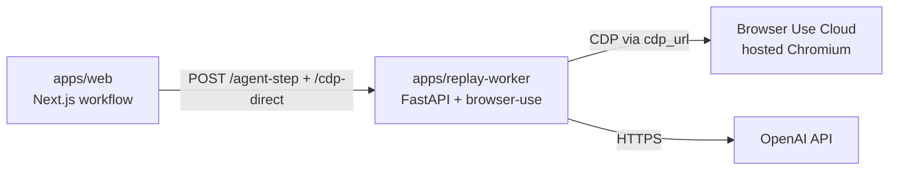
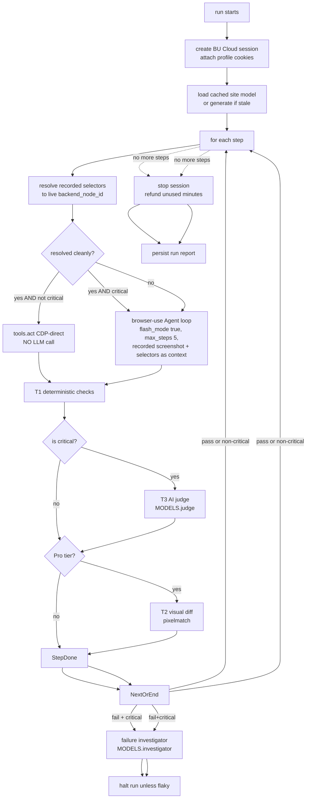

# Flowlens v3 — Low-Level Design

> **Companion to:** [HLD.md](HLD.md)
> **Audience:** engineers who will implement this
> **Status:** proposed (plan mode draft)

---

## Contents

1. [Component map](#1-component-map)
2. [Data models](#2-data-models)
3. [API contracts](#3-api-contracts)
4. [Recording protocol](#4-recording-protocol)
5. [Compile pipeline](#5-compile-pipeline)
6. [Replay engine algorithm](#6-replay-engine-algorithm)
7. [LLM integration map](#7-llm-integration-map)
8. [Cookie vault](#8-cookie-vault)
9. [Storage architecture](#9-storage-architecture)
10. [Auth flows](#10-auth-flows)
11. [Error handling & retries](#11-error-handling--retries)
12. [Step-by-step execution traces](#12-step-by-step-execution-traces)
13. [Edge cases](#13-edge-cases)
14. [Performance characteristics](#14-performance-characteristics)
15. [Cost model (detailed)](#15-cost-model-detailed)
16. [Security considerations](#16-security-considerations)
17. [Observability](#17-observability)

---

## 1. Component map

> **Polyglot reality**: The frontend, API, schema, and orchestration are TypeScript on Vercel. The replay engine's Agent loop calls **`browser_use`** which is a Python library — there is no equivalent npm package. We solve this with a thin Python sidecar (`apps/replay-worker/`) that the TS replay engine talks to over HTTP. See [§5.5](#55-browser-use-configuration--selector-resolution).

```text
flowlens/
  apps/
    extension/                        # WXT MV3 extension (TypeScript)
      wxt.config.ts
      entrypoints/
        background.ts                 # service worker
        sidepanel/
          index.html
          App.tsx                     # root state machine
          screens/
            Idle.tsx
            Recording.tsx
            Reviewing.tsx
            Running.tsx
            AuthRefresh.tsx
            Empty.tsx
            Error.tsx
        content/
          recorder.ts                 # rrweb wrapper + screenshot scheduler
          overlay.tsx                 # in-page record badge
          inject.ts                   # bootstrap content world
        popup/
          index.html
          Popup.tsx                   # tiny — opens side panel
      lib/
        api-client.ts                 # typed Cloud API client
        chrome-cookies.ts             # capture helpers
        chrome-storage.ts             # localStorage / sessionStorage helpers
        selector-harden.ts            # 4-tier selector computer
        message-bus.ts                # typed runtime messaging
        clerk-extension.ts            # Clerk auth glue
      manifest/
        permissions.json
    web/                              # Next.js 16 app (TypeScript)
      src/
        lib/
          db.ts                       # Drizzle node-postgres pool
          models.ts                   # ★ centralized FLOWLENS_MODEL_* registry
          openai.ts                   # ★ singleton OpenAI client + Zod-typed call helpers
          auth.ts                     # Clerk session helpers (Phase 1.5)
        app/
          (marketing)/
            page.tsx
          app/
            sites/page.tsx
            sites/[siteId]/page.tsx
            flows/[flowId]/page.tsx
            runs/[runId]/page.tsx
            runs/[runId]/share/[token]/page.tsx
            settings/page.tsx
          api/
            health/route.ts                 # ★ Phase 1: env + MODELS visibility
            recordings/start/route.ts
            recordings/[id]/chunks/route.ts
            recordings/[id]/finish/route.ts
            flows/route.ts
            flows/[id]/route.ts
            flows/[id]/compile/route.ts
            flows/[id]/runs/route.ts
            runs/[id]/route.ts
            runs/[id]/stream/route.ts          # SSE
            runs/[id]/pause/route.ts
            runs/[id]/resume/route.ts
            runs/[id]/cancel/route.ts
            cookies/refresh/route.ts
            sites/[id]/site-model/route.ts
            webhooks/browser-use/route.ts
            schedule/[flowId]/route.ts
            billing/usage/route.ts
          actions/
            createFlow.ts                     # server action
            deleteFlow.ts
            updateFlow.ts
      workflows/                              # ★ Phase 3.5a — Vercel Workflow Devkit (real)
        compile-recording.ts                  # 6 step fns + workflow fn ("use workflow")
        run-flow.ts                           # 9 step fns + auth-pause via createHook
        scheduled-run.ts                      # Phase 4
      drizzle.config.ts
    replay-worker/                            # ★ Python sidecar — Phase 3
      pyproject.toml
      src/flowlens_worker/
        main.py                               # FastAPI app
        agent_step.py                         # browser-use Agent loop wrapper
        cdp_direct.py                         # tools.act() direct execution
        models.py                             # mirrors @flowlens/llm-config MODELS table
        resolver.py                           # selector → backend_node_id
        verify_t1.py                          # T1 deterministic checks (server-side proxy)
      Dockerfile                              # deployable to AWS App Runner OR Azure Container Apps
      apprunner.yaml                          # AWS App Runner config (if AWS chosen)
      azure-containerapp.bicep                # Azure Container Apps config (if Azure chosen)
  packages/
    schema/                                   # Zod + Drizzle (TypeScript)
      src/
        index.ts
        flow.ts
        run.ts
        recording.ts
        cookie.ts
        events.ts                             # SSE / runtime message types
        db.ts                                 # Drizzle table defs
    recorder-core/                            # Phase 2 — extension-shared TS
      record.ts                               # rrweb + screenshots wrapper
      action-stream.ts                        # rrweb -> semantic actions
      selector-harden.ts
      chunker.ts                              # NDJSON gzip chunks
      sensitive-detect.ts                     # regex + LLM-fallback heuristic
    flow-doc/                                 # Phase 2 — compile pipeline
      compile.ts                              # main entry
      narrate-step.ts                         # MODELS.narrate (gpt-4.1-mini)
      synthesize-flow.ts                      # MODELS.synthesize (gpt-4.1)
      sibling-flows.ts                        # MODELS.siblingGen (gpt-4.1-mini)
      site-model.ts                           # MODELS.siteModel (gpt-4.1, cached)
      inject-flowlens-ids.ts                  # data-flowlens-id annotation hints
      prompts/
        narrate.md
        synthesize.md
        siblings.md
        site-model.md
    replay-engine/                            # ★ Phase 3 shipped — TS orchestration around the Python sidecar
      run.ts                                  # main entry: lifecycle, session, profile attach
      step.ts                                 # single-step decision tree (CDP direct vs Agent)
      resolve.ts                              # recorded selectors -> live backend_node_id
      cdp-direct.ts                           # delegates to replay-worker /cdp-direct
      agent-step.ts                           # delegates to replay-worker /agent-step
      verify-t1.ts                            # T1 deterministic checks (TS-side)
      verify-t3.ts                            # T3 AI judge (MODELS.judge)
      visual-diff-t2.ts                       # T2 pixelmatch (Pro tier)
      data-gen.ts                             # test data generator (MODELS.dataGen)
      failure-investigator.ts                 # MODELS.investigator (o4-mini)
      replay-worker-client.ts                 # ★ HTTP client to apps/replay-worker
    cookies-vault/
      capture.ts
      encrypt.ts                              # libsodium sealed box
      bu-profile-sync.ts
      refresh-detect.ts
    bu-cloud-client/                          # ★ shipped Phase 1 — typed BU Cloud v2 REST
      src/index.ts                            # billing, sessions, profiles, tasks
    design-tokens/                            # ★ shipped Phase 1 — shared CSS vars + TS
      src/index.ts
      src/tokens.css
    detectors/                                # Phase 3 port from v2
      functional.ts
      performance.ts
      accessibility.ts
      responsive.ts
  infra/
    vercel.json
  legacy/                                      # v2 archived (read-only)
```

★ = item shipped or augmented in Phase 1 that wasn't in the original LLD draft.

---

## 2. Data models

### Drizzle schema (Postgres)

```ts
// packages/schema/drizzle.ts (excerpts)
import { pgTable, text, integer, timestamp, jsonb, boolean, uuid, index, primaryKey } from 'drizzle-orm/pg-core';

export const orgs = pgTable('orgs', {
  id: uuid('id').primaryKey().defaultRandom(),
  clerkOrgId: text('clerk_org_id').unique().notNull(),
  name: text('name').notNull(),
  plan: text('plan', { enum: ['free', 'pro', 'team'] }).default('free').notNull(),
  // Microdollars (USD * 1_000_000) so we never do float math on credit balances.
  monthlyRunBudgetUsdMicro: integer('monthly_run_budget_usd_micro').default(20_000_000).notNull(),
  monthlyRunsConsumedUsdMicro: integer('monthly_runs_consumed_usd_micro').default(0).notNull(),
  monthlyRunsResetAt: timestamp('monthly_runs_reset_at').defaultNow().notNull(),
  createdAt: timestamp('created_at').defaultNow().notNull(),
});

export const users = pgTable('users', {
  id: uuid('id').primaryKey().defaultRandom(),
  clerkUserId: text('clerk_user_id').unique().notNull(),
  email: text('email').notNull(),
  defaultOrgId: uuid('default_org_id').references(() => orgs.id),
  createdAt: timestamp('created_at').defaultNow().notNull(),
});

export const sites = pgTable('sites', {
  id: uuid('id').primaryKey().defaultRandom(),
  orgId: uuid('org_id').references(() => orgs.id).notNull(),
  origin: text('origin').notNull(),                    // https://shop.example.com
  displayName: text('display_name').notNull(),
  faviconUrl: text('favicon_url'),
  siteModel: jsonb('site_model'),                      // cached AI understanding
  siteModelStaleAfter: timestamp('site_model_stale_after'),
  createdAt: timestamp('created_at').defaultNow().notNull(),
}, t => ({
  orgOrigin: index('sites_org_origin_idx').on(t.orgId, t.origin),
}));

export const flows = pgTable('flows', {
  id: uuid('id').primaryKey().defaultRandom(),
  orgId: uuid('org_id').references(() => orgs.id).notNull(),
  siteId: uuid('site_id').references(() => sites.id).notNull(),
  createdByUserId: uuid('created_by_user_id').references(() => users.id).notNull(),
  name: text('name').notNull(),
  description: text('description'),
  source: text('source', { enum: ['recorded', 'ai_suggested', 'manual'] }).notNull(),
  preconditions: jsonb('preconditions').$type<string[]>().default([]),
  postconditions: jsonb('postconditions').$type<string[]>().default([]),
  fragilityHints: jsonb('fragility_hints').$type<string[]>().default([]),
  steps: jsonb('steps').$type<FlowStep[]>().notNull(),
  rrwebBlobKey: text('rrweb_blob_key'),                // null for ai_suggested
  cookieSnapshotId: uuid('cookie_snapshot_id').references(() => cookieSnapshots.id),
  buProfileId: text('bu_profile_id'),                  // browser-use cloud profile id
  parentFlowId: uuid('parent_flow_id'),                // for ai_suggested siblings
  status: text('status', { enum: ['draft', 'compiling', 'ready', 'archived'] }).default('draft').notNull(),
  createdAt: timestamp('created_at').defaultNow().notNull(),
  updatedAt: timestamp('updated_at').defaultNow().notNull(),
});

export type FlowStep = {
  index: number;
  action: 'navigate' | 'click' | 'input' | 'select' | 'keypress' | 'wait' | 'assert' | 'scroll';
  intent: string;                          // VLM-generated NL ("click the Add to Cart button")
  expectedOutcome: string;                 // for AI judge
  isCritical: boolean;                     // affects flash_mode and judge usage
  selectors: {
    role?: string;                         // e.g. "button"
    accessibleName?: string;               // e.g. "Add to Cart"
    testid?: string;
    css?: string;
    xpath?: string;
  };
  recordedValue?: string;                  // user's typed value (may be redacted)
  isSensitive?: boolean;                   // password / card / SSN heuristic hit
  recordedScreenshotKey: string;           // blob key
  url?: string;                            // for navigate
  durationMsHint?: number;                 // recorded delay before this step
};

export const recordings = pgTable('recordings', {
  id: uuid('id').primaryKey().defaultRandom(),
  flowId: uuid('flow_id').references(() => flows.id).notNull(),
  startedAt: timestamp('started_at').defaultNow().notNull(),
  finishedAt: timestamp('finished_at'),
  rrwebChunks: jsonb('rrweb_chunks').$type<{ blobKey: string; bytes: number; ordinal: number }[]>().default([]).notNull(),
  // Action stream is uploaded as a single blob (NDJSON) at recording finish,
  // not embedded inline — keeps the row small and queryable.
  actionStreamBlobKey: text('action_stream_blob_key'),
  viewport: jsonb('viewport').$type<{ w: number; h: number; dpr: number }>(),
  userAgent: text('user_agent'),
});

export const cookieSnapshots = pgTable('cookie_snapshots', {
  id: uuid('id').primaryKey().defaultRandom(),
  orgId: uuid('org_id').references(() => orgs.id).notNull(),
  siteId: uuid('site_id').references(() => sites.id).notNull(),
  capturedByUserId: uuid('captured_by_user_id').references(() => users.id).notNull(),
  capturedAt: timestamp('captured_at').defaultNow().notNull(),
  origin: text('origin').notNull(),
  ciphertext: text('ciphertext').notNull(),            // libsodium sealed box (cookies + storage)
  nonce: text('nonce').notNull(),
  cookieDomains: jsonb('cookie_domains').$type<string[]>().notNull(),
  hasAuthCookie: boolean('has_auth_cookie').notNull(), // heuristic flag
  expiresAtHint: timestamp('expires_at_hint'),         // earliest cookie expiry seen
  supersededAt: timestamp('superseded_at'),
});

export const runs = pgTable('runs', {
  id: uuid('id').primaryKey().defaultRandom(),
  orgId: uuid('org_id').references(() => orgs.id).notNull(),
  flowId: uuid('flow_id').references(() => flows.id).notNull(),
  triggeredBy: text('triggered_by', { enum: ['user', 'schedule', 'webhook', 'sibling_chain'] }).notNull(),
  triggeredByUserId: uuid('triggered_by_user_id').references(() => users.id),
  status: text('status', {
    enum: ['queued', 'running', 'paused_auth', 'paused_user', 'passed', 'failed', 'errored', 'canceled'],
  }).default('queued').notNull(),
  buSessionId: text('bu_session_id'),
  buCdpUrl: text('bu_cdp_url'),
  liveUrl: text('live_url'),
  publicShareToken: text('public_share_token'),
  startedAt: timestamp('started_at'),
  finishedAt: timestamp('finished_at'),
  durationMs: integer('duration_ms'),
  costUsdMicro: integer('cost_usd_micro'),             // microdollars
  workflowRunId: text('workflow_run_id'),              // Vercel Workflow id
  healthScore: integer('health_score'),                // 0-100
  summary: text('summary'),                            // AI-generated 1-line
  errorClass: text('error_class', { enum: ['app_bug', 'flaky', 'env', 'auth'] }),
  cookieSnapshotId: uuid('cookie_snapshot_id').references(() => cookieSnapshots.id),
  createdAt: timestamp('created_at').defaultNow().notNull(),
});

export const stepResults = pgTable('step_results', {
  id: uuid('id').primaryKey().defaultRandom(),
  runId: uuid('run_id').references(() => runs.id).notNull(),
  stepIndex: integer('step_index').notNull(),
  status: text('status', {
    enum: ['passed', 'failed', 'flaky', 'blocked_auth', 'inconclusive', 'skipped'],
  }).notNull(),
  startedAt: timestamp('started_at').notNull(),
  finishedAt: timestamp('finished_at'),
  durationMs: integer('duration_ms'),
  selectorResolvedVia: text('selector_resolved_via', {
    enum: ['testid', 'role-name', 'css', 'xpath', 'flowlens-id', 'llm', 'recorded-only'],
  }),
  replayScreenshotKey: text('replay_screenshot_key'),
  judge: jsonb('judge').$type<{ verdict: 'pass' | 'fail'; reason: string; confidence: number }>(),
  visualDiff: jsonb('visual_diff').$type<{ score: number; threshold: number; passed: boolean; overlayKey: string }>(),
  consoleErrors: jsonb('console_errors').$type<string[]>().default([]),
  networkErrors: jsonb('network_errors').$type<{ url: string; status: number }[]>().default([]),
  llmStepsUsed: integer('llm_steps_used').default(0),
  llmCostUsdMicro: integer('llm_cost_usd_micro').default(0),
  errorMessage: text('error_message'),
}, t => ({
  runStep: index('step_results_run_step_idx').on(t.runId, t.stepIndex),
}));

export const flowSchedules = pgTable('flow_schedules', {
  id: uuid('id').primaryKey().defaultRandom(),
  flowId: uuid('flow_id').references(() => flows.id).notNull(),
  cron: text('cron').notNull(),                        // e.g. "0 9 * * *"
  enabled: boolean('enabled').default(true).notNull(),
  lastRunAt: timestamp('last_run_at'),
  nextRunAt: timestamp('next_run_at'),
});

export const notificationChannels = pgTable('notification_channels', {
  id: uuid('id').primaryKey().defaultRandom(),
  orgId: uuid('org_id').references(() => orgs.id).notNull(),
  kind: text('kind', { enum: ['email', 'slack', 'webhook'] }).notNull(),
  config: jsonb('config').notNull(),                   // { email } | { webhookUrl } | etc.
  failureOnly: boolean('failure_only').default(true).notNull(),
});
```

### Zod runtime schemas (extension ↔ API)

```ts
// packages/schema/events.ts (excerpts)
export const SseEvent = z.discriminatedUnion('type', [
  z.object({ type: z.literal('run_started'), runId: z.string(), liveUrl: z.string() }),
  z.object({ type: z.literal('step_started'), runId: z.string(), stepIndex: z.number() }),
  z.object({ type: z.literal('step_finished'), runId: z.string(), stepIndex: z.number(), result: StepResultSchema }),
  z.object({ type: z.literal('run_paused'), runId: z.string(), reason: z.enum(['auth', 'user']), hint: z.string() }),
  z.object({ type: z.literal('run_resumed'), runId: z.string() }),
  z.object({ type: z.literal('run_complete'), runId: z.string(), status: RunStatusSchema, healthScore: z.number() }),
  z.object({ type: z.literal('compile_progress'), flowId: z.string(), pct: z.number(), stage: z.string() }),
]);
```

---

## 3. API contracts

All endpoints are signed with the user's Clerk session JWT (web) or extension token (extension). Org scoping is enforced server-side from the JWT.

### Recording lifecycle

```http
POST /api/recordings/start
body: { siteOrigin: string, viewport: {w,h,dpr}, userAgent: string, displayName: string }
200:  { recordingId: uuid, flowId: uuid, uploadKeyPrefix: string }

PUT  /api/recordings/:recordingId/chunks
body: multipart { ordinal: number, gzipNdjson: blob, screenshots?: blob[] }
200:  { ordinal, bytesStored }

POST /api/recordings/:recordingId/finish
body: {
  cookies: { domain, name, value, expires, sameSite, httpOnly, secure }[],
  storage: { localStorage: Record<string,string>, sessionStorage: Record<string,string> },
  origins: string[],                          # all origins seen during recording
  actions: RecordedAction[],                  # action stream summary (lightweight, full stream is in chunks)
}
200:  { flowId, recordingId, status: 'compiling' }
```

### Flow CRUD

```http
GET    /api/flows?siteId=...                  list flows for a site
GET    /api/flows/:flowId                     get one
PATCH  /api/flows/:flowId                     edit name/description/steps (limited)
DELETE /api/flows/:flowId                     soft delete + cookie purge
POST   /api/flows/:flowId/compile             re-compile (rare)
GET    /api/flows/:flowId/compile-status      polled by extension
POST   /api/flows/:flowId/siblings/accept     body: { suggestionIds: string[] }
```

### Run lifecycle

```http
POST  /api/flows/:flowId/runs                 body: { mode: 'default' | 'fast' }
GET   /api/runs/:runId                        full report
GET   /api/runs/:runId/stream                 SSE: see SseEvent above
POST  /api/runs/:runId/pause                  user-initiated pause
POST  /api/runs/:runId/resume
POST  /api/runs/:runId/cancel
POST  /api/runs/:runId/share                  body: { enable: boolean } -> { token | null }
```

### Cookie / auth

```http
POST  /api/cookies/refresh
body: {
  siteId: uuid,
  cookies: [...], storage: {...},              # same shape as recording finish
  triggeredByRunId?: uuid,                     # if invoked from a paused run
}
200:  { cookieSnapshotId, buProfileUpdated: true, runResumed?: boolean }
```

### Site model (cached AI understanding)

```http
GET   /api/sites/:siteId/site-model           cached, may trigger background refresh
POST  /api/sites/:siteId/site-model/refresh   manual refresh
```

### Schedule

```http
POST  /api/schedule/:flowId                   body: { cron: '0 9 * * *', enabled: true }
DELETE /api/schedule/:flowId
```

### Webhooks (incoming from BU Cloud — optional)

```http
POST  /api/webhooks/browser-use               # if/when BU Cloud webhooks ship
```

### SSE protocol details

- Heartbeat every 15 s (`: ping\n\n`).
- Reconnection via `Last-Event-ID` header — server replays from event log in Redis (TTL 1 h).
- Authenticated via signed query param token (extensions can't easily set Auth headers on EventSource).

---

## 4. Recording protocol

### What we capture

```ts
// packages/recorder-core/record.ts
type CapturedRecording = {
  rrwebEvents: RrwebEvent[];                    // streamed in chunks (NDJSON gzipped)
  actions: RecordedAction[];                    // semantic action stream (subset)
  screenshots: { actionIndex: number; blobKey: string; url: string }[];
  meta: {
    viewport: { w: number; h: number; dpr: number };
    userAgent: string;
    startedAt: string;
    finishedAt: string;
  };
  cookies: ChromeCookie[];                       // captured at start, end, and on Set-Cookie
  storage: { localStorage: KV; sessionStorage: KV };
  origins: string[];                              // all unique origins visited
};

type RecordedAction = {
  index: number;
  timestamp: number;                              // ms since recording start
  type: 'navigate' | 'click' | 'input' | 'change' | 'submit' | 'keypress' | 'scroll';
  url: string;
  selectors: HardenedSelectors;
  value?: string;                                 // for input/change
  isSensitiveByHeuristic: boolean;
  rrwebEventId: number;                           // index into the rrweb stream for replay
  screenshotKey?: string;                         // post-action visible screenshot
};
```

### Chunking & upload

- rrweb events buffered in memory in 256 KB blocks → gzipped → POSTed as `chunks/${ordinal}`.
- Upload runs in service worker with `chrome.runtime.connect` long-lived port.
- Failed chunks retry with exponential backoff (max 5 attempts), then queue locally in `chrome.storage.local` for next online window.
- Atomic finish: `POST /finish` is the only step that commits the recording. If user closes the tab mid-recording, the partial chunks are GC'd after 24 h.

### Selector hardening (4 tiers, computed client-side per action)

```ts
// packages/recorder-core/selector-harden.ts
function harden(el: Element): HardenedSelectors {
  const role = el.getAttribute('role') ?? implicitRole(el);    // computed via aria-utils
  const accessibleName = computeAccessibleName(el);            // axe-core algorithm
  const testid = el.getAttribute('data-testid') ?? el.getAttribute('data-test') ?? el.id;
  const css = optimalCssSelector(el);                          // unique, shortest, no nth-child if avoidable
  const xpath = uniqueXPath(el);

  return { role, accessibleName, testid, css, xpath };
}
```

The replay engine resolves in this order: testid → role+name → css → xpath → LLM intent.

### Sensitive-data heuristic

For each input action, mark sensitive if any of:

- `<input type="password" / "tel" / "credit-card" />`
- `name`/`id` matches `/password|pwd|cvv|cvc|cardnumber|ssn|secret|token/i`
- value matches `/\b\d{4}[- ]?\d{4}[- ]?\d{4}[- ]?\d{4}\b/` (card-like) or `/\b\d{3}-\d{2}-\d{4}\b/` (SSN-like)
- value is exactly the user's logged-in email / known org domain

Sensitive values are **stored encrypted** in the cookie vault, not the flow document. The flow document keeps `recordedValue: '[REDACTED:password]'` and on replay we substitute from the vault.

---

## 5. Compile pipeline

Implemented as a Vercel Workflow so partial progress survives function timeouts.

```ts
// apps/web/workflows/compile-recording.ts
export const compileRecording = workflow('compile-recording', {
  input: z.object({ flowId: z.string(), recordingId: z.string() }),
  steps: {
    async loadRecording(ctx) { /* ... */ },
    async normalizeActions(ctx) {
      // merge rrweb events with action stream; collapse duplicate clicks; drop noise
    },
    async narrateSteps(ctx) {
      // parallel narrate calls (MODELS.narrate, gpt-4.1-mini), 4 at a time
      return await pMap(actions, narrateOne, { concurrency: 4 });
    },
    async detectSensitive(ctx) { /* heuristic + LLM fallback */ },
    async synthesizeFlow(ctx) {
      // single MODELS.synthesize (gpt-4.1) call with all narrated steps
    },
    async generateSiblings(ctx) {
      // single MODELS.siblingGen call returning 1-3 sibling flow prompts
    },
    async persist(ctx) { /* update flows row, write artifacts */ },
    async pushSse(ctx) { /* emit compile_progress + compile_done */ },
  },
});
```

Stages emit `compile_progress` SSE with `pct` and `stage` for the extension's progress bar.

### Prompt: per-step narration (MODELS.narrate, default gpt-4.1-mini)

```text
You are converting a recorded user action into a semantic test step.

Input:
- Previous screenshot: <image>
- Current screenshot (post-action): <image>
- Page URL: {url}
- Page title: {title}
- Action: {action_type} on element with role={role}, name={name}, css={css}
- Recorded value: {value or "n/a"}

Output JSON matching this schema:
{
  "intent": "imperative natural language description of what the user is trying to accomplish in this step",
  "expectedOutcome": "what should be visible / what should happen for this step to be considered successful",
  "isCritical": "true if this step is on the critical path (data submitted, navigation, irreversible action); false for cosmetic steps like dismissing a banner",
  "fragility": "low | medium | high based on selector specificity and visual change between before/after"
}

Be terse and concrete. Don't speculate beyond what the screenshots show.
```

### Prompt: flow synthesis (MODELS.synthesize, default gpt-4.1)

```text
You are summarizing a recorded user flow into a Flow document for automated testing.

Inputs:
- Site origin: {origin}
- Site model (cached understanding): {site_model_or_null}
- N narrated steps: [{intent, expectedOutcome, isCritical, ...}]

Output JSON:
{
  "name": "short imperative title (e.g. 'Sign up and verify email')",
  "description": "1-2 sentence what this flow tests",
  "preconditions": ["list of states that must be true before this flow runs"],
  "postconditions": ["list of states that must be true after this flow"],
  "fragilityHints": ["list of likely failure modes"],
  "stepRevisions": [
    {"index": 0, "intentRevision": "...", "expectedOutcomeRevision": "..."}
    /* only include indices where you'd improve on the per-step narration */
  ]
}
```

---

## 5.5 browser-use configuration & selector resolution

This section is the result of a deep dive into [`browser_use/agent/service.py`](../../../browser-use-source/browser_use/agent/service.py), [`browser_use/dom/serializer/`](../../../browser-use-source/browser_use/dom/serializer/), and [`browser_use/tools/service.py`](../../../browser-use-source/browser_use/tools/service.py). It captures the realities that constrain our replay design.

### What browser-use actually does (the model in our head)

1. **Element addressing is `backend_node_id`** — a CDP-assigned numeric id, not a stable selector. The Agent serializes the live DOM (cap: `max_clickable_elements_length=40000` chars) and shows the LLM lines like `*[12345]<button "Add to cart">`. The LLM picks the numeric id.
2. **No first-class "use my recorded selector"** — every Agent step the model re-infers from live DOM. There is no shortcut path that says "click the element matching role=button name='Add to cart'".
3. **`data-testid` is NOT in the default attribute allowlist.** We must opt in via `include_attributes`.
4. **You can bypass the Agent loop entirely.** `tools.act(actionModel, browser_session=…)` executes a CDP command directly, no LLM, no DOM serialization. This is our "fast path".
5. **Token cost is dominated by DOM serialization**, not the action JSON. Heavy pages can hit the 40K cap.
6. **Loop detection, judge, message compaction, planning** are all built-in but cost extra LLM calls; we tune them down for replay.

### Two execution paths over the same `cdp_url`

| Path | Layer | LLM call? | Per-step cost | When it wins |
|---|---|---|---|---|
| **CDP-direct** | `tools.act(click_action)` directly, no `Agent` | No | ~$0.001 (browser only) | Stable steps where our hardened selector still resolves cleanly. ~70 % of replay steps in well-behaved apps. |
| **Agent loop** | `new Agent({ task, browser, … }).run()` for one micro-task | Yes | ~$0.005–0.015 (cached) | Critical steps OR when CDP-direct resolution failed. The LLM uses recorded screenshot + selectors as context, then re-finds via the live DOM. |

Both paths share the **same** `BrowserSession` attached to the BU Cloud `cdp_url`. We never spawn a second browser.

### Selector resolution layer (`packages/replay-engine/resolve.ts`)

The unit of work: given our `HardenedSelectors`, return a live `backend_node_id` if any strategy still matches. Resolution itself runs **inside the Python sidecar** (it needs `browser_use`'s DOM serializer + `selector_map`); the TS package just calls `POST /resolve` and returns the typed result.

```ts
// packages/replay-engine/resolve.ts
import { replayWorker } from './replay-worker-client';
import type { HardenedSelectors, SelectorResolvedVia } from '@flowlens/schema';

export type ResolveResult =
  | { found: true; backendNodeId: number; via: SelectorResolvedVia }
  | { found: false; reason: 'no_match' | 'multiple_matches' | 'page_not_settled' };

export async function resolveBackendNodeId(
  cdpUrl: string,
  selectors: HardenedSelectors,
): Promise<ResolveResult> {
  return replayWorker.post('/resolve', { cdp_url: cdpUrl, selectors });
}
```

The Python `/resolve` endpoint (in `apps/replay-worker/src/flowlens_worker/resolver.py`) does the actual matching:

```python
async def resolve(req: ResolveRequest) -> ResolveResult:
    browser = BrowserSession(cdp_url=req.cdp_url, keep_alive=True)
    await browser.start()
    await browser.wait_for_idle(timeout=3.0)
    summary = await browser.get_browser_state_summary(include_screenshot=False)

    for strategy in ('testid', 'role-name', 'css', 'xpath'):
        matches = match_in_dom(summary.dom_state, req.selectors, strategy)
        if len(matches) == 1:
            return {'found': True, 'backendNodeId': matches[0].backend_node_id, 'via': strategy}
        if len(matches) > 1:
            continue                  # ambiguous, try next strategy
    return {'found': False, 'reason': 'no_match'}
```

`matchInDom` walks `dom_state.selector_map` (which is `backend_node_id → EnhancedDOMTreeNode`) and matches by:

- **testid**: any of `data-testid`, `data-test`, `data-cy`, or `id` matches.
- **roleAndName**: ARIA role + accessible name matches.
- **css**: `document.querySelector(css)` evaluated via CDP `Runtime.evaluate`.
- **xpath**: `document.evaluate(...)` via CDP.

We always retry on a fresh DOM read after a 1 s settle if the first attempt finds 0 or N>1.

### Architectural reality: browser-use is Python; our backend is TypeScript

`browser_use` (the upstream library that gives us the Agent loop, DOM serialization, `tools.act()`, and `selector_map` resolution against a CDP session) is **Python-only**. There is no equivalent npm package; the Cloud REST `/tasks` endpoint is fully hosted but doesn't expose `tools.act()`-style direct CDP execution. To get the hybrid CDP-direct + Agent-loop replay we want, we deploy a thin Python sidecar.



- The TS `replay-engine` package owns **orchestration**: lifecycle, T1 + T2 + T3 verifiers, judge calls, profile attach, run state.
- The Python `replay-worker` owns the **single-step browser execution**: `POST /agent-step` (full Agent loop for one logical action) and `POST /cdp-direct` (resolve a recorded selector against the live DOM and execute via `tools.act()`).
- Both call the same `cdp_url` from a single BU Cloud session.
- Both are stateless per request; the BU Cloud session itself holds the only mutable state across steps. This is what lets us scale the worker horizontally on Fly.io / Railway / Vercel Sandbox without sticky sessions.

### Recommended `Agent` config inside the Python sidecar

Default LLM is OpenAI via `ChatOpenAI`. `flash_mode` is a `ChatBrowserUse`-specific schema knob and stays off; instead we lean on `use_vision='auto'` + tightened `include_attributes` + small `max_clickable_elements_length` for cost control.

```python
# apps/replay-worker/src/flowlens_worker/agent_step.py
from browser_use import Agent, BrowserSession
from browser_use.llm import ChatOpenAI
from .models import MODELS  # mirrors apps/web/src/lib/models.ts

async def run_agent_step(req: AgentStepRequest) -> StepExecution:
    browser = BrowserSession(cdp_url=req.cdp_url, keep_alive=True)
    await browser.start()

    agent = Agent(
        task=req.task,                                  # intent + recorded ref + selectors
        llm=ChatOpenAI(
            model=MODELS["replay_agent"],               # gpt-4.1-mini by default
        ),
        browser_session=browser,

        # Cost shape (no flash_mode — that's ChatBrowserUse-only schema)
        use_vision="auto",                              # include screenshot only on demand
        use_thinking=req.is_critical,                   # verbose reasoning only on critical
        use_judge=False,                                # we run our own T3 judge externally
        max_steps=5 if req.is_critical else 3,
        max_actions_per_step=3,
        max_failures=2,                                 # tighter than default (5)
        step_timeout=60,
        llm_timeout=30,
        llm_screenshot_size=(1024, 768),
        vision_detail_level="low",

        # Surface OUR hardened selector hints to the LLM
        include_attributes=[
            "role", "aria-label", "aria-labelledby", "name", "placeholder",
            "title", "alt", "value", "type",
            "data-testid", "data-test", "data-cy", "data-flowlens-id",
        ],
        max_clickable_elements_length=25_000,           # tighter cap = cheaper prompts

        message_compaction=dict(compact_every_n_steps=8, trigger_char_count=25_000),
        sensitive_data=req.sensitive_data,              # injected from cookies-vault
        output_model_schema=StepOutcome,
    )
    history = await agent.run()
    return serialize_outcome(history)
```

### TS-side glue

```ts
// packages/replay-engine/agent-step.ts
import { MODELS } from '@/lib/models';
import { replayWorker } from './replay-worker-client';

export async function runAgentStep(ctx: RunContext, step: FlowStep): Promise<StepExecution> {
  return replayWorker.post('/agent-step', {
    cdp_url: ctx.cdpUrl,
    task: buildAgentTask(step, ctx),
    is_critical: step.isCritical,
    sensitive_data: ctx.vault.forStep(step),
    model: MODELS.replayAgent,
  });
}
```

The TS replay-engine never imports `browser-use`. The Python sidecar never owns long-lived run state. The split keeps both surfaces small and independently scalable.

> **Fallback**: orgs can opt in to `ChatBrowserUse` for the replay agent via a feature flag passed in `AgentStepRequest`. It uses provider-side prompt caching that's cheaper than OpenAI for very repetitive loops, but you trade some control. Default ships OpenAI.

### `data-flowlens-id` injection at compile time

To make the Agent loop's element-finding more reliable, the **compile pipeline** annotates each significant DOM node from the recording with a synthetic stable id, written into the rrweb stream's serialized snapshot:

```ts
// packages/flow-doc/inject-flowlens-ids.ts (runs once per recording at compile time)
// For each RecordedAction's target node, attach data-flowlens-id="step-{n}-target"
// in our per-step "site model lookup hints". At replay time, we add this attribute
// via a tiny CDP Runtime.evaluate before the step executes:
await browser.evaluate(`
  const el = document.querySelector(${JSON.stringify(step.selectors.css)});
  if (el) el.setAttribute('data-flowlens-id', 'step-${step.index}-target');
`);
```

This sounds invasive but it's not — we add the attribute, run the step, and the attribute persists only in the cloud Chromium's DOM (never on the user's site). It gives the Agent loop a high-signal, deterministic hint.

### Realistic per-step cost (OpenAI gpt-4.1-mini)

OpenAI April 2026 pricing: `gpt-4.1-mini` ~$0.40/M input, ~$1.60/M output. No provider-side prompt caching (that's ChatBrowserUse-only), so input tokens always pay full price; we offset by tightening `max_clickable_elements_length` to 25K chars.

| Component | Tokens / cost |
|---|---|
| System prompt + DOM serialization (post-tightening, 4 chars/token) | ~6K tokens × $0.40/M = ~$0.0024 |
| Optional vision payload at `low` detail (~50 % of steps when `vision='auto'`) | ~$0.0006 amortized |
| History + step context | ~1.5K tokens × $0.40/M = ~$0.0006 |
| Action output JSON | ~300 tokens × $1.60/M = ~$0.0005 |
| **Single Agent micro-step total** | **~$0.004–0.005** |
| **CDP-direct step** | **~$0.001** (browser session only) |

For a 12-step run with 6 critical (Agent) and 6 non-critical (CDP-direct):

- Agent loop: 6 × $0.0045 = **$0.027**
- CDP-direct: 6 × $0.001 = **$0.006**
- T3 judge (critical only, vision call with small token count): 6 × $0.005 = **$0.030**
- Test data generator: ~1–2 actual LLM calls (rest deterministic): **~$0.005**
- Sensitive classifier expected value (~10 % of inputs): **~$0.001**
- BU Cloud session, ~30 s billed at $0.05 / hr min 1 min: **$0.0008**
- **Total per run: ~$0.07** (was overstated as $0.13 in earlier drafts because we double-counted DOM tokens)

> **Reconciliation note**: HLD §11's hybrid-mode envelope of $0.14–0.18 was based on a worst-case run where every Agent step uses vision and prompt size hits the 40K char cap. With our `max_clickable_elements_length=25_000` + `vision='auto'` defaults the realistic central estimate is **$0.07**. We use $0.07 as the planning average and $0.14 as the upper guardrail for budget enforcement.

**$500 BU + $2,000 OpenAI** → LLM is the binding constraint:

- Optimistic ($0.07/run): **~28,500 hybrid runs**
- Pessimistic ($0.14/run): **~14,000 hybrid runs**

Either way, comfortable runway for a 150–200 user closed beta running 2–3 daily flows for a month.

---

## 6. Replay engine algorithm

> **Phase 3.5a update**: both `compile-recording` and `run-flow` now run on
> the real Vercel Workflow Devkit (`workflow@4.2.4` + `@workflow/next@4.0.5`).
> Each `"use step"` function is independently retried + persisted; if a Vercel
> function instance dies mid-replay the workflow resumes from the last
> committed step. Auth-pause uses `createHook<{ refreshed: true }>({ token: \`run:${`runId`}:auth-refreshed\` })` raced
> against `sleep('24h')` — the `/api/cookies/refresh` route fires the resume
> via `resumeHook(token, { refreshed: true })`. WDK's auto-discovery picks up
> the directives at build time (manifest reports 2 workflows + 18 steps).
> The shim from Phase 3 (`apps/web/src/lib/workflow-shim.ts`) is gone.

### High-level: hybrid (CDP-direct fast path + Agent loop slow path)



### Single-step decision tree (pseudo-code)

```ts
// packages/replay-engine/step.ts
import { resolveBackendNodeId } from './resolve';
import { cdpDirectExecute } from './cdp-direct';
import { runAgentStep } from './agent-step';

export async function executeStep(ctx: RunContext, step: FlowStep): Promise<StepResult> {
  const startedAt = Date.now();

  // 1. Resolve the value to type / select / etc.
  const value = step.action === 'input'
    ? await resolveValue(step, ctx)              // recorded | regenerated | sensitive-from-vault
    : undefined;

  // 2. Inject our compile-time stable id hint (if the recorded selector still resolves)
  await tagFlowlensIdIfPossible(ctx.browser, step);

  // 3. Try CDP-direct path: resolve recorded selectors to a live backend_node_id
  const resolved = await resolveBackendNodeId(ctx.browser, step.selectors);

  let result: StepExecution;
  if (resolved.found && !step.isCritical && ctx.mode !== 'full_llm') {
    // FAST PATH: tools.act() -- no LLM, just CDP
    result = await cdpDirectExecute(ctx, {
      backendNodeId: resolved.backendNodeId,
      action: step.action,
      value,
    });
    result.selectorResolvedVia = resolved.via;
  } else {
    // SLOW PATH: full Agent loop, recording is the prior
    result = await runAgentStep(ctx, step);     // see §5.5 for config
    result.selectorResolvedVia = result.selectorResolvedVia ?? 'llm';
  }

  // 4. T1 deterministic checks (HTTP, console, JS errors, navigation outcome)
  const t1 = await runT1Checks(ctx, step);

  // 5. T3 AI judge for critical steps only
  const t3 = step.isCritical
    ? await aiJudge({
        expected: step.expectedOutcome,
        replayScreenshot: result.screenshotKey,
        recordedScreenshot: step.recordedScreenshotKey,
      })
    : undefined;

  // 6. T2 visual diff (Pro tier only)
  const t2 = ctx.org.plan !== 'free'
    ? await visualDiff(step.recordedScreenshotKey, result.screenshotKey, {
        ignoreDynamicRegions: detectDynamic(result.domHash),
      })
    : undefined;

  // 7. Persist + emit SSE
  const status = decideStatus(t1, t3, t2, result);
  await ctx.persistStepResult({ step, result, t1, t3, t2, status, startedAt });
  await ctx.emitSse('step_finished', { stepIndex: step.index, status });

  return { ...result, t1, t3, t2, status };
}
```

### Building the agent task

```ts
function buildAgentTask(step: FlowStep, ctx: RunContext): string {
  return `Goal of the overall flow: ${ctx.flow.name}.
This step (${step.index + 1} of ${ctx.flow.steps.length}): ${step.intent}.
Expected outcome of this step: ${step.expectedOutcome}.

Reference: when the user originally recorded this flow, this step looked like the attached screenshot.
The user's recorded action was: ${describeAction(step)}.
Hardened selectors as hints (in priority order): ${JSON.stringify(step.selectors)}.

If the page looks substantially the same as the reference, do exactly what the user did.
If the UI has changed but the intent is still achievable, find the equivalent element and do the same intent.
If the intent is no longer achievable, return done: false with a clear reason.`;
}
```

### Recovery strategies (per failure type)

| Failure type | Recovery |
|---|---|
| Resolution returns `no_match` | Promote step to Agent loop with a richer task that includes the recorded screenshot + recorded selector strings as hints. |
| Resolution returns `multiple_matches` | Promote step to Agent loop; LLM disambiguates using the recorded screenshot. |
| Agent loop also fails to find element | One retry with `scroll_to_text` toward the recorded text content, then re-attempt. Mark `flaky` if recovery succeeds. |
| Page never settles (network idle never reached) | Hard timeout, mark `inconclusive`. Do not halt run unless critical. |
| Modal/popup blocks interaction | Auto-dismiss heuristic before each step (close cookie banners, modals); fall back to Agent loop if persistent. |
| Login wall detected | Halt run with `paused_auth` (see [Auth flow](#auth-refresh-flow)). |
| App-level crash (5xx, blank page) | T1 catches it. Run a single failure-investigator LLM call. Mark `failed` with `errorClass=app_bug`. |
| Agent stuck in loop | `ActionLoopDetector` (built into browser-use) plus our `max_failures: 2` cap aborts step. |
| Concurrent run already on same profile | Queue this run; emit `run_queued` SSE; user sees "Queued" in side panel. |
| BU Cloud session expires mid-run | Workflow restarts with a fresh session, replays from last completed step (idempotent step indexing). |

---

## 7. LLM integration map

Every LLM call in the system. Model strings live in [`apps/web/src/lib/models.ts`](../../apps/web/src/lib/models.ts) — never inline. OpenAI is the sole provider; ChatBrowserUse is an opt-in fallback for the replay agent only.

| Stage | Model (key) | When | Why this model | Caching | Avg cost |
|---|---|---|---|---|---|
| Per-step narration | `gpt-4.1-mini` (`narrate`), vision detail=low | Compile time, parallel ×4 | Cheap, vision-capable | App-level: stored in Postgres per-flow | $0.012–0.018 / step |
| Sensitive detection (LLM fallback) | `gpt-4.1-mini` (`sensitiveClassifier`) | Compile time, only when regex heuristic is uncertain | Cheap classifier | App-level | $0.004 / call |
| Flow synthesis | `gpt-4.1` (`synthesize`) | Once per recording | Multi-step reasoning over the narrated step list | None (rare call) | $0.05–0.07 |
| Sibling flow generation | `gpt-4.1-mini` (`siblingGen`) | Once per recording | Lightweight creative task | None | $0.01–0.015 |
| Site model (one-shot) | `gpt-4.1` (`siteModel`) | First run on a site, cached 7 days | Foundational site understanding | Stored in `sites.site_model` | $0.05, amortized |
| Replay agent (the inner loop, used on critical OR selector-miss steps) | `gpt-4.1-mini` (`replayAgent`) via `ChatOpenAI`, `vision='auto'`, tightened DOM cap | Every critical step + every step where CDP-direct resolution failed | Cheapest competent vision-capable agent LLM | None (page state is dynamic) | $0.004–0.008 / step |
| **CDP-direct (NOT an LLM call)** | n/a — `tools.act()` with resolved `backend_node_id` | Every non-critical step that resolves cleanly | Skip the LLM entirely when we already know the action | n/a | ~$0.001 / step (browser only) |
| Test data generator | `gpt-4.1-mini` (`dataGen`) | Per replay step that needs fresh data (signup email, etc.) | Structured output | Skipped entirely for known field types (uuid emails, faker names) | $0.005 |
| Replay agent (sibling AI flows, no recording prior) | `gpt-4.1-mini` (`replayAgent`) via `ChatOpenAI` | Every step in autonomous mode | Same model; more steps because no recording to anchor | None | $0.012–0.020 / step |
| T3 AI judge | `gpt-4.1-mini` (`judge`), structured output | After every critical step | Fast yes/no verdict + reason | None | $0.005 |
| Failure investigator | `o4-mini` (`investigator`) | Only on critical-step failure (~10 % of runs) | Reasoning model for root-cause classification | None | $0.05–0.08 |
| Cross-run drift analyzer | `gpt-4.1` (`driftAnalyzer`) | Run N completes, has a passing N-1 | Compares two run reports | None | $0.02–0.03 |

### Optional fallback: ChatBrowserUse for the replay agent

Orgs can opt in via a feature flag. ChatBrowserUse routes through `https://llm.api.browser-use.com` with provider-side prompt caching ($0.20/M → $0.02/M cached input), which makes very repetitive browser loops 5–10× cheaper than OpenAI on the input side. Trade-offs: less control over reasoning, schema is browser-use's `flash_mode` shape, and you take a hard dependency on browser-use's LLM gateway. We ship OpenAI as the safe default and let cost-sensitive orgs opt in.

### Caching strategy

- **App-level**: site model and per-flow narrations are stored in Postgres. Re-compiles read from cache unless explicitly invalidated.
- **OpenAI**: no first-class prompt caching for `gpt-4.1-mini` at our prompt sizes (~5–8K tokens) — we offset by tightening `max_clickable_elements_length` to 25K chars and using `vision='auto'`.
- **Don't cache** the replay agent's inner loop — pages are dynamic, you'd just produce stale actions.

---

## 8. Cookie vault

### Capture

The extension captures three layers per origin:

```ts
async function captureForOrigin(origin: string) {
  const cookies = await chrome.cookies.getAll({ url: origin });
  const tab = await chrome.tabs.query({ active: true, currentWindow: true });
  const [{ result: storage }] = await chrome.scripting.executeScript({
    target: { tabId: tab[0].id! },
    func: () => ({
      localStorage: { ...localStorage },
      sessionStorage: { ...sessionStorage },
    }),
  });
  return { cookies, storage };
}
```

### Encrypt

```ts
// packages/cookies-vault/encrypt.ts
import { crypto_box_seal, crypto_box_keypair } from 'libsodium-wrappers-sumo';

// Per-org keypair, generated on org creation, public key stored in DB.
// Private key lives in Vercel env (KMS-backed Vercel Secrets).
function sealForOrg(orgPublicKey: Uint8Array, plaintext: string): { ciphertext: string; nonce: string } {
  const nonce = crypto_box_seal_nonce();
  const ciphertext = crypto_box_seal(plaintext, orgPublicKey);
  return { ciphertext: b64(ciphertext), nonce: b64(nonce) };
}
```

Why per-org keypair: deleting an org permanently invalidates all of its cookie data, even if someone restores DB from backup. Compromising one org doesn't compromise others.

### Push to BU Cloud profile

On flow save (and on cookie refresh):

```ts
async function syncToBuProfile(snapshot: CookieSnapshot) {
  const decrypted = unsealForOrg(snapshot);
  const profileId = snapshot.flow.buProfileId
    ?? (await buCloud.profiles.create({ name: `${snapshot.site.origin}` })).id;

  await buCloud.profiles.update(profileId, {
    cookies: decrypted.cookies,
    localStorage: decrypted.storage.localStorage,
    sessionStorage: decrypted.storage.sessionStorage,
  });
  return profileId;
}
```

If BU Cloud's profile API is granular enough we update in place; otherwise we replace the full profile. Either way, the profile lives in BU Cloud's storage, encrypted at their layer too.

### Refresh trigger heuristics

A scheduled run hits a login wall when:

1. Replay attempts an action and the page URL ends up matching `/(login|signin|sign-in|sso|auth)/i`
2. T1 finds an HTTP 401/403 in the network log
3. Page DOM contains a visible password input that wasn't there in the recorded screenshot

When triggered: workflow pauses, run goes to `paused_auth`, notification dispatched.

User responds: opens the site, logs in. Extension content script polls every 3 s for "logged in" signals (URL pattern, presence of an auth cookie, absence of a password input visible). When detected, side panel surfaces "I'm logged in — refresh auth?" button.

User clicks → cookies + storage re-snapped → POST to `/api/cookies/refresh` → server inserts new `cookieSnapshots` row, marks old one `supersededAt`, updates BU profile, then `POST /api/runs/:runId/resume` resumes the workflow.

### Stale cookie detection (pre-emptive)

Before a scheduled run, we check the latest cookie snapshot:

- If `expiresAtHint` is within 24 h → emit a "cookies expiring soon" notification before running.
- If `capturedAt` > 30 d ago → flag as stale, push a warning into the run report regardless of result.

---

## 9. Storage architecture

### What lives where

| Data | Storage | Why | Retention |
|---|---|---|---|
| Users, orgs, sites, flows, runs, steps, schedules | Neon Postgres | Strong consistency, queries, transactions | Permanent |
| Cookie snapshots (encrypted) | Neon Postgres | Tied to flows, must transactionally update | Until flow deleted + 30 d grace |
| rrweb chunks (NDJSON gzipped) | Vercel Blob | Bulky, append-only, served via signed URLs | 90 d default; ∞ for paying orgs |
| Screenshots (.webp) | Vercel Blob | One per action + per replay step | Same as rrweb |
| Replay videos (rendered on demand) | Vercel Blob | Lazy-rendered MP4 from rrweb when user clicks "Download video" | 30 d cache |
| SSE event log (last hour) | Upstash Redis | Reconnection replay | TTL 1 h |
| Run queue / locks | Upstash Redis | Lightweight queueing, per-org concurrency caps | Ephemeral |
| Site models (cached AI) | Postgres `sites.site_model` | Tied to site row | TTL 7 d, refresh on demand |
| Compile pipeline state | Vercel Workflow internal | Durable execution | 30 d after completion |

### Retention policy

- Free org: rrweb + screenshots retained 30 d.
- Pro org: 90 d.
- Team: 180 d.
- After expiry: blobs deleted, but the Flow document (the AI-compiled steps + selectors + screenshots used as references) is kept forever, because it's the artifact you actually re-run from.

### Costs to watch

- Vercel Blob: ~$0.023 / GB-month.
- One recording averages 5–15 MB.
- Run-time blobs (replay screenshots, ~12 webp/run) ~150 KB/run.
- Heavy power user (50 flows, 500 runs/month) ≈ 350 MB/month → $0.008/month. Negligible.

---

## 10. Auth flows

> **Phase staging**: Phase 1 ships with a *stub* auth flow — the side panel
> writes a hard-coded `flowlens_auth = { email }` to `chrome.storage.local`
> on click. This unlocks the side-panel state machine for development without
> waiting on Clerk. Phase 1.5 replaces the stub with the real Clerk flow
> below, and Phase 2's recording-upload routes assume real Clerk JWTs from
> day one.

### User auth (web + extension) — Phase 1.5 onwards

- Clerk handles the OAuth dance.
- Web: standard Clerk Next.js middleware.
- Extension:
  1. Side panel opens a Clerk-hosted sign-in page in a new tab.
  2. After success, Clerk redirects to `flowlens.in/extension-callback?token=...`.
  3. Extension content script on `flowlens.in/*` reads the token and posts it to the service worker via `chrome.runtime.sendMessage`.
  4. Service worker stores it in `chrome.storage.local`, attaches it as `Authorization: Bearer ...` to every API call.
  5. Token rotates every 24 h (silent refresh via Clerk).

### API auth

```ts
// apps/web/lib/auth.ts
export async function getOrgFromRequest(req: Request): Promise<Org> {
  const token = bearerToken(req);
  const session = await clerk.verifyToken(token);
  const org = await db.query.orgs.findFirst({ where: eq(orgs.clerkOrgId, session.orgId) });
  if (!org) throw new HttpError(404);
  return org;
}
```

All endpoints except `/api/webhooks/*` require the user to be in an org.

### Extension permission flow

On install:

1. User opens side panel → clicks "Sign in".
2. We open Clerk's hosted UI in a new tab (avoids passwords/OAuth in extension chrome).
3. After sign-in, extension prompts for site permissions on first use ("Flowlens needs to record `shop.example.com` to capture this flow").
4. Permission is granted via `chrome.permissions.request({ origins: ['https://shop.example.com/*'] })`.

We do NOT request `<all_urls>` upfront. Instead we use **optional host permissions** and request per-origin at first record. This is a much better Chrome Web Store story.

---

## 11. Error handling & retries

### Layer-by-layer policy

| Layer | Failure | Policy |
|---|---|---|
| Extension upload | Network error | Exponential backoff (1, 2, 4, 8, 16 s), then queue locally for 24 h. |
| API routes | DB timeout | Retry with idempotency key, log to Vercel Observability. |
| Compile workflow | LLM 5xx / timeout | Vercel Workflow native retry: 3 attempts, exponential. |
| Compile workflow | Bad LLM JSON | One retry with explicit "your previous output was invalid JSON, try again" prompt. Then fallback to a stub Flow document and mark `manual_edit_recommended`. |
| Replay workflow | BU Cloud 429 (concurrency) | Queue, retry after 60 s, max wait 10 min, then `errored` with clear message. |
| Replay workflow | BU Cloud 5xx | One retry on a fresh session. |
| Replay step | Loop / timeout | Mark step `inconclusive`, continue run, mark run `failed` if critical step. |
| Cookie refresh | Failed sync to BU | Retain new snapshot, retry next run, alert on 3 consecutive failures. |

### Idempotency

Every mutating endpoint requires a client-supplied `Idempotency-Key` header. Stored in Redis for 24 h with the response body. Repeated keys return cached response.

### Circuit breakers

- BU Cloud client: open after 5 consecutive 5xx in 60 s. Half-open after 30 s.
- OpenAI client: same pattern, separate circuit per model in `MODELS`.

---

## 12. Step-by-step execution traces

Five concrete scenarios that exercise the system end-to-end. Use these as integration tests.

### Trace A — Happy path (record + replay + pass)

```text
T+0:     User clicks "Record" in side panel.
T+0.05:  background.ts: chrome.scripting.executeScript injects content/inject.ts.
T+0.1:   content/recorder.ts: rrweb.record({...}) starts, overlay shows red dot.
T+0.5:   POST /api/recordings/start  -> { recordingId: r1, flowId: f1 }
T+5..120: User signs up. 12 actions captured. 12 screenshots taken.
         Service worker uploads chunks 1..3 (gzipped NDJSON, ~500 KB total).
T+121:   User clicks "Stop".
T+121.2: Cookies + storage captured. POST /api/recordings/r1/finish.
T+121.3: API enqueues compile workflow.
T+121..130: Workflow:
            - normalizeActions (200 ms)
            - narrateSteps (12 parallel gpt-4.1-mini, ~2.5 s wallclock, $0.17)
            - synthesizeFlow (gpt-4.1, 1.2 s, $0.07)
            - generateSiblings (gpt-4.1-mini, 0.8 s, $0.015)
            - persist (50 ms)
T+130:   SSE compile_done emitted to side panel.
T+130:   Side panel switches to Review screen showing 12 steps.
T+135:   User saves flow.
T+136:   User clicks "Run now".
T+136.5: POST /api/flows/f1/runs -> { runId: r2 }
T+136.6: Workflow run-flow starts.
T+136.7: BU Cloud session created (~1.5 s), profile attached, liveUrl returned.
T+138.2: SSE run_started + liveUrl. Side panel iframes liveUrl.
T+138..158: 12 steps execute. Each ~1.5 s including LLM step + verify.
            Total LLM cost: ~$0.30. Browser session: 20 s = $0.0003.
T+158.5: BU session stopped. Workflow persists report.
T+158.7: SSE run_complete emitted, healthScore=100.
T+159:   Side panel shows step-by-step report with green pills.
```

### Trace B — Selector drift, Agent loop recovers

```text
T+0..136: same as Trace A (an old flow re-run).
T+136..143: steps 1..6 pass via CDP-direct (testid resolves cleanly, ~0.4 s/step).
T+143.1: step 7 ("click Add to Cart"):
         - resolveBackendNodeId() tries testid='add-cart-btn'  -> 0 matches (renamed)
         - tries role=button name='Add to cart'                -> 0 matches
         - tries CSS / XPath                                   -> 0 matches
         - returns { found: false, reason: 'no_match' }
         - step.ts falls through to runAgentStep(ctx, step):
            - Agent task: "click the Add to Cart button. Recorded screenshot
              attached. Recorded selectors: testid=add-cart-btn, role=button name=Add to cart."
            - Agent serializes live DOM with include_attributes including data-testid.
            - Agent's LLM: 1 step, finds new button (role=button name="Add to bag"),
              picks its backend_node_id, emits click action.
            - tools.act executes click via CDP.
         - T1 passes (no console errors, no HTTP errors).
         - T3 judge: verdict=pass, reason="cart counter incremented to 1".
         - stepResults.selectorResolvedVia = 'llm'
         - Run report flags step as "selector drift detected", suggests user update flow.
T+148..152: steps 8..12 pass via CDP-direct.
T+153: SSE run_complete, healthScore=95 (drift penalty -5).
```

### Trace C — Auth expiry mid-run, refresh, resume

```text
T+0..137: scheduled run starts at 9:00 AM.
T+138: step 1 (navigate to /dashboard) → URL ends up at /login.
       T1 detects redirect to login pattern.
T+138.1: Workflow checkpoints. run.status = paused_auth.
T+138.2: Notifier dispatches Slack message + Chrome notification.
         "shop.example.com auth expired. Click to refresh."
T+138.3: Workflow yields, BU session stays alive (keep_alive=true).
T+T+M:   User reads notification 5 minutes later, clicks deep link.
T+T+M+5s: Side panel opens, banner: "Refresh auth for shop.example.com".
T+T+M+10s: User clicks → side panel switches to "Open the site" mode.
T+T+M+15s: User opens shop.example.com, logs in.
T+T+M+20s: Content script detects logged-in (presence of session cookie + URL=/dashboard).
T+T+M+22s: Side panel: "Looks like you're logged in. Refresh auth?"
T+T+M+25s: User confirms → POST /api/cookies/refresh.
T+T+M+26s: Server: new cookieSnapshot row, BU profile updated, run resumed.
T+T+M+30s: BU Cloud session reattaches updated profile, retries step 1.
T+T+M+32s: step 1 passes; remaining steps resume.
T+T+M+50s: Run completes.
```

### Trace D — Real bug, failure investigator

```text
T+0..145: steps 1..6 pass (mix of CDP-direct and Agent loop on critical steps).
T+145.5: step 7 ("submit signup form"), step.isCritical=true → Agent loop path:
         - Agent fills form via input action, clicks submit.
         - Page reloads, T1 detects HTTP 500 on POST /signup.
         - T1 marks step 'failed' with networkErrors=[{url:.., status:500}].
         - step.isCritical=true → failure investigator runs.
T+152: o4-mini investigator with [recorded screenshot, replay screenshot,
       network log, console errors, prior step results].
       Verdict: errorClass='app_bug', summary="POST /signup returns 500
       Internal Server Error. Likely server-side regression introduced after
       last successful run on 2026-04-25."
T+152.5: Workflow halts run. status='failed'. healthScore=30.
T+153: SSE run_complete. Notifier sends Slack: "🚨 Signup flow broken on shop.example.com."
T+153: Web dashboard shows full report with cross-run drift comparison
       to the last passing run.
```

### Trace E — AI-suggested sibling flow run (no recording)

```text
T+0:    User accepts "Test guest checkout" suggestion.
T+0.1:  Server creates new flow row: source='ai_suggested',
        rrwebBlobKey=null, steps=[{intent: "Complete a guest checkout..."}]
T+0.5:  User clicks "Run".
T+0.6:  Workflow starts. No recorded selectors to fall back to.
T+0.7:  BU session, profile=null (guest, no auth).
T+1.5:  liveUrl emitted.
T+1.5..40: Pure browser-use Agent run with task =
           "On https://shop.example.com, complete a guest checkout for any
            in-stock product. Use realistic test data: name=Test User,
            email=test+{unique}@flowlens.in, address=...".
            Agent does ~25 steps autonomously. Cost ~$0.50 (more steps).
T+41:   Run completes. Report shows the agent's actual journey (no comparison
        to a recording, since there isn't one).
```

---

## 13. Edge cases

### Recording

| Edge case | How we handle it |
|---|---|
| User opens new tab during recording | Service worker tracks `tabId`; recording continues only on the original tab. New tab not captured but logged in metadata. |
| User opens cross-origin redirect (OAuth) | rrweb stops automatically at origin boundary. We capture cookies before & after the redirect, splice them into the cookie snapshot. Replay handles OAuth in BU Cloud as a second-leg agent task. |
| Page refresh / hard reload | rrweb starts a new "session" automatically; we stitch them in `normalizeActions`. |
| Browser back/forward | Captured as `navigate` actions with `historyDelta`. Replay re-navigates to the URL directly (back/forward doesn't always replay deterministically). |
| User accidentally clicks junk (cookie banner, ad) | Review screen lets them delete steps. Compile pipeline auto-flags low-information steps (anchor with no name, no DOM change). |
| Long forms (50+ fields) | rrweb handles them; we collapse same-field updates into a single final value. |
| File upload | Captured as an action with `value=null` and `fileMeta`. Replay either skips or uses a fixture file from blob storage (paid feature). |
| Drag-and-drop | rrweb captures pointer events. Replay attempts deterministic event dispatch; if that fails, LLM path with explicit "drag X to Y" task. |
| Iframe-heavy sites (Stripe Elements, Maps) | rrweb has limited cross-origin iframe access. We capture screenshots only across boundaries; mark step `iframeRestricted` so replay attempts via LLM only. |
| Native CAPTCHAs during recording | Capture but warn user at compile time. Replay uses BU Cloud stealth Chromium, but we mark the flow `requires_captcha_review`. |
| Network error mid-recording | Local buffer in `chrome.storage.local`, retry on reconnect. |
| Browser crash mid-recording | Local buffer survives, restored on next extension load. |
| Recording > 10 min | Soft warn at 5 min, hard cap at 10 min (UX boundary, not a tech limit). |
| Recording on `localhost` | Works. Replay requires BU Cloud tunnel: extension can wrap a local URL with `cloudflared` (per [browser-use skill](../../../browser-use-source/skills/browser-use/SKILL.md)). |
| User records sensitive data | Sensitive heuristic flags fields; values are encrypted in vault, not stored in the flow doc; review screen shows `[REDACTED]` placeholders. |

### Auth

| Edge case | How we handle it |
|---|---|
| 2FA during recording | We capture cookies post-2FA. Replay reuses cookies. If 2FA is needed mid-flow (rare for tests), replay pauses at auth wall. |
| SSO with corporate IdP | Same as 2FA; we capture the post-SSO session cookie. Re-auth flow same as standard refresh. |
| HttpOnly cookies | Captured via `chrome.cookies.getAll` (Chrome's privileged API). |
| SameSite=Strict cookies | BU Cloud profile preserves SameSite. Cross-origin replays may break — flag in report. |
| JWT in localStorage refreshed by frontend | Both localStorage and cookies snapped on auth refresh. |
| Service-worker-cached auth | Out of scope for v3. Document limitation. |

### Replay

| Edge case | How we handle it |
|---|---|
| **`backend_node_id` instability** | Browser-use's element addressing changes whenever the DOM rebuilds. We **never** persist recorded `backend_node_id`. Resolution layer maps our hardened selectors → live `backend_node_id` per step, retried on a fresh DOM read after 1 s settle. |
| **Recorded testid no longer present** | Resolution falls through to role+name → CSS → XPath → Agent loop with the recorded screenshot as visual hint. |
| **Selector matches multiple elements** | Resolution returns "ambiguous", forcing the Agent loop. Agent uses recorded screenshot + step intent to disambiguate. |
| **DOM serialization hits the 25K char cap** | Pages with thousands of clickable elements (data tables, infinite scroll). The cap drops less-relevant elements. We pre-`scroll_to_text` toward the recorded selector's text content, then re-serialize. |
| A/B testing on the site | Site model is per-origin, not per-variant. AI judge is variant-aware via "expected outcome" being functional, not pixel-exact. |
| Personalization (user-specific content) | Run uses the user's profile cookies, so personalization is preserved. |
| Time-sensitive flash sales | Flow may fail if "buy now" button doesn't exist any more. Mark `errorClass=env`, do not regress score. |
| Stale cart from prior runs | Pre-run hook: clear cart via storage manipulation if site has a known clear endpoint. Otherwise flag as known limitation. |
| Side effects (real emails sent, real orders) | Recommend users record on staging. Document at sign-up. Optional "test mode" config per site (env var injection — Pro feature). |
| Rate limiting on the site | BU Cloud rotates proxy on 429, retries once. |
| Geographic content | Match `proxyCountryCode` to recorded user IP locale. |
| Mobile layout testing | Emulate mobile viewport via BU Cloud session params (`screenSize`, user-agent override). |
| Animation timing | Built-in `wait` actions added by recorder for any actions that follow a non-trivial DOM mutation; LLM path inherently waits. |
| Agent stuck in loop | browser-use's built-in `ActionLoopDetector` plus our `max_failures: 2` cap; fail step `inconclusive`, halt run if critical. |

---

## 14. Performance characteristics

### Latency budgets (P50 targets)

| Operation | Budget |
|---|---|
| Side panel open → idle screen rendered | 200 ms |
| Click "Record" → red dot visible | 500 ms |
| Click "Stop" → review screen | 8 s (compile pipeline) |
| Click "Run now" → liveUrl iframe loaded | 4 s (BU session creation) |
| Single replay step (CDP-direct, no LLM) | 0.4 s |
| Single replay step (Agent loop, flash_mode + cached) | 2.5 s |
| Single replay step (Agent loop, full thinking + vision) | 5–8 s |
| 12-step run total (hybrid: 6 critical + 6 stable) | 25–45 s |
| Run report on web dashboard | 1 s (server-rendered, cached) |

### Throughput

- Vercel Workflow can run ~hundreds of concurrent runs depending on plan.
- BU Cloud concurrency limited by plan (we'll start at default, upgrade as we grow).
- Per-org cap: configurable, default 5 concurrent runs.

### Bandwidth

- Recording bundle: 5–15 MB upload, chunked.
- Live replay: liveUrl is a hosted stream, ~500 KB/s for 720p preview.
- SSE: ~10 KB total per run for status events.

---

## 15. Cost model (detailed)

OpenAI April 2026 prices used throughout: `gpt-4.1-mini` ~$0.40/M input, ~$1.60/M output; `gpt-4.1` ~$2.50/M input, ~$10/M output; `o4-mini` ~$1.10/M input, ~$4.40/M output.

### Per recording (one-time)

| Line item | Model | Cost |
|---|---|---|
| 12 step narrations × $0.014 (vision, low detail) | gpt-4.1-mini | $0.17 |
| 1 flow synthesis | gpt-4.1 | $0.07 |
| 1 sibling-flow generation | gpt-4.1-mini | $0.015 |
| Site model (amortized over 100 runs) | gpt-4.1 | $0.0005 |
| Storage (15 MB blob) | n/a | < $0.001 / month |
| **Total** | | **~$0.26** |

### Per replay run — hybrid mode (default)

Assumes 12 steps, 6 critical (Agent) + 6 stable (CDP-direct), all selectors resolved. Per-step math derived in §5.5.

| Line item | Model | Cost |
|---|---|---|
| BU Cloud session, ~30 s actual usage, billed min 1 min | n/a | $0.0008 |
| Agent loop on critical steps: 6 × $0.0045 | gpt-4.1-mini via ChatOpenAI | $0.027 |
| CDP-direct on stable steps: 6 × $0.001 | n/a | $0.006 |
| T3 AI judge: 6 critical × $0.005 | gpt-4.1-mini | $0.030 |
| Test data generator (~1–2 actual calls, rest deterministic) | gpt-4.1-mini | $0.005 |
| Sensitive classifier expected value (~10 % of inputs) | gpt-4.1-mini | $0.001 |
| Failure investigator expected value (~10 % runs × $0.06) | o4-mini | $0.006 |
| **Total** | | **~$0.07** |

> **Planning anchors**: $0.07 central / $0.14 upper guardrail (HLD §11). Per-org budget enforcement uses the upper bound to avoid surprise overruns.

### Per replay run — fast mode (opt-in, stable apps)

CDP-direct everywhere we can; only fall back to Agent for genuinely critical steps.

| Line item | Cost |
|---|---|
| BU Cloud session | $0.0008 |
| CDP-direct on ~10 / 12 steps | $0.010 |
| Agent loop fallback on 2 critical (gpt-4.1-mini) | $0.016 |
| T3 judge (2 critical) | $0.010 |
| **Total** | **~$0.04** |

### Per replay run — full LLM mode (opt-in, drifty apps or new flows)

Agent loop on every step. Used for AI-only sibling flows and "deep test" mode.

| Line item | Cost |
|---|---|
| BU Cloud session | $0.0008 |
| Agent loop: 12 × $0.012 (richer prompts, vision more often) | $0.144 |
| T3 judge: 12 × $0.005 | $0.060 |
| Test data generator: 4 × $0.005 | $0.020 |
| **Total** | **~$0.23** |

### Sibling AI-only flow run (no recording prior)

Pure browser-use Agent autonomous mode, more steps because no recorded prior to anchor.

| Line item | Cost |
|---|---|
| BU Cloud session, ~60 s billed | $0.0008 |
| Agent loop: ~25 steps × $0.014 | $0.35 |
| T3 judge on outcome only | $0.005 |
| **Total** | **~$0.36** |

### Combined credit pool: $500 BU + $2,000 OpenAI

LLM is the binding constraint; BU Cloud at $0.0008/run is functionally non-binding.

| Allocation | Volume |
|---|---|
| 100 recording compiles | $26 |
| 20,000 hybrid-mode runs ($0.07 avg) | $1,400 |
| 3,000 fast-mode runs ($0.04) | $120 |
| 200 full-LLM-mode runs ($0.23) | $46 |
| 100 sibling AI flow runs ($0.36) | $36 |
| Prompt iteration + dev / drift analyzer overhead | $50 |
| **Total LLM spend** | **~$1,680 of $2,000** |

Leaves ~$320 OpenAI buffer plus the $500 BU pool barely touched. Enough for a **closed beta of 150–200 users** running daily scheduled flows for a month, plus generous ad-hoc usage. If real-world LLM cost lands at the $0.14 upper guardrail instead, the budget still supports ~14,000 hybrid runs — easily a 60–80 user beta.

> **Cost guardrail in practice**: per-org monthly budget enforced on `POST /runs`; OpenAI usage tracked per-call via `models.ts` instrumentation and rolled up into `runs.cost_usd_micro`.

### Hard guardrails

- Per-org `monthlyRunBudgetUsd` (free: $20, pro: $200, team: $500) — enforced on `POST /runs`.
- Global circuit breaker: BU Cloud account balance polled hourly via `GET /api/v2/billing/account`. At 90 % depletion, all non-paying-org runs paused with explicit message.
- Per-step `max_steps` and wallclock caps so a stuck agent can't melt credits.

---

## 16. Security considerations

### Threat model

| Threat | Mitigation |
|---|---|
| Compromised extension stealing cookies | Cookies never stored in extension after upload; uploaded over TLS to our API; encrypted server-side immediately. |
| Compromised API server | Org keypair: server holds the private key; rotating keys requires re-encrypting all snapshots (acceptable). |
| Cross-tenant data leak | Every query filters by `org_id` from the JWT; row-level security checked in API + DB. Drizzle types enforce org-scoped queries. |
| Replay spawning real charges (orders, emails) | User warned at sign-up + per-flow; staging-recommended; future: per-site test-mode config. |
| LLM prompt injection from page content | We treat page content as data, not instructions. Replay-agent system prompt (via `ChatOpenAI`) is hardened. Sensitive operations (payment, account deletion) require `is_critical=true` + explicit user confirmation in the flow document. |
| Public share token leakage | Token is 32 chars random, single-use revocation, not indexed by search engines (`X-Robots-Tag: noindex`). |
| Cookie capture on a site the user doesn't own | Out of scope — terms of service prohibit; we don't enforce technically (any browser tool can do this). |

### Data handling

- All user data encrypted at rest (Postgres + Blob).
- Cookies encrypted again with org-specific keypair.
- PII redacted in logs.
- Right-to-delete: delete flow → cascade soft-delete cookieSnapshots, blobs, runs, stepResults; hard delete after 30-d grace.
- GDPR: standard Clerk-backed flow.

### Privacy-by-design choices

- Optional host permissions, not `<all_urls>`.
- Sensitive-data heuristic at compile time, with user-visible review.
- "Watch what we capture" mode: extension shows the diff between cookies before/after a recording, so the user knows exactly what we took.

---

## 17. Observability

### Metrics

- `flowlens.recording.duration_ms` — histogram by site
- `flowlens.compile.duration_ms` — by stage
- `flowlens.compile.llm_cost_usd_micro` — by model
- `flowlens.run.duration_ms` — by mode (default/fast)
- `flowlens.run.cost_usd_micro` — by org plan
- `flowlens.step.outcome` — counter by status
- `flowlens.bu_cloud.session_lifetime_ms` — histogram
- `flowlens.bu_cloud.errors` — counter by code
- `flowlens.auth_refresh.success_rate` — gauge

### Logs

Structured JSON logs (Vercel Observability) with `org_id`, `user_id`, `flow_id`, `run_id` on every record.

### Traces

OpenTelemetry on the run workflow; spans for each step, each LLM call, each BU Cloud call. Traces shipped to Vercel Observability.

### Alerts

- BU Cloud balance < 10 % → page on-call.
- Run failure rate (24 h rolling) > 30 % → page.
- Compile pipeline P95 > 30 s → ticket.
- Cookie refresh success rate < 80 % → ticket.

---

## 18. Open features deferred

Features that are scoped, designed, but explicitly NOT implemented in Phases 1–4.
Listed here so they aren't lost.

### 18.1 Test matrix (Pro tier, Phase 5)

> User asked we keep this on the roadmap. Captured here verbatim.

**Goal:** for any saved Flow, generate N adversarial / boundary data variants and replay them in parallel as a single batch. The original recording is one variant of many ("happy path"); the matrix exercises the others (duplicate emails, malformed payloads, regional pricing, A/B variant probes, etc.).

**Pipeline:**

1. User clicks "Test matrix" on a flow.
2. **`o3`** (`MODELS.matrixGenerator` — new key) takes the Flow + site model + a "senior QA engineer, what could go wrong" prompt and outputs `[{family, variantName, rationale, dataOverrides, expectedOutcomePerVariant, fragility}]` for each step that takes input. `family` ∈ {`happy_path`, `boundary`, `format`, `encoding`, `adversarial`, `locale`, `state`, `auth`}. The reasoning model is intentional: variant generation is a one-time-per-flow cost amortized across every future run, so the marginal cost of using a stronger model is rounding error vs replay cost. `o4-mini` is the rate-limit fallback only.
3. We persist N `test_variants` rows linked to the parent flow.
4. UI: user reviews + edits the matrix before kickoff.
5. On run, we fan out: one BU Cloud session per variant, all linked to the same `runs.batch_id`. Replay engine takes a `variantId` query param that swaps `recordedValue` per step before execution.
6. T3 judge uses the **per-variant** `expectedOutcomePerVariant` instead of the recording's expected outcome.
7. Run report aggregates: pass/fail grid, AI-summarized per-variant root causes.

**Schema additions** (Phase 5 migration):

```sql
CREATE TABLE test_variants (
  id              UUID PRIMARY KEY DEFAULT gen_random_uuid(),
  flow_id         UUID NOT NULL REFERENCES flows(id) ON DELETE CASCADE,
  org_id          UUID NOT NULL REFERENCES orgs(id) ON DELETE CASCADE,
  name            TEXT NOT NULL,
  data_overrides  JSONB NOT NULL,            -- { stepIndex -> value }
  expected_per_step JSONB NOT NULL,           -- { stepIndex -> expectedOutcome }
  rationale       TEXT,                       -- AI explanation for why this variant matters
  created_at      TIMESTAMPTZ DEFAULT now() NOT NULL,
  archived_at     TIMESTAMPTZ
);

ALTER TABLE runs ADD COLUMN batch_id   UUID;
ALTER TABLE runs ADD COLUMN variant_id UUID REFERENCES test_variants(id) ON DELETE SET NULL;

CREATE INDEX runs_batch_idx ON runs (batch_id);
```

**Tier defaults (locked):**
- Free tier: 3 variants per batch (happy path + 2 generated). Tastes the magic.
- Pro tier: default 10 variants, configurable up to 20.
- Team tier: default 10, configurable up to 25.
- Enterprise: configurable up to 100.

**Cost shape (10-variant Pro batch):**
- Variant generation, one-time per flow (`o3`, ~2K input + ~7K output reasoning tokens at $2/M + $8/M): ~$0.06.
- 10 parallel replay runs × $0.07 hybrid: $0.70.
- 10 variant-aware T3 judges × $0.005: $0.05.
- BU Cloud sessions (10 × min-1-min × $0.05/hr): $0.008.
- AI cluster analysis post-batch (`o4-mini`): $0.05.
- **Total: ~$0.87 per 10-variant batch.**

**$500 BU + $2,000 OpenAI runway:** ~2,500 ten-variant batches, comfortable for closed beta.

**Pricing model (Pro tier):** matrix runs count against the `monthlyRunBudgetUsdMicro` like normal runs but consume credit faster. Show explicit budget impact in the UI before kickoff.

### 18.2 Visual regression diff (Pro tier, Phase 4)

Already documented inline; see HLD §11 + §10. Hooked into `step_results.visual_diff` schema; the pixelmatch implementation is the only missing piece.

### 18.3 Cross-run drift analyzer

`gpt-4.1` compares run N to the most recent passing run N-1 and surfaces *what changed in the app* rather than what changed in the test. Single LLM call per run, ~$0.02. Already on the LLM map (§7) — implementation lands in Phase 4 as part of the run-report enrichment pipeline.

---

## 19. Where to go next

- **[HLD.md](HLD.md)** — strategic context.
- **[UX.md](UX.md)** — every-state-of-every-screen wireframes.
- After approval, switch to agent mode and:
  1. Bootstrap monorepo skeleton.
  2. Set up Vercel + Neon + Blob + Redis + Clerk via the [Vercel bootstrap skill](../../../browser-use-source/CLOUD.md).
  3. Build phase 1 milestones from [HLD §10](HLD.md#10-phased-delivery-4-weeks).
