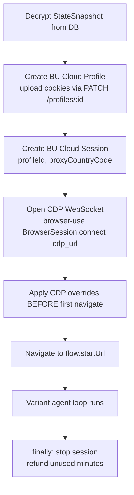
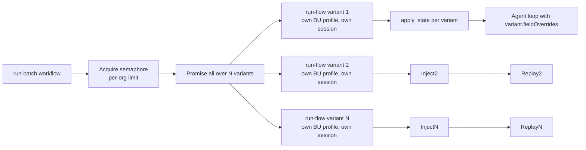

# Flowlens v3 — Session Replication Deep Dive

> **Goal**: Spawn N parallel BU Cloud browsers that look + behave **byte-identical** to the user's logged-in Chrome session, so variants execute against the user's real account state without ever hitting an auth wall.

This doc is the architecture spec + gap audit + local test plan for the core product feature.

---

## 1. The 7 layers of "browser session"

A browser session isn't just cookies. To truly replicate the user's environment, we need to capture and inject across all 7 layers below. **A miss at any layer breaks at least some flows.**

| # | Layer | What's in it | Capture API (Chrome) | Inject API (CDP) |
|---|---|---|---|---|
| 1 | **Network identity** | Cookies (incl. HttpOnly, SameSite, Secure) | `chrome.cookies.getAll` | `Storage.setCookies` |
| 2 | **Origin storage** | localStorage, sessionStorage | `chrome.scripting.executeScript` reading `localStorage`/`sessionStorage` | `Storage.setLocalStorage` (CDP doesn't have this — must use `Runtime.evaluate` to call `localStorage.setItem`) |
| 3 | **Object storage** | IndexedDB (Clerk, Supabase, Firebase auth) | `indexedDB.databases()` + cursor over each store | `Runtime.evaluate` to write via `indexedDB.open` + `objectStore.put` |
| 4 | **Service worker state** | SW registrations, Cache API entries | `navigator.serviceWorker.getRegistrations()` (limited; can't get internal state) | Re-register via `navigator.serviceWorker.register()` post-load (best-effort) |
| 5 | **Browser fingerprint** | UA, UA-CH hints, viewport, DPR, color depth, hardware concurrency, device memory, platform, timezone, locale | `navigator.*` + `Intl.DateTimeFormat()` | `Emulation.setUserAgentOverride`, `setDeviceMetricsOverride`, `setTimezoneOverride`, `setLocaleOverride` |
| 6 | **Permissions** | Geolocation, notifications, clipboard, camera, mic | `navigator.permissions.query({name})` | `Browser.grantPermissions` |
| 7 | **Per-flow startup** | Initial URL, scroll position, viewport at recording time, open modals/forms | rrweb's first DOM snapshot | `Page.navigate` + restore via Agent task |

**Total fields to capture: ~30**.
**Total CDP commands per variant on session-start: ~10**.

---

## 2. Capture (extension side)

### 2.1 Trigger points

Capture happens at three moments:

1. **Recording start** — full snapshot for fidelity baseline
2. **Recording stop** — second snapshot to catch any changes during the session (auth refreshed mid-flow, modal opened, etc.)
3. **"Refresh auth" button** — explicit user action when cookies expire

We currently do (1) and (3). Add (2).

### 2.2 The capture function (concretely)

```ts
// packages/recorder-core/src/state-capture.ts
async function captureFullState(origin: string, tabId: number): Promise<StateSnapshot> {
  const [cookies, storage, idb, sw, fingerprint, permissions] = await Promise.allSettled([
    captureCookies(origin),
    captureWebStorage(tabId),     // localStorage + sessionStorage
    captureIndexedDB(tabId),      // ← currently MISSING
    captureServiceWorkers(tabId), // ← currently MISSING
    captureFingerprint(tabId),    // ← currently MISSING
    capturePermissions(origin),   // ← currently MISSING
  ]);
  return mergeWithFallbacks({ cookies, storage, idb, sw, fingerprint, permissions });
}
```

### 2.3 Specifics per layer

**Layer 1 — Cookies** (we do this):
```ts
chrome.cookies.getAll({ url: origin });  // returns HttpOnly too
```

**Layer 2 — Web storage** (we do this):
```ts
chrome.scripting.executeScript({
  target: { tabId },
  func: () => ({ localStorage: {...localStorage}, sessionStorage: {...sessionStorage} }),
});
```

**Layer 3 — IndexedDB** (we DON'T do this):
```ts
chrome.scripting.executeScript({
  target: { tabId },
  func: async () => {
    const dbs = await indexedDB.databases();
    const out = {};
    for (const { name, version } of dbs) {
      const req = indexedDB.open(name);
      const db = await new Promise(r => { req.onsuccess = () => r(req.result); });
      out[name] = { version, stores: {} };
      for (const storeName of db.objectStoreNames) {
        const tx = db.transaction(storeName, 'readonly');
        const records = [];
        await new Promise(r => {
          const cur = tx.objectStore(storeName).openCursor();
          cur.onsuccess = e => {
            const c = e.target.result;
            if (c) { records.push({ key: c.key, value: c.value }); c.continue(); }
            else r();
          };
        });
        out[name].stores[storeName] = records;
      }
    }
    return out;
  },
});
```

This is the **most important missing piece** for SPA-based auth. Clerk stores tokens in `__clerk_*`, Supabase in `sb-*`, Firebase in `firebase:authUser:*`.

**Layer 4 — Service workers** (best-effort):
```ts
chrome.scripting.executeScript({
  target: { tabId },
  func: () => navigator.serviceWorker.getRegistrations().then(rs => rs.map(r => ({
    scope: r.scope,
    scriptURL: r.active?.scriptURL,
    state: r.active?.state,
  }))),
});
```
Inject side will warn if SW state is critical (most flows tolerate without).

**Layer 5 — Fingerprint**:
```ts
chrome.scripting.executeScript({
  target: { tabId },
  func: async () => ({
    userAgent: navigator.userAgent,
    userAgentData: await navigator.userAgentData?.getHighEntropyValues([
      'platform', 'platformVersion', 'architecture', 'model',
      'mobile', 'bitness', 'wow64', 'fullVersionList',
    ]),
    viewport: { width: window.innerWidth, height: window.innerHeight },
    devicePixelRatio,
    colorDepth: screen.colorDepth,
    hardwareConcurrency: navigator.hardwareConcurrency,
    deviceMemory: navigator.deviceMemory,
    platform: navigator.platform,
    timezone: Intl.DateTimeFormat().resolvedOptions().timeZone,
    languages: [...navigator.languages],
    language: navigator.language,
  }),
});
```

**Layer 6 — Permissions** (per origin):
```ts
chrome.scripting.executeScript({
  target: { tabId },
  func: async () => {
    const out = {};
    for (const p of ['geolocation','notifications','clipboard-read','clipboard-write','camera','microphone','persistent-storage']) {
      try {
        out[p] = (await navigator.permissions.query({ name: p })).state;
      } catch { out[p] = 'unsupported'; }
    }
    return out;
  },
});
```

**Layer 7 — Startup** (we capture URL + viewport already; rrweb snapshot covers DOM):
```ts
const initial = {
  url: location.href,
  scroll: { x: scrollX, y: scrollY },
  viewport: { w: innerWidth, h: innerHeight },
  // rrweb's snapshot is in the chunk stream
};
```

---

## 3. Encryption + persistence (server side)

Currently `cookie_snapshots` table holds only cookies + web storage. **Rename + extend** to:

```sql
ALTER TABLE cookie_snapshots RENAME TO state_snapshots;
-- ciphertext now contains the full StateSnapshot bundle
ALTER TABLE state_snapshots ADD COLUMN snapshot_version int NOT NULL DEFAULT 2;
ALTER TABLE state_snapshots ADD COLUMN has_idb boolean NOT NULL DEFAULT false;
ALTER TABLE state_snapshots ADD COLUMN has_service_worker boolean NOT NULL DEFAULT false;
```

The encrypted bundle (libsodium sealed-box, per-org keypair) now holds:

```ts
type StateSnapshot = {
  version: 2;
  origin: string;
  capturedAt: string;
  cookies: ChromeCookie[];
  webStorage: { localStorage: KV; sessionStorage: KV };
  indexedDB: Record<string, { version: number; stores: Record<string, { key: any; value: any }[]> }>;
  serviceWorkers: { scope: string; scriptURL: string; state: string }[];
  fingerprint: Fingerprint;
  permissions: Record<string, 'granted' | 'denied' | 'prompt' | 'unsupported'>;
  initial: { url: string; scroll: {x:number,y:number}; viewport: {w:number,h:number} };
};
```

---

## 4. Inject (sidecar Python — for each variant)

Per-variant flow:



### 4.1 The CDP override sequence

```python
# apps/replay-worker/app/state_inject.py
async def apply_state(session, state):
    cdp = session.cdp_client

    # 1. Cookies (BU profile already has them via PATCH; this is belt-and-suspenders)
    await cdp.send('Storage.setCookies', { 'cookies': state['cookies'] })

    # 2. UA override
    fp = state['fingerprint']
    await cdp.send('Emulation.setUserAgentOverride', {
        'userAgent': fp['userAgent'],
        'platform': fp.get('platform'),
        'userAgentMetadata': fp.get('userAgentData'),
    })

    # 3. Timezone + locale
    await cdp.send('Emulation.setTimezoneOverride', { 'timezoneId': fp['timezone'] })
    await cdp.send('Emulation.setLocaleOverride', { 'locale': fp['language'] })

    # 4. Viewport + DPR
    await cdp.send('Emulation.setDeviceMetricsOverride', {
        'width': fp['viewport']['width'],
        'height': fp['viewport']['height'],
        'deviceScaleFactor': fp['devicePixelRatio'],
        'mobile': False,
    })

    # 5. Permissions per origin
    granted = [p for p, s in state['permissions'].items() if s == 'granted']
    if granted:
        await cdp.send('Browser.grantPermissions', {
            'origin': state['origin'],
            'permissions': granted,
        })

    # 6. localStorage / sessionStorage / IndexedDB injection
    # CDP doesn't have direct setLocalStorage, so we inject via Runtime.evaluate AFTER
    # the first navigate (origins must match for storage scope).
    # Phase 1: just navigate to the origin's about:blank-equivalent; Phase 2: write storage.
    await cdp.send('Page.navigate', { 'url': state['origin'] })
    # Wait for load
    # Then via Runtime.evaluate, write each key/value
    await write_origin_storage(cdp, state['webStorage'])
    await write_indexeddb(cdp, state['indexedDB'])

    # 7. Re-register service workers (best-effort; pages auto-register on next nav)
    # Skip; let the flow's first-page-load handle this naturally.
```

### 4.2 Critical ordering

CDP overrides MUST be applied **before** the first `Page.navigate` so the page sees them. Specifically:
- UA override → before any HTTP request (server may serve different content per UA)
- Timezone override → before page loads (affects `new Date()` in initial scripts)
- Storage cookies → before the first page request (auth cookie sent in headers)

After first navigate completes:
- localStorage / sessionStorage → injected via `Runtime.evaluate` running `localStorage.setItem`
- IndexedDB → same approach but more complex (open db, transaction, put per record)
- Permissions → may need post-navigate grant for some Chromium versions

---

## 5. Variant fan-out — N parallel sessions



**Why one profile per variant** (not shared): variants modify state during execution (e.g. `state` family creates rapid taps that may corrupt server-side state). Don't let variants step on each other.

**Concurrency cap**: BU Cloud plan limits + per-org Upstash semaphore. Default 5 concurrent. User's plan likely allows more — adjustable via `FLOWLENS_BU_MAX_CONCURRENT` env var.

---

## 6. Audit: are we up there?

| Component | Status | Notes |
|---|---|---|
| Cookies capture | ✅ implemented | `chrome.cookies.getAll` in extension |
| Cookies decrypt + push to BU profile | ⚠️ buggy | Current cookie-fix worker addressing — `cookies.decrypted {count: 0}` |
| Web storage capture | ✅ implemented | localStorage + sessionStorage in cookie snapshot bundle |
| Web storage inject | ⚠️ partial | Code exists but not verified after first navigate |
| **IndexedDB capture** | ❌ **MISSING** | Critical for Clerk/Supabase/Firebase SPAs |
| **IndexedDB inject** | ❌ **MISSING** | Same |
| Service worker capture/inject | ❌ MISSING | Best-effort; not blocking for most flows |
| **UA + UA-CH override** | ❌ **MISSING** | Site may serve different content per UA, anti-bot may flag mismatch |
| **Timezone override** | ❌ **MISSING** | Affects `Intl.*` outputs in app |
| **Locale override** | ❌ **MISSING** | Affects i18n routing |
| **Viewport / DPR override** | ❌ **MISSING** | Responsive sites render differently |
| **Permissions grant** | ❌ **MISSING** | Geo-aware sites prompt; cloud Chromium will block |
| Per-variant BU profile | ⚠️ partial | Code path exists; uses one shared profile right now |
| Per-variant CDP override | ❌ **MISSING** | apply_state function not yet built |
| Concurrency cap | ✅ | Semaphore at 5 |
| Cluster analysis post-batch | ✅ | Existing |

**Verdict: ~40% complete.** Cookie path proven by Phase 3 even if buggy. The other six layers (IndexedDB, fingerprint, timezone/locale, viewport, permissions, service workers) are completely unbuilt.

---

## 7. Local test plan (after gaps closed)

### 7.1 Test target

Use **Wikipedia** (no auth needed but rich client-side state) for the cookieless layers, then **a Clerk-protected demo app** (e.g. clerk-nextjs-starter on localhost:3001) for the IndexedDB/cookie-heavy layer.

### 7.2 Smoke matrix

```
A. Cookie-only sanity (Wikipedia)
   - Record: search "octopus", click first result
   - Run with 5 variants
   - Expected: all 5 reach stepFinished, each tries different unicode/encoding/state edge cases

B. IndexedDB-required (Clerk-protected)
   - Set up local Next.js app with Clerk, sign in
   - Record: dashboard navigation
   - Run with 5 variants
   - Expected: variants land at /dashboard (authenticated), no /sign-in redirect

C. UA-sensitive (mobile-aware site)
   - Record on https://m.wikipedia.org from desktop browser
   - Variants must keep desktop UA — verify by checking nav links match desktop layout

D. Timezone-sensitive (calendar app)
   - Record on Google Calendar (auth via Clerk-style local app)
   - Verify variant runs see same TZ as user (no calendar-shift errors)
```

### 7.3 Pass criteria

- ≥4/5 variants reach `step_finished > 0` per smoke
- No variant fails because of auth wall
- No variant fails because of UA mismatch / TZ mismatch / permission prompt

### 7.4 Tooling

`apps/web/scripts/local-e2e.mjs` already exists. Extend with:
- `--site` arg to switch test target
- Per-layer assertions (verify cookies present, IDB has data, UA matches, etc.)
- Output a report card per layer showing what worked

---

## 8. What ships next (when cookie worker lands)

A focused worker takes this doc as spec and:

1. Adds capture functions (Layer 3, 4, 5, 6) to `packages/recorder-core/`
2. Extends `state_snapshots` schema (rename + new columns)
3. Adds `apps/replay-worker/app/state_inject.py` with the CDP override sequence
4. Wires `apply_state` call into the variant runner before `Page.navigate`
5. Extends `local-e2e.mjs` with per-layer assertions
6. Runs the 4-scenario smoke matrix from §7.2
7. Reports per-layer pass/fail

Estimated cost: ~$2 in OpenAI (variant gen across 4 smokes + cluster analysis × 4) + ~$0.05 BU. Acceptable per user.

---

## 9. Risks + mitigations

| Risk | Mitigation |
|---|---|
| BU Cloud Chromium version doesn't support all CDP commands above | Wrap each `cdp.send` in try/except; surface unsupported in run report instead of crashing |
| User's cookies expire between record and replay | Existing auth-refresh flow handles. Surface "expires in N days" in extension. |
| IndexedDB capture too slow for large stores (some sites cache MB of data) | Cap per-store at 1 MB; truncate with explicit warning |
| Site detects emulated UA | Use UA-CH high-entropy hints exactly as captured; don't fabricate |
| Permission prompts during replay block agent | Pre-grant all captured permissions; for `denied` ones, set explicit denial via CDP |
| Service worker registers asynchronously after page load → variant misses SW-cached responses | Document as known limitation; flows that depend on SW caching marked `requires_warm_cache` in future |

---

## 10. TL;DR for the user

**Today**: variants spawn but don't authenticate (cookies broken).
**With the work in §8**: variants spawn AND look like the user's exact browser AND auth survives across all 7 layers.
**Test plan**: §7. 4 scenarios, ~30 min to run, evidence-driven.

Once cookie-fix worker lands, the session-replication worker takes this doc as input and ships it. Expect 2–3 hours of focused work + the 30 min smoke.
