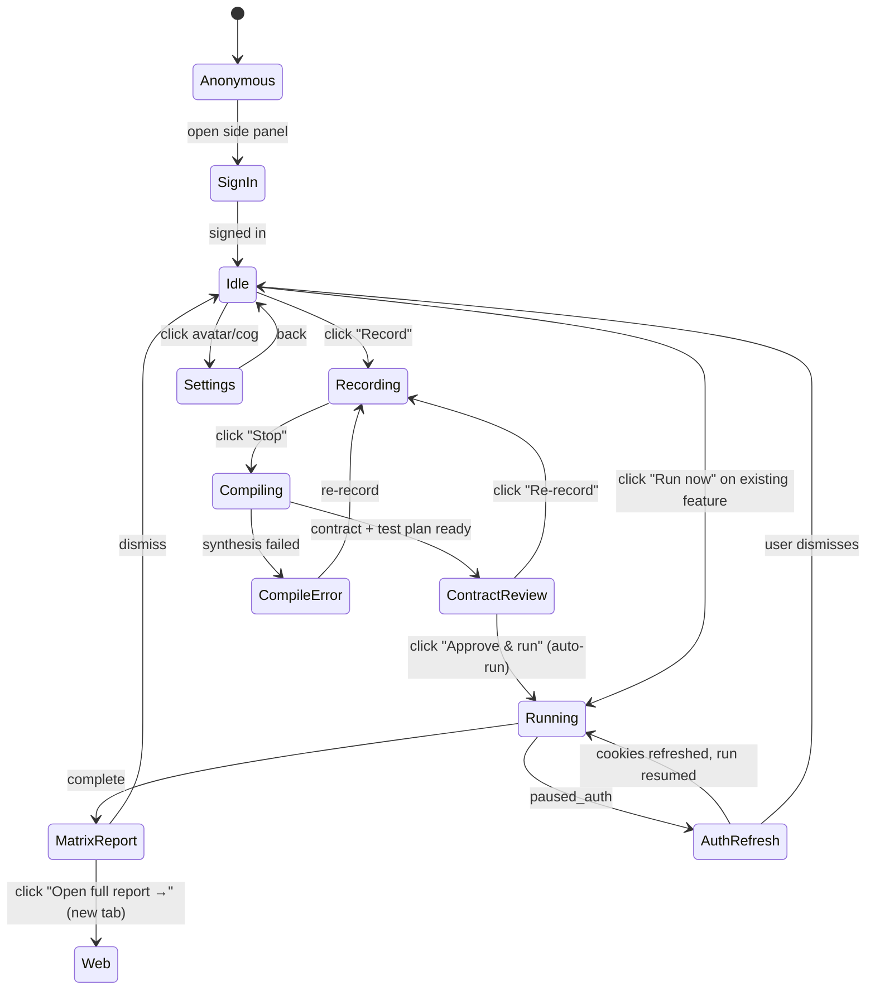

# Flowlens v3 — UX Design

> **Companion to:** [HLD.md](HLD.md), [LLD.md](LLD.md)
> **Note on Figma:** these are ASCII wireframes intended to be lossless on what each screen does and how it transitions. Real Figma frames are a follow-up deliverable — see [§13](#13-figma-handoff-plan).

---

## Contents

1. [Design principles](#1-design-principles)
2. [Information architecture](#2-information-architecture)
3. [User journey maps](#3-user-journey-maps)
4. [State machine — extension](#4-state-machine--extension)
5. [Onboarding (first-run experience)](#5-onboarding-first-run-experience)
6. [Extension wireframes (every state)](#6-extension-wireframes-every-state)
7. [Web dashboard wireframes](#7-web-dashboard-wireframes)
8. [Surface split — side panel vs web dashboard](#8-surface-split--side-panel-vs-web-dashboard)
9. [Microinteractions](#9-microinteractions)
10. [Empty states inventory](#10-empty-states-inventory)
11. [Error states inventory](#11-error-states-inventory)
12. [Accessibility](#12-accessibility)
13. [Voice & tone — microcopy](#13-voice--tone--microcopy)
14. [Figma handoff plan](#14-figma-handoff-plan)

---

## 1. Design principles

1. **Two surfaces, one job.** The extension is for *action* (record, approve the contract, refresh auth, watch a run). The web is for *understanding* (reports, history, sharing, scheduling). Never make the user open the wrong one.
2. **Tests are about behaviors, not clicks.** The recording is a *demonstration*; the artifact we test against is the **Feature Contract** — inputs, expected behaviors, invariants. The user reviews the contract, not a step list. Tests survive UI tweaks because they reason about claims.
3. **The recording is a conversation, not a form.** No selectors. No assertions. Just demonstrate what the feature should do, once, and we'll synthesize the contract and the test plan.
4. **The AI works in the open.** Every AI stage is visible — "Narrating each step", "Synthesizing contract", "Generating test plan", "Variant 7 of 12 (B2/Stress)". The user always knows what we're doing and why.
5. **Two axes, one verdict.** A run produces **Correctness** (does it work as claimed?) and **Robustness** (does it survive what users actually do?), not a single pass/fail. Green Correctness with red Robustness is a real, useful state.
6. **Failure is a feature.** When something breaks, the most valuable moment is *the explanation*. Lead with the AI's clustered diagnosis ("Reset doesn't repaint — drives B4/Verify, B2/Stress, B3/Adv"), not a stack trace.
7. **Auth refresh is one click, never one form.** Users never type credentials into Flowlens. They log in on the real site, we capture cookies + storage + IndexedDB.
8. **Free tier feels generous; Pro upgrades are obvious.** Daily scheduling beyond 5 features, deeper variant coverage, visual regression, and multi-seat are the wedges.
9. **No tutorial pop-ups.** Onboarding is real work: by the end of step 3 you've recorded your first feature; by step 6 you've approved its contract.

---

## 2. Information architecture

### Extension (Chrome side panel, ~400 px wide)

```text
Flowlens (root)
├── Idle
│   ├── Features for this site (tabbed: All · Recent · Failing)
│   └── Recent runs (last 5)
├── Recording
│   ├── In-page overlay
│   └── Side panel — Live capture status
├── Compiling (post-stop, pre-review)
│   ├── Stitching · Narrating · Synthesizing contract · Generating test plan
│   └── Cancel
├── ContractReview (replaces the old "Review")
│   ├── Feature name + AI summary
│   ├── Inputs (ControlInputs from the page-wide inventory)
│   ├── Expected behaviors (3–7, given/when/then)
│   ├── Invariants
│   ├── Auth status (cookie + storage indicator)
│   └── Approve & run · Re-record
├── Running
│   ├── Per-behavior progress with mode pills (V/E/S/A)
│   ├── Embedded liveUrl iframe
│   └── Pause / Stop controls
├── Run report (collapsed, two-axis)
│   ├── Correctness × Robustness summary
│   ├── Behavior × Mode grid
│   ├── AI cluster summary
│   └── Deep link to web for full
├── Auth refresh
│   ├── Detect logged-in state
│   └── Confirm + push session state
├── Settings
│   ├── Account
│   ├── Notifications
│   └── Sites & permissions
└── Help / docs
```

### Web dashboard (`flowlens.in/app/...`)

```text
Web app
├── /app/sites                       — list of sites I've recorded against
├── /app/sites/[id]                  — site dashboard: features, health chart, schedules
├── /app/features/[id]               — feature detail: contract, test plan, runs, schedules
├── /app/runs/[id]                   — single run report (full two-axis grid + variant lightbox)
├── /app/runs/[id]/share/[token]     — public read-only run report
├── /app/integrations                — Slack, email, webhooks
├── /app/billing                     — plan, usage, credits
└── /app/settings                    — org, members, API keys
```

The principle: every extension card has a "View on flowlens.in" deep link for full detail. The extension never tries to render a 500-line report.

> **Naming note.** Internally and in code we still use `flow_id` / `flows` table for backward compatibility with phases 1–3 storage; the user-facing noun is **Feature** everywhere. The migration to feature-prefixed routes is part of Phase 4.

---

## 3. User journey maps

### Persona 1 — "Priya, CTO of a 20-person startup"


| Step                                       | Surface                       | Emotion       | What works                                                                       |
| ------------------------------------------ | ----------------------------- | ------------- | -------------------------------------------------------------------------------- |
| Hears about Flowlens on Twitter            | external                      | curious       | One-line pitch lands ("record a feature, we QA it forever")                      |
| Installs extension                         | Chrome Web Store              | mild friction | Extension is 5 MB; install is 8 s                                                |
| Clicks side panel for the first time       | extension idle                | confused      | "Sign in with Google" is the only thing on the screen                            |
| Signs in                                   | Clerk hosted                  | friction      | One-tap Google OAuth                                                             |
| Opens her staging site, clicks Record      | extension recording           | engaged       | Red dot is reassuring, no surprise                                               |
| Demonstrates signup flow                   | site under test               | focused       | Subtle overlay, doesn't get in the way                                           |
| Stops, watches AI compile contract         | extension compiling           | curious       | Visible stages: Stitching · Narrating · Synthesizing contract · Generating tests |
| Reads the Feature Contract                 | extension contract review     | delighted     | "It understood the *feature*, not just my clicks"                                |
| Approves the contract                      | extension contract review     | committed     | One button; the test plan auto-runs (no extra click)                             |
| Watches matrix run live                    | extension running             | trusting      | Per-behavior progress + mode pills + liveUrl iframe = magic moment               |
| Sees the two-axis verdict in the panel     | extension matrix report       | informed      | Compact: Correctness 4/5, Robustness 2/5, AI cluster summary                     |
| Clicks "Open full report →"                | web dashboard (new tab)       | engaged       | Side panel hands off to the deep view; quick actions stay in the panel           |
| Reads variant-by-variant detail            | web run report                | productive    | Side-by-side recorded vs replay screenshots, AI debugging analysis as full prose |
| Schedules daily from the web               | web feature detail            | committed     | One toggle, default time is sensible                                             |
| Day 7: Slack notification on regression    | Slack                         | alarmed       | Notification has the cluster diagnosis, not just "failed"                        |
| Opens link, fixes the bug                  | web dashboard → her IDE       | productive    | Side-by-side recorded vs replay screenshots, cross-deploy diff                   |


### Persona 2 — "Akshay, agency dev managing 12 client sites"

Cares about: org-level dashboards, white-label reports for clients (defer; v3.1), public share URLs.

Flowlens nails the public share — sends a link to a client saying "checkout is broken — Correctness 60 %, two behaviors regressed, here's the side-by-side". The link opens the web dashboard's run report (read-only); the side panel's compact verdict is just the trigger.

### Persona 3 — "Zara, QA contractor brought in for one project"

Cares about: ability to import existing test plans, schedule batch runs, export results to CSV. Mostly out of scope for v3 — document this clearly.

### Persona 4 — "Ben, indie hacker shipping a side project"

Cares about: cheap, fast, low-friction. Free tier is the entire product for him. Stickiness driver is the daily Slack digest.

---

## 4. State machine — extension




Hard rules:

- Only one side-panel state visible at any time.
- Recording state is global per Chrome window — switching tabs doesn't change it; switching windows surfaces a "Recording in window 1" indicator.
- Auth refresh state pre-empts everything else (highest priority surface).
- **Approval auto-runs.** There is no "Save" → "Run" two-step. Approving the contract kicks off the matrix run; if the user wants to save without running they can dismiss back to Idle and run later.
- **Open full report opens a new tab** — the side panel keeps the compact MatrixReport visible so quick actions (Re-run failed only, Schedule daily, Share) remain one click away.

---

## 5. Onboarding (first-run experience)

Goal: from install to "first flow saved" in under 10 minutes. Three frames. No tutorial pop-ups on top of the actual UI.

### Frame 1 — Welcome

```text
┌──────────────────────────────────────────────────┐
│                                                  │
│              ✦  Flowlens                         │
│              ───────────                         │
│                                                  │
│  Record a flow once. We test it forever.        │
│                                                  │
│  ┌──────────────────────────────────────────┐   │
│  │  Sign in with Google                      │   │
│  └──────────────────────────────────────────┘   │
│                                                  │
│  ┌──────────────────────────────────────────┐   │
│  │  Sign in with email                       │   │
│  └──────────────────────────────────────────┘   │
│                                                  │
│  By signing in, you agree to our Terms.         │
│                                                  │
│  Privacy at a glance:                            │
│  • We only access sites you record on.          │
│  • Cookies are encrypted before they leave      │
│    your browser. Read the docs.                 │
│                                                  │
└──────────────────────────────────────────────────┘
```

### Frame 2 — First-record nudge (post sign-in, no flows)

```text
┌──────────────────────────────────────────────────┐
│ Flowlens         No site selected         [👤]  │
├──────────────────────────────────────────────────┤
│                                                  │
│   Welcome, Priya 👋                              │
│                                                  │
│   Step 1 — Open the site you want to test      │
│            in this tab.                          │
│   Step 2 — Come back, click Record below.       │
│   Step 3 — Demonstrate the flow.                │
│                                                  │
│   ┌─────────────────────────────────────────┐    │
│   │  🔴 Record a flow                          │    │
│   │  (open a site first)                       │    │
│   └─────────────────────────────────────────┘    │
│                                                  │
│   📺 Watch a 60-second demo                     │
│                                                  │
└──────────────────────────────────────────────────┘
```

The "Record a flow" button is **disabled** until the user has a real site URL in the active tab. Tooltip on hover explains why.

### Frame 3 — First record in progress (in-page coachmark)

The first time the user records, a tiny coachmark anchored to the in-page overlay says:

> Just do what you'd test by hand. We'll capture every click.

Dismisses on first click. Never appears again.

---

## 6. Extension wireframes (every state)

> All wireframes are 80-char wide ASCII. Real implementation is a 400 px Chrome side panel. Margins normalized for readability.

### 6.1 Idle, has features

```text
┌──────────────────────────────────────────────────────────────┐
│  ✦ Flowlens         shop.example.com  ▾       [👤  ⚙]      │
├──────────────────────────────────────────────────────────────┤
│  ┌──────────────────────────────────────────────────────┐    │
│  │  🔴 Record a feature                                  │    │
│  │  Demonstrate it once; we'll synthesize the contract   │    │
│  └──────────────────────────────────────────────────────┘    │
│                                                                │
│  Features  ·  Recent · Failing                                │
│  ────────────────────────────────────────────                 │
│                                                                │
│  ✓ Sign up & verify email                            [▶ Run] │
│    Correctness ✓ 5/5 · Robustness ✓ 4/5 · 2 h ago             │
│    ───────────────────────────────────                        │
│                                                                │
│  ✗ Add to cart & checkout                            [▶ Run] │
│    Correctness ✗ 3/5 · Robustness ✗ 1/5 · 12 m ago            │
│    🚨 "Pay button missing on cart page" — 3 behaviors broke   │
│    ───────────────────────────────────                        │
│                                                                │
│  ✓ Filter products                                   [▶ Run] │
│    Correctness ✓ 4/5 · Robustness ⚠ 2/5 · yesterday           │
│    ⚠ Reset doesn't repaint slider — Robustness fragile        │
│    ───────────────────────────────────                        │
│                                                                │
│  Recent runs                              [View all on web →] │
│  ────────────────────────────────────────                     │
│  ✗ checkout · 12m ago                                         │
│  ✓ signup    · 2h ago                                         │
│  ⚠ filter    · yesterday                                      │
│                                                                │
│  Session: 🟢 cookies + 5/7 layers fresh · 9 d   [Refresh]    │
└──────────────────────────────────────────────────────────────┘
```

Notes:

- Site name is a `<select>` with all sites the user has recorded against. Switches the side panel context.
- "Failing" tab shows only features where the last run had a red Correctness OR Robustness column — primary user action point.
- Each feature row shows the **two-axis verdict at a glance** (e.g. `Correctness ✓ 5/5 · Robustness ⚠ 2/5`) — the same vocabulary the report uses, so users learn it once.
- The session status row is **always visible** (low chrome footprint, big trust factor) — it surfaces both cookie freshness *and* how many of the 7 session layers were captured (see [HLD §4.5.3](HLD.md#453-how-user-sessions-are-replicated)).

### 6.2 Recording — in-page overlay (anchored bottom-right of the tab)

```text
                         ┌────────────────────────────┐
                         │  🔴 REC  ·  12 actions      │
                         │  ────────────────────────   │
                         │  [✏ Note this step]         │
                         │  [⏸ Pause]   [⏹ Stop]      │
                         └────────────────────────────┘
```

- Drag-handle on the title bar so user can move it out of the way.
- Pulses gently while active (animation, not flashing — accessibility).
- "Note this step" opens a single-line input that attaches a user comment to the next captured action.
- Pause: rrweb stops recording, screenshots stop. Cookies still tracked. Resume continues from where it left off.

### 6.3 Recording — side panel (visible when user opens it during recording)

```text
┌──────────────────────────────────────────────────────────────┐
│  ✦ Flowlens         shop.example.com  ●         [👤  ⚙]    │
├──────────────────────────────────────────────────────────────┤
│                                                                │
│  🔴 Recording in progress                                     │
│  ──────────────────────────                                   │
│                                                                │
│  12 actions captured  ·  3:42 elapsed                         │
│                                                                │
│  ┌──────────────────────────────────────────────────────┐    │
│  │  Latest:                                               │    │
│  │  [screenshot thumbnail]                                │    │
│  │  Filled email · "priya@startup.com"                    │    │
│  └──────────────────────────────────────────────────────┘    │
│                                                                │
│  Tip — you can keep the side panel closed while recording.    │
│  Use the in-page overlay to control everything.              │
│                                                                │
│  ┌──────────────────────────────────────────────────────┐    │
│  │  ⏹ Stop recording                                      │    │
│  └──────────────────────────────────────────────────────┘    │
│                                                                │
│  ⚠ We detected a password-like value at step 8.              │
│    It's been encrypted and won't be shown.                    │
│                                                                │
└──────────────────────────────────────────────────────────────┘
```

The sensitive-data warning is one of the highest-trust microinteractions: confirmed real, in-flight, and the user knows we did the right thing.

### 6.4 Compiling (post-stop, pre-contract)

```text
┌──────────────────────────────────────────────────────────────┐
│  ✦ Flowlens         shop.example.com           [👤  ⚙]      │
├──────────────────────────────────────────────────────────────┤
│                                                                │
│  Compiling the Feature Contract…                              │
│  ──────────────────────────────────                           │
│                                                                │
│  ●  Stitching the recording                ✓ done             │
│  ●  Narrating each step                    ████░░░░  6 of 12  │
│  ○  Synthesizing the contract                                 │
│      (inputs · expected behaviors · invariants)               │
│  ○  Generating the 4-mode test plan                           │
│      (verify · edge · stress · adversarial)                   │
│                                                                │
│  This usually takes 10–20 seconds.                            │
│                                                                │
│  ┌──────────────────────────────────────────────────────┐    │
│  │  Cancel                                                │    │
│  └──────────────────────────────────────────────────────┘    │
│                                                                │
└──────────────────────────────────────────────────────────────┘
```

The four named stages are the principle "AI works in the open" applied to the new pipeline. Each stage corresponds to a distinct LLM call (or, for stitching, a deterministic step) — see [HLD §4.5.1](HLD.md#451-how-the-llm-makes-decisions-stage-by-stage).

### 6.5 Contract Review

The old "Review" step was a step carousel. In v3 we don't ask the user to verify clicks — we ask them to verify what we *understood about the feature*. This is the screen that earns the "AI senior QA engineer" framing.

```text
┌──────────────────────────────────────────────────────────────┐
│  ✦ Flowlens         shop.example.com           [👤  ⚙]      │
├──────────────────────────────────────────────────────────────┤
│  ← Back                                                       │
│                                                                │
│  Feature: Filter products                          [✏ rename]│
│  ─────────────────────────                                    │
│  AI understood: Filter the product list by category, price    │
│  range, and minimum rating.                                   │
│                                                                │
│  Inputs                                                        │
│  ──────                                                        │
│  • Category         · select   · {Apparel, Toys, Tools, …}    │
│  • Price (min, max) · number×2 · 0 — 1000                     │
│  • Rating (min)     · slider   · 1 — 5                        │
│  • Reset            · button   · clears all filters           │
│                                                                │
│  Expected behaviors                                            │
│  ───────────────────                                           │
│  ▸ B1 · Selecting a category narrows the list                 │
│       given the page is loaded                                │
│       when the user picks a category                          │
│       then only products in that category remain              │
│                                                                │
│  ▸ B2 · Setting a min price hides cheaper items               │
│  ▸ B3 · Min rating ≥ 4 hides 1–3 star items                   │
│  ▸ B4 · Reset clears all filters                              │
│                                                                │
│  Invariants                                                    │
│  ──────────                                                    │
│  • Result count never increases when adding a filter          │
│  • No console errors during any filter change                 │
│  • The "Reset" button is reachable from any filter state      │
│                                                                │
│  Test plan: 12 variants (3 verify · 3 edge · 3 stress · 3 adv)│
│  Estimated cost: ~$0.30 · estimated time: ~2 min              │
│                                                                │
│  Session: 🟢 14 cookies · 5/7 layers captured  (encrypted)    │
│  ⚠ Detected a password at step 8 — redacted in the contract.  │
│                                                                │
│  ┌──────────────────────────────┐  ┌──────────────────────┐   │
│  │  ✓ Approve and run tests     │  │  ↻ Re-record          │   │
│  └──────────────────────────────┘  └──────────────────────┘   │
│                                                                │
│  v1 is review-only. If anything looks wrong, re-record —       │
│  we'll learn from re-record patterns before adding an editor. │
│                                                                │
└──────────────────────────────────────────────────────────────┘
```

Notes:
- Each behavior expands on tap to show its full given/when/then. The collapsed default keeps 4–6 behaviors readable in one viewport.
- **No step carousel.** The recorded clicks are evidence, not the artifact. They're available on the web Feature detail page if anyone wants them.
- Approval is the single primary action and **auto-runs** the test plan (state machine §4). There is no separate "Save then Run" — see [HLD §8 Key design decisions: "Auto-run after contract approval"](HLD.md#8-key-design-decisions).
- Sibling-flow suggestions are **gone in v3** — matrix-gen's adversarial + edge variants now cover the "what if the user does the wrong thing?" surface that sibling flows used to. Anything matrix-gen misses, the user re-records.

### 6.6 Running — matrix in flight

The side panel during a run is the **watch-live surface**: a live iframe of the BU Cloud browser plus a per-behavior progress grid with mode pills. It does NOT redirect to the web mid-run — that would break the magic moment. The web report is the destination for *after* the run completes.

```text
┌──────────────────────────────────────────────────────────────┐
│  ✦ Flowlens         shop.example.com           [👤  ⚙]      │
├──────────────────────────────────────────────────────────────┤
│                                                                │
│  Running: Filter products                                     │
│  ───────────────────────────                                  │
│  Variant 7 of 12 · 18.4 s · est. 24 s left                    │
│                                                                │
│  ┌──────────────────────────────────────────────────────┐    │
│  │ [iframe of liveUrl — cloud browser doing the thing]    │    │
│  │                                                        │    │
│  │                                                        │    │
│  └──────────────────────────────────────────────────────┘    │
│                                                                │
│  By behavior                                                  │
│  ────────────                                                 │
│  B1 Category narrows list      [V✓][V✓][E✓][S·][A·]          │
│  B2 Min price hides cheap      [V✓][E·][S○][A○]               │
│  B3 Min rating filters         [V·][E○][S○][A○]               │
│  B4 Reset clears filters       [V○][E○]                       │
│  Inv1 count never increases    [running…]                     │
│                                                                │
│  Legend  V verify · E edge · S stress · A adversarial         │
│         ✓ pass  ✗ fail  · running  ○ queued                  │
│                                                                │
│  Now: B2 / Stress · "rapidly toggle min-price 12 times"       │
│       AI agent picking element on live page…                  │
│                                                                │
│  ┌──────────────────────┐  ┌──────────────────────┐           │
│  │  ⏸ Pause              │  │  ⏹ Stop                │           │
│  └──────────────────────┘  └──────────────────────┘           │
│                                                                │
└──────────────────────────────────────────────────────────────┘
```

The "AI agent picking element" status flips to "Action executed" as soon as it lands; for variants on the CDP-direct fast path (~70 % of variants — see [HLD §4.5.2](HLD.md#452-how-replay-executes-in-the-remote-browser)) the line reads "Resolved by testid · executed" instead. The user feels every thought.

### 6.7 Matrix Report (compact, in side panel)

The side panel **stops at the verdict**. It's the compact, scannable summary that tells the user what the run found. Anything that needs a second column, a zoomable screenshot, or a paragraph of analysis lives on the web — see [§8 Surface split](#8-surface-split--side-panel-vs-web-dashboard). The primary CTA is the deep-link.

```text
┌──────────────────────────────────────────────────────────────┐
│  ✦ Flowlens         shop.example.com           [👤  ⚙]      │
├──────────────────────────────────────────────────────────────┤
│  ← Back                                                       │
│                                                                │
│  Run #47 · Filter products                                    │
│  ──────────────────────────                                   │
│  Correctness  ████████░░  4/5 behaviors                       │
│  Robustness   ████░░░░░░  2/5 behaviors                       │
│  142 s · $0.31 · 12 variants (10 ✓ · 2 ✗)                     │
│                                                                │
│  By behavior                                                  │
│  ────────────                                                 │
│              Verify  Edge  Stress  Adv  ┃ Correct ┃ Robust    │
│  B1 Cat       ✓ ✓    ✓     ·       ✓    ┃   ✓     ┃   ✓       │
│  B2 Min$      ✓      ·     ✗       ✓    ┃   ✓     ┃   ✗       │
│  B3 Rating    ✓      ✓     ·       ✗    ┃   ✓     ┃   ✗       │
│  B4 Reset     ✗      —     —       —    ┃   ✗     ┃   —       │
│  Inv1 count   —      —     —       —    ┃   ✓     ┃   ✓       │
│                                                                │
│  AI debugging analysis — top cluster                          │
│  ──────────────────────────────────                           │
│  Reset doesn't repaint the slider — drives B4/Verify,         │
│  B2/Stress, and B3/Adversarial. Fix this and 3 of 5 broken    │
│  variants pass.                                                │
│  + 1 more cluster on the full report.                         │
│                                                                │
│  ┌──────────────────────────────────────────────────────┐    │
│  │  Open full report ↗                                   │    │
│  └──────────────────────────────────────────────────────┘    │
│                                                                │
│  Quick actions                                                 │
│  ─────────────                                                 │
│  [↻ Re-run failed only]  [⏰ Schedule daily]  [🔗 Share]      │
│                                                                │
└──────────────────────────────────────────────────────────────┘
```

Notes:
- **Primary CTA** (full-width, primary button): `Open full report ↗` — opens `${flowlensWebUrl}/app/features/${flowId}/runs/${batchId}` in a new tab. Same `target="_blank"` + `rel="noreferrer"` pattern the existing Reviewing screen uses (`apps/extension/entrypoints/sidepanel/screens/Reviewing.tsx`).
- **Quick actions** stay in the side panel because they're one-tap operations that don't need a full surface:
  - `Re-run failed only` — re-runs just the variants that failed (cheap, ~$0.10).
  - `Schedule daily` — opens the lightweight schedule popover (one toggle + time picker); for anything richer (weekly, on-PR webhooks) the user clicks through to the web.
  - `Share` — generates a public share token and copies the URL to clipboard.
- The cluster summary shows the **top cluster only** (truncated to ~2 lines). The full clustered analysis with all 1–3 clusters lives on the web report.
- Cell tap on the behavior × mode grid does NOT expand inline — it deep-links into the web report scrolled to that variant. This is by design: the side panel is too narrow to render side-by-side recorded vs replay screenshots responsibly.

### 6.8 Auth refresh — banner (top of side panel, any state)

```text
┌──────────────────────────────────────────────────────────────┐
│  ⚠ Auth expired for shop.example.com                  [×]    │
│  Open the site, log in, then come back here.                  │
│                       [Take me there →]                       │
└──────────────────────────────────────────────────────────────┘
```

### 6.9 Auth refresh — active screen (after user navigates to site)

```text
┌──────────────────────────────────────────────────────────────┐
│  ✦ Flowlens         shop.example.com           [👤  ⚙]      │
├──────────────────────────────────────────────────────────────┤
│                                                                │
│  Refresh auth                                                  │
│  ─────────────                                                 │
│                                                                │
│  Step 1 — Log into shop.example.com on this tab. ✓ done       │
│  Step 2 — Click the button below.                              │
│                                                                │
│  ┌──────────────────────────────────────────────────────┐    │
│  │  I'm logged in — refresh auth                         │    │
│  └──────────────────────────────────────────────────────┘    │
│                                                                │
│  We'll capture your fresh cookies (encrypted), update         │
│  the test profile, and resume the paused run.                  │
│                                                                │
│  ───────────────                                               │
│  Paused run: "Add to cart & checkout"                         │
│  Will resume from step 1.                                      │
│                                                                │
│  ┌──────────────────────────────────────────────────────┐    │
│  │  Cancel and stop run                                  │    │
│  └──────────────────────────────────────────────────────┘    │
│                                                                │
└──────────────────────────────────────────────────────────────┘
```

### 6.10 Settings → Sites & permissions

```text
┌──────────────────────────────────────────────────────────────┐
│  ← Settings                                                    │
│                                                                │
│  Sites & permissions                                           │
│  ────────────────────                                          │
│                                                                │
│  ✓ shop.example.com         12 flows · 47 runs   [Revoke]    │
│  ✓ admin.example.com         3 flows · 12 runs   [Revoke]    │
│  ✓ docs.example.com          1 flow  · 4 runs    [Revoke]    │
│                                                                │
│  + Add site                                                    │
│                                                                │
│  Revoking a site immediately deletes flows, runs, cookies,    │
│  and recordings for that site.                                 │
│                                                                │
└──────────────────────────────────────────────────────────────┘
```

### 6.11 Settings → Account

```text
┌──────────────────────────────────────────────────────────────┐
│  ← Settings                                                    │
│                                                                │
│  Account                                                       │
│  ───────                                                       │
│  Priya · priya@startup.com                                     │
│  Plan: Free                                                    │
│                                                                │
│  This month                                                    │
│  ─────────                                                     │
│  Runs:        47 / 50      ████████████████░░ 94 %             │
│  Flows:        8 / 10                                          │
│  Sites:        3 / 3 ✓                                         │
│                                                                │
│  ┌──────────────────────────────────────────────────────┐    │
│  │  Upgrade to Pro — $39/mo                              │    │
│  └──────────────────────────────────────────────────────┘    │
│                                                                │
│  Pro unlocks:                                                  │
│  • 10 sites, 100 flows, 1000 runs/month                       │
│  • Daily scheduled runs                                        │
│  • Visual regression diffing                                   │
│  • Priority support                                            │
│                                                                │
└──────────────────────────────────────────────────────────────┘
```

---

## 7. Web dashboard wireframes

### 7.1 Sites list (`/app/sites`)

```text
┌────────────────────────────────────────────────────────────────────────────┐
│  ✦ Flowlens                          Priya · Acme  ▾       [Docs] [👤]    │
├────────────────────────────────────────────────────────────────────────────┤
│                                                                            │
│  Sites                                                       [+ Add site] │
│  ─────                                                                     │
│                                                                            │
│  ┌──────────────────────────────────────────────────────────────────┐     │
│  │  shop.example.com         12 features · 4 failing · daily        │     │
│  │  ──────────────────────                                          │     │
│  │  Correctness 92 % · Robustness 71 %    last 30 d ▁▂▃▆▇▆▃▂▆▇█    │     │
│  │  Last run 12 m ago · ✗ checkout failing                          │     │
│  └──────────────────────────────────────────────────────────────────┘     │
│                                                                            │
│  ┌──────────────────────────────────────────────────────────────────┐     │
│  │  admin.example.com        3 features · 0 failing                 │     │
│  │  Correctness 98 % · Robustness 88 %    last 30 d ▆▇▇█████████   │     │
│  │  Last run 1 h ago · all passing                                  │     │
│  └──────────────────────────────────────────────────────────────────┘     │
│                                                                            │
└────────────────────────────────────────────────────────────────────────────┘
```

### 7.2 Site detail (`/app/sites/[id]`)

```text
┌────────────────────────────────────────────────────────────────────────────┐
│  ✦ Flowlens     shop.example.com                                           │
├────────────────────────────────────────────────────────────────────────────┤
│                                                                            │
│  ← Sites                                                                   │
│                                                                            │
│  shop.example.com                                                          │
│  ─────────────────                                                         │
│  12 features · 4 currently failing · daily schedule at 09:00 IST           │
│  Session: 🟢 fresh · last refreshed 2 h ago    [Refresh in extension]     │
│                                                                            │
│  Two-axis health over time                                                 │
│  ──────────────────────────                                                │
│  ┌──────────────────────────────────────────────────────────────────┐     │
│  │ Correctness                                                        │     │
│  │ 100│●──●──●──●──●──●──●─●─●─●                                     │     │
│  │  80│                                                              │     │
│  │ Robustness                                                          │     │
│  │ 100│         ●─●                ●─●                                 │     │
│  │  60│●──●──●        ●──●──●──●         ●─●─●                       │     │
│  │     Apr 1     Apr 8     Apr 15     Apr 22     Apr 27               │     │
│  └──────────────────────────────────────────────────────────────────┘     │
│  Robustness dropped Apr 20 — Reset regression on the Filter feature.      │
│                                                                            │
│  Features                                          [+ Record new feature] │
│  ────────                                                                  │
│  ✗ Add to cart & checkout    Cor 60 % · Rob 20 %   12 m ago  [Open] [Run] │
│  ✗ Apply discount code       Cor 50 % · Rob 30 %   12 m ago  [Open] [Run] │
│  ⚠ Filter products           Cor 80 % · Rob 40 %   1 h ago   [Open] [Run] │
│  ✓ Sign up                   Cor 100% · Rob 80 %   12 m ago  [Open] [Run] │
│  ✓ Sign in                   Cor 100% · Rob 90 %   12 m ago  [Open] [Run] │
│  ✓ Search a product          Cor 100% · Rob 100%   1 h ago   [Open] [Run] │
│                                                                            │
└────────────────────────────────────────────────────────────────────────────┘
```

### 7.3 Feature detail (`/app/features/[id]`)

The web Feature detail surfaces what the side panel can't fit on contract review: the persistent contract, run history, scheduling, and the variants tab. Persistent left nav (Sites → Features → Runs) anchors the page.

```text
┌────────────────────────────────────────────────────────────────────────────┐
│  ┌──────────┐                                                              │
│  │ Sites    │  ← shop.example.com                                          │
│  │ Features │                                                              │
│  │ Runs     │  Filter products                       [✏ rename] [🗑]     │
│  │ Schedule │  ─────────────────                                           │
│  │ Settings │  Recorded by Priya · 12 variants · last run 12 m ago         │
│  └──────────┘  Correctness 80 % · Robustness 40 %                          │
│                                                                            │
│                [▶ Run now]  [⏰ Schedule]  [🔗 Public share]  [↻ Re-record]│
│                                                                            │
│                ┌──────────────────────┬──────────────────────┐             │
│                │ Contract              │ Run history (last 30) │            │
│                │ ────────              │ ─────────────────────  │            │
│                │ Inputs (4)            │ Today  ✗ Cor80 Rob40   │            │
│                │ Behaviors (4)         │ -1d   ✓ Cor100 Rob80  │            │
│                │ Invariants (3)        │ -2d   ✓ Cor100 Rob80  │            │
│                │ [view full contract]  │ -3d   ✓ Cor100 Rob80  │            │
│                │                       │ -4d   ⚠ Cor100 Rob60  │            │
│                │ Test plan             │ ...                    │            │
│                │ ─────────             │ Click any → run report │            │
│                │ 12 variants           │                        │            │
│                │ V:3 · E:3 · S:3 · A:3 │ Cross-deploy diff     │            │
│                │                       │ ────────────────────   │            │
│                │ Avg run cost: $0.31   │ vs last passing run:   │            │
│                │ Avg duration: 142 s   │  • B4 Reset regressed │            │
│                │                       │  • B2/Stress regressed│            │
│                │                       │  • B3/Adv regressed   │            │
│                └──────────────────────┴──────────────────────┘             │
│                                                                            │
│                AI summary across all runs                                  │
│                ─────────────────────────                                   │
│                In the last 30 days, this feature's Correctness has been    │
│                rock-solid (≥ 95 %) but Robustness regressed twice — both   │
│                tied to changes in the Reset handler. Consider adding a     │
│                regression test on the slider repaint path.                 │
│                                                                            │
└────────────────────────────────────────────────────────────────────────────┘
```

### 7.4 Run report — deep view (`/app/features/[id]/runs/[batchId]`)

This is the destination for the side panel's "Open full report ↗" CTA. Wider layout, multi-column, persistent left nav. Everything the side panel had to truncate is here in full: cluster summaries, side-by-side variant evidence, console + network logs, and the cross-deploy regression diff.

```text
┌────────────────────────────────────────────────────────────────────────────┐
│  ┌──────────┐                                                              │
│  │ Sites    │  ← Filter products                                           │
│  │ Features │                                                              │
│  │ Runs     │  Run #47 · Apr 27, 13:24:11 IST                              │
│  │ Schedule │  ─────────────────────────────                               │
│  │ Settings │  Correctness 80 % · Robustness 40 % · Duration 142 s · $0.31│
│  └──────────┘                                                              │
│                [Re-run]  [Re-run failed only]  [Compare to last passing]   │
│                [Public share]  [Download evidence (zip)]                   │
│                                                                            │
│                ╔══════════════════════════════════════════════════════╗    │
│                ║ AI debugging analysis                                  ║    │
│                ║ ─────────────────────                                  ║    │
│                ║                                                         ║    │
│                ║ Cluster A — "Reset doesn't repaint"                     ║    │
│                ║   B4/Verify, B2/Stress, B3/Adversarial all fail with    ║    │
│                ║   the same root cause: the Reset handler clears form    ║    │
│                ║   state but doesn't trigger a slider re-render.         ║    │
│                ║   Highest impact — fix this and 3 of 5 broken variants  ║    │
│                ║   pass.                                                  ║    │
│                ║   Class: app_bug · Confidence: 0.92                      ║    │
│                ║                                                          ║    │
│                ║ Cluster B — "Empty filter shows zero results"            ║    │
│                ║   B3/Adversarial only. Edge case where rating ≥ 5       ║    │
│                ║   returns zero rows without an empty-state message.     ║    │
│                ║   Class: app_bug · Confidence: 0.78                      ║    │
│                ╚══════════════════════════════════════════════════════╝    │
│                                                                            │
│                Behaviors × Modes                          Filter: [all  ▾] │
│                ─────────────────                                           │
│                                  Verify  Edge  Stress  Adv ┃ Cor ┃ Rob   │
│                B1 Cat narrows     ✓ ✓    ✓     ·       ✓   ┃  ✓  ┃  ✓    │
│                B2 Min$ hides      ✓      ·     ✗       ✓   ┃  ✓  ┃  ✗    │
│                B3 Rating filters  ✓      ✓     ·       ✗   ┃  ✓  ┃  ✗    │
│                B4 Reset clears    ✗      —     —       —   ┃  ✗  ┃  —    │
│                Inv1 count         —      —     —       —   ┃  ✓  ┃  ✓    │
│                                                                            │
│                Click any cell → variant detail expanded below              │
│                Click a behavior label → filter to just that behavior       │
│                                                                            │
│                ▾ B4 / Verify · "Click Reset after applying min-price 50"   │
│                                                            ✗ failed         │
│                  Task         · Apply min-price 50, then click Reset;       │
│                                 expect filter cleared, full list visible.   │
│                  Assertion    · kind=text_present                           │
│                                 spec="Showing 1247 of 1247 products"        │
│                                 fallbackPrompt="Did Reset restore the list?"│
│                  Should pass  · ✓  (verify-mode: documented happy path)     │
│                  Result       · ✗  Slider stayed at 50; count stayed at 312.│
│                  Resolved via · testid (no LLM at execution time)           │
│                  Console errors · 0    Network errors · 0                   │
│                                                                            │
│                  Evidence — recorded vs replay                              │
│                  ┌──────────────────────────┬──────────────────────────┐    │
│                  │ Recorded (Apr 22)         │ Replay (Apr 27)           │    │
│                  │ [large screenshot,        │ [large screenshot,        │    │
│                  │  cleared filter, 1247]    │  slider still at 50, 312] │    │
│                  │  [zoom ↗]                 │  [zoom ↗]                 │    │
│                  └──────────────────────────┴──────────────────────────┘    │
│                                                                            │
│                ▸ B2 / Stress · "Toggle min-price 12 times in 3 s"  ✗      │
│                ▸ B3 / Adv    · "Set rating to 5"                   ✗      │
│                ▸ B1 / Verify · "Pick category=Apparel"             ✓      │
│                ▸ ... (8 more)                                              │
│                                                                            │
│                Cross-deploy regression                                     │
│                ───────────────────────                                      │
│                vs last passing run (Apr 26, 09:00):                         │
│                  Newly broken: B4/Verify, B2/Stress, B3/Adversarial         │
│                  Newly passing: none                                        │
│                  No change: B1 (all modes), Inv1                            │
│                  Likely deploy window: Apr 26 14:00 – Apr 27 09:00          │
│                  (We'd link the GitHub commit range if you connect GH.)     │
│                                                                            │
└────────────────────────────────────────────────────────────────────────────┘
```

Notes:
- The behavior × mode grid is **the same shape as the side panel's compact verdict**, just with bigger cells and click-to-expand variant rows below. The user learns the grid once on the side panel, then the web is just "more of what they already understand".
- **Variant lightbox.** Tap a screenshot's `[zoom ↗]` to open a full-viewport modal with the recorded screenshot, the replay end-state screenshot, the console log, and the network log (sourced from CDP `Log` and `Network.responseReceived`). DOM snapshots are intentionally not rendered for the user to read — they're available as a downloadable artifact.
- **Behavior-level filter.** The dropdown above the grid filters everything below to a single behavior — useful when one cluster is loud and the user wants to focus.
- **Cross-deploy regression diff** is a first-class section, not buried — it's the answer to "which commit broke it?". When GitHub is connected, deploy windows hyperlink to commit ranges.
- **Schedule** lives on the Feature detail (§7.3), not here — schedule is a feature-level setting, not per-run.

### 7.5 Public share (`/app/runs/[id]/share/[token]`)

Same layout as 7.4 but:

- Stripped of left nav and account header (just the "Powered by Flowlens" footer).
- No re-run button (read-only).
- Cluster summary + behavior × mode grid + variant evidence are all visible — the public share is the deep report, not a teaser.
- Cross-deploy regression diff is hidden by default (it can leak deploy cadence) — toggleable when generating the share link.
- Optional comment thread for the linked viewer (Pro).

---

## 8. Surface split — side panel vs web dashboard

Two surfaces, two jobs. This isn't a fallback for "the side panel can't fit everything" — each surface is **chosen** for what it does best. Side panel is action-shaped (narrow, present, in-flow). Web is data-shaped (wide, comparative, sharable).

### The split, by job

| Job                                          | Lives on                  | Why there                                                                                  |
| -------------------------------------------- | ------------------------- | ------------------------------------------------------------------------------------------ |
| Record a feature                             | **Side panel**            | The recorder needs the page; the panel sits next to it.                                    |
| Approve the Feature Contract                 | **Side panel**            | The "I trust what you understood" moment is short and decisive — no need for a wide view.  |
| Watch a matrix run live                      | **Side panel**            | The liveUrl iframe + per-behavior progress is exactly the watch-live magic moment. Don't redirect to web mid-run. |
| Compact two-axis verdict + cluster headline  | **Side panel**            | Scan in 5 seconds; drives the next decision (re-run, schedule, share, deep-dive).          |
| Quick actions: Re-run failed, Schedule daily, Share | **Side panel**     | One tap each. No surface change required.                                                  |
| Refresh expired auth                         | **Side panel**            | Tied to the recorded site, which the user just visited in the same window.                 |
| Side-by-side recorded vs replay screenshots  | **Web**                   | Needs width. The side panel is 400 px; you can't responsibly shrink two screenshots into that. |
| Per-variant detail (task, assertion, evidence) | **Web**                 | Multi-paragraph, multi-image — natural fit for a wider canvas.                             |
| AI debugging analysis as full prose          | **Web**                   | Side panel shows the top cluster headline; the web shows all 1–3 clusters with full reasoning. |
| Cross-deploy regression diff                 | **Web**                   | Inherently comparative; needs to render two run reports side by side.                      |
| Schedule management (daily / weekly / on-PR webhook) | **Web**           | Settings UI; shareable URL; not an in-flow action.                                         |
| Public share link generation + read-only viewer | **Web**                | The shared URL must work without the extension installed.                                  |
| Behavior-level filtering, variant lightboxes | **Web**                   | Wide layout, wide viewport, multiple panes.                                                |
| Team / org settings, billing, integrations   | **Web**                   | Once-a-month tasks; not an in-flow surface.                                                |

### Handoff — side panel → web

After a matrix run completes, the side panel renders the compact `MatrixReport` (§6.7). Its **primary CTA** is `Open full report ↗`, which deep-links to:

```text
${flowlensWebUrl}/app/features/${flowId}/runs/${batchId}
```

…in a new tab (`target="_blank"`, `rel="noreferrer"`), matching the existing `Reviewing.tsx` pattern. The side panel **stays open** with the compact verdict still visible, so the secondary quick actions (Re-run failed only · Schedule daily · Share) remain one click away while the user explores the deep view in the new tab.

### What is intentionally NOT on the web

- **No live record button.** Recording requires the extension's content script + tab access. The web's "Record new feature" CTA links the user to the extension instead.
- **No live-run iframe duplicate.** The cloud browser is being watched in the side panel; mirroring it on the web is wasted bandwidth and a worse layout.
- **No contract approval on the web (in v1).** Approval is a recorder-flow moment, not a dashboard one.

### What is intentionally NOT on the side panel

- **No long-form text** (cluster summary truncated to top cluster, ~2 lines).
- **No side-by-side images** (any image comparison opens the web report).
- **No cross-deploy regression diff** (web only — it needs two report layouts side by side).
- **No team / billing / integrations UI** (settings on the web; the side panel only carries Account + Sites + Notifications).

### One backend, two views

Both surfaces query the same Next.js API routes — the side panel via `fetch` from the WXT runtime, the web from RSC + Server Actions. SSE event names (`run_started`, `variant_finished`, `run_complete`) are shared. The deep-link is the only handoff primitive; there's no "session" to carry across surfaces because both surfaces are signed in to the same Clerk org.

---

## 9. Microinteractions


| Moment                            | Detail                                                                                                              |
| --------------------------------- | ------------------------------------------------------------------------------------------------------------------- |
| Click "Record"                    | Side panel header dot turns red and pulses; in-page overlay slides in over 200 ms; subtle "ding" sound (toggleable) |
| First sensitive value detected    | Side panel slides down a one-line banner with the lock emoji; goes away after 4 s                                   |
| Compile stage advances            | Stage row checkmarks in; the next row's spinner starts; the "≈ 10–20 s" hint stays put                              |
| Variant pill flips ✓ → ✗          | Pill cross-fades; the failing variant gets a soft red glow that lingers until the user looks at the report          |
| Behavior row goes Robustness ✗    | The Robust column cell flips first; the cluster summary at the bottom updates in place                              |
| Click "Approve and run tests"     | Button morphs into "Spinning up cloud browser…" with a linear progress bar; transitions into Running screen on first SSE |
| Click "Open full report ↗"        | Button shows a brief spinner, opens the new tab; side panel stays on the MatrixReport                               |
| Live URL iframe loads             | Fade-in over 300 ms; "watching the cloud browser…" caption appears below                                            |
| Auth banner                       | Slide down from top with 100 ms ease-out; never auto-dismisses                                                      |
| Compile complete                  | Number badge on the side panel icon flashes briefly (just enough to be noticed if the user has navigated away)      |
| Re-run failed only                | Button collapses inline into a "queued 3 variants" toast; matrix grid stays visible with re-running cells pulsing   |


---

## 10. Empty states inventory


| Surface                                    | State              | Copy                                                                                                  |
| ------------------------------------------ | ------------------ | ----------------------------------------------------------------------------------------------------- |
| Side panel — no features for this site     | First record nudge | "No features yet. Demonstrate one and we'll synthesize the contract."                                 |
| Side panel — contract review pre-approval  | Compile in flight  | "We're synthesizing the contract. Hold tight."                                                        |
| Site detail (web) — no runs                | Pre-first-run      | "Approve a contract in the extension to see results here." (with link to extension)                   |
| Run report — variant has no deterministic assertion | Judge fallback | "No deterministic check fit this variant. The AI judge looked at pixels + the assertion's fallback prompt." |
| Settings — no notification channels        | Pre-setup          | "Pick how you want to be told when something breaks."                                                 |
| Public share — token expired               | Error              | "This link has expired. Ask the owner to share again."                                                |
| Feature detail — no run history yet        | First-run pending  | "First run is queued. We'll show the two-axis verdict here when it finishes."                         |


---

## 11. Error states inventory


| Failure                              | User-facing copy                                                                                                  | Recovery action                                  |
| ------------------------------------ | ----------------------------------------------------------------------------------------------------------------- | ------------------------------------------------ |
| Network down during recording        | "Saving locally — we'll upload when you're back online."                                                          | Auto-retry on reconnect                          |
| Upload chunk failed                  | "Saving offline. We'll keep trying."                                                                              | Auto-retry; show retry button after 5 failures   |
| Contract synthesis failed (LLM bad output) | "We had trouble making sense of this recording. Re-record, or open the raw recording on the web."           | Re-record (preferred) or "Open raw recording on web" deep-link |
| Matrix-gen produced 0 variants       | "We couldn't generate test variants for this contract. The contract is probably too vague — try re-recording with one extra step that exercises the feature." | Re-record with a hint                            |
| BU Cloud at concurrency limit        | "All test slots are busy — your run is queued (~30 s)."                                                           | Auto-retry; show position in queue               |
| BU Cloud account out of credits      | "We're out of credits for this period. Upgrade to keep running tests."                                            | CTA to billing                                   |
| Run paused waiting for auth          | (see auth refresh wireframe)                                                                                      | One-click refresh                                |
| Session refresh failed               | "Couldn't update session on the test browser (cookies + storage). Try again or contact support."                  | Retry button + help link                         |
| Variant assertion judge low confidence | "The AI judge wasn't sure (0.62 confidence). Marked as inconclusive — re-run to confirm or open the evidence."  | "Re-run this variant" + deep-link to evidence    |
| Extension permission denied          | "Flowlens needs permission to record this site. [Grant access]"                                                   | Re-prompt                                        |
| Sign-in expired                      | "You've been signed out. [Sign in]"                                                                               | Prominent sign-in CTA                            |
| Service worker killed (MV3)          | (transparent — auto-respawn; no UI)                                                                               | None                                             |
| User on Firefox/Safari               | "Flowlens currently supports Chrome and Edge. We're working on more browsers!"                                    | Notify-me email capture                          |


---

## 12. Accessibility

- All interactive elements reachable by keyboard. Tab order matches visual flow.
- Color is never the sole indicator of state (icons + text accompany the green/red pills).
- Recording overlay does not flash; pulse animation is at < 3 Hz and respects `prefers-reduced-motion`.
- Screen reader: side panel uses landmark roles (`<main>`, `<nav>`, `<aside>`). Live regions announce SSE updates politely.
- Color contrast meets WCAG AA on all text (4.5:1 for body, 3:1 for large headings).
- Live URL iframe gets a "skip iframe" link for screen reader users; alternative text-based step view always available.
- Auth-refresh banner is announced as `role="alert"` (assertive) — it's the most important interruption.

---

## 13. Voice & tone — microcopy

### Principles

- **Direct, not chatty.** "Record a flow" not "Let's get started recording!"
- **Honest about AI.** Say "AI" when it's AI. No magical hand-waving.
- **Failure-first framing.** When something breaks, name what broke before naming the next action.
- **Cost is mentioned, not buried.** Users should always know what a click will cost in credits.

### Copy specimens


| Surface                 | Bad                                                   | Good                                                                                                  |
| ----------------------- | ----------------------------------------------------- | ----------------------------------------------------------------------------------------------------- |
| Record button           | "Start recording your amazing flow! ✨"                | "Record a feature"                                                                                    |
| Compile progress        | "We're working our magic..."                          | "Synthesizing the contract · inputs · expected behaviors · invariants"                                |
| Contract review header  | "Look at this cool contract we made!"                 | "AI understood: Filter the product list by category, price range, and minimum rating."                |
| Approve CTA             | "Looks good to me!"                                   | "Approve and run tests"                                                                               |
| Auth refresh banner     | "Oops! Looks like we need a little help with auth..." | "Auth expired for shop.example.com. Open the site and log in."                                        |
| Variant failure         | "Something went wrong! Please try again."             | "B4 / Verify failed: Reset didn't restore the full list. Slider stayed at min-price 50."              |
| Cluster summary         | "Multiple things went wrong with your tests"          | "Reset doesn't repaint — drives B4/Verify, B2/Stress, B3/Adversarial. Fix this and 3 of 5 pass."      |
| Open full report CTA    | "Click here to see more details"                      | "Open full report ↗"                                                                                  |
| Pro upgrade CTA         | "Unlock the full power of Flowlens!"                  | "Upgrade to Pro for daily scheduled runs and visual regression diffing."                              |


---

## 14. Figma handoff plan

These ASCII wireframes lock the *information architecture and behavior*. Real Figma frames are the next deliverable and will:

1. Use the existing `flowlens.in` design tokens (Tailwind v4 + matching color, type scales already in [frontend/](../../frontend/)).
2. Cover every state in [§6](#6-extension-wireframes-every-state) and [§7](#7-web-dashboard-wireframes) at the right canvas size:
  - Extension side panel: 400 × 800 (with 600 and 1080 height variants); explicit frames for Compiling (§6.4), ContractReview (§6.5), Running with mode pills (§6.6), MatrixReport with `Open full report ↗` primary CTA (§6.7).
  - Web dashboard: 1440 × 900 (desktop) and 768 × 1024 (tablet); explicit frames for Feature detail (§7.3) and the Run report deep view at `/app/features/[id]/runs/[batchId]` (§7.4) including the variant lightbox.
3. Use the `figma-generate-design` and `figma-use` skills to produce design-system-aligned components rather than ad-hoc shapes.
4. Be organized as one Figma file with three pages:
  - Page 1: **Onboarding & extension** (§5–§6)
  - Page 2: **Web dashboard** (§7.1–§7.5)
  - Page 3: **Components** (extracted reusable atoms — mode pill, two-axis bars, behavior × mode grid cell, variant evidence card)

When ready, switch out of plan mode and run:

```text
"Build out the extension Figma frames from docs/v3/UX.md §6 using our existing design tokens"
```

…and the Figma MCP path will produce them directly.

---

## 15. Where to go next

- **[HLD.md](HLD.md)** — strategic context, system architecture, phasing.
- **[LLD.md](LLD.md)** — implementation details, data models, edge cases, execution traces.

