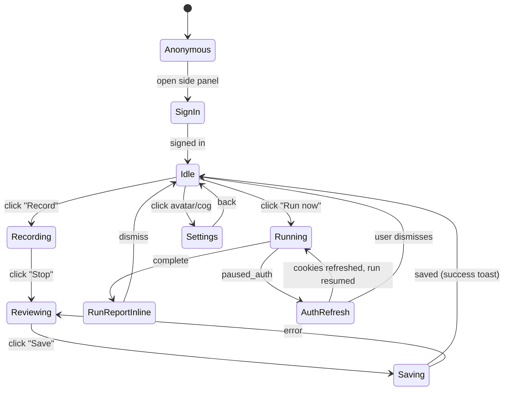

# Flowlens v3 — UX Design

> **Companion to:** [HLD.md](HLD.md), [LLD.md](LLD.md)
> **Note on Figma:** these are ASCII wireframes intended to be lossless on what each screen does and how it transitions. Real Figma frames are a follow-up deliverable — see [§13](#13-figma-handoff-plan).

---

## Contents

1. [Design principles](#1-design-principles)
2. [Information architecture](#2-information-architecture)
3. [User journey maps](#3-user-journey-maps)
4. [State machine — extension](#4-state-machine--extension)
5. [Onboarding (first-run experience)](#5-onboarding-first-run-experience)
6. [Extension wireframes (every state)](#6-extension-wireframes-every-state)
7. [Web dashboard wireframes](#7-web-dashboard-wireframes)
8. [Microinteractions](#8-microinteractions)
9. [Empty states inventory](#9-empty-states-inventory)
10. [Error states inventory](#10-error-states-inventory)
11. [Accessibility](#11-accessibility)
12. [Voice & tone — microcopy](#12-voice--tone--microcopy)
13. [Figma handoff plan](#13-figma-handoff-plan)

---

## 1. Design principles

1. **Two surfaces, one job.** The extension is for *action* (record, run, refresh auth). The web is for *understanding* (reports, history, sharing). Never make the user open the wrong one.
2. **The recording is a conversation, not a form.** No selectors. No assertions. Just demonstrate what you do, and we'll figure out the rest.
3. **The AI works in the open.** Every AI step is visible: "Narrating your steps…", "Comparing with last week's run…", "Investigating the failure…". The user always knows what we're doing and why.
4. **Failure is a feature.** When something breaks, the most valuable moment is *the explanation*. Lead with the AI's diagnosis, not a stack trace.
5. **Auth refresh is one click, never one form.** Users never type credentials into Flowlens. They log in on the real site, we capture cookies.
6. **Free tier feels generous; Pro upgrades are obvious.** Visual diff, daily scheduling beyond 5 flows, multi-user are the wedges.
7. **No tutorial pop-ups.** Onboarding is real work: by the end of step 3 you've recorded your first flow.

---

## 2. Information architecture

### Extension (Chrome side panel, ~400 px wide)

```text
Flowlens (root)
├── Idle
│   ├── Flows for this site (tabbed: All · Recent · Failing · Suggested)
│   └── Recent runs (last 5)
├── Recording
│   ├── In-page overlay
│   └── Side panel — Live capture status
├── Review (post-recording)
│   ├── Step carousel (editable)
│   ├── Auth status (cookie indicator)
│   └── Sibling-flow suggestions
├── Running
│   ├── Live progress (SSE)
│   ├── Embedded liveUrl iframe
│   └── Pause / Stop controls
├── Run report (collapsed)
│   └── Deep link to web for full
├── Auth refresh
│   ├── Detect logged-in state
│   └── Confirm + push cookies
├── Settings
│   ├── Account
│   ├── Notifications
│   └── Sites & permissions
└── Help / docs
```

### Web dashboard (`flowlens.in/app/...`)

```text
Web app
├── /app/sites                       — list of sites I've recorded against
├── /app/sites/[id]                  — site dashboard: flows, health chart, schedules
├── /app/flows/[id]                  — flow detail: steps, runs, settings, regression diff
├── /app/runs/[id]                   — single run report (full)
├── /app/runs/[id]/share/[token]     — public read-only run report
├── /app/integrations                — Slack, email, webhooks
├── /app/billing                     — plan, usage, credits
└── /app/settings                    — org, members, API keys
```

The principle: every extension card has a "View on flowlens.in" deep link for full detail. The extension never tries to render a 500-line report.

---

## 3. User journey maps

### Persona 1 — "Priya, CTO of a 20-person startup"


| Step                                  | Surface                 | Emotion       | What works                                                 |
| ------------------------------------- | ----------------------- | ------------- | ---------------------------------------------------------- |
| Hears about Flowlens on Twitter       | external                | curious       | One-line pitch lands ("record a flow, we test it forever") |
| Installs extension                    | Chrome Web Store        | mild friction | Extension is 5 MB; install is 8 s                          |
| Clicks side panel for the first time  | extension idle          | confused      | "Sign in with Google" is the only thing on the screen      |
| Signs in                              | Clerk hosted            | friction      | One-tap Google OAuth                                       |
| Opens her staging site, clicks Record | extension recording     | engaged       | Red dot is reassuring, no surprise                         |
| Demonstrates signup flow              | site under test         | focused       | Subtle overlay, doesn't get in the way                     |
| Stops, sees AI labels                 | extension review        | delighted     | "Wow, it understood every step"                            |
| Saves the flow                        | extension review        | satisfied     | Save button is obvious; loading is fast                    |
| Sees suggested sibling flow           | extension review        | curious       | Opt-in, not pushy                                          |
| Runs the flow on demand               | extension running       | trusting      | LiveUrl iframe is the magic moment                         |
| Schedules daily                       | web dashboard           | committed     | One toggle, default time is sensible                       |
| Day 7: Slack notification on failure  | Slack                   | alarmed       | Notification has the AI diagnosis, not just "failed"       |
| Opens link, fixes the bug             | web dashboard → her IDE | productive    | Side-by-side recorded vs replay screenshots                |


### Persona 2 — "Akshay, agency dev managing 12 client sites"

Cares about: org-level dashboards, white-label reports for clients (defer; v3.1), public share URLs.

Flowlens nails the public share — sends a link to a client saying "your checkout is broken, here's the recording".

### Persona 3 — "Zara, QA contractor brought in for one project"

Cares about: ability to import existing test plans, schedule batch runs, export results to CSV. Mostly out of scope for v3 — document this clearly.

### Persona 4 — "Ben, indie hacker shipping a side project"

Cares about: cheap, fast, low-friction. Free tier is the entire product for him. Stickiness driver is the daily Slack digest.

---

## 4. State machine — extension




Hard rules:

- Only one side-panel state visible at any time.
- Recording state is global per Chrome window — switching tabs doesn't change it; switching windows surfaces a "Recording in window 1" indicator.
- Auth refresh state pre-empts everything else (highest priority surface).

---

## 5. Onboarding (first-run experience)

Goal: from install to "first flow saved" in under 10 minutes. Three frames. No tutorial pop-ups on top of the actual UI.

### Frame 1 — Welcome

```text
┌──────────────────────────────────────────────────┐
│                                                  │
│              ✦  Flowlens                         │
│              ───────────                         │
│                                                  │
│  Record a flow once. We test it forever.        │
│                                                  │
│  ┌──────────────────────────────────────────┐   │
│  │  Sign in with Google                      │   │
│  └──────────────────────────────────────────┘   │
│                                                  │
│  ┌──────────────────────────────────────────┐   │
│  │  Sign in with email                       │   │
│  └──────────────────────────────────────────┘   │
│                                                  │
│  By signing in, you agree to our Terms.         │
│                                                  │
│  Privacy at a glance:                            │
│  • We only access sites you record on.          │
│  • Cookies are encrypted before they leave      │
│    your browser. Read the docs.                 │
│                                                  │
└──────────────────────────────────────────────────┘
```

### Frame 2 — First-record nudge (post sign-in, no flows)

```text
┌──────────────────────────────────────────────────┐
│ Flowlens         No site selected         [👤]  │
├──────────────────────────────────────────────────┤
│                                                  │
│   Welcome, Priya 👋                              │
│                                                  │
│   Step 1 — Open the site you want to test      │
│            in this tab.                          │
│   Step 2 — Come back, click Record below.       │
│   Step 3 — Demonstrate the flow.                │
│                                                  │
│   ┌─────────────────────────────────────────┐    │
│   │  🔴 Record a flow                          │    │
│   │  (open a site first)                       │    │
│   └─────────────────────────────────────────┘    │
│                                                  │
│   📺 Watch a 60-second demo                     │
│                                                  │
└──────────────────────────────────────────────────┘
```

The "Record a flow" button is **disabled** until the user has a real site URL in the active tab. Tooltip on hover explains why.

### Frame 3 — First record in progress (in-page coachmark)

The first time the user records, a tiny coachmark anchored to the in-page overlay says:

> Just do what you'd test by hand. We'll capture every click.

Dismisses on first click. Never appears again.

---

## 6. Extension wireframes (every state)

> All wireframes are 80-char wide ASCII. Real implementation is a 400 px Chrome side panel. Margins normalized for readability.

### 6.1 Idle, has flows

```text
┌──────────────────────────────────────────────────────────────┐
│  ✦ Flowlens         shop.example.com  ▾       [👤  ⚙]      │
├──────────────────────────────────────────────────────────────┤
│  ┌──────────────────────────────────────────────────────┐    │
│  │  🔴 Record a flow                                     │    │
│  │  Capture what to test on this site                    │    │
│  └──────────────────────────────────────────────────────┘    │
│                                                                │
│  Flows  ·  Recent · Failing · Suggested                       │
│  ────────────────────────────────────────────                 │
│                                                                │
│  ✓ Sign up & verify email                            [▶ Run] │
│    Last run: 2 h ago · passed                                 │
│    ───────────────────────────────────                        │
│                                                                │
│  ✗ Add to cart & checkout                            [▶ Run] │
│    Last run: 12 m ago · failed at step 4                      │
│    🚨 "Pay button missing on cart page"                       │
│    ───────────────────────────────────                        │
│                                                                │
│  ✓ Search a product                                  [▶ Run] │
│    Last run: yesterday · passed                               │
│    ───────────────────────────────────                        │
│                                                                │
│  ✨ Suggested · Guest checkout (no login)        [+ Accept]   │
│  ───────────────────────────────────                          │
│                                                                │
│  Recent runs                              [View all on web →] │
│  ────────────────────────────────────────                     │
│  ✗ checkout · 12m ago                                         │
│  ✓ signup    · 2h ago                                         │
│  ✓ search    · yesterday                                      │
│                                                                │
│  Auth: 🟢 cookies fresh · expires in 9 d        [Refresh]    │
└──────────────────────────────────────────────────────────────┘
```

Notes:

- Site name is a `<select>` with all sites the user has recorded against. Switches the side panel context.
- "Failing" tab shows only flows where the last run failed — primary user action point.
- The auth status row is **always visible** (low chrome footprint, big trust factor).

### 6.2 Recording — in-page overlay (anchored bottom-right of the tab)

```text
                         ┌────────────────────────────┐
                         │  🔴 REC  ·  12 actions      │
                         │  ────────────────────────   │
                         │  [✏ Note this step]         │
                         │  [⏸ Pause]   [⏹ Stop]      │
                         └────────────────────────────┘
```

- Drag-handle on the title bar so user can move it out of the way.
- Pulses gently while active (animation, not flashing — accessibility).
- "Note this step" opens a single-line input that attaches a user comment to the next captured action.
- Pause: rrweb stops recording, screenshots stop. Cookies still tracked. Resume continues from where it left off.

### 6.3 Recording — side panel (visible when user opens it during recording)

```text
┌──────────────────────────────────────────────────────────────┐
│  ✦ Flowlens         shop.example.com  ●         [👤  ⚙]    │
├──────────────────────────────────────────────────────────────┤
│                                                                │
│  🔴 Recording in progress                                     │
│  ──────────────────────────                                   │
│                                                                │
│  12 actions captured  ·  3:42 elapsed                         │
│                                                                │
│  ┌──────────────────────────────────────────────────────┐    │
│  │  Latest:                                               │    │
│  │  [screenshot thumbnail]                                │    │
│  │  Filled email · "priya@startup.com"                    │    │
│  └──────────────────────────────────────────────────────┘    │
│                                                                │
│  Tip — you can keep the side panel closed while recording.    │
│  Use the in-page overlay to control everything.              │
│                                                                │
│  ┌──────────────────────────────────────────────────────┐    │
│  │  ⏹ Stop recording                                      │    │
│  └──────────────────────────────────────────────────────┘    │
│                                                                │
│  ⚠ We detected a password-like value at step 8.              │
│    It's been encrypted and won't be shown.                    │
│                                                                │
└──────────────────────────────────────────────────────────────┘
```

The sensitive-data warning is one of the highest-trust microinteractions: confirmed real, in-flight, and the user knows we did the right thing.

### 6.4 Compiling (post-stop, before review)

```text
┌──────────────────────────────────────────────────────────────┐
│  ✦ Flowlens         shop.example.com           [👤  ⚙]      │
├──────────────────────────────────────────────────────────────┤
│                                                                │
│  Making sense of your recording…                              │
│  ────────────────────────────────────                         │
│                                                                │
│  ●  Stitching the recording                ✓ done             │
│  ●  Narrating each step                    ████░░░░  6 of 12  │
│  ○  Synthesizing the flow                                     │
│  ○  Suggesting related flows                                  │
│                                                                │
│  This usually takes 5–10 seconds.                             │
│                                                                │
│  ┌──────────────────────────────────────────────────────┐    │
│  │  Cancel                                                │    │
│  └──────────────────────────────────────────────────────┘    │
│                                                                │
└──────────────────────────────────────────────────────────────┘
```

The visible AI stages are the principle "AI works in the open" in action.

### 6.5 Review

```text
┌──────────────────────────────────────────────────────────────┐
│  ✦ Flowlens         shop.example.com           [👤  ⚙]      │
├──────────────────────────────────────────────────────────────┤
│  ← Back                                                       │
│                                                                │
│  Sign up and verify email                          [✏ rename]│
│  ──────────────────────────────────                           │
│  AI summary: Creates a new user account, verifies the email   │
│  link, and lands on the dashboard.                            │
│                                                                │
│  ┌────┬────┬────┬────┬────┬────┬────┬────┬────┬────┬────┬────┐│
│  │ 1  │ 2  │ 3  │ 4  │ 5  │ 6  │ 7  │ 8  │ 9  │ 10 │ 11 │ 12 ││
│  │[i] │[i] │[i] │[i] │[i] │[!] │[i] │[s] │[i] │[i] │[i] │[i] ││
│  └────┴────┴────┴────┴────┴────┴────┴────┴────┴────┴────┴────┘│
│  Selected: Step 3 of 12                                       │
│                                                                │
│  ┌──────────────────────────────────────────────────────┐    │
│  │ [screenshot, full-bleed]                               │    │
│  └──────────────────────────────────────────────────────┘    │
│                                                                │
│  Action     · click                                            │
│  Intent     · Click the "Sign up" button on the homepage.     │
│              [✏ edit]                                          │
│  Expected   · Sign-up form appears.                            │
│              [✏ edit]                                          │
│  Critical   · ☑ on critical path                               │
│  Selectors  · role=button, name="Sign up"  [show all]         │
│                                                                │
│  Step actions:  [Delete step]  [Insert wait]  [Reorder]       │
│                                                                │
│  ┌──────────────────────────────────────────────────────┐    │
│  │  Save flow                                             │    │
│  └──────────────────────────────────────────────────────┘    │
│  ────────────────                                              │
│  Cookies captured: 14 (encrypted)                             │
│  We also detected a password — it's redacted in the flow.    │
│                                                                │
└──────────────────────────────────────────────────────────────┘
```

Step pills meaning: `[i]` = informational, `[!]` = critical, `[s]` = sensitive (password / card / secret).

### 6.6 Sibling-flow suggestions (post-save modal)

```text
┌──────────────────────────────────────────────────────────────┐
│  ✦ Flowlens                                                  │
├──────────────────────────────────────────────────────────────┤
│                                                                │
│  Flow saved 🎉                                                 │
│  ──────────────                                                │
│  "Sign up and verify email" is ready.                         │
│                                                                │
│  Want us to also test these?                                  │
│  ───────────────────────────                                  │
│                                                                │
│  ☑ Sign up with already-used email                            │
│     Tests the duplicate-account error path.                   │
│                                                                │
│  ☑ Sign up, then sign out, then sign in                       │
│     Tests login after signup.                                 │
│                                                                │
│  ☐ Sign up with weak password                                 │
│     Tests password-strength validation.                       │
│                                                                │
│  These are AI-only flows — no recording needed.               │
│  Each costs about $0.30 per run.                              │
│                                                                │
│  ┌──────────────────────────────┐  ┌──────────────────────┐   │
│  │  Run selected (2)            │  │  Skip                 │   │
│  └──────────────────────────────┘  └──────────────────────┘   │
│                                                                │
└──────────────────────────────────────────────────────────────┘
```

### 6.7 Running

```text
┌──────────────────────────────────────────────────────────────┐
│  ✦ Flowlens         shop.example.com           [👤  ⚙]      │
├──────────────────────────────────────────────────────────────┤
│                                                                │
│  Running: Sign up and verify email                            │
│  ────────────────────────────────────                         │
│  Step 5 of 12 · 12.4 s elapsed · est. 22 s left              │
│                                                                │
│  ┌──────────────────────────────────────────────────────┐    │
│  │ [iframe of liveUrl - cloud browser doing the thing]    │    │
│  │                                                        │    │
│  │                                                        │    │
│  │                                                        │    │
│  └──────────────────────────────────────────────────────┘    │
│                                                                │
│  ✓ 1 · Open homepage                                          │
│  ✓ 2 · Click "Sign up"                                        │
│  ✓ 3 · Fill email                                             │
│  ✓ 4 · Fill password                                          │
│  ● 5 · Click "Create account"  ← AI is finding the button     │
│  ○ 6 · Wait for verification email…                           │
│  ○ 7..12                                                       │
│                                                                │
│  ┌──────────────────────┐  ┌──────────────────────┐           │
│  │  ⏸ Pause              │  │  ⏹ Stop                │           │
│  └──────────────────────┘  └──────────────────────┘           │
│                                                                │
└──────────────────────────────────────────────────────────────┘
```

The "AI is finding the button" status flips to "Click executed" as soon as the action lands. The user feels every thought.

### 6.8 Run report (collapsed, in extension)

```text
┌──────────────────────────────────────────────────────────────┐
│  ✦ Flowlens         shop.example.com           [👤  ⚙]      │
├──────────────────────────────────────────────────────────────┤
│  ← Back                                                       │
│                                                                │
│  Run #47 · Add to cart & checkout                             │
│  ─────────────────────────────────                            │
│  Status: ✗ failed at step 8                                   │
│  Health: 60 / 100                                             │
│  Duration: 38 s                                               │
│  Cost: $0.31                                                  │
│                                                                │
│  AI diagnosis                                                  │
│  ────────────                                                  │
│  The "Pay" button is missing on the cart page.                │
│  Likely a recent app regression. Last run on 2026-04-25       │
│  passed; this is a real failure.                              │
│  Class: app_bug                                                │
│                                                                │
│  Steps                                                         │
│  ─────                                                         │
│  ✓ 1 · Open homepage                                          │
│  ✓ 2 · Click "Search"                                         │
│  ✓ 3 · Type "wireless mouse"                                  │
│  ✓ 4 · Press Enter                                            │
│  ✓ 5 · Click first result                                     │
│  ✓ 6 · Click "Add to cart"                                    │
│  ✓ 7 · Click cart icon                                        │
│  ✗ 8 · Click "Pay"  ← element not found                       │
│  ↩ 9..12 · skipped                                            │
│                                                                │
│  ┌──────────────────────────────────┐  ┌────────────────────┐ │
│  │  Open full report on flowlens.in │  │  Re-run            │ │
│  └──────────────────────────────────┘  └────────────────────┘ │
│                                                                │
└──────────────────────────────────────────────────────────────┘
```

### 6.9 Auth refresh — banner (top of side panel, any state)

```text
┌──────────────────────────────────────────────────────────────┐
│  ⚠ Auth expired for shop.example.com                  [×]    │
│  Open the site, log in, then come back here.                  │
│                       [Take me there →]                       │
└──────────────────────────────────────────────────────────────┘
```

### 6.10 Auth refresh — active screen (after user navigates to site)

```text
┌──────────────────────────────────────────────────────────────┐
│  ✦ Flowlens         shop.example.com           [👤  ⚙]      │
├──────────────────────────────────────────────────────────────┤
│                                                                │
│  Refresh auth                                                  │
│  ─────────────                                                 │
│                                                                │
│  Step 1 — Log into shop.example.com on this tab. ✓ done       │
│  Step 2 — Click the button below.                              │
│                                                                │
│  ┌──────────────────────────────────────────────────────┐    │
│  │  I'm logged in — refresh auth                         │    │
│  └──────────────────────────────────────────────────────┘    │
│                                                                │
│  We'll capture your fresh cookies (encrypted), update         │
│  the test profile, and resume the paused run.                  │
│                                                                │
│  ───────────────                                               │
│  Paused run: "Add to cart & checkout"                         │
│  Will resume from step 1.                                      │
│                                                                │
│  ┌──────────────────────────────────────────────────────┐    │
│  │  Cancel and stop run                                  │    │
│  └──────────────────────────────────────────────────────┘    │
│                                                                │
└──────────────────────────────────────────────────────────────┘
```

### 6.11 Settings → Sites & permissions

```text
┌──────────────────────────────────────────────────────────────┐
│  ← Settings                                                    │
│                                                                │
│  Sites & permissions                                           │
│  ────────────────────                                          │
│                                                                │
│  ✓ shop.example.com         12 flows · 47 runs   [Revoke]    │
│  ✓ admin.example.com         3 flows · 12 runs   [Revoke]    │
│  ✓ docs.example.com          1 flow  · 4 runs    [Revoke]    │
│                                                                │
│  + Add site                                                    │
│                                                                │
│  Revoking a site immediately deletes flows, runs, cookies,    │
│  and recordings for that site.                                 │
│                                                                │
└──────────────────────────────────────────────────────────────┘
```

### 6.12 Settings → Account

```text
┌──────────────────────────────────────────────────────────────┐
│  ← Settings                                                    │
│                                                                │
│  Account                                                       │
│  ───────                                                       │
│  Priya · priya@startup.com                                     │
│  Plan: Free                                                    │
│                                                                │
│  This month                                                    │
│  ─────────                                                     │
│  Runs:        47 / 50      ████████████████░░ 94 %             │
│  Flows:        8 / 10                                          │
│  Sites:        3 / 3 ✓                                         │
│                                                                │
│  ┌──────────────────────────────────────────────────────┐    │
│  │  Upgrade to Pro — $39/mo                              │    │
│  └──────────────────────────────────────────────────────┘    │
│                                                                │
│  Pro unlocks:                                                  │
│  • 10 sites, 100 flows, 1000 runs/month                       │
│  • Daily scheduled runs                                        │
│  • Visual regression diffing                                   │
│  • Priority support                                            │
│                                                                │
└──────────────────────────────────────────────────────────────┘
```

---

## 7. Web dashboard wireframes

### 7.1 Sites list (`/app/sites`)

```text
┌────────────────────────────────────────────────────────────────────────────┐
│  ✦ Flowlens                          Priya · Acme  ▾       [Docs] [👤]    │
├────────────────────────────────────────────────────────────────────────────┤
│                                                                            │
│  Sites                                                       [+ Add site] │
│  ─────                                                                     │
│                                                                            │
│  ┌──────────────────────────────────────────────────────────────────┐     │
│  │  shop.example.com         12 flows · 4 failing · daily schedule │     │
│  │  ──────────────────────                                            │     │
│  │  Health (last 30 d): ▁▂▃▆▇▆▃▂▁▂▆▇█▇▆▃▂▆▇▆     85 → 92  ↑       │     │
│  │  Last run 12 m ago · ✗ checkout failing                          │     │
│  └──────────────────────────────────────────────────────────────────┘     │
│                                                                            │
│  ┌──────────────────────────────────────────────────────────────────┐     │
│  │  admin.example.com        3 flows · 0 failing                    │     │
│  │  Health (last 30 d): ▆▆▇█████████████████      96 → 98  ↑       │     │
│  │  Last run 1 h ago · all passing                                  │     │
│  └──────────────────────────────────────────────────────────────────┘     │
│                                                                            │
└────────────────────────────────────────────────────────────────────────────┘
```

### 7.2 Site detail (`/app/sites/[id]`)

```text
┌────────────────────────────────────────────────────────────────────────────┐
│  ✦ Flowlens     shop.example.com                                           │
├────────────────────────────────────────────────────────────────────────────┤
│                                                                            │
│  ← Sites                                                                   │
│                                                                            │
│  shop.example.com                                                          │
│  ─────────────────                                                         │
│  12 flows · 4 currently failing · daily schedule at 09:00 IST              │
│  Auth: 🟢 fresh · last refreshed 2 h ago      [Refresh in extension]      │
│                                                                            │
│  Health over time                                                          │
│  ─────────────────                                                         │
│  ┌──────────────────────────────────────────────────────────────────┐     │
│  │ 100│                       ●─●─●                                  │     │
│  │  90│              ●─●─●           ●                                │     │
│  │  80│       ●─●         ←——— Apr 20: checkout broken                │     │
│  │  70│  ●                                                            │     │
│  │  60│                                                               │     │
│  │     └──────────────────────────────────────────────────────────    │     │
│  │       Apr 1     Apr 8     Apr 15     Apr 22     Apr 27             │     │
│  └──────────────────────────────────────────────────────────────────┘     │
│                                                                            │
│  Flows                                                  [+ Record new]    │
│  ─────                                                                     │
│  ✗ Add to cart & checkout       failed 12 m ago        [Open] [Run]       │
│  ✗ Apply discount code           failed 12 m ago       [Open] [Run]       │
│  ✓ Sign up                       passed 12 m ago       [Open] [Run]       │
│  ✓ Sign in                       passed 12 m ago       [Open] [Run]       │
│  ✓ Search a product              passed 1 h ago        [Open] [Run]       │
│  ...                                                                       │
│                                                                            │
└────────────────────────────────────────────────────────────────────────────┘
```

### 7.3 Flow detail (`/app/flows/[id]`)

```text
┌────────────────────────────────────────────────────────────────────────────┐
│  ← shop.example.com                                                        │
│                                                                            │
│  Add to cart & checkout                            [✏ edit name] [🗑]    │
│  ─────────────────────                                                     │
│  Recorded by Priya · last run 12 m ago · ✗ failing at step 8              │
│                                                                            │
│  [▶ Run now]   [⏰ Schedule]   [⌥ Variants]   [↗ Share last run]         │
│                                                                            │
│  Steps (12)                       Run history (last 20)                    │
│  ──────────                       ──────────────────────                   │
│  1 ✓ Open homepage                ✗ ✗ ✗ ✓ ✓ ✓ ✓ ✓ ✓ ✓ ✓ ✓ ✓ ✓ ✓ ✓ ✓ ✓   │
│  2 ✓ Click "Search"                ↑ ↑ ↑                                  │
│  3 ✓ Type "wireless mouse"         today                                  │
│  4 ✓ Press Enter                                                           │
│  5 ✓ Click first result                                                    │
│  6 ✓ Click "Add to cart"           Click any to open the run report       │
│  7 ✓ Click cart icon                                                       │
│  8 ✗ Click "Pay"  ← failing here                                          │
│  9 - Skipped                                                               │
│  ...                                                                       │
│                                                                            │
│  AI diagnosis (latest run)                                                 │
│  ──────────────────────                                                    │
│  The "Pay" button is missing on the cart page since 2026-04-25.           │
│  Likely a regression introduced in commit range:                          │
│  (We'd link the deploy if you connect GitHub.)                            │
│                                                                            │
│  Variants                                              [+ Add variant]    │
│  ────────                                                                  │
│  ✨ Guest checkout (AI-only)              passed yesterday   [Run]        │
│  ✨ Apply discount code (AI-only)         failing            [Run]        │
│                                                                            │
└────────────────────────────────────────────────────────────────────────────┘
```

### 7.4 Run report (`/app/runs/[id]`)

```text
┌────────────────────────────────────────────────────────────────────────────┐
│  ← Add to cart & checkout                                                  │
│                                                                            │
│  Run #47 · Apr 27, 13:24:11 IST · ✗ failed                                │
│  ────────────────────────────────────                                     │
│  Health 60 · Duration 38 s · Cost $0.31 · Triggered by schedule           │
│                                                                            │
│  [Re-run]  [Compare to previous]  [Public share]  [Download video]        │
│                                                                            │
│  ╔══════════════════════════════════════════════════════════════════╗     │
│  ║ AI diagnosis                                                       ║     │
│  ║ ────────────                                                       ║     │
│  ║ The "Pay" button is missing on the cart page. Likely a real        ║     │
│  ║ regression — last passing run was 2 days ago.                      ║     │
│  ║ Class: app_bug · Confidence: 0.92                                   ║     │
│  ║                                                                      ║     │
│  ║ What changed on the page?                                           ║     │
│  ║ • The cart page now shows two buttons: "Continue shopping" and      ║     │
│  ║   "View cart". The "Pay" button is gone.                            ║     │
│  ║ • The cart counter still updates correctly.                         ║     │
│  ║ • API calls succeeded; this is a UI-only regression.                ║     │
│  ╚══════════════════════════════════════════════════════════════════╝     │
│                                                                            │
│  Step-by-step                                                              │
│  ────────────                                                              │
│  ▾ 8 ✗ Click "Pay" — element not found                                    │
│      ┌──────────────────────────┬──────────────────────────┐               │
│      │ Recorded (Apr 22)         │ Replay (Apr 27)           │              │
│      │ [screenshot, side-by-side]│                            │              │
│      │  with Pay button visible  │  no Pay button visible     │              │
│      └──────────────────────────┴──────────────────────────┘               │
│      Resolved via: tried role+name, css, xpath, llm — all failed          │
│      Console errors: 0                                                     │
│      Network errors: 0                                                     │
│      Visual diff: 18.2 % (Pro) — regions changed: cart actions zone        │
│                                                                            │
│  ▸ 7 ✓ Click cart icon                                                    │
│  ▸ 6 ✓ Click "Add to cart"                                                │
│  ▸ ...                                                                     │
│                                                                            │
└────────────────────────────────────────────────────────────────────────────┘
```

### 7.5 Public share (`/app/runs/[id]/share/[token]`)

Same layout as 7.4 but:

- Stripped of org chrome and account header.
- "Powered by Flowlens" footer.
- No re-run button (read-only).
- Optional comment thread for the linked viewer (Pro).

---

## 8. Microinteractions


| Moment                            | Detail                                                                                                              |
| --------------------------------- | ------------------------------------------------------------------------------------------------------------------- |
| Click "Record"                    | Side panel header dot turns red and pulses; in-page overlay slides in over 200 ms; subtle "ding" sound (toggleable) |
| First sensitive value detected    | Side panel slides down a one-line banner with the lock emoji; goes away after 4 s                                   |
| Step status flips passed → failed | Step pill cross-fades; the failing step gets a soft red glow that lingers until acknowledged                        |
| Click "Run now"                   | Button morphs into a loading state with a tiny linear progress bar (estimated based on prior run duration)          |
| Live URL iframe loads             | Fade-in over 300 ms; "watching the cloud browser…" caption appears below                                            |
| Auth banner                       | Slide down from top with 100 ms ease-out; never auto-dismisses                                                      |
| Compile complete                  | Number badge on the side panel icon flashes briefly (just enough to be noticed if the user has navigated away)      |
| Sibling-flow card hover           | Cost estimate appears: "~$0.30 per run"                                                                             |


---

## 9. Empty states inventory


| Surface                             | State              | Copy                                                                                    |
| ----------------------------------- | ------------------ | --------------------------------------------------------------------------------------- |
| Side panel — no flows for this site | First record nudge | "No flows yet. Demonstrate one and we'll handle the rest."                              |
| Site detail (web) — no runs         | Pre-first-run      | "Run your flow to see results here." (with primary CTA)                                 |
| Run report — step has no AI judge   | Free tier          | "AI judge is on for critical steps in the Free plan. Upgrade to Pro for full coverage." |
| Settings — no notification channels | Pre-setup          | "Pick how you want to be told when something breaks."                                   |
| Public share — token expired        | Error              | "This link has expired. Ask the owner to share again."                                  |
| Variants tab — no AI suggestions    | Empty              | "We didn't find sibling flows for this one. Want to record another variation manually?" |


---

## 10. Error states inventory


| Failure                         | User-facing copy                                                                  | Recovery action                                |
| ------------------------------- | --------------------------------------------------------------------------------- | ---------------------------------------------- |
| Network down during recording   | "Saving locally — we'll upload when you're back online."                          | Auto-retry on reconnect                        |
| Upload chunk failed             | "Saving offline. We'll keep trying."                                              | Auto-retry; show retry button after 5 failures |
| Compile failed (LLM bad output) | "We had trouble understanding the recording. Want to try again or save it as-is?" | Re-compile or save with placeholder steps      |
| BU Cloud at concurrency limit   | "All test slots are busy — your run is queued (~30 s)."                           | Auto-retry; show position in queue             |
| BU Cloud account out of credits | "We're out of credits for this period. Upgrade to keep running tests."            | CTA to billing                                 |
| Run paused waiting for auth     | (see auth refresh wireframe)                                                      | One-click refresh                              |
| Cookie refresh failed           | "Couldn't update auth on the test browser. Try again or contact support."         | Retry button + help link                       |
| Extension permission denied     | "Flowlens needs permission to record this site. [Grant access]"                   | Re-prompt                                      |
| Sign-in expired                 | "You've been signed out. [Sign in]"                                               | Prominent sign-in CTA                          |
| Service worker killed (MV3)     | (transparent — auto-respawn; no UI)                                               | None                                           |
| User on Firefox/Safari          | "Flowlens currently supports Chrome and Edge. We're working on more browsers!"    | Notify-me email capture                        |


---

## 11. Accessibility

- All interactive elements reachable by keyboard. Tab order matches visual flow.
- Color is never the sole indicator of state (icons + text accompany the green/red pills).
- Recording overlay does not flash; pulse animation is at < 3 Hz and respects `prefers-reduced-motion`.
- Screen reader: side panel uses landmark roles (`<main>`, `<nav>`, `<aside>`). Live regions announce SSE updates politely.
- Color contrast meets WCAG AA on all text (4.5:1 for body, 3:1 for large headings).
- Live URL iframe gets a "skip iframe" link for screen reader users; alternative text-based step view always available.
- Auth-refresh banner is announced as `role="alert"` (assertive) — it's the most important interruption.

---

## 12. Voice & tone — microcopy

### Principles

- **Direct, not chatty.** "Record a flow" not "Let's get started recording!"
- **Honest about AI.** Say "AI" when it's AI. No magical hand-waving.
- **Failure-first framing.** When something breaks, name what broke before naming the next action.
- **Cost is mentioned, not buried.** Users should always know what a click will cost in credits.

### Copy specimens


| Surface             | Bad                                                   | Good                                                                          |
| ------------------- | ----------------------------------------------------- | ----------------------------------------------------------------------------- |
| Record button       | "Start recording your amazing flow! ✨"                | "Record a flow"                                                               |
| Compile progress    | "We're working our magic..."                          | "Narrating each step · 6 of 12"                                               |
| Auth refresh banner | "Oops! Looks like we need a little help with auth..." | "Auth expired for shop.example.com. Open the site and log in."                |
| Run failure         | "Something went wrong! Please try again."             | "Step 8 failed: 'Pay' button missing on cart page. Likely a real regression." |
| Sibling suggestion  | "Try our amazing AI-suggested flows!"                 | "Want us to also test guest checkout? ~$0.30 per run."                        |
| Pro upgrade CTA     | "Unlock the full power of Flowlens!"                  | "Upgrade to Pro for visual regression diffing and daily scheduled runs."      |


---

## 13. Figma handoff plan

These ASCII wireframes lock the *information architecture and behavior*. Real Figma frames are the next deliverable and will:

1. Use the existing `flowlens.in` design tokens (Tailwind v4 + matching color, type scales already in [frontend/](../../frontend/)).
2. Cover every state in [§6](#6-extension-wireframes-every-state) and [§7](#7-web-dashboard-wireframes) at the right canvas size:
  - Extension side panel: 400 × 800 (with 600 and 1080 height variants)
  - Web dashboard: 1440 × 900 (desktop) and 768 × 1024 (tablet)
3. Use the `figma-generate-design` and `figma-use` skills to produce design-system-aligned components rather than ad-hoc shapes.
4. Be organized as one Figma file with three pages:
  - Page 1: **Onboarding & extension** (flows 1–6)
  - Page 2: **Web dashboard** (flows 7.1–7.5)
  - Page 3: **Components** (extracted reusable atoms)

When ready, switch out of plan mode and run:

```text
"Build out the extension Figma frames from docs/v3/UX.md §6 using our existing design tokens"
```

…and the Figma MCP path will produce them directly.

---

## 14. Where to go next

- **[HLD.md](HLD.md)** — strategic context, system architecture, phasing.
- **[LLD.md](LLD.md)** — implementation details, data models, edge cases, execution traces.

